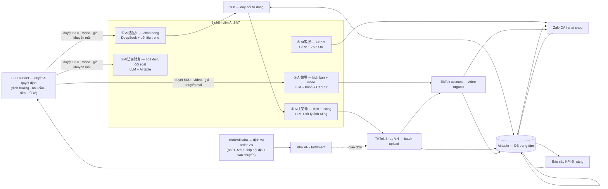

# Kế hoạch 01: TikTok Shop xuyên biên giới full-AI (OPC)

> Model phụ trách: DeepSeek · Ngày: 2026-09-10 · Trạng thái: draft
> Mẫu gốc: 光年易达 (14 shop TikTok Shop, 4 thị trường) — thu nhỏ về 1 người, vốn ≤5.000 USD, VN trước → US sau.

> 🔄 **CẬP NHẬT 10/09/2026:** Kế hoạch này đã được đào sâu thành **gói 10 tài liệu vận hành** tại thư mục `01-tiktok-shop-crossborder-opc/` (3.973 dòng: dossier thị trường 117 nguồn, tài chính 24 tháng, lịch 26 tuần, prompt library 865 dòng, 12 SOP, hạ tầng, pháp lý, rủi ro, outreach). Đọc `01-tiktok-shop-crossborder-opc/00-tong-quan.md` trước. 4 thay đổi lớn so với bản này: (1) hoa hồng bách hoá còn ≤9,5% từ 03/07/2026; (2) **seller mới mở shop trước 30/09/2026 được miễn phí giao dịch 60 ngày**; (3) thuế khoán đã bị bỏ từ 01/01/2026 (NQ198/2025/QH15 — xem file 07); (4) BEP cập nhật 56 đơn/tháng (file 02).

## 1. Mô hình công ty (1 slide)

- **Khách hàng:** giai đoạn 1 = người dùng TikTok Shop VN 18–34 tuổi, mua theo video ngắn, giá 99k–349k; giai đoạn 2 = khách Mỹ, AOV $20–40.
- **Bán gì:** hàng tiêu dùng nhẹ, dễ ship, giá trị cảm nhận cao — 1 ngách dọc duy nhất (gợi ý: đồ tổ chức/bếp thông minh mini, phụ kiện thú cưng, hoặc phụ kiện bàn làm việc) nhập từ 1688/Alibaba.
- **Khác biệt:** toàn bộ pipeline (chọn hàng → listing → content → CSKH → vận hành) do 5 "nhân viên AI" chạy 24/7; founder chỉ duyệt và quyết định — bản sao thu nhỏ của 光年易达.
- **Vì sao 1 người làm được:** AI chọn hàng theo văn hoá/kiêng kỵ từng thị trường, AI dịch + xử lý ảnh + batch listing, AI CSKH đêm (1 AI = 10+ người) — đã được 光年易达 chứng minh ✅ (brief B2); phần còn lại founder chỉ giữ: định hướng, nhu cầu, tiền + rủi ro (nguyên tắc 4).

## 2. Vì sao nó thắng ở Trung Quốc

- **光年易达 ✅** — 3 cựu JD.com chạy 14 shop TikTok Shop tại ĐNÁ/Nhật/Mexico/Mỹ, GMV vài vạn RMB/tháng; AI CSKH đêm, AI chọn hàng theo văn hoá từng nước, AI dịch + xử lý ảnh + batch listing ([中国经营报](https://news.qq.com/rain/a/20260326A04AP000)).
- **Bài học copy số 1:** nguyên tắc 3 tầng — "AI hoá triệt để → chuẩn hoá cục bộ → người giỏi nhất giữ lõi". Copy SOP nguyên khối sang thị trường mới = thất bại (họ đã thất bại khi copy SOP VN sang Nhật/Mexico).
- **Bài học copy số 2:** compliance là vũ khí — video mở hàng + chứng từ đã cứu 光年易达 khỏi 60–70% hoàn trả gian lận; áp dụng từ đơn hàng đầu tiên.
- **Bài học copy số 3:** TikTok Shop trước Amazon (luật quen, traffic tự nhiên, thân thiện người nhỏ) — cả VN lẫn US đều là sân nhà: TikTok VN đã phát hành AI chatbot cho seller, chuyển đổi x2,2 ✅ ([100ec](https://www.100ec.cn/detail--6654018.html)).
- **张顺 ✅** — 1 người, 2 shop eBay, 5 AI nhân viên có chức danh 24/7 ([南国都市报](http://szb.ngdsb.cn/h5/html5/2026-07/23/content_58867_19728456.htm)): mẫu "vị trí công việc AI" dùng ở mục 5.

## 3. Thị trường VN & US

### VN — vào trước (rào cản thấp nhất)
- **Đăng ký:** tài khoản Seller Center bằng CCCD (cá nhân) hoặc giấy phép hộ kinh doanh/công ty, 1–3 ngày, phí 0đ (brief). Nên lập **hộ kinh doanh cá thể** ngay tuần 1 để xuất hoá đơn, thuế rõ ràng (lệ phí ~100k ⚠️ tự khai, xác nhận tại UBND quận/huyện).
- **Phí sàn (từ 09/05/2026, tăng lần nữa):** phí giao dịch 6%; hoa hồng nền tảng shop thường: thời trang 12,5–13,5%, sức khoẻ–làm đẹp 12,5–14%, bách hoá 9–13%; VXP tự nguyện 4% (tối đa 50k/sp); có Dynamic Commission giảm phí khi chạy Shop Ads ([Báo Công Thương](https://congthuong.vn/tu-9-5-tiktok-shop-tiep-tuc-tang-bieu-phi-voi-nha-ban-hang-454850.html)). Tổng phí sàn ~15–19% doanh thu → phải chọn ngách biên gộp ≥35%.
- **Thuế:** hộ kinh doanh có thể chọn thuế khoán; tỷ lệ GTGT+TNCN cho bán lẻ thường ~1–1,5% doanh thu ⚠️ (xác nhận chi cục thuế địa phương); hoá đơn điện tử theo Thông tư 78 (brief ✅); tuân thủ Nghị định 13/2023/NĐ-CP về dữ liệu cá nhân (brief ✅).
- **Đối thủ:** hàng TQ bán trực tiếp giá sát vốn + shop bản địa có kho; thắng bằng content AI tần suất cao + ngách hẹp + CSKH nhanh, không đấu giá.

### US — giai đoạn 2 (chỉ khi VN có lãi)
- **Phí:** referral 6% phẳng (5% trang sức), **không có** phí giao dịch riêng; seller mới được 3% trong 30 ngày đầu; affiliate 5–25% do seller tự đặt ([OneCart, 04/2026](https://www.getonecart.com/tiktok-shop-seller-fees/)).
- **Điều kiện cho seller ngoài Mỹ — khó hơn nhiều:** cần pháp nhân Mỹ (LLC/Corp) + EIN (W-9) + tài khoản ngân hàng Mỹ + **kho phát hàng nội địa Mỹ** (không được ship từ TQ về thẳng) ([妙手ERP](https://erp.91miaoshou.com/platforms/tiktokshopus.html)); chi phí LLC Wyoming qua Doola ~$397 năm đầu + $297/năm duy trì ([TheAmericanLLC](https://www.theamericanllc.com/llc/tiktok-shop)). Lộ trình khả thi: LLC → EIN → Mercury bank → kho 3PL US nhỏ.
- **Kết luận cửa vào:** **VN trước** — đăng ký 0đ trong 1–3 ngày, không cần pháp nhân, quen ngôn ngữ; US là bản nâng cấp khi đã có dòng tiền và SOP chạy.

## 4. Tech stack & kiến trúc tự động hoá

| Công cụ | Vai trò | Chi phí/tháng |
|---|---|---|
| DeepSeek API (gateway OpenRouter) | Chọn hàng, dịch, sinh listing, CSKH | ~300–500k VND ⚠️ |
| n8n self-host (VPS nhỏ) | "Dây nối" tự động hoá end-to-end | ~150–300k VND ⚠️ |
| Airtable / Google Sheets | Database trung tâm (SKU, đơn, KPI) | 0đ |
| Coze quốc tế (coze.com) | Bot CSKH đa kênh (Zalo OA, web chat) | 0đ |
| CapCut Pro + Kling quốc tế | Dựng video + xử lý ảnh/background listing | ~1,0–1,2 triệu VND ⚠️ |
| TikTok Creative Center + FastMoss/Shoplus (bản free) | Dữ liệu trend chọn hàng | 0đ (bản trả phí cân nhắc sau) |
| Zalo OA + TikTok Seller Center | Giao diện khách + kênh bán | 0đ |
| OpenClaw (repo chính thức, tuỳ chọn) | Tự thao tác trình duyệt khi hết API | 0đ |

- **Người làm:** chọn ngách, duyệt SKU (người cầm chịu trách nhiệm về chất lượng + IP), duyệt video trước đăng, quyết giá/khuyến mãi, xử lý tranh chấp nghiêm trọng.
- **AI làm:** quét trend, sinh listing đa ngôn ngữ, xử lý ảnh, viết kịch bản + cắt video, trả lời khách đêm, đối soát đơn, báo cáo KPI.

## 5. Vận hành ngày/tuần của founder

**Lịch tuần mẫu (tổng ~15–20 giờ, tiến tới <2h/ngày):**
- Thứ 2: đọc báo cáo KPI tự động (GMV, đơn, hoàn, CTR) → chọn 10 SKU mới từ danh sách AI gợi ý.
- Thứ 3: duyệt batch listing 10–20 sản phẩm AI đã dịch (15 phút/batch).
- Thứ 4: quay bổ sung 1–2 video tay (bối cảnh thật tăng tin) + duyệt 5 video AI sinh.
- Thứ 5: xem số liệu ads/affiliate, điều chỉnh tỷ lệ hoa hồng affiliate.
- Thứ 6: đối soát tiền + hoá đơn (AI soạn sẵn), xử lý tranh chấp/hoàn tồn đọng.
- Thứ 7: nghỉ; hệ thống tự chạy.

**Vị trí công việc AI (mẫu 张顺):**

| Chức danh | Prompt lõi | Công cụ |
|---|---|---|
| AI选品师 | "Quét top video #tiktokshop VN ngách X; loại sản phẩm kiêng kỵ văn hoá; chấm theo 5 tiêu chí: biên ≥35%, nhẹ <1kg, ít hoàn, không vi phạm IP, có trend ≥30 ngày" | DeepSeek + FastMoss free |
| AI上架师 | "Từ ảnh/link 1688 → tiêu đề 80 ký tự chứa 3 keyword, mô tả 3 đoạn, 5–9 ảnh nền sạch, giá đề xuất theo công thức margin" | LLM + Kling xử lý ảnh + n8n batch |
| AI编导 | "Từ listing → 3 kịch bản video 15–30s: hook 2s, mở hộp, demo, CTA; sinh cảnh + voice-over, xuất bản nháp" | Kling + CapCut |
| AI客服 | "Trả lời trong 2 phút theo SOP: ship, đổi trả, bảo hành; chuyển người khi khách đòi bồi thường >100k" | Coze bot + Zalo OA |
| AI法务财务 | "Đối soát đơn–tiền về hằng ngày, soạn hoá đơn điện tử, cảnh báo đơn rủi ro hoàn hàng" | LLM + Airtable + n8n |

**Vòng lặp dữ liệu:** đơn/CTR/đánh giá/hoàn → Airtable → prompt chọn hàng được tinh chỉnh hằng tuần → SKU mới ngày càng trúng → tỷ lệ thắng tăng (vòng lặp "sản phẩm → dữ liệu → AI → sản phẩm").

## 6. Mô hình doanh thu & chi phí

Giả định: AOV 250k VND, giá vốn 40% (nhập 1688 ~35k–100k/SP + phí order 1–5% + ship nội địa TQ + vận chuyển TQ–VN, theo công thức giá về tay [nhaphangchina.net](https://nhaphangchina.net/cach-tinh-gia-ve-tay-khi-order-hang-trung-quoc-chuan-nhat-2026/)), phí sàn 16%, ads/affiliate 10%, fulfillment 15k/đơn ⚠️ (số nội bộ, tự khai). Tỷ giá 1 USD = 26.000 VND ⚠️.

| Tháng | Tệ | Cơ bản | Tốt |
|---|---|---|---|
| 1 | DT 0–3tr; lỗ ~5tr | DT 5tr; lỗ ~3tr | DT 10tr; lỗ ~2tr |
| 2–3 | DT 3–8tr; lỗ luỹ kế 15tr | DT 8–15tr; lỗ luỹ kế 8tr | DT 20–30tr; gần hoà vốn |
| 4–6 | Kill | DT 20–35tr; **hoà vốn T5** | DT 40–70tr; lãi 5–12tr/tháng |
| 7–9 | — | DT 35–50tr; lãi 4–8tr | DT 80–120tr; lãi 12–20tr; mở US |
| 10–12 | — | DT 50–60tr; lãi 6–10tr | DT 120–200tr; lãi 20–35tr (VN+US) |

- **Điểm hoà vốn cơ bản:** ~45–50 đơn/tháng (≈12–13 triệu DT/tháng) với phí cố định ~3 triệu/tháng (tools + kho/vận hành) ⚠️.
- **Ngân sách 6 tháng (≤5.000 USD ≈ 130tr):** vốn hàng lô 1–2: 40tr; tools 6 tháng: 12tr; đăng ký/giấy tờ/thiết bị quay tối thiểu: 8tr; quảng cáo 3 tháng đầu: 15tr; dự phòng + lệnh US (LLC $397–497 ≈ 10–13tr): 35tr. **Tổng ≈ 110tr (~4.200 USD) ⚠️.**
- Giá bán = giá vốn × 3 trở lên (phí sàn + ads + hoàn hàng ăn ~35–40% doanh thu).

## 7. Lộ trình start-from-scratch

**Giai đoạn 0–30 ngày (chi ~15–20tr):**
1. Ngày 1: đăng ký TikTok Shop Seller Center bằng CCCD (0đ, 1–3 ngày xét duyệt).
2. Ngày 1–5: đăng ký hộ kinh doanh cá thể tại UBND quận/huyện (~100k ⚠️), mở tài khoản ngân hàng riêng cho shop.
3. Ngày 2–7: chọn ngách (tiêu chí mục 5), lập Airtable schema (SKU/đơn/hoàn/đánh giá).
4. Ngày 3–10: đăng ký DeepSeek API + n8n (VPS nhỏ) + Coze + CapCut; chạy thử workflow "link 1688 → listing nháp".
5. Ngày 5–14: đặt 10–15 SKU mẫu qua dịch vụ order 1688 (tổng 10–15tr), yêu cầu kiểm đếm; so sánh 2 đơn vị vận chuyển.
6. Ngày 10–20: AI sinh 20 listing đầu, founder duyệt, đăng batch; tự chụp lại ảnh thật cho 5 SKU chủ lực.
7. Ngày 15–25: dựng bot CSKH Coze (SOP 20 câu thường gặp) nối Zalo OA.
8. Ngày 20–30: đăng 10 video đầu (5 AI + 5 quay tay); mốc: có đơn đầu tiên, mọi đơn đều quay video mở hàng.

**Giai đoạn 30–60 ngày (chi ~10tr):**
1. Tăng lên 30–40 SKU (batch AI + duyệt người), 3–5 video/tuần.
2. Mở affiliate 10–15% cho 10 SKU chạy nhất; tắt SKU 0 view sau 14 ngày.
3. Nối đơn hàng tự chảy về Airtable; đối soát tiền tự động.
4. Chạy Shop Ads 200–500k/ngày cho 2 video tốt nhất (tận dụng Dynamic Commission).
5. Thiết lập chống hoàn: video đóng gói + blacklist khách + chính sách đổi trả rõ.
6. Mốc: 30+ đơn/tháng, hoàn <5%, founder <2h/ngày vận hành.

**Giai đoạn 60–90 ngày (chi ~5tr):**
1. Mở shop thứ 2 cùng ngách lệch (hoặc lấn sâu 1 phân khúc) khi shop 1 có 50+ đơn/tháng.
2. Đóng gói quy trình thành "skill" (prompt + SOP + template) để nhân bản.
3. Tự động hoá 100% khâu đăng bài/báo cáo; founder chỉ duyệt.
4. Mốc: lợi nhuận dương tháng thứ 3; quyết định KILL/SCALE theo mục 9.

**Giai đoạn 90–180 ngày (chi 15–25tr nếu mở US):**
1. Nếu VN có lãi 2 tháng liên tiếp: thành lập US LLC (Doola/Stripe Atlas ~$400–500 ⚠️) → EIN → Mercury bank (theo [TheAmericanLLC](https://www.theamericanllc.com/llc/tiktok-shop)).
2. Thuê 3PL nhỏ tại US nhận hàng (yêu cầu bắt buộc: kho nội địa Mỹ — [妙手ERP](https://erp.91miaoshou.com/platforms/tiktokshopus.html)).
3. Localise bằng AI: dịch listing/video EN, chỉnh văn hoá (kiêng kỵ, đơn vị đo, khẩu vị).
4. Tận dụng ưu đãi seller mới 3% commission 30 ngày ([OneCart](https://www.getonecart.com/tiktok-shop-seller-fees/)); mốc: 20 đơn/tháng US sau 60 ngày.
5. Nhân bản thêm thị trường theo nguyên tắc "chuẩn hoá cục bộ" (không copy SOP nguyên khối).

## 8. Rủi ro & phòng thủ

1. **Phí sàn tăng + chính sách đổi liên tục (đã xảy ra 09/05/2026):** đệm biên gộp ≥35%, đa kênh (Shopee, Facebook), theo dõi thông báo Seller Center hằng tuần.
2. **Hoàn hàng/gian lận hoàn tiền VN cao (case 光年易达 mất 60–70% đơn):** video mở hàng + đóng gói từ đơn số 1, lưu chứng từ, blacklist, đổi trả 7 ngày rõ ràng.
3. **Đứt gãy chuỗi hàng TQ (delay, lỗi mẫu, tắc biên 15–60 ngày):** 2–3 nguồn cung song song, kiểm đếm tại kho TQ, tồn kho bán chạy 2 tuần.
4. **Khoá tài khoản / vi phạm IP (ảnh lấy từ 1688, hàng nhái logo):** tự chụp/xử lý lại ảnh bằng AI, check nhãn hiệu trước khi chọn hàng, không bán hàng thương hiệu.
5. **Thuế & pháp lý VN:** hộ kinh doanh từ đầu, hoá đơn điện tử (TT78), tuân thủ Nghị định 13/2023; hỏi chi cục thuế mức khoán trước khi bán.
6. **US: gánh pháp lý LLC + Form 5472 + FTC disclosure (phạt tới $51.744/vi phạm theo TheAmericanLLC):** chỉ mở US khi VN có lãi; thuê dịch vụ kế toán US gói rẻ khi DT >$2k/tháng.
7. **Cá nhân: burn-out, phụ thuộc 1 người:** SOP + AI gánh 80% khối lượng; mục tiêu cứng <2h/ngày vận hành; định kỳ nghỉ 1 ngày/tuần hệ thống tự chạy.

## 9. KPI & tiêu chí kill/scale

- **KPI:** (1) GMV/tháng; (2) đơn/tháng; (3) biên lợi nhuận gộp ≥30%; (4) tỷ lệ hoàn hàng <5%; (5) giờ vận hành của founder <2h/ngày.
- **KILL (ngày 90):** <30 đơn/tháng VÀ lỗ luỹ kế >3.000 USD → dừng, đổi ngách mới trong ≤2 tuần (tinh thần 景行: "sai thì bỏ trong vài tuần"); giữ lại toàn bộ skill/prompt đã đóng gói làm tài sản.
- **SCALE:** 3 tháng liên tiếp lợi nhuận >1.500 USD/tháng VÀ vận hành <2h/ngày → mở shop US (bước 90–180) + tuyển người làm video/sản xuất content đầu tiên → đi lộ trình OPC → STC.

## 10. Nguồn tham khảo

- [Báo Công Thương — Từ 9/5, TikTok Shop tăng biểu phí (03/05/2026)](https://congthuong.vn/tu-9-5-tiktok-shop-tiep-tuc-tang-bieu-phi-voi-nha-ban-hang-454850.html) — truy cập 10/09/2026.
- [OneCart — TikTok Shop Seller Fees 2026 (17/04/2026)](https://www.getonecart.com/tiktok-shop-seller-fees/) — truy cập 10/09/2026.
- [妙手ERP — TikTok美区跨境店入驻要求](https://erp.91miaoshou.com/platforms/tiktokshopus.html) — truy cập 10/09/2026.
- [TheAmericanLLC — US LLC cho TikTok Shop (2026)](https://www.theamericanllc.com/llc/tiktok-shop) — truy cập 10/09/2026.
- [Nhập Hàng China — Cách tính giá về tay khi order TQ (19/01/2026)](https://nhaphangchina.net/cach-tinh-gia-ve-tay-khi-order-hang-trung-quoc-chuan-nhat-2026/) — truy cập 10/09/2026.
- [中国经营报 — OPC "AI+跨境电商" (光年易达, 03/2026)](https://news.qq.com/rain/a/20260326A04AP000) — truy cập 10/09/2026.
- [南国都市报 — 张顺 và 5 AI员工 (07/2026)](http://szb.ngdsb.cn/h5/html5/2026-07/23/content_58867_19728456.htm) — truy cập 10/09/2026.
- [100ec — TikTok VN AI chatbot, chuyển đổi x2,2](https://www.100ec.cn/detail--6654018.html) — truy cập 10/09/2026.
- Master playbook nội bộ: `plans/reports/260910-1118-opc-china-master-playbook.md`.

## 11. Câu hỏi mở

1. TikTok Shop US hiện có kênh nào cho seller Việt Nam (pháp nhân VN) hay bắt buộc LLC Mỹ? (Trang 妙手ERP chỉ mô tả CCCU/ACCU cho chủ thể TQ/HK.)
2. Chính sách AI livestream/数字人 trên TikTok Shop VN hiện tại: phải gắn nhãn AI, giới hạn giờ phát thế nào?
3. Thuế nhập khẩu chính ngạch vs tiểu ngạch cho lô nhỏ 1688→VN năm 2026 — ngưỡng giá trị được miễn/thuế suất hiện hành?
4. FastMoss/Shoplus bản trả phí có đáng cho OPC giai đoạn đầu, hay dữ liệu free của TikTok Creative Center đã đủ?
5. Mức thuế khoán thực tế cho hộ kinh doanh bán hàng online tại Hà Nội/TP.HCM năm 2026 là bao nhiêu?
