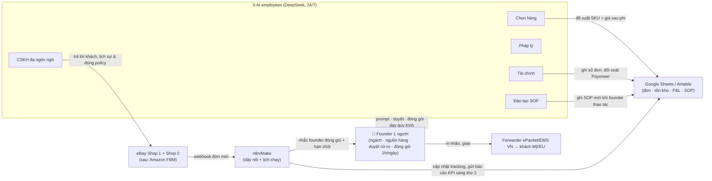

# Kế hoạch 02: Solo seller eBay/Amazon với 5 AI employees (OPC)

> Model phụ trách: DeepSeek · Ngày: 2026-09-10 · Trạng thái: draft

## 1. Mô hình công ty (1 slide)

- **Khách hàng:** người mua eBay/Amazon tại Mỹ (sau mở rộng EU: Đức, Anh) — thị trường mua sắm đồ thủ công, phụ kiện nhỏ, sản phẩm độc lạ có câu chuyện; sẵn sàng chờ ship 8–15 ngày nếu giá hợp lý và mô tả tốt.
- **Bán gì:** ngách dọc, nhẹ, cao margin, ít kẹt hải quan — gợi ý khởi đầu: đồ đan móc thủ công (amigurumi, túi), phụ kiện vải lụa/broderie, đồ trang trí tre/mây. Tiêu chí chọn hàng cứng: **<500 g** (để đi ePacket), giá bán $15–50, margin sau mọi phí ≥40%, ít biến thể size/màu, không pin/nam châm mạnh/mỹ phẩm.
- **Khác biệt:** 5 "nhân viên AI" có chức danh chạy 24/7 (chênh múi giờ VN–US chính là lợi thế: khách Mỹ nhắn 2h sáng, bot trả lời 2 phút); giá gốc Việt Nam; compliance chủ động (video mở hàng từng đơn).
- **Vì sao 1 người làm được:** 90% thao tác lặp (listing, trả lời khách, ghi sổ, đối soát) giao AI; người chỉ giữ 3 thứ theo nguyên tắc vàng: **định hướng ngách, kiểm định nguồn hàng, niềm tin + rủi ro** (master playbook mục 9).

## 2. Vì sao nó thắng ở Trung Quốc

- **Case 张顺 (Trương Thuận) ✅** — 1 người, 2 shop eBay, 5 nhân viên AI (chọn hàng, CSKH, pháp lý, tài chính, đào tạo SOP) làm việc 24/7; số "doanh thu >20.000 USD/tháng/shop" là **⚠️ tự khai, chỉ dùng làm hướng tham chiếu, không lập kế hoạch tài chính theo** — [南国都市报/中新网海南, 07/2026](http://szb.ngdsb.cn/h5/html5/2026-07/23/content_58867_19728456.htm).
- **Bài học copy được:**
  1. *Chuẩn hoá "vị trí công việc AI" có chức danh* — dễ giao việc, dễ đo KPI, dễ thay prompt (nguyên tắc vàng #8).
  2. *Múi giờ là vũ khí*: AI CSKH đêm thay 10+ nhân viên (pattern của 光年易达 ✅ — [中国经营报](https://news.qq.com/rain/a/20260326A04AP000)).
  3. *Dạy agent như dạy nhân viên*: quy trình thao tác 1 lần → đóng gói thành SOP → agent lặp lại đúng format (pattern Feishu aily ✅ — [环球时报](https://finance.sina.cn/2026-03-31/detail-inhsvmyh9204120.d.html)).
  4. *Người giữ lõi*: 张顺 vẫn là người chọn hướng và duyệt rủi ro — đừng AI-hoá phần quyết định.

## 3. Thị trường VN & US

**US — chi phí nền tảng (số đã đối chiếu):**
- eBay 2026: phí cuối (FVF) mặc định **13,6%** trên giá + ship, cộng phí cố định **$0,40/đơn** (đơn ≥$10) → đơn $50 mất $7,20 (≈14,4%) — [sellerfeecalc đối chiếu trang phí chính thức eBay](https://sellerfeecalc.com/seller-fees/ebay) / [eBay help](https://www.ebay.com/help/selling/fees-credits-invoices/selling-fees?id=4822). Phí quốc tế ~1,65% có thể cộng thêm khi địa chỉ người bán/người mua khác quốc gia — [sellerfeecalc](https://sellerfeecalc.com/ebay-fees/international-fee); kiểm tra trang phí theo quốc gia của người bán VN khi mở tài khoản.
- **Giới hạn tài khoản mới:** thường ~**10 listings & $500 doanh số/tháng**, reset theo tháng, tăng nhờ: dùng gần hết hạn mức + defect rate <2% + ship đúng hạn có tracking + chủ động bấm "Request higher selling limits" — [Nifty, 04/2026](https://www.nifty.ai/post/ebay-selling-limits).
- Amazon 2026: Professional **$39,99/tháng** (Individual $0,99/đơn), phí referral mặc định **15%** (điện tử ~8%), FBA mẫu ~**$6,00/đơn + 3,5% phụ phí nhiên liệu** — [sellerfeecalc đối chiếu trang giá chính thức Amazon](https://sellerfeecalc.com/amazon-fees) / [sell.amazon.com/pricing](https://sell.amazon.com/pricing).
- Dropshipping trên eBay 2026 vẫn bị siết: chỉ cho phép mua từ nhà cung cấp sỉ, tự chịu trách nhiệm giao đúng hạn — [SaleHoo](https://www.salehoo.com/learn/ebay-dropshipping). → Kế hoạch này **bán hàng có sẵn tồn kho ở VN**, không dropship.

**VN — hạ tầng người bán:**
- Ship VN→Mỹ: cước từ ~**$7,13/kg, 1–21 ngày** — [RateShips](https://rateships.com/en/shipping/vietnam-to-united-states); gói ePacket cho hàng nhẹ từ ~**198.000 VND (~$8), 8–12 ngày** — [AntinPhat](https://antinphat.vn/gui-hang-epacket-di-my.html); EMS qua bưu điện — [GothL](https://gothl.vn/gui-hang-di-my-qua-buu-dien-ems/).
- Thanh toán: eBay quản lý thanh toán (Managed Payments) cho người bán VN — [eBay SEA-VN](https://export.ebay.com/sea-vn/fees-regulations-policies/transactions/ebay-is-managing-payments/); rút tiền qua Payoneer — [Payoneer hướng dẫn liên kết eBay (tiếng Việt)](https://www.payoneer.com/vi/resources/cach-lien-ket-tai-khoan-payoneer-voi-ebay-va-nhan-thanh-toan/).
- Thuế VN: thu nhập từ nền tảng nước ngoài phải kê khai; cá nhân/hộ kinh doanh TMĐT thường áp thuế khoán trên doanh thu (xem hướng dẫn — [Luật ACC](https://congtyluatacc.vn/thu-nhap-ban-hang-online-tu-nen-tang-nuoc-ngoai-ke-khai-the-nao/) và [Cú Thông Thái](https://thue.cuthongthai.vn/blog/thue-xuat-khau-seller-vn-2026)); **xác nhận mức chính xác với chi cục thuế quận/huyện trước khi mở bán**.
- **Cửa vào trước: eBay** (không đòi đăng ký thương hiệu, không cần gửi kho, hạn mức $500/tháng buộc đi chậm = an toàn cho người mới); Amazon FBM sau khi có nguồn hàng và quy trình đóng gói ổn định.

## 4. Tech stack & kiến trúc tự động hoá

| Công cụ | Vai trò | Chi phí/tháng |
|---|---|---|
| DeepSeek API (qua gateway đa model) | "Trí não" của cả 5 AI employee | ≈$5 ⚠️ ước lượng theo khối lượng token |
| Coze quốc tế (coze.com) / Dify self-host | Bot CSKH + bot chọn hàng, publish ra kênh chat | $0–$10 ⚠️ (gói miễn phí + VPS nhỏ) |
| n8n (self-host) hoặc Make | "Dây nối": đơn mới → cập nhật tracking → ghi sổ → báo cáo | $0–$15 ⚠️ |
| Google Sheets / Airtable | Database trung tâm: đơn, tồn kho, chi phí, KPI | $0 (free tier) ⚠️ |
| 3Dsellers / Nifty | Bulk listing 100+ sản phẩm & AI viết listing từ ảnh | bản dùng thử miễn phí; mua khi >50 SKU ⚠️ ([3Dsellers](https://www.3dsellers.com/blog/ebay-bulk-listing), [Nifty](https://www.nifty.ai/post/ebay-selling-limits)) |
| CapCut + ảnh điện thoại + hộp chụp tự chế | Ảnh/video listing (video mở hàng để chống gian lận hoàn) | $0 |
| Payoneer + Paypal | Nhận tiền từ eBay/Amazon | % phí rút, không phí duy trì ⚠️ |
| Forwarder ePacket/EMS VN | Vận chuyển VN→Mỹ có tracking | theo đơn, từ ~$8/đơn hàng nhẹ |

**Người làm:** chọn ngách, chốt nguồn hàng, đóng gói/gửi hàng (~1 h/ngày), duyệt khuyến mãi & đơn giá >$100, trả lời khiếu nại phức tạp mà bot chuyển lên. **AI làm:** phần còn lại, kể cả việc "ngủ đêm trả lời khách".

## 5. Vận hành ngày/tuần của founder

**Lịch tuần mẫu (tổng ~10 h/tuần):** mỗi ngày 18:00–19:00 đóng gói đơn + gửi forwarder; sáng thứ 2 đọc báo cáo KPI auto (30 phút); thứ 4 duyệt 10 SKU mới do "Chọn hàng" đề xuất (30 phút); thứ 6 duyệt chiến dịch khuyến mãi + case CSKH còn treo (30 phút).

**5 vị trí AI (chức danh + prompt lõi + công cụ):**

| Chức danh | Prompt lõi (tóm tắt) | Công cụ |
|---|---|---|
| **Trưởng phòng Chọn hàng** | "Đề xuất SKU thoả: <500 g, giá bán $15–50, margin sau phí eBay+ship ≥40%, ít hoàn trả, không bị restricted items; so sánh đối thủ trên eBay (sold listings) trước khi đề xuất; kèm giá nhập thực tế và lý do khách mua." | DeepSeek + dữ liệu eBay/ZIK ([ZIK Analytics](https://www.zikanalytics.com/blog/ebay-selling-limits/)) |
| **Giám đốc CSKH** | "Trả lời <2 phút, EN/DE/FR/ES theo ngôn ngữ khách; chỉ cam kết điều có thật (ship 8–15 ngày, tracking, hoàn 30 ngày theo policy); 24 tình huống có sẵn template; mọi vụ >$50 hoặc dấu hiệu gian lận → chuyển founder." | Coze/Dify + DeepSeek, gắn vào trang shop & tin nhắn |
| **Cố vấn pháp lý** | "Kiểm tra mỗi listing: không đụng VeRO/nhãn hiệu, không restricted; khai HS code đúng khi gửi; lưu ảnh mở hàng + bill từng đơn; mỗi thứ 2 báo cáo 1 trang: rủi ro tuần này + việc cần làm." | DeepSeek + Sheets chứng từ + Notion |
| **Kế toán trưởng** | "Mỗi đơn ghi: giá, phí eBay (~14,4%), ship, hoàn, thuế khoán; đối soát Payoneer hàng tuần; báo P&L + điểm hoà vốn sáng thứ 2; cảnh báo nếu margin đơn <30%." | n8n + Sheets + DeepSeek |
| **Giám đốc Đào tạo SOP** | "Mỗi lần founder thao tác mới (gửi forwarder, xử lý hoàn), ghi SOP 7 bước + checklist vào Notion; khi quy trình đổi, cập nhật và báo các AI khác dùng bản mới." | DeepSeek + Notion (pattern "沉淀 thành skill" ✅) |

**Vòng lặp dữ liệu:** mỗi đơn → dữ liệu (giá, phí, lời, thời gian giao, feedback) → nuôi prompt Chọn hàng & CSKH → listing đời sau chính xác hơn → bán tốt hơn.

## 6. Mô hình doanh thu & chi phí

**Đơn vị kinh tế chuẩn (ví dụ túi móc len $30):** giá bán $30 → phí eBay ≈$4,30 (14,4%) → ship ePacket ≈$8 (tính vào giá hoặc buyer trả) → COGS ≈$6 → lãi gộp ≈**$10/đơn** ⚠️ (mẫu tính, thay số thật sau 10 đơn đầu).

**Bảng tháng 1→12 (2 shop eBay; USD):**

| Tháng | Đơn/tháng | Doanh thu | Chi phí hàng+ship | Phí sàn ~14,4% | Công cụ cố định | Lãi ròng | Kịch bản |
|---|---|---|---|---|---|---|---|
| 1 | 8 | $240 | $112 | $35 | $30 | $63 | Tệ |
| 2 | 12 | $360 | $168 | $52 | $30 | $110 | Tệ |
| 3 | 20 | $600 | $280 | $86 | $30 | $204 | Tệ |
| 4–6 | 25–40 | $750–1.200 | $350–560 | $108–173 | $30 | $262–437 | Cơ bản |
| 7–9 | 50–70 | $1.500–2.100 | $700–980 | $216–302 | $35 | $549–783 | Cơ bản |
| 10–12 | 90–150 | $2.700–4.500 | $1.260–2.100 | $389–648 | $40 | $1.011–1.712 | Tốt |

- **Điểm hoà vốn:** chi phí cố định ~$30–40/tháng + thuế khoán → **≈15–20 đơn/tháng** là hoà vốn (⚠️ ước lượng, cập nhật sau tháng 1 thực tế).
- **Kịch bản tệ:** 8–20 đơn/tháng, lãi $60–200/tháng — vẫn dương, đủ nuôi vòng lặp học.
- **Kịch bản tốt:** 150 đơn/tháng ≈ $4.500 doanh thu, lãi ~$1.700 — xa con số $20k của 张顺 (⚠️ tự khai), nhưng là mục tiêu khả thi cho 1 người 6 tháng.
- **Vốn khởi điểm (một lần, ≤5.000 USD):** hàng mẫu + tồn kho 30–50 SKU ≈ $800; thiết bị (hộp chụp tự chế, máy in nhãn nhiệt, cân điện tử, bao bì) ≈ $250; phí Payoneer/đăng ký hộ kinh doanh ≈ $100; công cụ 3 tháng ≈ $120; **dự phòng 3 tháng chi phí ≈ $1.000. Tổng ≈ $2.270.**

## 7. Lộ trình start-from-scratch

**Ngày 0–30 — Pháp lý, tài khoản, 5 AI workers:**
1. Đăng ký **hộ kinh doanh cá thể** tại UBND quận/huyện (CMND/CCCD, 3–5 ngày, gần như không mất phí) — bắt buộc để khai thuế và nhận tiền minh bạch.
2. Mở tài khoản **Payoneer** (CMND, xác minh địa chỉ) rồi liên kết với eBay theo hướng dẫn [Payoneer VN](https://www.payoneer.com/vi/resources/cach-lien-ket-tai-khoan-payoneer-voi-ebay-va-nhan-thanh-toan/).
3. Đăng ký tài khoản bán trên **ebay.com** (chọn địa chỉ đăng ký VN; đọc trang [eBay SEA-VN](https://export.ebay.com/sea-vn/fees-regulations-policies/transactions/ebay-is-managing-payments/)); nhận hạn mức ~10 items/$500, đặt báo thức "Request higher limits" hàng tháng.
4. Mua **5–10 sản phẩm mẫu** của ngách đã chọn, chụp ảnh/video theo 1 template cố định (5 ảnh + video 10 giây).
5. Dựng **5 AI workers** theo mục 5 trên Coze/Dify + n8n + Google Sheets (đọc template prompt, thay tên shop; 2–3 ngày).
6. **List 10 sản phẩm đầu** bằng form tự viết hoặc bulk tool ([3Dsellers](https://www.3dsellers.com/blog/ebay-bulk-listing)); giá = COGS×3,5 rồi điều chỉnh theo đối thủ.
7. Kiểm tra thử end-to-end: đặt thử 1 đơn bằng tài khoản bạn bè ở Mỹ → bot trả lời → đóng gói → forwarder ([AntinPhat](https://antinphat.vn/gui-hang-epacket-di-my.html)) → tracking hiện trên eBay.
8. Mốc: **1 đơn thật đầu tiên.**

**Ngày 30–60 — 10 đơn đầu & chuẩn hoá:**
1. Với mỗi đơn: **video mở hàng + bill + ảnh cân nặng** trước khi gửi (compliance là vũ khí — bài học 光年易达 chặn 60–70% hoàn trả gian lận ✅).
2. Sau 10 đơn: tính lại margin thật, bỏ 2 SKU tệ nhất, nhân đôi 2 SKU tốt nhất.
3. Tối ưu listing bằng AI (title SEO, description 3 câu + bảng thông số, hashtag).
4. Bật CSKH bot lên toàn bộ tin nhắn; đo thời gian phản hồi (mục tiêu <1 h).
5. Xin nâng hạn mức lần 1 khi bán hết ~80% hạn mức tháng.
6. **Mở shop thứ 2** (bản sao shop 1, ngách liền kề) — đúng mẫu 张顺 2 shop.
7. Cân nhắc đăng ký **Amazon Professional FBM** ($39,99/tháng) với 3–5 SKU best-seller nếu eBay ổn.
8. Mốc: **20 đơn/tháng, defect rate 0%, lãi ròng dương.**

**Ngày 60–90 — Tăng tốc:**
1. Mở rộng lên 40–60 SKU; dùng bulk listing ([3Dsellers](https://www.3dsellers.com/blog/ebay-bulk-listing)) thay đăng tay.
2. Bật **Promoted Listings 2–3%** cho 10 SKU bán chạy (theo dõi trong fee stack — [sellerfeecalc](https://sellerfeecalc.com/seller-fees/ebay)).
3. Đối soát Payoneer + kê khai thuế VN quý đầu với chi cục thuế ([tham khảo](https://congtyluatacc.vn/thu-nhap-ban-hang-online-tu-nen-tang-nuoc-ngoai-ke-khai-the-nao/)).
4. Chuẩn hoá 24 kịch bản CSKH + bảng từ chối buyer rủi ro (blocklist).
5. Mốc: **40 đơn/tháng, lãi ≥$400/tháng.**

**Ngày 90–180 — Scale & phòng thủ:**
1. Mở **eBay DE/UK** (dùng lại listing AI dịch sang Đức/Anh) cho sản phẩm đã bán chạy tại Mỹ.
2. Gửi thử **FBA 3–5 SKU** best-seller (nhờ đối tác vận chuyển tổng hợp VN→kho FBA) nếu đơn Amazon FBM tăng.
3. Thuê **1 người đóng gói bán thời gian** khi >60 đơn/tháng (OPC → chớm STC — nguyên tắc vàng #10).
4. Backup tài khoản: mở seller account dự phòng, không giam toàn bộ vốn trong eBay (rút payout hằng tuần).
5. Mốc: **90–150 đơn/tháng, lãi ≥$1.000/tháng, 2 thị trường.**

## 8. Rủi ro & phòng thủ

| # | Rủi ro | Giảm thiểu |
|---|---|---|
| 1 | **Đóng băng/hạ hạn mức tài khoản** (MC011/MC999 khi seller mới quốc tế) — rủi ro chết người với 1-shop | Ship 100% có tracking đúng hạn, defect <2% ([Nifty](https://www.nifty.ai/post/ebay-selling-limits)), không bán nhãn hiệu vi phạm VeRO, không dropship bán lẻ ([SaleHoo](https://www.salehoo.com/learn/ebay-dropshipping)); rút tiền hằng tuần; shop thứ 2 là backup sống |
| 2 | **Phí ship quốc tế ăn hết margin** (cước tăng, đơn nhẹ đắt tương đối) | Chỉ bán <500 g; tính phí vào giá hoặc buyer trả ship; ký 2 forwarder so giá; đàm phán giá theo khối lượng từ tháng 4 |
| 3 | **Hoàn hàng gian lận / buyer lạm dụng** (INAD, "không nhận được") | Video mở hàng + bill từng đơn (vũ khí compliance ✅); tracking mọi đơn; blocklist; chính sách hoàn 30 ngày rõ ràng trong listing |
| 4 | **Thuế & pháp lý VN** (kê khai sai, xuất khẩu nhỏ lẻ) | Khai thuế khoán từ tháng đầu với chi cục thuế ([tham khảo](https://congtyluatacc.vn/thu-nhap-ban-hang-online-tu-nen-tang-nuoc-ngoai-ke-khai-the-nao/)); giữ chứng từ; Nghị định 13/2023/NĐ-CP khi lưu dữ liệu khách (brief B5) |
| 5 | **Nền tảng đổi phí/policy** (eBay tăng FVF, siết seller VN) | Đa kênh (eBay + Amazon + tiến tới TikTok Shop US theo nguyên tắc vàng #5); cập nhật fee table mỗi quý ([sellerfeecalc](https://sellerfeecalc.com/seller-fees/ebay) theo dõi thay đổi) |
| 6 | **Công nghệ:** agent hallucinate trả lời sai cam kết | Template cứng 24 tình huống + chặn các từ "guarantee/refund ngoài policy"; bot chỉ trả lời trong phạm vi template, còn lại chuyển người; log mọi hội thoại |
| 7 | **Cá nhân:** burnout vì "AI làm mà vẫn phải lo hết" | Giữ đúng nguyên tắc người giữ 3 thứ; đóng gói gom 1 khung giờ; nghỉ 1 ngày/tuần — AI vẫn chạy |

## 9. KPI & tiêu chí kill/scale

**KPI chính (đo tự động, báo cáo sáng thứ 2):**
1. Đơn/tháng và lãi ròng/đơn (target ≥$8/đơn sau mọi phí).
2. % đơn có tracking đúng hạn = 100%; defect rate <2%.
3. Thời gian phản hồi CSKH trung bình <1 h (24/7).
4. Sell-through rate listing/tháng (target ≥25% để được nâng hạn mức — [Nifty](https://www.nifty.ai/post/ebay-selling-limits)).
5. Margin tổng ≥30% (nếu dưới, Kế toán trưởng cảnh báo ngay).

**KILL (dừng/đổi hướng):** hết tháng 6 mà **<20 đơn/tháng hoặc lãi ròng ≤$0 hai tháng liên tiếp** → giữ nguyên 5 AI workers, đổi ngách sản phẩm hoặc đổi kênh chính (sang TikTok Shop US — nguyên tắc vàng #5). Không đổ thêm tiền quảng cáo vào ngách đã chứng minh thất bại.

**SCALE (OPC → STC):** **≥80 đơn/tháng ổn định 2 tháng** → thuê 1 người đóng gói part-time, mở Amazon FBA cho top SKU; **doanh thu ≥$8.000/tháng** → tuyển 1 người sourcing thật + 1 CSKH người cho case khó, 5 AI workers giữ nguyên làm "đội nền".

## 10. Nguồn tham khảo

- [南国都市报 — 张顺和他的5个AI员工 (07/2026)](http://szb.ngdsb.cn/h5/html5/2026-07/23/content_58867_19728456.htm)
- [sellerfeecalc — eBay seller fees 2026 (đối chiếu trang phí chính thức eBay)](https://sellerfeecalc.com/seller-fees/ebay) · [eBay help — selling fees](https://www.ebay.com/help/selling/fees-credits-invoices/selling-fees?id=4822) · [eBay international fee 1,65%](https://sellerfeecalc.com/ebay-fees/international-fee)
- [Nifty — eBay selling limits 2026 (10 items/$500)](https://www.nifty.ai/post/ebay-selling-limits) · [ZIK Analytics — tăng hạn mức eBay](https://www.zikanalytics.com/blog/ebay-selling-limits/)
- [sellerfeecalc — Amazon fees 2026 (đối chiếu sell.amazon.com/pricing)](https://sellerfeecalc.com/amazon-fees) · [Amazon pricing chính thức](https://sell.amazon.com/pricing)
- [SaleHoo — eBay dropshipping policy 2026](https://www.salehoo.com/learn/ebay-dropshipping)
- [3Dsellers — eBay bulk listing](https://www.3dsellers.com/blog/ebay-bulk-listing) · [FlowLister — so sánh công cụ listing 2026](https://flowlister.com/best-ebay-listing-software/)
- [RateShips — vận chuyển VN→US từ $7,13/kg](https://rateships.com/en/shipping/vietnam-to-united-states) · [AntinPhat — ePacket đi Mỹ từ 198k VND, 8–12 ngày](https://antinphat.vn/gui-hang-epacket-di-my.html) · [GothL — gửi hàng đi Mỹ qua EMS](https://gothl.vn/gui-hang-di-my-qua-buu-dien-ems/)
- [Payoneer VN — liên kết Payoneer với eBay](https://www.payoneer.com/vi/resources/cach-lien-ket-tai-khoan-payoneer-voi-ebay-va-nhan-thanh-toan/) · [eBay SEA-VN — eBay quản lý thanh toán](https://export.ebay.com/sea-vn/fees-regulations-policies/transactions/ebay-is-managing-payments/)
- [Luật ACC — kê khai thu nhập bán online từ nền tảng nước ngoài](https://congtyluatacc.vn/thu-nhap-ban-hang-online-tu-nen-tang-nuoc-ngoai-ke-khai-the-nao/) · [Cú Thông Thái — thuế xuất khẩu seller VN 2026](https://thue.cuthongthai.vn/blog/thue-xuat-khau-seller-vn-2026)
- Playbook: [中国经营报 — 光年易达](https://news.qq.com/rain/a/20260326A04AP000) · [环球时报 — 百虾竞渡](https://finance.sina.cn/2026-03-31/detail-inhsvmyh9204120.d.html) · `plans/reports/260910-1118-opc-china-master-playbook.md`
- Ngày truy cập web: 2026-09-10.

## 11. Câu hỏi mở

1. eBay áp chính sách gì riêng cho seller đăng ký tại VN (hạn mức, phí quốc tế 1,65% có áp cho mọi đơn bán sang Mỹ, payout qua Payoneer)? Cần đọc trang phí theo quốc gia + hỏi support trước khi tính giá bán.
2. Mức thuế khoán chính xác cho hộ kinh doanh bán trên eBay/Amazon tại từng tỉnh (doanh thu ngoại tệ kê khai thế nào, có được khấu trừ phí sàn/ ship)?
3. Forwarder ePacket nào ở VN có tích hợp API tạo nhãn + tracking tự động (để n8n cập nhật tracking không qua tay người)?
4. Ngách thủ công nào của VN thực sự có demand trên eBay US mà chưa bị seller Trung Quốc chiếm (cần chạy thử "Chọn hàng" bằng dữ liệu sold listings trước khi nhập 50 SKU)?
5. Ngưỡng nào thì chuyển SKU best-seller sang Amazon FBA có lời, khi FBA ~$6/đơn + 3,5% phụ phí + chi phí gửi kho từ VN?
