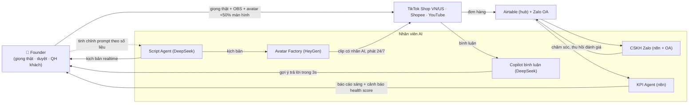

# Kế hoạch 03: Studio livestream AI 数字人 (digital human) bán hàng xuyên biên giới (OPC)

> Model phụ trách: DeepSeek · Ngày: 2026-09-10 · Trạng thái: draft

## 1. Mô hình công ty (1 slide)

- **Khách hàng:** (a) người mua trên TikTok Shop VN/US qua shop tự chủ + affiliate; (b) seller/nhãn hàng VN thuê studio (B2B — "bán xẻng" kiểu 冉伟, brief B2).
- **Bán gì:** chuỗi khép kín *kịch bản → avatar AI → phát sóng → chốt đơn → CSKH*: video bán hàng avatar AI chạy 24/7 + phiên LIVE lai "giọng người thật + hình avatar + AI copilot" + dịch vụ studio cho khách B2B.
- **Khác biệt:** agency VN bán livestream người ảo **11–37 triệu VND/buổi 4 giờ** ([Lao Động, 07/01/2026](https://news.laodong.vn/cong-nghe/livestream-nguoi-ao-co-gia-len-toi-37-trieu-dongbuoi-1637112.ldo)); OPC bán **2–5 triệu VND/buổi** hoặc tự dùng — vì 75% founder OPC TQ không có nền kỹ thuật vẫn làm được (brief B1), và chi phí nhân vật ở TQ chỉ vài nghìn RMB (mục 2).
- **Vì sao 1 người làm được:** AI làm 80% (kịch bản, avatar, copilot bình luận, CSKH đêm, báo cáo KPI); người giữ 3 thứ theo nguyên tắc vàng: định hướng, duyệt nội dung, **giọng nói thật + quan hệ khách hàng** (brief B4).
- **Pivot bắt buộc so với "24/7 thuần AI":** TikTok Shop US từ 23/05/2026 **cấm giọng AI và audio thu sẵn trong LIVE** ([ppc.land](https://ppc.land/tiktok-shops-quality-rules-ban-ai-voices-and-still-images-from-lives/)); VN từ 01/07/2026 bắt buộc **xác thực VNeID khi livestream bán hàng** ([Lao Động](https://news.laodong.vn/kinh-doanh/phai-xac-thuc-danh-tinh-bang-vneid-truoc-khi-livestream-ban-hang-1623141.ldo)). → Studio chạy 2 "tua" hợp pháp: (1) **nhà máy video avatar AI** (shoppable video có gắn nhãn AI) chạy 24/7; (2) **LIVE lai**: giọng người thật (founder + 2 cộng tác viên giọng part-time) + hình avatar <50% màn hình + AI copilot. "24/7" đạt bằng tổng thời lượng video + nhiều slot giọng, không bằng 1 avatar vô hạn.

## 2. Vì sao nó thắng ở Trung Quốc

- ✅ **[一财 12/01/2026](https://finance.sina.com.cn/roll/2026-01-12/doc-inhfzukt9994973.shtml) (đã đọc toàn văn):** 老管家 bật 数字人 cho 8–10 shop Kuaishou, chạy 6h–24h, mỗi shop bán vài nghìn đến 5 vạn NDT/ngày, đỉnh **20–30 vạn NDT/ngày**; 数字人 La Yonghao chỉ 26 phút đã vượt GMV 1 giờ của người thật; một tài khoản 数字人 năm 2022 bán được **1,9 亿 NDT/năm**.
- ✅ **Cùng bài — bài học chi phí để copy:** clone 1 nhân vật **1–2 nghìn NDT**, bản rẻ "PC + phần mềm + mẫu công cộng + LLM sinh lời thoại" **vài nghìn NDT/năm** mà giúp nông dân bán trứng vài vạn NDT/tháng; tổng chi phí giảm tới **80%** so với đội MC thật (lương 1,5–2 vạn/tháng, chưa kể bao ăn ở). 集思科技 bán gói tầm trung **3–6 vạn NDT/năm/phòng** cho 24h ([一财](https://finance.sina.com.cn/roll/2026-01-12/doc-inhfzukt9994973.shtml)).
- ✅ **Kiến trúc copy về:** 1 数字人 chất lượng cao = **6–7 agent** (主播/互动/场控…) do AI trung tâm điều phối — chính là "vị trí công việc AI" của 张顺 (brief B2/B4) → triển khai ở mục 5.
- ✅ **Chính sách:** Lâm Cảng (Thượng Hải) xếp **livestream xuyên biên giới vào 8 ngành ưu tiên** cho OPC (brief B1, [上观新闻](https://www.shobserver.com/wx/detail.do?id=1036074)).
- ⚠️ **Bài học cảnh báo:** Douyin không khuyến khích 数字人; Taobao/JD/PDD hạn chế traffic ban ngày; nhưng 12/2025 **JD mở miễn phí 数字人 cho mọi merchant** (đã phục vụ 5 vạn+ nhãn) — kênh và policy là biến số sống còn, công nghệ chỉ là điều kiện cần ([一财](https://finance.sina.com.cn/roll/2026-01-12/doc-inhfzukt9994973.shtml)).

## 3. Thị trường VN & US

**VN (vào trước):**
- Sóng đã nổi: nhiều phiên livestream người ảo bán quần áo/mỹ phẩm/đồ gia dụng kéo dài hàng giờ, "đọc bình luận nhanh hơn MC thật", vài trăm đơn/phiên ([Lao Động](https://news.laodong.vn/cong-nghe/livestream-nguoi-ao-co-gia-len-toi-37-trieu-dongbuoi-1637112.ldo)); Thiên Long ứng dụng AI livestream, **doanh thu TikTok Shop tăng 3,5 lần** ([Báo Công Thương, 11/08/2026](https://congthuong.vn/thien-long-ung-dung-ai-livestream-doanh-thu-tiktok-shop-tang-3-5-lan-450026.media)).
- Quy định: từ **01/07/2026**, người livestream bán hàng trên sàn TMĐT **phải xác thực danh tính bằng VNeID** ([Lao Động](https://news.laodong.vn/kinh-doanh/phai-xac-thuc-danh-tinh-bang-vneid-truoc-khi-livestream-ban-hang-1623141.ldo)); người tiêu dùng còn lo "mua rồi biết khiếu nại ai" — công bố AI minh bạch là lợi thế cạnh tranh ([Lao Động](https://news.laodong.vn/cong-nghe/livestream-nguoi-ao-co-gia-len-toi-37-trieu-dongbuoi-1637112.ldo)).
- Đối thủ: agency số hóa nhân giá cao (11–37 triệu/buổi), seller tự phát dùng video lặp. **Kẽ hở: phân khúc "studio AI giá rẻ + chuẩn compliance" gần như trống** — đây là cửa B2B.

**US (vào sau, bằng video trước):**
- Policy 23/05/2026 (TikTok Shop Academy US): **cấm giọng AI, audio thu sẵn, khung hình tĩnh >50% màn hình, ảnh chụp PDP** trong LIVE và video shoppable; yêu cầu tương tác lời nói **thời gian thực**; nhân vật hoạt hình không phải người thật chiếm >50% diện tích bị tính là khung hình tĩnh; phạt điểm → gỡ nội dung → **khoá hoa hồng → khoá tài khoản** ([ppc.land](https://ppc.land/tiktok-shops-quality-rules-ban-ai-voices-and-still-images-from-lives/)).
- 10/07/2026 TikTok cập nhật nhãn AI nền tảng (C2PA); ~22/07/2026 TikTok Shop cho seller dùng AI **dịch/lồng tiếng/tường thuật cho VIDEO (không phải LIVE)** nhưng phải công bố; clone giọng phải có đồng ý bằng văn bản ([gocrazyai, 04/08/2026](https://www.gocrazyai.com/blog/tiktok-synthetic-voice-rules)).
- Phí hoa hồng US đang được điều chỉnh, đảo ngược kinh tế của seller ⚠️ ([Ecommerce Times](https://ecommerce-times.com/tiktok-shops-u-s-commission-hike-is-reshaping-seller-economics-3/)); từ 25/02/2026 **hết Seller Shipping**, phải dùng logistics của TikTok ([ppc.land](https://ppc.land/tiktok-shop-forces-sellers-into-logistics-ultimatum-that-could-destroy-3pl-businesses/)).
- **Cửa vào US:** affiliate + video shoppable AI (có nhãn) trước, LIVE lai sau khi đủ dữ liệu VN.

## 4. Tech stack & kiến trúc tự động hoá

| Công cụ | Vai trò | Chi phí/tháng |
|---|---|---|
| HeyGen (Creator) | Clone avatar từ clip 15 giây, 175+ ngôn ngữ, dubbing không tốn credit, API tốt nhất | **~$24** ⚠️ kiểm tra trang giá ([frankx.ai](https://www.frankx.ai/blog/heygen-vs-synthesia-vs-argil-2026)) |
| Argil (dự phòng, chưa cần) | Shorts 30–90s cho creator | Pro $100 (đã xác minh, [toolchase](https://toolchase.com/tool/argil/)) |
| CapCut Pro | Dựng, phụ đề đồng bộ lời nói | ⚠️ ~200–300k VND |
| OBS Studio | Phát LIVE | 0đ |
| LiveKit Agents (self-host) | Avatar real-time trong LIVE (mã nguồn mở) | ⚠️ server ~300–500k VND |
| n8n (self-host) | "Dây nối": lịch phát, ghi đơn, báo cáo, cảnh báo policy | 0đ |
| DeepSeek API | Kịch bản, copilot bình luận, dịch VN↔EN | ⚠️ ~$5–15 theo mức dùng |
| Airtable + Zalo OA | Hub dữ liệu trung tâm + CSKH sau bán | 0đ |

**Người làm:** nói trực tiếp trong LIVE, duyệt kịch bản/claim sản phẩm, chốt đối tác B2B, xử lý khiếu nại. **AI làm:** sinh kịch bản đa ngôn ngữ, render avatar, đọc-gom bình luận, CSKH đêm, báo cáo, soi health score shop.

## 5. Vận hành ngày/tuần của founder

**Lịch tuần mẫu (sau ngày 60):**
- Thứ 2: sinh 30–40 clip avatar (VI + EN) bằng HeyGen batch + API, đăng lịch 7 ngày (n8n).
- Thứ 3–6: LIVE lai 2 ca (12h–15h founder; 19h–22h founder/cộng tác giọng), AI copilot dẫn lời, trả lời bình luận theo gợi ý.
- Thứ 7: họp 30 phút với "KPI Agent": clip nào chuyển đơn, từ khoá nào bị tuột → sửa prompt Script Agent.
- CN: nghỉ; CSKH do Zalo bot + script dự phòng.
- Tối mỗi ngày: AI soi tài khoản (health score, cảnh báo vi phạm) gửi Telegram.

**5 vị trí công việc AI (mẫu 张顺, brief B2):**
1. **Giám đốc kịch bản (Script Agent):** prompt chính — *"Viết kịch bản 60s hook-vấn đề-demo-CTA cho [sản phẩm], giọng miền Nam, cấm claim sức khoẻ, dưới 90 từ, kèm 5 bình luận dự kiến"*.
2. **Trợ lý trường quay (Copilot):** đọc bình luận realtime → phân loại (hỏi giá/khiếu nại/troll) → gợi ý câu trả lời <15 từ.
3. **Nhân viên sản xuất video (Avatar Factory):** HeyGen API + template → clip gắn nhãn "Nội dung có AI".
4. **CSKH đêm (Zalo bot):** trả lời FAQ, ghi đơn vào Airtable, leo thang cho người khi khách giận.
5. **KPI Agent:** n8n tổng hợp GMV, tỷ lệ clip→đơn, điểm sức khoẻ shop, gửi báo cáo 7h sáng.

**Vòng lặp dữ liệu (增强回路):** clip/live → đơn + bình luận → Airtable → phân tích đúng/sai → sửa prompt kịch bản → clip tốt hơn (brief B4.7).

## 6. Mô hình doanh thu & chi phí

**Vốn khởi điểm: ~120 triệu VND ≈ $4.700** ⚠️ (tỷ giá 25.500): pháp lý + VNeID + hoá đơn 2tr; PC/mic/đèn/webcam 10tr; phần mềm 6 tháng 10tr; hàng mẫu + nguồn hàng test 25tr; ads/seed content 25tr; 2 cộng tác viên giọng part-time 3 tháng 15tr; dự phòng 33tr.

**Bảng ước lượng tháng 1→12 (kịch bản cơ bản, triệu VND):**

| T | Hành động chính | Doanh thu | Chi phí | Luỹ kế |
|---|---|---|---|---|
| 1 | Đăng ký pháp lý, VNeID, clone avatar, 10 clip test | 0 | 18 | -18 |
| 2 | 60 clip, LIVE lai 2h/ngày, đăng ký affiliate | 1 | 20 | -37 |
| 3 | Tối ưu 3 clip tốt nhất, 2 slot giọng, chốt B2B #1 | 3 | 22 | -56 |
| 4 | 20h LIVE/tuần, B2B #2, mở Shopee | 8 | 25 | -73 |
| 5 | Tăng ads cho clip ăn, đơn ổn định 5–8/ngày | 13 | 26 | -86 |
| 6 | Chuẩn hoá SOP studio, B2B #3 | 20 | 27 | -93 |
| 7 | **Điểm hoà vốn** (~30tr/tháng) | 30 | 28 | -91 |
| 8 | Mở video shoppable EN, affiliate US test | 38 | 30 | -83 |
| 9 | B2B #4–5, gói studio trọn gói 4tr/buổi | 46 | 32 | -69 |
| 10 | LIVE lai 28h/tuần, shop US nhập nhẹ | 55 | 34 | -48 |
| 11 | Mùa mua sắm cuối năm (11.11/Black Friday) | 70 | 36 | -14 |
| 12 | Bán Tết VN, tổng kết | 85 | 38 | **+33** |

**3 kịch bản 12 tháng:** Tệ — không clip nào ăn, tháng 6 GMV <10tr → tổng doanh thu ~90tr, lỗ ~160tr → **KILL shop, pivot thuần B2B studio** (vốn studio đã có sẵn). Cơ bản — như bảng trên. Tốt — 1 clip viral tháng 3 (≥1 triệu view) + 5 khách B2B từ tháng 6 → tổng ~700tr, lãi ~350tr ⚠️ (số tự lập, để test KPI mục 9).
**Dòng tiền khác:** affiliate 10–20% hoa hồng không cần vốn hàng; B2B thu trước 50%/buổi — 2 nguồn này nuôi giai đoạn đầu.

## 7. Lộ trình start-from-scratch

**Giai đoạn 0–30 ngày (nền móng, ~30tr):**
1. Ngày 1: tải app VNeID, xác thực mức 2 (0đ); mở Seller Center TikTok Shop VN bằng CCCD gắn chip + STK ngân hàng, chờ duyệt 1–3 ngày, phí 0đ (kèm tài khoản affiliate).
2. Ngày 2–5: đăng ký **hộ kinh doanh** cá thể (0–500k, 1–3 ngày) — OPC của VN; làm chữ ký số + hoá đơn điện tử (Thông tư 78) ~1,5tr ⚠️ (brief B5).
3. Ngày 3–7: quay clip 15 giây bản thân → clone avatar HeyGen (~$24/tháng ⚠️, [frankx.ai](https://www.frankx.ai/blog/heygen-vs-synthesia-vs-argil-2026)); dựng mini-studio tại nhà (mic + đèn + webcam ~5tr).
4. Ngày 8–14: chọn 1 ngách dọc (gợi ý: đồ gia dụng nhà bếp mini, phụ kiện bàn làm việc); lấy 5 mẫu hàng (3tr); chụp ảnh/video demo thật sản phẩm.
5. Ngày 15–21: sinh 10 clip shoppable (gắn nhãn "có AI", giọng lồng tiếng AI hợp lệ cho video, [gocrazyai](https://www.gocrazyai.com/blog/tiktok-synthetic-voice-rules)); đăng + chạy ads thử 2tr.
6. Ngày 22–30: LIVE lai đầu tiên 1h/ngày (giọng thật + avatar <50% màn hình + demo sản phẩm thật); mở Zalo OA; dựng Airtable + n8n ghi đơn. **Mốc: 10 clip, 5 phiên live, 3 đơn đầu.**

**Giai đoạn 30–60 (chạy vòng lặp, ~25tr):**
7. Nâng lên 60 clip/tháng qua HeyGen API + template; phân tích clip nào chuyển đơn.
8. Tuyển 2 cộng tác viên giọng part-time (~40k/h ⚠️), nâng 15–20h live/tuần.
9. Bật 5 vị trí AI (mục 5); CSKH đêm tự động.
10. Bán gói B2B đầu: studio AI 2tr/buổi cho 1 seller nhỏ (đối chiếu giá thị trường 11–37tr, [Lao Động](https://news.laodong.vn/cong-nghe/livestream-nguoi-ao-co-gia-len-toi-37-trieu-dongbuoi-1637112.ldo)). **Mốc: ≥20 đơn/tuần hoặc 1 khách B2B.**

**Giai đoạn 60–90 (đóng gói & phòng thủ, ~20tr):**
11. Soi health score shop hàng tuần; video mở hàng + chứng từ chặn gian lận hoàn hàng (brief B4.6).
12. Đóng gói SOP thành "skill studio" (kịch bản, avatar, live, CSKH) — tài sản tái dùng cho B2B và bán sang thị trường mới.
13. Kiểm tra policy TikTok Shop mới nhất 2 tuần/lần (Academy US/VN).
14. Mở kênh thứ 2 (Shopee) bằng cùng nội dung. **Mốc: 30 đơn/tuần hoặc 2 khách B2B, điểm hoà vốn tháng thứ 7 còn đúng.**

**Giai đoạn 90–180 (mở US, ~30tr):**
15. Dùng HeyGen dubbing + lip-sync sang EN (175+ ngôn ngữ, [frankx.ai](https://www.frankx.ai/blog/heygen-vs-synthesia-vs-argil-2026)) cho 30 clip; chạy affiliate US (không tồn kho).
16. Nghiên cứu logistics TikTok US (bắt buộc từ 25/02/2026, [ppc.land](https://ppc.land/tiktok-shop-forces-sellers-into-logistics-ultimatum-that-could-destroy-3pl-businesses/)) trước khi mở shop US.
17. B2B: bán gói "studio AI 24/7" cho 3–5 nhãn VN; tuyển VA đầu tiên khi quá tải. **Mốc: GMV ≥100tr/tháng hoặc 5 khách B2B → SCALE.**

## 8. Rủi ro & phòng thủ

1. **Policy nền tảng siết thêm (cao nhất):** LIVE bị cấm giọng AI/khung hình tĩnh, phạt khoá hoa hồng ([ppc.land](https://ppc.land/tiktok-shops-quality-rules-ban-ai-voices-and-still-images-from-lives/)) → *phòng thủ:* thiết kế compliance-by-default (giọng thật, nhãn AI, avatar <50%, demo sản phẩm thật); đa kênh (Shopee/YouTube/site riêng); soi policy 2 tuần/lần.
2. **Niềm tin người tiêu dùng:** người mua "không biết khiếu nại ai" với người ảo ([Lao Động](https://news.laodong.vn/cong-nghe/livestream-nguoi-ao-co-gia-len-toi-37-trieu-dongbuoi-1637112.ldo)) → *phòng thủ:* công bố AI minh bạch ngay đầu phiên, CSKH người thật khi có khiếu nại, tuyệt đối không claim sức khoẻ.
3. **Pháp lý VN:** VNeID bắt buộc từ 01/07/2026 ([Lao Động](https://news.laodong.vn/kinh-doanh/phai-xac-thuc-danh-tinh-bang-vneid-truoc-khi-livestream-ban-hang-1623141.ldo)); Nghị định 13/2023 bảo vệ dữ liệu cá nhân (brief B5) → *phòng thủ:* đăng ký hộ kinh doanh + xác thực VNeID trước ngày live đầu tiên; dữ liệu khách chỉ nằm trong Airtable/Zalo, có cam kết bảo mật.
4. **Rủi ro tài chính/hàng tồn:** chôn vốn vào hàng → *phòng thủ:* affiliate + đặt hàng theo đơn 3 tháng đầu; nhập hàng chỉ khi 1 SKU chạy ổn.
5. **Rủi ro công nghệ:** giá/tính năng HeyGen đổi, deepfake bị lạm dụng → *phòng thủ:* giữ log nguồn gốc (C2PA), dự phòng Argil/LiveKit, không phụ thuộc 1 model (brief B4).
6. **Rủi ro cá nhân:** founder khản giọng/mệt khi phải nói liên tục → *phòng thủ:* giới hạn 4h live/ngày, 2 cộng tác viên giọng từ ngày 30, nghỉ 1 ngày/tuần.
7. **Đối thủ agency hạ giá:** agency VN đã bán 11–37tr/buổi ([Lao Động](https://news.laodong.vn/cong-nghe/livestream-nguoi-ao-co-gia-len-toi-37-trieu-dongbuoi-1637112.ldo)) có thể theo giá → *phòng thủ:* khoá bằng kết quả (đơn/buổi) và SOP riêng, không cạnh tranh bằng giá thuần.

## 9. KPI & tiêu chí kill/scale

**KPI (theo dõi hàng tuần):** ① GMV/tháng (mục tiêu 30tr vào tháng 7); ② tỷ lệ clip→đơn ≥2% ⚠️; ③ giờ LIVE/tuần ≥20 và giá trị đơn/giờ live; ④ điểm sức khoẻ shop (SPS/CHR) không có điểm phạt; ⑤ số khách B2B.
**KILL (đổi hướng):** hết tháng 4 mà GMV <10tr/tháng VÀ <2 khách B2B → dừng shop tự chủ, pivot thuần studio B2B (đã có sẵn avatar + SOP); hết tháng 6 không hoà vốn tiến tới → dừng mô hình, giữ lại kỹ năng làm dịch vụ.
**SCALE (OPC → STC):** GMV ≥100tr/tháng hoặc ≥5 khách B2B trả phí định kỳ → tuyển 1 VA vận hành + 1 VA chỉnh clip; mở shop US đầy đủ; gói SOP thành sản phẩm "studio-in-a-box" cho seller khác (mẫu 冉伟, brief B2).

## 10. Nguồn tham khảo (truy cập 2026-09-10)

- [一财 — 带货能力超越罗永浩，成本几千元的数字人卖爆 (12/01/2026)](https://finance.sina.com.cn/roll/2026-01-12/doc-inhfzukt9994973.shtml) (bản gốc [yicai.com](https://www.yicai.com/news/102999437.html))
- [PPC Land — TikTok Shop bans AI voices and still images from LIVEs (policy 23/05/2026)](https://ppc.land/tiktok-shops-quality-rules-ban-ai-voices-and-still-images-from-lives/)
- [GoCrazyAI — TikTok synthetic voice rules, July 2026 guide](https://www.gocrazyai.com/blog/tiktok-synthetic-voice-rules)
- [Lao Động — Livestream người ảo giá tới 37 triệu đồng/buổi (07/01/2026)](https://news.laodong.vn/cong-nghe/livestream-nguoi-ao-co-gia-len-toi-37-trieu-dongbuoi-1637112.ldo)
- [Lao Động — Phải xác thực VNeID trước khi livestream bán hàng (từ 01/07/2026)](https://news.laodong.vn/kinh-doanh/phai-xac-thuc-danh-tinh-bang-vneid-truoc-khi-livestream-ban-hang-1623141.ldo)
- [Báo Công Thương — Thiên Long ứng dụng AI livestream, doanh thu TikTok Shop tăng 3,5 lần (11/08/2026)](https://congthuong.vn/thien-long-ung-dung-ai-livestream-doanh-thu-tiktok-shop-tang-3-5-lan-450026.media)
- [FrankX — HeyGen vs Synthesia vs Argil 2026 (giá HeyGen ~$24/tháng)](https://www.frankx.ai/blog/heygen-vs-synthesia-vs-argil-2026)
- [ToolChase — Argil review & pricing 2026 (Pro $100 / Business $200)](https://toolchase.com/tool/argil/)
- [Ecommerce Times — TikTok Shop US commission hike ⚠️](https://ecommerce-times.com/tiktok-shops-u-s-commission-hike-is-reshaping-seller-economics-3/)
- [PPC Land — TikTok Shop logistics mandate (hết Seller Shipping 25/02/2026)](https://ppc.land/tiktok-shop-forces-sellers-into-logistics-ultimatum-that-could-destroy-3pl-businesses/)
- [PYMNTS — TikTok Shop bans AI voices from livestreams](https://www.pymnts.com/news/ecommerce/2026/tiktok-shop-bans-ai-voices-from-livestreams/)
- [网易 — TikTok Shop发布AI生成内容规则：合规就不限流](https://www.163.com/dy/article/KLBREAB505118A6A.html)

## 11. Câu hỏi mở

1. TikTok Shop **VN** đã có bộ quy tắc "High-Quality LIVEs" tương tự US chưa, hay mới chỉ có VNeID? (đọc TikTok Shop Academy VN trước ngày live thứ 31)
2. Giá gói real-time interactive avatar của HeyGen/LiveKit hiện tại là bao nhiêu (bảng trên chỉ có giá bản render video)?
3. Hộ kinh doanh VN nộp thuế affiliate TikTok theo tỷ lệ nào (Thông tư 40/2021) — xác nhận với kế toán trước tháng 3?
4. TikTok Symphony Digital Avatars có mở cho seller nhỏ không phải brand không?
5. Mức hoa hồng chính xác theo ngành hàng của TikTok Shop US 2026 sau đợt tăng phí ⚠️?
