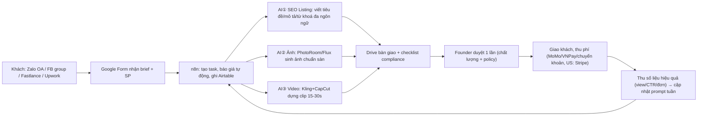

# Kế hoạch 04: Agency AI listing & content cho seller nhỏ (OPC)

> Model phụ trách: DeepSeek · Ngày: 2026-09-10 · Trạng thái: draft
> Tóm tắt: "Bán xẻng" — xưởng dịch vụ AI làm listing đa ngôn ngữ, ảnh sản phẩm, video ngắn, SEO sàn cho seller TikTok Shop VN/Shopee/Amazon. Vốn ≤2.000 USD, 1 người + 5 "nhân viên AI".

## 1. Mô hình công ty (1 slide)

- **Khách hàng:** seller nhỏ VN (hộ kinh doanh, shop cá nhân, KOC tự bán hàng) đang bán Shopee/TikTok Shop VN và muốn mở TikTok Shop ĐNÁ/US; giai đoạn 2 là seller Amazon/Shopify US.
- **Bán gì:** 4 gói dịch vụ — (A) Listing chuẩn SEO theo sàn (tiêu đề, mô tả, từ khoá, hashtag); (B) Ảnh sản phẩm AI (nền trắng + lifestyle); (C) Video ngắn bán hàng 15–30s; (D) Localize đa ngôn ngữ (Thái/Indo/Malay/Anh/Tây Ban Nha) + retainer "quản trị content tháng".
- **Khác biệt:** không bán "ảnh đẹp" mà bán **listing có số liệu** — mỗi đơn giao kèm từ khoá đã nghiên cứu, ảnh/video đúng quy chuẩn sàn, và sau 2 tuần gửi báo cáo so sánh (view/CTR). Đối thủ freelancer VN chỉ giao file, không chứng minh hiệu quả.
- **Vì sao 1 người làm được:** toàn bộ công đoạn sản xuất do 5 AI worker làm (copy, ảnh, dịch, dựng video, CSKH); người chỉ giữ: chốt khách, duyệt chất lượng, kiểm tra compliance. Chi phí biến đổi mỗi đơn ≈ vài nghìn đồng tiền API (⚠️ ước tính theo giá DeepSeek API), biên lợi nhuận gộp 80–90%.

## 2. Vì sao nó thắng ở Trung Quốc

- **光年易达 ✅** — chính là công thức "tự chạy rồi bán xẻng": tiền thân là đội 上海瑭豆 bán công nghệ AI cho TMĐT, phát hiện "chỉ bán tech khó chạm nỗi đau — **中小商家 cần nhất không phải model, mà là cách bán hàng TQ ra nước ngoài**" → tự xuống làm 14 shop TikTok Shop, chạy thông toàn quy trình, rồi "再用经验和AI工具服务更多跨境电商企业". Sản phẩm họ tự dùng chính là thứ ta sẽ bán: *"上架一个品过去要几十张图、人工翻译双语，现在一个人轻松搞定"* (dịch+ảnh+batch listing) ([中国经营报 qua eastmoney](https://finance.eastmoney.com/news/1699,202603263685217855.html)). **Bài học copy:** agency phải có proof "tôi tự chạy được shop" — tuần đầu ta tự mở 1 shop test, dùng chính pipeline của mình.
- **冉伟 "同路人" ✅** — 48 giờ dựng nền tảng phục vụ chính cộng đồng OPC: "bán xẻng cho thợ đào vàng" là ngành OPC hợp lệ ([天下网商/界面](https://m.jiemian.com/article/14193991.html)). **Bài học:** sản phẩm phục vụ seller nhỏ không cần xây nền tảng; landing page + Zalo OA là đủ.
- **彭青云 ✅** — doanh thu AI短剧 = sản xuất + video giải thích + **đào tạo** ([天下网商](https://m.jiemian.com/article/14193991.html)). **Bài học:** thêm dòng tiền thứ 3 — khoá mini "seller tự làm AI listing" vừa kiếm tiền vừa là phễu khách.

## 3. Thị trường VN & US

**VN — cửa vào trước (dễ):**
- Thị trường TMĐT VN cạnh tranh gay gắt Shopee–TikTok Shop–Lazada; TikTok Shop tăng tốc, có thời điểm vượt Shopee ở chỉ số quan trọng ([cafebiz](https://cafebiz.vn/tiktok-shop-but-pha-ngoan-muc-shopee-lan-dau-mat-ngoi-o-mot-chi-so-quan-trong-176250729085631368.chn)). TikTok VN đã ra AI chatbot cho seller, chuyển đổi x2,2 ✅ ([100ec](https://www.100ec.cn/detail--6654018.html)) → seller VN quen khái niệm AI.
- **Đối thủ:** freelancer giá sàn rất thấp — dịch vụ "đăng SP tối ưu SEO Shopee & TikTok Shop" niêm yết **32.000đ/sản phẩm** (bộ 10 SP, 3 ngày, 7 lần sửa) ([Fastlance](https://fastlance.vn/user/kimanhbica/seo-26587805?badges=&page=3&position=1&source=categories_browse&subcategorySlug=seo&tagSEOSlug=audit)); studio chụp ảnh sản phẩm thuê giờ ([thuestudio](https://thuestudio.com/studio-chup-anh-san-pham-thiet-ke-linh-hoat/)). → Chơi gói + retainer + số liệu, KHÔNG cạnh tranh giá đơn lẻ.
- **Quy định:** Nghị định 13/2023/NĐ-CP (bảo vệ dữ liệu khách — phải cam kết bảo mật ảnh/thông tin SP của khách); thuế hộ kinh doanh theo Thông tư 18/2026/TT-BTC ([bảng tra cứu thuế suất](https://congdoanvietnam.vn/thoi-su/tra-cuu-nhanh-thue-suat-ho-kinh-doanh-theo-thong-tu-182026tt-btc-32477.tld), [hướng dẫn kê khai 2026](https://luatvietnam.vn/tin-van-ban-moi/cong-van-3695-tcs8-nvdtpc-ha-noi-huong-dan-ke-khai-nop-thue-doi-voi-ho-kinh-doanh-tu-nam-2026-186-107545-article.html)).
- Kênh bán: Zalo OA (từ 1/6/2026 chuyển sang 4 gói trả phí Cơ bản–Tiêu chuẩn–Tăng trưởng–Toàn diện; giá chi tiết tại [zalo.solutions/oa/pricing](https://zalo.solutions/oa/pricing) — bảng giá dạng ảnh, số cụ thể chưa đọc được ⚠️), group Facebook seller, Fastlance, giới thiệu chéo.

**US — cửa vào sau (khó hơn, tiền cao hơn):**
- Ngành "listing optimization" cho Amazon đã trưởng thành, có hẳn phân khúc dịch vụ chuyên biệt ([SellerShorts: Amazon Listing Optimization Services](https://sellershorts.com/resources/blog/amazon-listing-optimization-services-for-sellers)).
- Mốc giá quan trọng: chi phí tự sản xuất 1 AI UGC ad ≈ **$70–130** (trung bình $125, bao gồm cả clip bị loại — số liệu production đã ghi chép của invideo, 07/2026) ([invideo blog](https://invideo.io/blog/ai-ugc-ads-vs-hiring-creators/)) → agency bán lại $150–250/video vẫn rẻ hơn thuê UGC creator thật (tính cả phí sửa, lịch chờ).
- Đòi hỏi tiếng Anh bản địa, portfolio case study, và tuân thủ quy định nội dung AI của nền tảng Mỹ ([keyouyun tổng hợp hạn chế AI content US](https://www.keyouyun.com/aishengchengneirongxianzhiyuheguiyaoqiumeiguo/)); CCPA khi có khách California; thanh toán qua Stripe/PayPal/Wise.
- **Kết luận:** vào VN trước (ngày 1 là bán được), lấy 3–6 tháng xây case study tiếng Việt + tiếng Anh, rồi mở rộng US từ tháng 7.

## 4. Tech stack & kiến trúc tự động hoá

| Công cụ | Vai trò | Chi phí/tháng (⚠️ tự ước, kiểm tra giá niêm yết khi mua) |
|---|---|---|
| DeepSeek API + GPT/Gemini (dự phòng) | Viết listing, dịch đa ngôn ngữ, nghiên cứu từ khoá | $10–20 |
| PhotoRoom Pro / Flux / Canva | Ảnh nền trắng, tách nền, lifestyle | $10–15 |
| CapCut Pro + Kling (quốc tế) | Dựng video 15–30s, sinh cảnh sản phẩm | $15–25 |
| n8n Cloud (free tier) + Airtable/Notion | Nhận đơn → phân việc AI → giao → lưu dữ liệu | $0–20 |
| Coze quốc tế + Zalo OA | Bot CSKH/báo giá 24/7 trên Zalo/FB | $0 + phí gói OA |
| Google Form + Drive | Cổng nhận brief, bàn giao file | $0 |

**Người làm:** chốt khách, duyệt cuối, xử lý khiếu nại, học policy sàn mỗi tuần. **AI làm:** 100% công đoạn sinh nội dung + báo giá + nhắc việc.

## 5. Vận hành ngày/tuần của founder

**Lịch tuần mẫu:** T2 — trả lời khách, báo giá, lên lịch sản xuất; T3–T5 — chạy đơn bằng 3 AI worker (mỗi ngày 1–2 đơn), duyệt & giao; T6 — làm content marketing (video case study, bài Zalo OA/FB group, 1 bài TikTok demo quy trình); T7 — tổng kết KPI, cập nhật prompt, đọc policy sàn.

**Prompt mẫu (dán thẳng vào DeepSeek/GPT):** *"Bạn là chuyên viên SEO listing 5 năm kinh nghiệm sàn Shopee VN. SP: [tên], ngành: [ngành], giá bán: [giá], đối tượng: [mô tả khách]. Viết: (1) tiêu đề ≤100 ký tự chứa từ khoá mua hàng chính; (2) mô tả 250–350 từ theo cấu trúc: mở bài 1 câu chạm nỗi đau → 5 thông số kỹ thuật → 3 công dụng → chính sách bảo hành/đổi trả; (3) 10 hashtag xếp theo độ cạnh tranh tăng dần. Không hứa công dụng quá thực tế (tránh vi phạm quảng cáo)."* — Mỗi ngành dùng 1 prompt riêng, lưu thành thư viện.

**5 "vị trí công việc AI" (mẫu 张顺):**
1. *Chuyên viên SEO Listing* — prompt lõi: "viết tiêu đề ≤100 ký tự chứa từ khoá chính+thương hiệu; mô tả 300 từ có thông số kỹ thuật, công dụng, bảo hành; 10 hashtag; đúng quy chuẩn [sàn X] ngành [Y]" — công cụ DeepSeek/GPT + thư viện prompt theo ngành.
2. *Nhiếp ảnh gia AI* — quy tắc: ảnh chính nền trắng 1:1, 3–5 ảnh lifestyle 3:4 theo từng nước (bài học 光年易达: tôn trọng kiêng kỵ văn hoá từng thị trường).
3. *Biên dịch viên đa ngôn ngữ* — dịch + kiểm tra kiêng kỵ văn hoá/tôn giáo từng thị trường ĐNÁ/Trung Đông.
4. *Editor video ngắn* — template: hook 3 giây → 3 lợi ích → CTA; Kling sinh cảnh, CapCut ráp + phụ đề.
5. *CSKH & báo giá 24/7* — Coze bot: nhận yêu cầu, gửi bảng giá, ghi đơn vào Airtable, báo founder qua Zalo.

**Vòng lặp dữ liệu:** mỗi đơn lưu (ngành, sàn, từ khoá, kết quả khách phản hồi) → tối CN cập nhật prompt → cuối tháng chọn ra "ngành trả tiền tốt nhất" → nhân bản ngách đó.

## 6. Mô hình doanh thu & chi phí

**Giá bán VN:** Gói A "10 SP Listing Pro" 490.000đ; Gói B "20 ảnh AI" 350.000đ; Gói C "5 video ngắn" 750.000đ; Gói D "Localize 3 ngôn ngữ × 10 SP" 1.200.000đ; Retainer tháng 2.500.000đ (20 SP mới/refresh + 10 video + báo cáo). **US (từ tháng 7):** listing pack 3 SP $75–150; 1 AI UGC ad $150–250; retainer $500–1.000/tháng.

**Chi phí cố định/tháng ≈ 2,5–4,5 triệu đ:** tool AI ~1,2–1,5tr, Zalo OA gói ⚠️ ~0–300k, FB ads 1tr (từ tháng 2), linh tinh 500k. **Vốn 6 tháng ≈ 26 triệu đ (~1.050 USD):** pháp lý hộ kinh doanh 1tr, tool 6 tháng 8tr, ads 6tr, dự phòng 11tr → dưới trần 2.000 USD ✅.

**Công suất 1 người (⚠️ ước tính):** 1 đơn Gói A ≈ 60–90 phút (AI sinh 20 phút + duyệt 30 phút + giao); 1 video Gói C ≈ 2–3 giờ. Trần thực tế ~3 đơn/ngày → ~60 đơn/tháng ≈ 30–45tr doanh thu VN tối đa trước khi thuê VA. Đây là giới hạn tự nhiên của mô hình, không nên hứa giao nhanh hơn năng lực.

| Tháng | 1 | 2 | 3 | 4 | 5 | 6 | 7–9 | 10–12 |
|---|---|---|---|---|---|---|---|---|
| Doanh thu (cơ bản, triệu đ) | 3 | 6 | 12 | 18 | 24 | 30 | 40–50 (+$300–800 US) | 50–60 |
| Chi phí (triệu đ) | 2,5 | 3 | 3,5 | 4 | 4,5 | 5 | 6 | 7 |
| Luỹ kế (triệu đ) | +0,5 | +3,5 | +12 | +26 | +45,5 | +70,5 | — | — |

- **Kịch bản tệ:** <10 khách sau 90 ngày, doanh thu <4tr/tháng → dừng, pivot sang tự bán hàng bằng chính pipeline (đúng bài 光年易达).
- **Kịch bản cơ bản:** như bảng; hoà vốn luỹ kế tháng 3, lợi nhuận ~25tr/tháng từ tháng 6.
- **Kịch bản tốt:** 1 video Zalo/TikTok viral + 1 khách lớn (đơn localize 100+ SP cho shop mở ĐNÁ) → tháng 3 đạt 25tr, tháng 6 đạt 60tr, tuyển VA tháng 5.

## 7. Lộ trình start-from-scratch

**0–30 ngày — dựng xưởng + 5 khách đầu (chi ~6tr):**
1. Ngày 1: đăng ký **hộ kinh doanh cá thể** online tại dichvucong.gov.vn (mất 1–3 ngày, lệ phí ~100.000đ, nộp thuế môn bài theo doanh thu).
2. Ngày 2: lập Zalo OA (tạo miễn phí) + Google Form nhận brief + Airtable + n8n Cloud free.
3. Ngày 3–5: mua PhotoRoom Pro, CapCut Pro, nạp $10 DeepSeek API, mua gói Kling rẻ nhất.
4. Ngày 6–10: viết 3 prompt lõi (SEO listing, ảnh, video) + Coze bot báo giá.
5. Ngày 11–20: **mở 1 shop TikTok Shop VN thật** (đăng ký Seller Center bằng CCCD/giấy phép, phí 0đ, 1–3 ngày duyệt) và làm 20 SP demo bằng pipeline của mình; chụp màn hình số liệu trước/sau làm bằng chứng bán hàng.
6. Ngày 21–25: đăng dịch vụ lên Fastlance, vào 10 group FB seller lớn, đăng bài Zalo OA giới thiệu.
7. Ngày 26–30: chốt 5 đơn đầu giá ưu đãi 50% đổi lấy feedback + cho phép dùng làm case study. *Mốc: 5 khách trả tiền.*

**30–60 ngày — chuẩn hoá (chi ~6tr):**
8. Nối n8n: form → báo giá tự động → phân việc 3 AI worker → thư mục giao.
9. Đóng gói 4 gói + bảng giá + hợp đồng mẫu (thanh toán trước ≥50%).
10. Ra khoá mini "Seller tự làm AI listing" 199k (1 buổi Zoom) — vừa thu tiền vừa lọc khách.
11. Đạt 15–20 khách luỹ kế, ký 2 retainer. *Mốc: doanh thu 8–10tr/tháng.*

**60–90 ngày — localize ĐNÁ + mở cửa US (chi ~7tr):**
12. Khảo sát 20 shop muốn mở TikTok Shop Thái/Indo/Malay → bán Gói D.
13. Làm 5 case study song ngữ (trước/sau: view, CTR, đơn).
14. Mở profile Upwork/Fiverr, nạp tiền connect, gửi 10 proposal/tuần.
15. *Mốc: 30 khách luỹ kế, 5 retainer, MRR 15–20tr.*

**90–180 ngày — US & scale nhỏ (chi ~12tr):**
16. Chốt 2–3 đơn US đầu (listing pack $75–150 hoặc 1 video $150) dù lãi mỏng để lấy review.
17. Nếu đơn VN quá tải: thuê 1 VA part-time 2–3tr/tháng làm việc lặp (tải ảnh, đăng bài) — AI vẫn làm phần lõi.
18. Cân nhắc chuyển TNHH MTV khi MRR >30tr; mở gói đào tạo doanh nghiệp.
19. *Mốc: MRR 30–50tr, quyết định SCALE.*

## 8. Rủi ro & phòng thủ

1. **Giá sàn 32k/SP commoditise dịch vụ** — không bán lẻ theo SP; bán gói + retainer + số liệu chứng minh; chọn ngách dọc (VD: chỉ làm mỹ phẩm & thời trang nữ).
2. **Nền tảng tự hoá mất giá trị gia tăng** (TikTok Symphony, AI tool của Shopee, PhotoRoom rẻ) — chuyển lên tầng chiến lược: nghiên cứu từ khoá, A/B test, localize văn hoá, compliance — thứ tool không tự làm thay được; đa kênh (Facebook, Lazada, US).
3. **Policy AI content thay đổi** (các nền tảng đang "lập quy" cho nội dung AI: [stcn](https://stcn.com/article/detail/4138603.html#1)) — đọc policy sàn mỗi tuần, ghi rõ nội dung AI cho khách, giữ ảnh gốc/chứng từ; không hứa "không bị gắn nhãn".
4. **Pháp lý VN** — NĐ13/2023: cam kết bảo mật dữ liệu khách trong hợp đồng; thuế khoán hộ kinh doanh theo Thông tư 18/2026/TT-BTC (nhờ kế toán đối chiếu ngưỡng miễn thuế); hoá đơn điện tử khi khách DN yêu cầu.
5. **Khách quỵt tiền/lùi deadline** — thanh toán trước ≥50%, giao file đóng dấu mờ trước khi nhận nốt; qua Fastlance/Upwork có ký quỹ.
6. **Phụ thuộc 1 model/1 tool** — dùng DeepSeek + GPT/Gemini song song; ảnh có PhotoRoom/Flux/Canva thay thế nhau; video Kling/Runway.
7. **Cá nhân: quá tải/ốm đau** — SOP đủ chi tiết để VA thay thế trong 1 tuần; mốc MRR 30tr bắt buộc thuê người.

## 9. KPI & tiêu chí kill/scale

- **KPI:** (1) khách trả tiền mới/tháng (M3 ≥15); (2) MRR (M3 ≥10tr, M6 ≥25tr); (3) tỷ lệ khách quay lại/retainer (M6 ≥40%); (4) giá trị đơn trung bình (tăng 300k → 1tr); (5) số case study có số liệu cải thiện (M3 ≥5).
- **KILL (đánh giá ngày 90):** <10 khách trả tiền HOẶC MRR <5tr → dừng agency, pivot sang tự bán hàng bằng pipeline đã có (hướng kế hoạch 01/02) — xưởng không chết, chỉ đổi khách.
- **SCALE:** MRR ≥50tr trong 2 tháng liên tiếp → tuyển 1 VA sản xuất + 1 sales part-time, chuyển TNHH MTV, nhân bản gói US + đào tạo → lộ trình STC.

## 10. Nguồn tham khảo (truy cập 2026-09-10)

- [中国经营报/东方财富 — 光年易达 "AI+跨境电商" toàn văn](https://finance.eastmoney.com/news/1699,202603263685217855.html)
- [天下网商/界面 — 冉伟 "同路人", 彭青云 AI短剧](https://m.jiemian.com/article/14193991.html)
- [Fastlance — dịch vụ đăng SP SEO Shopee/TikTok 32.000đ/SP](https://fastlance.vn/user/kimanhbica/seo-26587805?badges=&page=3&position=1&source=categories_browse&subcategorySlug=seo&tagSEOSlug=audit)
- [invideo — chi phí AI UGC ads $70–130/video (07/2026)](https://invideo.io/blog/ai-ugc-ads-vs-hiring-creators/)
- [SellerShorts — Amazon listing optimization services](https://sellershorts.com/resources/blog/amazon-listing-optimization-services-for-sellers)
- [cafebiz — TikTok Shop bứt phá vs Shopee](https://cafebiz.vn/tiktok-shop-but-pha-ngoan-muc-shopee-lan-dau-mat-ngoi-o-mot-chi-so-quan-trong-176250729085631368.chn)
- [100ec — TikTok VN AI chatbot, chuyển đổi x2,2](https://www.100ec.cn/detail--6654018.html)
- [Zalo OA — 4 gói dịch vụ mới từ 1/6/2026](https://oa.zalo.me/home/resources/news/chinh-thuc-quyen-loi-va-bieu-phi-cac-goi-dich-vu-zalo-oa-moi-tu-162026-_5100578039811031184?utm_source=ZOAwebsite&utm_medium=blog&utm_campaign=releasenewOA&utm_content=Quickannouncement) · [bảng giá](https://zalo.solutions/oa/pricing)
- [证券时报 — AI thành "nhân viên số" TMĐT, nền tảng lập quy](https://stcn.com/article/detail/4138603.html#1)
- [Thông tư 18/2026/TT-BTC — thuế hộ kinh doanh](https://congdoanvietnam.vn/thoi-su/tra-cuu-nhanh-thue-suat-ho-kinh-doanh-theo-thong-tu-182026tt-btc-32477.tld) · [Công văn 3695 hướng dẫn 2026](https://luatvietnam.vn/tin-van-ban-moi/cong-van-3695-tcs8-nvdtpc-ha-noi-huong-dan-ke-khai-nop-thue-doi-voi-ho-kinh-doanh-tu-nam-2026-186-107545-article.html)
- [keyouyun — hạn chế nội dung AI tại thị trường US](https://www.keyouyun.com/aishengchengneirongxianzhiyuheguiyaoqiumeiguo/)
- [thuestudio — đối thủ studio chụp ảnh SP](https://thuestudio.com/studio-chup-anh-san-pham-thiet-ke-linh-hoat/)

## 11. Câu hỏi mở

1. Policy hiện tại của TikTok Shop VN/US với nội dung AI bán hàng (gắn nhãn bắt buộc, giới hạn với listing/video) — phải đọc bản mới nhất trước khi nhận đơn video AI.
2. Ngưỡng miễn thuế GTGT/TNCN (100 triệu/năm) và mức thuế khoán áp cho "dịch vụ nội dung số" của hộ kinh doanh theo Thông tư 18/2026/TT-BTC — cần kế toán xác nhận.
3. Giá cụ thể 4 gói Zalo OA từ 1/6/2026 (bảng giá dạng ảnh, chưa đọc được) — ảnh hưởng chi phí CSKH.
4. Seller VN sẵn sàng trả bao nhiêu cho gói "localize TikTok Shop ĐNÁ" — cần khảo sát 20 shop trước khi đầu tư nặng cho ngôn ngữ Thái/Indo.
5. Upwork/Fiverr 2026 với tài khoản VN mới: yêu cầu xác minh gì, có hạn chế danh mục AI content không — ảnh hưởng mốc mở cửa US.
