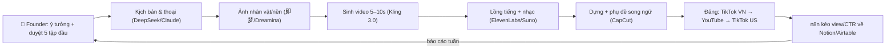

# Kế hoạch 05: AI Short Drama Studio xuất khẩu (OPC)

> Model phụ trách: DeepSeek · Ngày: 2026-09-10 · Trạng thái: draft

## 1. Mô hình công ty (1 slide)

- **Khách hàng:** (a) người xem phim ngắn dọc (short drama) ở thị trường trả tiền tốt nhất thế giới — US/tiếng Anh qua YouTube/TikTok + app ReelShort/DramaBox; (b) doanh nghiệp nhỏ VN (shop, quán, clinic, địa ốc) cần phim ngắn quảng cáo bằng AI.
- **Bán gì:** series phim ngắn dọc 1–2 phút/tập, 30–60 tập/mùa, sản xuất 100% bằng AI (kịch bản → ảnh → video → lồng tiếng → dựng), kèm dịch vụ "AI short drama thuê ngoài" cho doanh nghiệp.
- **Khác biệt:** 1 người = 1 đoàn phim (mẫu 彭青云 ✅, playbook); chi phí ~2 vạn NDT/bộ như case 重庆 ✅; vừa bán nội dung (license/ads/revenue-share) vừa bán xẻng (sản xuất thuê).
- **Vì sao 1 người làm được:** toàn pipeline là text→image→video→edit — tất cả đã có công cụ SaaS; người chỉ giữ 3 thứ: ý tưởng, kiểm định nhu cầu, duyệt chất lượng (nguyên tắc vàng 光年易达, playbook mục 9).

## 2. Vì sao nó thắng ở Trung Quốc

- **✅ 彭青云:** bị sa thải 2023 → tự học qua cộng đồng mở WaytoAGI → 《众神之战》~20 triệu nhiệt độ, bán sang Singapore/Pháp; 2 người, vài vạn RMB/tháng; doanh thu = sản xuất + video giải thích + đào tạo ([天下网商/界面](https://m.jiemian.com/article/14193991.html)).
- **✅ Lý Tứ Cô Nương (Trùng Khánh, 08/2026 — đọc toàn văn):** cựu nhân viên tài chính 42 tuổi, **1 người + 1 máy tính + 1,5 tháng + ~20.000 NDT** → 60 tập AI漫剧 《我和我的AI男友：樱时叙归途》, ra mắt 15/08 trên Douyin + 红果短剧, 4 ngày đạt **12 triệu nhiệt độ**; quy trình: chết kẹp **5 tập đầu chạy kín vòng lặp rồi mới batch**; công cụ 即梦 + 小云雀; văn phòng 200 NDT/tháng; phần 2 + IP liên hoàn (tiểu thuyết, tiểu game) đang làm ([重庆日报](https://www.cqrb.cn/shishi/2026-08-20/2755319_pc.html)).
- **✅ 重庆日报 03/2026:** "一人一剧组 AI短剧催生内容创作新生态" — mô hình được chính quyền ủng hộ (vay OPC tới 500k NDT, trợ cấp khởi nghiệp) ([重庆日报](https://cqrb.cn/shishi/2026-03-29/2618574_pc.html)).
- **✅ Quy mô ngành:** doanh thu IAP app short drama toàn cầu 2025 **>2,8 tỷ USD, +116% YoY** ([新浪财经](https://finance.sina.cn/2026-01-14/detail-inhhfvzc7368470.d.html?vt=4)); ReelShort sắp cán mốc **1 tỷ USD** ([Indian Television](https://indiantelevision.com/iworld/reelshort-set-to-cross-1-bn-as-micro-drama-market-gathers-pace/)); nền tảng short drama xuất khẩu đời đầu đã có doanh thu năm **>20 亿 NDT** ([36氪](https://m.36kr.com/p/3280977856569473)).
- **Bài học copy:** (1) 4 module chuẩn — 剧本/分镜/生产制作/后期; (2) 5 tập đầu validate rồi mới batch; (3) không cần nền kỹ thuật; (4) đa doanh thu: nền tảng + bán license + đào tạo/dịch vụ.
- **⚠️ Mặt tối:** "短剧出海越火越难赚" — cạnh tranh tăng, chi phí mua lượng cao ([新浪财经](https://finance.sina.cn/2026-04-04/detail-inhthwyi8235822.d.html?vt=4)); người thắng là bên có IP/chi phí sản xuất thấp/ngách hẹp ([界面](https://www.jiemian.com/article/14586635.html)).

## 3. Thị trường VN & US

- **US (cửa trả tiền):** hệ sinh thái trả phí lớn nhất — DramaBox/ReelShort/ShortMax thu phí theo tập; YouTube/TikTok US monetize bằng ads. Rào cản 2025–2026: **YouTube 07/2025 thắt chặt monetization với AI content** — chặn nội dung AI "mass-produced, repetitious, low-quality" và không authentic ([The Star](https://beta.the-star.co.ke/news/2025-07-17-youtube-ends-monetization-of-ai-generated-videos), [Times of India](https://timesofindia.indiatimes.com/articleshow/122370719.cms), [YourStory](https://yourstory.com/ai-story/youtube-ai-content-monetisation-policy-change)); TikTok yêu cầu **gắn nhãn AIGC** bắt buộc cho nội dung thực tế giả lập ([checklist 2026](https://creatorsagency.co/blog/youtube-tiktok-ai-disclosure-rules-2026)). → Chiến lược US: làm **AI-assisted có con người tuyển chọn** (kịch bản gốc, lồng tiếng thật hoặc TTS chất lượng cao, hậu kỳ nặng), gắn nhãn, phân phối đa nền tảng — không sống nhờ một mình AdSense.
- **VN (cửa dễ vào trước):** khán giả quen phim dọc free trên TikTok/YouTube; chưa có app short drama nội địa trả phí mạnh; đối thủ = studio phim ngắn truyền thống (chi phí cao hơn AI nhiều). Dễ vào: ngách **nội dung VN xuất khẩu** (truyện cổ tích/dân gian/linh dị Việt kể bằng AI, phụ đề Anh) + **B2B phim quảng cáo AI** cho SME VN. Thuế VN: cá nhân/hộ kinh doanh doanh thu **trên 100 triệu VND/năm** phải kê khai nộp thuế ([Báo Chính phủ](https://cms.baochinhphu.vn/print/sang-tao-noi-dung-so-doanh-thu-bao-nhieu-phai-nop-thue-102260716165956679.htm), [Vietnam.vn](https://www.vietnam.vn/en/thu-nhap-tu-sang-tao-noi-dung-so-co-duoc-giam-tru-gia-canh)).
- **Đối thủ VN:** studio phim ngắn truyền thống (chi phí quay thật cao hơn AI nhiều lần), agency quảng cáo dùng freelancer, và một số kênh AI faceless nội địa đã xuất hiện. Lợi thế OPC: chi phí/tập ~300k VND trong khi 1 phút video quay thật + hậu kỳ thường từ 5–15 triệu VND ⚠️ (giá thị trường agency, cần báo giá kiểm chứng khi chào B2B).
- **Đánh giá:** bắt đầu **từ VN** (TikTok VN + YouTube, chi phí 0, luật quen) để luyện pipeline; song song đăng bản **tiếng Anh sang US** ngay từ tập 1 — thị trường trả tiền nằm ở US, nên đừng chờ.

## 4. Tech stack & kiến trúc tự động hoá

| Công cụ | Vai trò | Chi phí/tháng |
|---|---|---|
| DeepSeek API / Claude | kịch bản, thoại, phân tích trend | ~$5–15 |
| 即梦/Dreamina (quốc tế) | sinh ảnh nhân vật/nền, giữ nhất quán nhân vật | free–$10 |
| Kling AI (可灵 quốc tế) | sinh video 5–10s, lip-sync | Pro ~$28,8 (3.000 credits) ⚠️ [pricing](https://klingai.com/blog/kling-video-3-0-credit-cost-guide), [Modellix](https://www.modellix.ai/blog/kling-ai-pricing-per-month/) |
| Runway (dự phòng) | sinh video scene phức tạp | Standard $12 / Pro $28 ⚠️ [Creatify](https://creatify.ai/blog/runway-pricing-(2026)-plans-credits-and-what-you-ll-actually-pay) |
| ElevenLabs | lồng tiếng đa ngôn ngữ, giọng nhất quán | Starter $5 / Creator $22 |
| Suno | nhạc nền (bản quyền thương mại theo gói) | $10 |
| CapCut Pro | dựng, phụ đề song ngữ tự động | ~$10–20 |
| Notion/Airtable + n8n (free tier) | DB tập-phân cảnh, tự động kéo số liệu | $0 |
| HeyGen (tuỳ chọn) | digital human khi cần cảnh "người thật" | ~$29 ⚠️ |

**Tổng: ~$75–120/tháng (~1,9–3,1 triệu VND).**

- **Người làm:** ý tưởng series, duyệt từng tập, lồng tiếng/hậu kỳ tinh chỉnh, chốt hợp đồng B2B.
- **AI làm:** kịch bản nháp, sinh ảnh/video, draft phụ đề, chấm công số liệu, báo cáo tuần.

**"Vị trí công việc AI" chính thức (mẫu 张顺 — đặt chức danh để dễ quản, dễ đo, dễ thay):**

| Chức danh AI | Prompt chính | Công cụ |
|---|---|---|
| Biên kịch trưởng AI | "Dựa vào Bible nhân vật trong Notion, viết 5 tập tiếp theo; mỗi tập ≤300 từ; kết thúc cliffhanger; kiểm tra nhất quán tính cách." | DeepSeek/Claude API |
| Giám đốc hình ảnh AI | "Giữ seed + reference ảnh nhân vật cố định từ tập 1; sinh storyboard 8 cảnh/tập theo kịch bản." | 即梦/Dreamina |
| Quay phim AI | "Từ storyboard, sinh clip 5–10s mỗi cảnh; ưu tiên chuyển động tối thiểu, mặt nhân vật rõ; sinh 3 lần chọn 1." | Kling 3.0 (+Runway dự phòng) |
| Biên tập viên AI | "Ghép clip theo storyboard, chèn thoại TTS, phụ đề song ngữ, nhạc nền ≤ -20dB." | ElevenLabs + CapCut |
| Nhà phân tích khán giả AI | "Kéo view/CTR/giữ chân từ YouTube Analytics + TikTok mỗi sáng CN; tạo báo cáo 10 dòng: tập nào rớt, vì sao, gợi ý tuần tới." | n8n → Notion/Airtable |

## 5. Vận hành ngày/tuần của founder

**Lịch tuần chuẩn (sản xuất theo batch, mục tiêu 5 tập/tuần):**

- **T2 — "Biên kịch trưởng AI":** nạp số liệu tuần trước → chọn hướng thoại tập mới; prompt DeepSeek: *"Viết kịch bản 5 tập tiếp theo, giọng nhân vật X, cliffhanger cuối mỗi tập, mỗi tập ≤300 từ, bám Bible nhân vật trong Notion."* Founder duyệt 30–45 phút.
- **T3 — "Giám đốc hình ảnh AI":** sinh/nhất quán ảnh nhân vật bằng 即梦 (seed + reference giữ cố định từ tập 1).
- **T4 — "Quay phim AI":** batch sinh video Kling từ storyboard; giữ 2–3 lần sinh/cảnh, chọn cái tốt.
- **T5 — "Biên tập viên AI":** ElevenLabs đọc thoại → CapCut dựng + phụ đề Việt/Anh tự động → duyệt cuối.
- **T6 — "Phát hành AI":** đăng 1 tập/ngày trên 3 kênh (TikTok VN, YouTube, TikTok US) theo khung giờ cố định; trả lời comment bằng template AI.
- **T7 — "Nhà phân tích AI":** n8n kéo Analytics → Notion dashboard (view/CTR/giữ chân/tập nào rớt) → chốt prompt cho tuần sau. **Nửa buổi còn lại: outreach B2B** (10 tin nhắn chào hàng phim quảng cáo AI).

**Vòng lặp dữ liệu:** mỗi tập sinh 1 dòng trong Notion (chi phí credits, view 7 ngày, tỷ lệ giữ chân) → cuối tháng tính chi phí/view → cắt bỏ phân cảnh đắt mà không giữ người xem.

## 6. Mô hình doanh thu & chi phí

**Nguồn thu (xếp theo độ chắc):** (1) B2B sản xuất phim ngắn quảng cáo AI cho SME VN — 5–15 triệu VND/hợp đồng, chắc nhất; (2) YouTube ads + TikTok rewards (VN mỏng, US dày); (3) bán license series cho nền tảng/studio nước ngoài (mẫu 彭青云); (4) bán template/prompt/khóa học sau khi có case.

**Ước lượng 12 tháng (VND, tỷ giá ~25.500; vốn tối đa 5.000 USD ≈ 127 triệu):**

| Tháng | Kịch bản TỆ | Cơ bản | TỐT |
|---|---|---|---|
| 1–3 | Thu 0; chi ~3tr/tháng (tool) | Thu 0–2tr (ads); chi 3tr | Thu 2–5tr (1 hợp đồng B2B nhỏ); chi 3,5tr |
| 4–6 | Thu 0–3tr; chi 3tr | Thu 5–10tr (B2B đầu + ads); chi 4tr | Thu 15–25tr (2–3 hợp đồng); chi 5tr |
| 7–9 | Thu 3–8tr; chi 3,5tr | Thu 12–20tr (B2B đều + ads tăng); chi 5tr | Thu 30–50tr; chi 8tr |
| 10–12 | Thu 8–15tr; chi 4tr | Thu 20–35tr; chi 6tr | Thu 50–80tr (license + B2B); chi 10tr |

- **Điểm hoà vốn:** cơ bản ~tháng 6–7 (chi luỹ kế ~30–40tr; vốn 127tr dư sức chịu kịch bản TỆ cả 12 tháng — đây là lý do mô hình này hợp vốn ≤5.000 USD).
- **Ngân sách khuyến nghị:** tool 12 tháng ~35–45tr; thuê ngoài lồng tiếng thật Anh ~3–5tr/mùa; test ads ~20tr; dự phòng ~50tr.

## 7. Lộ trình start-from-scratch

**Giai đoạn 0–30 ngày — Setup + 5 tập đầu (chi ~10–15 triệu):**
1. Ngày 1: đăng ký hộ kinh doanh cá thể (qua dichvucong.gov.vn hoặc UBND quận, 1–3 ngày, phí 0–100k; chuyển TNHH MTV khi doanh thu ổn) + mở tài khoản Kling (gói Pro), ElevenLabs (Starter), CapCut Pro; tạo kênh TikTok VN + YouTube + TikTok US (VPN + SIM US nếu cần, lưu ý policy).
2. Ngày 2–4: chọn **1 ngách duy nhất** — gợi ý: "revenge/romance phim dọc" tiếng Anh (ngách ReelShort) HOẶC "truyền thuyết Việt kể kiểu horror" song ngữ. Dùng AI phân tích 20 kênh top ngách → chốt.
3. Ngày 5–10: dựng **Bible nhân vật** (tên, ngoại hình seed 即梦, giọng ElevenLabs, tính cách) + outline 30 tập trong Notion.
4. Ngày 11–25: làm **5 tập đầu** đúng pipeline mục 4, mỗi tập ≤2 phút, chi ≤300k VND/tập.
5. Ngày 26–30: đăng 5 tập (1 tập/ngày), gắn nhãn AI theo policy TikTok; ghi số liệu vào Notion. **Mốc:** 5 tập lên sóng, chi phí/tập đo được.

**Giai đoạn 30–60 ngày — Mùa 1 + chạm khách (chi ~10 triệu):**
6. Batch sản xuất đủ **30 tập** mùa 1 (bài học: validate rồi mới batch); đăng đều 1 tập/ngày.
7. Song song gửi **20 lời chào B2B** (shop thời trang, F&B, clinic, địa ốc) kèm 1 tập demo 60s làm riêng cho họ — mục tiêu ≥1 khách trả tiền (nguyên tắc Ninh Ba).
8. Tuần cuối: phân tích 30 tập — tập nào giữ chân >50% thì nhân bản motif; rà giá credits Kling để chuẩn hoá chi phí/tập.

**Giai đoạn 60–90 ngày — Đánh giá & rẽ nhánh (chi ~10 triệu):**
9. Nếu ads/TikTok có tập >50k view → làm mùa 2 và gửi đề cử nền tảng (DramaBox/ReelShort có chương trình nhận phim — kiểm tra điều kiện 2026).
10. Nếu B2B khởi động được ≥2 hợp đồng → dồn 70% thời gian cho B2B, phim mạng thành "portfolio sống".
11. Mốc kill/pivot ở mục 9.

**Giai đoạn 90–180 ngày — Hoà vốn hoặc pivot:**
12. Hoàn thành mùa 2 (60 tập); chốt 3–5 hợp đồng B2B luỹ kế; bán 1 license thử cho studio Singapore/Pháp (mẫu 彭青云).
13. Mở kênh đào tạo nhỏ (khóa "AI short drama cho founder" 2–5 triệu/học viên) khi có ≥1 case 100k+ view.

## 8. Rủi ro & phòng thủ

1. **Nền tảng (cao nhất):** YouTube 07/2025 chặn monetize AI content rẻ/khuôn mẫu ([The Star](https://beta.the-star.co.ke/news/2025-07-17-youtube-ends-monetization-of-ai-generated-videos)); TikTok gắn nhãn AI bắt buộc. → Làm AI-assisted có tuyển chọn người, kịch bản gốc, lồng tiếng thật, đa nền tảng, không sống nhờ một mình AdSense.
2. **Thị trường:** 短剧出海 cạnh tranh khốc liệt, ai cũng dùng AI ([新浪财经](https://finance.sina.cn/2026-04-04/detail-inhthwyi8235822.d.html?vt=4)). → Ngách hẹp + IP riêng + chi phí/tập thấp nhất có thể + B2B làm phao doanh thu.
3. **Pháp lý VN:** phim phổ biến trên không gian mạng có yêu cầu phân loại theo Luật Điện ảnh; nội dung bạo lực/nhạy cảm dễ bị gỡ. → Tránh motif phạm luật (ma tuý, cờ bạc, nhạy cảm chính trị), tham vấn Cục Điện ảnh khi phát hành trong nước; xuất khẩu vẫn phải sạch vì tài khoản VN.
4. **Bản quyền AI:** quyền thương mại của TTS/nhạc/hình ảnh sinh — ElevenLabs/Suno/Kling đều có điều khoản commercial; không dùng giọng người thật mà không có quyền; lưu hồ sơ prompt + hợp đồng từng dịch vụ.
5. **Công nghệ:** giá/credit Kling, Runway thay đổi theo năm. → Đa model (Kling + Runway + Veo), khoá chi phí/tập bằng giá trần, không ký dài hạn.
6. **Cá nhân:** burnout 1 người 6 vai. → SOP batch, ngày nghỉ cố định, tự đặt tiêu chí kill 90 ngày để không "cày mãi không tiền".

## 9. KPI & tiêu chí kill/scale

- **KPI:** (1) ≥5 tập/tuần với chi phí ≤300k VND/tập; (2) tỷ lệ giữ chân tập 1→2 ≥50% (TikTok analytics); (3) ≥1 khách B2B trả tiền trong 90 ngày; (4) lượt xem trung bình/tập sau 7 ngày ≥10k vào tháng 3; (5) chi phí tool ≤8% doanh thu từ tháng 4.
- **KILL (đổi hướng):** sau 90 ngày, 0 đồng doanh thu + 30 tập liên tiếp <3k view + không ai phản hồi 20 lời chào B2B → ngừng làm phim mạng, chuyển hẳn sang B2B sản xuất thuê hoặc bỏ ngách đổi series.
- **SCALE (→ STC):** doanh thu ≥30 triệu VND/tháng 2 tháng liên tiếp → thuê 1 editor + 1 người chạy Kling/TTS → bản thân chuyển sang chốt khách B2B và mở thị trường thứ 2 (Mỹ Latinh/ĐNÁ); mục tiêu 5 người sau 18 tháng.

## 10. Nguồn tham khảo

- [天下网商/界面 — 团队仅1人，目标年收入百万 (彭青云)](https://m.jiemian.com/article/14193991.html) — truy cập 10/09/2026
- [重庆日报 — 1人1电脑2万元成本，1200万热度AI漫剧 (08/2026)](https://www.cqrb.cn/shishi/2026-08-20/2755319_pc.html) — đọc toàn văn 10/09/2026
- [重庆日报 — 一人一剧组：AI短剧新生态 (03/2026)](https://cqrb.cn/shishi/2026-03-29/2618574_pc.html)
- [新浪财经 — 2025全球短剧应用内购收入超28亿美元 (+116%)](https://finance.sina.cn/2026-01-14/detail-inhhfvzc7368470.d.html?vt=4)
- [Indian Television — ReelShort set to cross $1bn](https://indiantelevision.com/iworld/reelshort-set-to-cross-1-bn-as-micro-drama-market-gathers-pace/)
- [36氪 — 最早一批出海的短剧平台，年收入已超20亿元](https://m.36kr.com/p/3280977856569473)
- [新浪财经 — 短剧出海越火，为什么越难赚到钱？](https://finance.sina.cn/2026-04-04/detail-inhthwyi8235822.d.html?vt=4)
- [界面 — AI短剧到底谁在赚钱](https://www.jiemian.com/article/14586635.html)
- [Kling official — VIDEO 3.0 credit cost](https://klingai.com/blog/kling-video-3-0-credit-cost-guide) · [Modellix — Kling pricing 2026 ⚠️](https://www.modellix.ai/blog/kling-ai-pricing-per-month/)
- [Creatify — Runway pricing 2026 ⚠️](https://creatify.ai/blog/runway-pricing-(2026)-plans-credits-and-what-you-ll-actually-pay)
- [The Star — YouTube ends monetization of AI-generated videos (07/2025)](https://beta.the-star.co.ke/news/2025-07-17-youtube-ends-monetization-of-ai-generated-videos) · [Times of India](https://timesofindia.indiatimes.com/articleshow/122370719.cms) · [YourStory](https://yourstory.com/ai-story/youtube-ai-content-monetisation-policy-change)
- [Creators Agency — YouTube/TikTok AI disclosure 2026](https://creatorsagency.co/blog/youtube-tiktok-ai-disclosure-rules-2026)
- [Báo Chính phủ — Thuế cho người sáng tạo nội dung số](https://cms.baochinhphu.vn/print/sang-tao-noi-dung-so-doanh-thu-bao-nhieu-phai-nop-thue-102260716165956679.htm) · [Vietnam.vn (EN)](https://www.vietnam.vn/en/thu-nhap-tu-sang-tao-noi-dung-so-co-duoc-giam-tru-gia-canh)

## 11. Câu hỏi mở

1. DramaBox/ReelShort 2026 có chương trình nhận phim từ studio cá nhân với tỷ lệ chia doanh thu bao nhiêu, điều kiện tối thiểu (số tập, độ dài, độc quyền)?
2. Phim ngắn phát hành trên TikTok/YouTube tại VN có phải phân loại theo Luật Điện ảnh 2022 không — ngưỡng và thủ tục với hộ kinh doanh cá thể?
3. Doanh thu YouTube/TikTok từ nước ngoài (ngoại tệ về VN) của hộ kinh doanh khai thuế theo quy trình nào (Thông tư 40/2021 áp dụng ra sao với nguồn thu ngoại)?
4. Tiêu hao credits Kling thực tế cho 1 tập 2 phút (chuẩn 1080p, 5–10s/clip) trung bình bao nhiêu — cần đo thật để chốt giá trần 300k/tập có đúng không?
5. Ngách nội dung Việt nào có bằng chứng được khán giả quốc tế đón nhận (folklore, horror, romance) — cần test A/B trước khi cam kết mùa 1.
