# Kế hoạch 06: Kênh AI 漫剧/hoạt hình tự xây IP (OPC)

> Model phụ trách: DeepSeek · Ngày: 2026-09-10 · Trạng thái: draft

## 1. Mô hình công ty (1 slide)

- **Khách hàng:** khán giả xem video giải trí 1–3 phút trên YouTube/TikTok toàn cầu (ưu tiên khán giả nói tiếng Anh 18–35 tuổi, thích truyện ngắn fantasy/kinh dị/lãng mạn có "điểm đảo" mỗi tập); sau đó là nhãn hàng tài trợ và bên mua bản quyền IP (studio game, nhà xuất bản, nền tảng truyện tranh).
- **Bán gì:** series 漫剧 (truyện tranh động) 1–3 phút với nhân vật/tạo hình cố định — "IP gốc" tự sáng tác, sinh 100% bằng AI (LLM viết kịch bản → AI sinh hình nhân vật nhất quán → Kling/Veo làm động → CapCut dựng → lồng tiếng TTS), đăng đa nền tảng.
- **Khác biệt:** (1) IP gốc thuộc sở hữu toàn phần của founder (không thuê/trả phí bản quyền网文 như mô hình TQ) → bán được quyền khai thác cho mọi thị trường; (2) kho truyện dân gian/thần thoại Việt – Đông Nam Á chưa ai khai thác bằng AI 漫剧 tiếng Anh; (3) chi phí sống VN + doanh thu quảng cáo theo giá US = chênh lệch lợi nhuận.
- **Vì sao 1 người làm được:** cả pipeline đã được TQ chứng minh "1 người = 1 đoàn phim" (master playbook mục 2, case 彭青云 ✅); công cụ sinh video AI 2026 giá $0,014–0,10/giây, một tập 2 phút tốn ~$5–15 tiền API thay vì 4.000–10.000 NDT/phút của sản xuất truyền thống ([界面/IT时报](https://m.jiemian.com/article/14009415.html)).

## 2. Vì sao nó thắng ở Trung Quốc

- **2025 là "漫剧元年" — nhu cầu bùng nổ có số liệu:** tháng 8/2025, chỉ riêng traffic tự nhiên trên Douyin đã mang về >10 triệu NDT/ngày tiền trả phí cho 漫剧, đỉnh投流 4 triệu NDT/ngày, so với 1 vạn NDT/ngày vào nửa cuối 2024; 快手可灵 Q3/2025: doanh thu ngày của AI漫剧 +900% so với Q4/2024, sản lượng tập +567% ✅ ([界面/IT时报](https://m.jiemian.com/article/14009415.html)).
- **Quy mô thị trường:** 2025 ước 200–248 tỷ NDT (+270% YoY), dự báo 2026 đạt 350–500 tỷ NDT ✅ ([投中网/霞光社](https://www.chinaventure.com.cn/news/78-20260128-389962.html)); 快手 Q1/2026 doanh thu Kling AI đạt 6,5+ tỷ NDT, +300% ✅ ([大公文匯](https://epaper.tkww.hk/a/202605/28/AP6a175304e4b04773b06eef75.html)).
- **Chi phí giảm 50–90% là động cơ:** truyền thống 2.000–5.000 NDT/phút → AI 1.000–2.500 (东吴证券), hiện "卷" còn ~600 NDT/phút; 巨日禄: 3D đạt chuẩn 1.300 NDT/phút, không khắt khe chỉ 400 NDT/phút ✅ ([界面/IT时报](https://m.jiemian.com/article/14009415.html); [投中网](https://www.chinaventure.com.cn/news/78-20260128-389962.html)).
- **Case xuất khẩu thành công:** 中文在线《愤怒的吸血鬼》— TikTok 3 ngày 2,3 tỷ lượt xem, tỷ lệ trả phí trên Sereal+ 22% (cao hơn HBO cùng kỳ 7 điểm %), chi phí/tập giảm 20万→10万 NDT ✅ ([投中网/霞光社](https://www.chinaventure.com.cn/news/78-20260128-389962.html)).
- **Case công ty mới:** 意联科技 (thành lập 07/12/2025) 5 tháng đầu 2026 doanh thu 10+ triệu NDT, lợi nhuận ròng 2+ triệu NDT; mô hình "IP孵化 + 商业运营" 3.0, tự có 2.000+ IP网文, mua IP giá rẻ ở ĐNÁ ✅ ([21世纪经济报道/东方财富](https://finance.eastmoney.com/a/202607043793970883.html)).
- **Bài học để copy:** (1) sản xuất nội dung thuần tuý KHÔNG đủ sống — chính founder意联 cảnh báo "tác phẩm vài chục triệu lượt xem chỉ thu về hơn chục NDT" → phải sở hữu IP + kênh + dữ liệu khán giả; (2) 80–90% dự án short drama không hoàn vốn, riêng kênh YouTube vận hành tốt có lợi nhuận cấp "nghìn vạn USD/năm" ✅; (3) nền tảng đang trợ giá nội dung: 红果 hệ số分账 60x cho 仿真人漫剧, 腾讯/爱奇艺 mua kịch bản (tối đa ~5万 NDT/单部评级) ✅ ([投中网](https://www.chinaventure.com.cn/news/78-20260128-389962.html); [界面/IT时报](https://m.jiemian.com/article/14009415.html)).
- **Bài học cảnh báo (quan trọng):** đến Q3–Q4/2026 TQ dự báo hết giai đoạn "kiếm tiền dễ", ngành chuyển sang 精品化 và đào thải; 审美疲劳 (tạo hình giả, kịch bản na ná) là rủi ro đã hiện hữu — nghĩa là người vào sau phải thắng bằng **câu chuyện + nhân vật**, không bằng số lượng ✅ ([界面/IT时报](https://m.jiemian.com/article/14009415.html)).

## 3. Thị trường VN & US

- **US (cửa chính về tiền):** long-form YouTube trả creator 55% doanh thu quảng cáo, RPM phim/cinematic AI thường $8–15/1.000 lượt xem; Shorts trả 45% pool với RPM ~$1–10; TikTok Creator Rewards trả $0,40–1,00 RPM — cao gấp 10–33 lần YouTube Shorts ✅ ([sozee.ai](https://www.sozee.ai/resources/ai-video-monetization-platforms-2026/)). Yêu cầu YPP: 1.000 sub + 4.000 giờ xem/12 tháng HOẶC 10 triệu lượt xem Shorts/90 ngày; TikTok Creator Rewards: 10.000 follower + 100.000 lượt xem/30 ngày ✅ (cùng nguồn). Đối thủ: kênh AI "slop" Mỹ đang bị quét mạnh — YouTube đã xoá 16 kênh AI rác (4,7 tỷ view, 35 triệu sub) đầu 2026 và tự gắn nhãn AI tự động ✅ ([sozee.ai](https://www.sozee.ai/resources/ai-video-monetization-platforms-2026/); [medianama](https://www.medianama.com/2026/05/223-youtube-ai-content-labels-visible-adds-auto-detection-undisclosed-ai-videos/)).
- **VN (cửa dễ vào trước, để test nhanh):** khán giả trẻ quen TikTok; YouTube/TikTok VN không yêu cầu giấy phép phát hành cho video giải trí đăng kênh cá nhân; rào cản duy nhất là ngưỡng kiếm tiền nền tảng. TikTok Creator Rewards tại VN ⚠️ cần kiểm tra policy hiện tại trước khi đặt mục tiêu thu nhập từ TikTok VN (chương trình mở theo thị trường, thay đổi nhanh) — xem câu hỏi mở Q1.
- **Quy định AI bắt buộc (cả 2 thị trường):** YouTube bắt tick "altered or synthetic content"; TikTok tự dán nhãn AI và từ 2026 phạt strike ngay với nội dung AI không khai báo (đã gỡ 51.618 video nửa cuối 2025) ✅ ([sozee.ai](https://www.sozee.ai/resources/ai-video-monetization-platforms-2026/)); EU AI Act áp nghĩa vụ minh bạch từ 02/08/2026 cho nội dung phục vụ khán giả EU ✅ (cùng nguồn). Hàn Quốc (thị trường webtoon quan trọng nếu bán IP): luật AI cơ bản mới yêu cầu nền tảng webtoon dán nhãn nội dung AI ✅ ([Anime News Network](https://www.animenewsnetwork.com/news/2026-01-24/south-korea-new-ai-law-raises-questions-for-webtoon-creators-platforms/.233383)).
- **Đánh giá:** vào **YouTube (tiếng Anh) trước** vì RPM cao nhất và chính sách AI rõ ràng nhất; TikTok VN làm kênh test nội dung rẻ; bán IP chỉ sau khi có bằng chứng số liệu (tối thiểu 1 series vượt 1 triệu view/tập).

## 4. Tech stack & kiến trúc tự động hoá

| Công cụ | Vai trò | Chi phí/tháng |
|---|---|---|
| Claude/GPT API (hoặc DeepSeek) | Viết kịch bản tập, phân cảnh, prompt hình | $10–20 |
| Midjourney (hoặc Leonardo/Flux) | Sinh character sheet + keyframe nhất quán | $10–30 |
| Kling 2.1 Pro API ($0,056/s, 1080p) / Veo3 ($0,10/s) cho cảnh quan trọng | Ảnh→video từng phân cảnh | $40–80 |
| ElevenLabs (hoặc TTS mở) | Lồng tiếng nhân vật, narration | $5–22 |
| CapCut Pro | Dựng, phụ đề, hiệu ứng âm thanh | $0–10 |
| n8n self-host (free) + Google Sheets/Notion | Workflow phát hành đa nền tảng + theo dõi số liệu | $0 |
| YouTube Studio + TikTok | Phát hành + AI disclosure | $0 |
| **Tổng** | | **$65–160** |

Giá API theo bảng so sánh 5/2026: Kling 2.1 Standard $0,014/s; Pro $0,056/s; Runway Gen-4 Turbo $0,10/s; Veo3 $0,10/s; Sora $0,12/s; dự phòng 10–20% lượt sinh hỏng và hệ số lặp 2,5x khi tính ngân sách ✅ ([crazyrouter](https://crazyrouter.com/zh/blog/ai-video-generation-api-pricing-may-2026-comparison)).

```mermaid
flowchart LR
    F["🧠 Founder (1 người)<br/>ý tưởng IP · duyệt kịch bản · chất lượng · bán IP"]
    LLM["Biên kịch AI<br/>LLM: plot, lời thoại, hook 3s"]
    IMG["Đạo diễn hình ảnh AI<br/>Midjourney: character sheet, keyframe"]
    VID["Xưởng sinh video AI<br/>Kling/Veo: ảnh→video 5-10s"]
    ED["Dựng + tiếng AI<br/>CapCut + ElevenLabs"]
    AUTO["Phân phối AI<br/>n8n: đăng YouTube/TikTok/FB, gắn nhãn AI"]
    DATA["Kho dữ liệu<br/>Sheets/Notion: view, retention, CTR"]
    F -->|"duyệt 1 lần/tuần"| LLM --> IMG --> VID --> ED --> AUTO
    AUTO -->|"đăng + khai báo AI"| CH["YouTube · TikTok · Facebook Reels"]
    CH -->|"số liệu"| DATA -->|"báo cáo + gợi ý tập sau"| F
```

- **Người làm (phần lõi):** chọn hướng IP, duyệt kịch bản/giọng điệu, kiểm soát nhất quán tạo hình, đàm phán tài trợ/bán IP.
- **AI làm:** sinh 80% khối lượng (kịch bản nháp, hình, video, lồng tiếng, đăng bài, tổng hợp số liệu). Đúng nguyên tắc "AI hoá triệt để → chuẩn hoá cục bộ → người giỏi nhất giữ lõi".

## 5. Vận hành ngày/tuần của founder

**Lịch tuần mẫu (~20–25 giờ):**
- Thứ 2 (4h): duyệt 2 kịch bản tập tuần này; chỉnh hook 3 giây + cliffhanger cuối tập; chốt 4–6 phân cảnh/tập.
- Thứ 3–5 (4h/ngày): chạy batch sinh hình nhân vật/cảnh (sáng để qua đêm); duyệt keyframe lỗi tạo hình (tay, mặt) — vứt, sinh lại.
- Thứ 6–7 (4h/ngày): batch Kling ảnh→video, chọn clip đạt; ráp CapCut, chèn phụ đề + nhạc (thư viện YouTube Audio Library, miễn phí).
- Chủ nhật (3h): n8n đăng 3–4 video (1 long-form 2–3 phút + 2–3 Shorts cắt từ tập) lên YouTube/TikTok/FB kèm khai báo AI; xem bảng số liệu, ghi 1 bài học → chỉnh prompt cho tuần sau.

**"Vị trí công việc AI" (theo mẫu 张顺):**
| Chức danh AI | Prompt chính | Công cụ |
|---|---|---|
| Biên kịch AI | "Viết tập 1–3 phút thể loại X, nhân vật cố định [profile], hook trong 3s, 1 cliffhanger cuối" | LLM API |
| Đạo diễn hình ảnh AI | Character sheet + "giữ nguyên khuôn mặt/trang phục nhân vật X, phong cách [style]" | Midjourney |
| Xưởng sinh video AI | "Image-to-video, chuyển động camera chậm, 5s, 1080p, không biến dạng mặt" | Kling 2.1 Pro API |
| Phân phối đa nền tảng AI | Đăng kèm mô tả chuẩn SEO + tick khai báo "altered/synthetic" + hashtag | n8n |
| Phân tích số liệu AI | "Tổng hợp view/retention/CTR tuần, đề xuất 3 thay đổi cho tập sau" | LLM + Sheets |

**Vòng lặp dữ liệu:** mỗi tuần 1 bảng số → 1 bài học → 1 chỉnh prompt. Sau 8 tuần bạn có "công thức kênh" riêng (đây là tài sản bán được sau này).

## 6. Mô hình doanh thu & chi phí

Doanh thu: (1) YouTube Adsense (long-form + Shorts); (2) TikTok Creator Rewards ⚠️ tuỳ thị trường; (3) tài trợ/品牌植入 sau 100k sub; (4) Patreon (tập sớm, ủng hộ); (5) bán IP/licensing từ tháng 12+ (giá tham chiếu: mua IP giá rẻ ĐNÁ theo case 意联 ✅ — mức cụ thể cần đàm phán từng deal).

Chi phí cố định/tháng: công cụ $65–160 (mục 4) + hosting/điện/internet ~$20 = **~$85–180/tháng**.

| Tháng | Kịch bản TỆ (USD) | Cơ bản (USD) | TỐT (USD) |
|---|---|---|---|
| 1–3 | 0 (build) | 0 | 0 |
| 4–6 | 0–30 | 50–150 | 200–500 |
| 7–9 | 30–100 | 150–400 | 600–1.500 |
| 10–12 | 50–150 | 400–800 | 1.500–4.000 (tài trợ + Patreon) |
| Vốn đã bỏ ra 12T | ~2.200 | ~2.200 | ~2.200 |
| Tổng thu 12T | ~120 | ~1.500 | ~4.000–7.000 |

- **Điểm hoà vốn (tổng vốn ~$2.200):** kịch bản TỆ không hoà vốn trong 12 tháng → kill; cơ bản hoà vốn ~tháng 15–18; TỐT hoà vốn ~tháng 11–12.
- Ngân sách: tổng vốn ≤3.000 USD, cắt theo "ngưỡng đốt tiền": hết $1.500 mà chưa có series nào đạt 500k view/tập → dừng thử nghiệm, đổi ngách.

## 7. Lộ trình start-from-scratch

**Giai đoạn 0–30 ngày — Dựng IP + 6 tập đầu (chi ~$350):**
1. Ngày 1: mở tài khoản YouTube (Google) + TikTok + Facebook Page; bật xác thực 2 lớp; tạo kênh tên IP (VD "Phantom of the Delta" — kinh dị sông nước ĐNÁ).
2. Ngày 2–3: chọn 1 ngách thể loại duy nhất (gợi ý: kinh dị dân gian ĐNÁ hoặc fantasy hệ thần thoại Việt) — kiểm tra 5 kênh đối thủ, ghi RPM/lượt view trung bình.
3. Ngày 4–7: viết "Kinh thánh IP" 1 trang (bộ 3–5 nhân vật: tên, quá khứ, mục tiêu, giọng nói) + sinh character sheet bằng Midjourney ($30) cho từng nhân vật, thử tới khi nhận diện ổn định.
4. Ngày 8–14: viết 8 kịch bản tập đầu (LLM + chỉnh tay); mỗi tập 60–90 giây, kết thúc cliffhanger.
5. Ngày 15–21: sinh keyframe + video Kling ($60 credits): mỗi tập ~10–12 clip 5s; lồng tiếng ElevenLabs ($22).
6. Ngày 22–28: dựng CapCut, chèn nhạc YouTube Audio Library; **mọi video tick khai báo AI** (mục 3).
7. Ngày 29–30: đăng 2 tập đầu cách nhau 3 ngày + 2 Shorts cắt từ tập; ghi số liệu 48h đầu.
- Mốc: 6 tập sẵn kho; kênh có ≥5 video.

**Giai đoạn 30–60 ngày — Tìm tập nào "ăn" (chi ~$250):**
1. Đăng đều 2–3 video/tuần (1 tập + 2 Shorts); giờ cố định.
2. Tuần 5–8: đo retention theo từng 10 giây, xác định điểm khán giả thoát.
3. Nhân đôi yếu tố ăn khách của tập tốt nhất (nhân vật nào, hook nào).
4. Dựng n8n workflow: đăng tự động + kéo số liệu về Sheets mỗi sáng.
5. Thử nghiệm A/B: 2 thumbnail/tập; 2 hook/tập Shorts.
6. Ghi nhãn AI đầy đủ; kiểm tra YouTube Studio không có cảnh báo chính sách.
- Mốc: tìm ra 1 định dạng đạt retention >45% (tập 60–90s).

**Giai đoạn 60–90 ngày — Đủ ngưỡng kiếm tiền (chi ~$250):**
1. Dồn lực vào định dạng thắng: 3 tập + 4–6 Shorts/tuần.
2. Target YPP: 1.000 sub + 4.000 giờ xem (hoặc 10M view Shorts/90 ngày) — nộp đơn ngay khi đủ.
3. Mở TikTok Creator Rewards nếu policy VN cho phép ⚠️ (kiểm tra tại thời điểm đó).
4. Mở kênh thứ 2 cùng IP, ngôn ngữ thứ 2 (Tây Ban Nha/Indonesia) bằng AI dịch + TTS (pattern nhân bản của master playbook mục 11).
5. Đăng ký hộ kinh doanh tại UBND quận (1–3 ngày, ~0–500k VND) để xuất hoá đơn khi có tài trợ; khai thuế TNCN theo thực nhận (Google trả qua SWIFT về TK ngân hàng VN).
- Mốc: YPP đã bật (kịch bản tốt) hoặc chạm ngưỡng kill (mục 9).

**Giai đoạn 90–180 ngày — Tiền + tài sản IP (chi ~$600):**
1. Tối ưu RPM: chuyển tập dài 3–5 phút (long-form trả 55%, RPM $8–15 ✅).
2. Mở Patreon ($5/tháng: tập sớm 48h, hậu trường prompt).
3. Đóng gói "media kit" (số liệu kênh) → gửi 20 nhãn hàng liên quan (game mobile, app đọc truyện).
4. Đăng ký bản quyền IP: đăng ký quyền tác giả tại Cục Bản quyền tác giả VN (phí ~100–600k VND/loại hình) + dùng Content ID khi đủ điều kiện.
5. Chào bán IP: liên hệ 5 nền tảng truyện tranh/studio game với 1-page pitch (số liệu view + nhân khẩu khán giả).
6. Tuyển freelancer đầu tiên (editor tiếng Anh $50–100/tuần) khi doanh thu >$1.000/tháng — bước OPC→STC.
- Mốc: doanh thu ổn định 3 tháng liên tiếp; 1 hợp đồng tài trợ hoặc 1 thư ngỏ mua IP.

## 8. Rủi ro & phòng thủ

1. **Rủi ro nền tảng — chính sách AI đổi nhanh:** YouTube đã xoá 16 kênh AI rác đầu 2026, tự phát hiện video AI không khai báo ✅ ([sozee](https://www.sozee.ai/resources/ai-video-monetization-platforms-2026/); [medianama](https://www.medianama.com/2026/05/223-youtube-ai-content-labels-visible-adds-auto-detection-undisclosed-ai-videos/)). → Luôn tick khai báo, tạo "dấu tay người" rõ rệt (giọng đọc riêng, cấu trúc câu chuyện gốc, hậu trường làm bằng chứng), không spam tần suất vô hồn.
2. **Rủi ro thị trường — 审美疲劳 & "90% không kiếm được tiền":** bài học trực tiếp từ TQ ([界面/IT时报](https://m.jiemian.com/article/14009415.html); [东方财富](https://finance.eastmoney.com/a/202607043793970883.html)). → Thắng bằng câu chuyện + nhân vật có hồn, đo bằng retention >45% và tỷ lệ quay lại tập sau; không đua số lượng.
3. **Rủi ro công nghệ — nhân vật không nhất quán, tay/mặt lỗi:** tỷ lệ sinh hỏng 10–20% ✅ ([crazyrouter](https://crazyrouter.com/zh/blog/ai-video-generation-api-pricing-may-2026-comparison)). → Character sheet chuẩn + giữ seed/tham chiếu ảnh; ngân sách hệ số lặp 2,5x; có checkpoint duyệt tay mỗi tuần.
4. **Rủi ro pháp lý — bản quyền & nhãn AI:** (a) không dùng nhân vật/phong cách của IP người khác; (b) tuân thủ luật AI: Hàn Quốc bắt buộc nhãn AI nếu phân phối webtoon ✅ ([ANN](https://www.animenewsnetwork.com/news/2026-01-24/south-korea-new-ai-law-raises-questions-for-webtoon-creators-platforms/.233383)); EU AI Act từ 02/08/2026 ✅. → Đăng ký quyền tác giả sớm, lưu toàn bộ prompt + file nguồn làm bằng chứng sáng tạo.
5. **Rủi ro tài chính cá nhân — đốt vốn 12 tháng không thu:** → giới hạn cứng $3.000; có việc làm thêm tối thiểu; mỗi 30 ngày 1 lần đối chiếu KPI kill (mục 9), không "thêm 1 tháng nữa" quá 2 lần.
6. **Rủi ro thuế/thanh toán VN:** AdSense/Creator Rewards về VN chịu thuế TNCN; hoá đơn tài trợ cần hộ kinh doanh. → Đăng ký hộ kinh doanh ở giai đoạn 60–90 ngày, khai thuế đủ, giữ 15% doanh thu dự phòng thuế.

## 9. KPI & tiêu chí kill/scale

KPI chính (theo dõi hàng tuần trong Sheets):
1. **Retention trung bình** tập 60–90s (mục tiêu >45% ở 30s).
2. **Lượt view/tập ở tuần thứ 4** sau đăng (đo "đuôi dài", không đo giờ đầu).
3. **Tỷ lệ sub/view** (mục tiêu >0,5% từ tháng 3).
4. **RPM tổng** khi YPP bật (mục tiêu ≥$6 tổng long-form + Shorts).
5. **Chi phí/phút nội dung hoàn thiện** (mục tiêu ≤$2/phút).

- **KILL (đánh giá mốc 90 ngày):** nếu (a) 30 video đã đăng mà không tập nào vượt 50k view OR (b) retention trung bình <25% OR (c) đã đốt $1.500/3.000 → dừng dạng nội dung này: giữ IP, chuyển kênh sang định dạng mới (audio drama có minh hoạ tĩnh) hoặc bán nguyên liệu IP cho agency.
- **SCALE (đạt 2/3 tiêu chí):** doanh thu >$1.000/tháng 3 tháng liên tiếp; 1 series >1M view/tập; ≥1 nhãn hàng chủ động liên hệ → tuyển freelancer editor/người viết, nhân bản kênh ngôn ngữ thứ 2, chào bán IP (OPC → STC).

## 10. Nguồn tham khảo

- [界面/IT时报 — AI漫剧，下一个赚钱的风口？ (02/2026)](https://m.jiemian.com/article/14009415.html) — truy cập 10/09/2026
- [投中网/霞光社 — 2026短剧出海：淘汰赛加速 (01/2026)](https://www.chinaventure.com.cn/news/78-20260128-389962.html) — truy cập 10/09/2026
- [21世纪经济报道/东方财富 — 意联科技孙舒彻：五个月营收破千万 (07/2026)](https://finance.eastmoney.com/a/202607043793970883.html) — truy cập 10/09/2026
- [大公文匯 — 快手首季可靈AI收入超6.5億 (05/2026)](https://epaper.tkww.hk/a/202605/28/AP6a175304e4b04773b06eef75.html) — truy cập 10/09/2026
- [Crazyrouter — AI Video Generation API Pricing May 2026: Veo3 vs Kling vs Runway vs Sora](https://crazyrouter.com/zh/blog/ai-video-generation-api-pricing-may-2026-comparison) — truy cập 10/09/2026
- [Sozee — Best Monetization Platforms for AI Video Creators 2026 (cập nhật 08/2026)](https://www.sozee.ai/resources/ai-video-monetization-platforms-2026/) — truy cập 10/09/2026
- [Anime News Network — South Korea's New AI Law Raises Questions for Webtoon Creators (01/2026)](https://www.animenewsnetwork.com/news/2026-01-24/south-korea-new-ai-law-raises-questions-for-webtoon-creators-platforms/.233383) — truy cập 10/09/2026
- [Medianama — YouTube automatic detection of undisclosed AI videos (05/2026)](https://www.medianama.com/2026/05/223-youtube-ai-content-labels-visible-adds-auto-detection-undisclosed-ai-videos/) — truy cập 10/09/2026
- Nền: master playbook `plans/reports/260910-1118-opc-china-master-playbook.md` (case 彭青云, 光年易达, nguyên tắc 10 điều) — truy cập 10/09/2026

## 11. Câu hỏi mở

1. TikTok Creator Rewards tại VN năm 2026: đã mở cho creator VN chưa, điều kiện và cách nhận tiền về ngân hàng VN?
2. YouTube có áp "inauthentic content policy" hạ mức kiếm tiền với kênh dùng 100% AI sinh hình dù có cốt truyện gốc? Ngưỡng thực tế (không công bố) là gì?
3. Đăng ký bản quyền cho IP "sinh một phần bằng AI" tại VN (Cục Bản quyền tác giả) và US (US Copyright Office với AI-assisted work) cần hồ sơ gì để được công nhận phần sáng tạo của con người?
4. Nền tảng webtoon nào (Webtoon/Tapas/Comico) hiện chấp nhận truyện AI hỗ trợ nếu khai báo đầy đủ — hay đang cấm toàn bộ theo luật AI Hàn Quốc?
5. Giá mua IP truyện tranh nhỏ ở ĐNÁ (Indonesia/Thái Lan) thực tế năm 2026 là bao nhiêu (tham chiếu case 意联 mua "giá thấp")?
