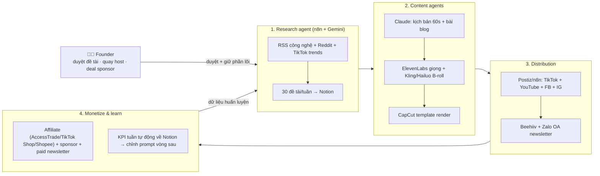

# Kế hoạch 07: Nhà vận hành kênh content IP dọc bằng AI agent (OPC)

> Model phụ trách: DeepSeek · Ngày: 2026-09-10 · Trạng thái: draft · Vốn ≤ 2.000 USD

## 1. Mô hình công ty (1 slide)

- **Ngách dọc chọn: CÔNG NGHỆ — "AI thực chiến cho người đi làm VN"** (nhân viên văn phòng 22–35 tuổi + chủ doanh nghiệp nhỏ muốn dùng AI tăng năng suất). Lý do chọn công nghệ thay vì tài chính/đời sống: (1) dữ liệu nguồn là docs/news công khai → AI agent sản xuất được nội dung đúng, ít sai; (2) giá trị affiliate cao (SaaS, khoá học, thiết bị); (3) né rủi ro pháp lý YMYL của nội dung tài chính.
- **Bán gì:** 1 IP chính (khuôn mặt thật của founder, lên hình 1–2 video/tuần) + 1 kênh faceless tiếng Anh (từ tháng 6, để hưởng RPM US). Sản phẩm: video ngắn (TikTok/YouTube Shorts/FB Reels), bài viết/blog, newsletter trả phí, podcast phát lại từ bản tin.
- **Doanh thu:** affiliate (AccessTrade, TikTok Shop, Shopee) → tài trợ → newsletter trả phí (~$5/tháng) → sau: khoá học/dịch vụ.
- **Khác biệt:** "AI là nhà máy, người là tổng biên tập" — 1 người ra 5 video/ngày + 3 bài/tuần với chi phí sản xuất/video ~2–5 USD, nội dung tiếng Việt bản địa (đối thủ dịch máy yếu).
- **Vì sao 1 người làm được:** 75% founder OPC TQ không có nền kỹ thuật ✅ (brief B1); pipeline content TQ đã chuẩn hoá: người viết ý tưởng → AI kịch bản → AI sinh hình → CapCut dựng → phân phối đa nền tảng → số liệu quay lại huấn luyện prompt ✅ (master playbook mục 4).

## 2. Vì sao nó thắng ở Trung Quốc

- ✅ **彭青云** (bị sa thải 2023 → AI短剧 studio): 《众神之战》~20 triệu nhiệt độ, bán Singapore/Pháp; 2 người, vài vạn RMB/tháng — chứng minh content IP do AI sản xuất bán được tiền và xuất khẩu được ([天下网商](https://m.jiemian.com/article/14193991.html)).
- ✅ **知识付费/IP cá nhân** là top ngành OPC TQ dễ copy nhất: "Cô giáo AI" 1000+ học viên, vốn gần 0, công thức "知识卡片" tăng fan ([podscan](https://podscan.fm/podcasts/yi-ren-gong-si-wu-xian-he-huo/episodes/1000xue-yuan-de-nuai-jiao-shi-zen-me-zai-zhi-shi-fu-fei-hong-hai-sheng-cun-de); [podwise](https://podwise.ai/episodes/7922189)).
- ⚠️ **Matrix account (số tự khai):** "Dùng AI làm ma trận video ngắn, 3 tháng đạt 50.000 NDT/tháng" ([今日头条](https://m.toutiao.com/article/7660882229127692823/)); "1 người quản 20 tài khoản AI, thu nhập 30.000 NDT/tháng" ([今日头条](https://www.toutiao.com/article/7678713560368759305/)) — dùng làm tham chiếu hướng, KHÔNG lập kế hoạch tài chính theo.
- ✅ **Digital human rẻ:** chi phí vài nghìn RMB, sức bán vượt cả người nổi tiếng ([一财](https://finance.sina.com.cn/roll/2026-01-12/doc-inhfzukt9994973.shtml)) — áp dụng cho phiên bản podcast/video ngoại ngữ khi scale.
- **Bài học copy:** (1) workflow content chuẩn của TQ (master playbook mục 4.2); (2) ma trận chỉ là khuếch đại — IP chính phải có mặt người thật để giữ niềm tin; (3) 沉淀 quy trình thành skill, dạy agent như dạy nhân viên (Feishu aily pattern ✅).

## 3. Thị trường VN & US

**VN — cửa vào chính:**
- RPM YouTube VN trung bình **$0,18/1.000 view** (hạng 76/87 thị trường) — KHÔNG thể sống bằng quảng cáo nền tảng ([Dynamoi](https://dynamoi.com/data/youtube-adsense-rpm/vn)).
- Bù lại: TikTok VN công bố creator làm nội dung chất lượng cao có lượt xem **+73%** — nền tảng đang chống "slop", ủng hộ nội dung có giá trị ([vietnam.vn](https://www.vietnam.vn/en/nha-sang-tao-noi-dung-chat-luong-cao-tren-tiktok-ghi-nhan-luot-xem-tang-73)).
- Affiliate nội địa: AccessTrade (merchant công nghệ/khóa học), tiếp thị liên kết TikTok Shop (chốt đơn ngay trong video, hoa hồng theo ngành — tham khảo mức nhà bán đặt tại [Chotdon](https://www.chotdon.vn/hoa-hong-affiliate-tiktok)), Shopee affiliate. Lưu ý: TikTok Shop điều chỉnh biểu phí từ 7/2026 — kiểm tra lại trước khi đăng ký ([Thương hiệu & Công luận](https://thuonghieucongluan.com.vn/tiktok-shop-dieu-chinh-bieu-phi-tu-thang-7-canh-tranh-moi-giua-cac-san-thuong-mai-dien-tu-a324397.html)).
- Quy định: đã có **đề xuất bắt buộc gắn nhãn nội dung AI** mô phỏng người thật/tái hiện sự kiện ([LuatVietnam](https://luatvietnam.vn/tin-van-ban-moi/de-xuat-bat-buoc-gan-nhan-noi-dung-ai-mo-phong-nguoi-that-va-tai-hien-su-kien-186-107883-article.html)) + Nghị định 13/2023/NĐ-CP (bảo vệ dữ liệu cá nhân khi thu email).
- Đối thủ: kênh công nghệ VN hiện hữu (GENK, Vật Vờ Studio, Hiếu TV...) mạnh về tin tức/phần cứng; khe hở = "hướng dẫn AI áp dụng cụ thể cho dân văn phòng" bằng tiếng Việt, cập nhật hàng ngày.

**US — cửa mở rộng (tháng 6+):**
- RPM US **$5,63** = gấp ~31 lần VN ([Dynamoi](https://dynamoi.com/data/youtube-adsense-rpm/vn)); sponsorship kênh công nghệ **$30–60 CPM** ([SponsorRadar](https://sponsorradar.com/sponsorship-rates/technology)).
- Case faceless AI đã kiểm chứng: Adavia Davis (22 tuổi) chạy 5 kênh YouTube AI, **$40–60k/tháng, làm 2h/ngày, biên 85–89%**, video 6h giá ~$60 sản xuất — Fortune xem AdSense payout records ([Fortune](https://fortune.com/2025/12/30/ai-slop-faceless-youtube-accounts-adavia-davis-user-generated-content/)). Nghiên cứu Kapwing: kênh AI-only đạt 63 tỷ view, 221M subs, ~$117M/năm quảng cáo (dẫn theo Fortune).
- Newsletter: median free→paid **0,62%**; top decile ngách tài chính/đầu tư 18–30%; giá chuẩn $10/tháng; thời gian trung bình tới đồng đô đầu tiên **66 ngày** cho newsletter khởi tạo 2025; recommend chéo tăng trưởng 2,75x ([Digital Applied tổng hợp từ báo cáo beehiiv 1/2026 & 6/2026](https://www.digitalapplied.com/blog/newsletter-statistics-2026-data-points)).
- **Kết luận:** vào VN trước (cạnh tranh thấp, affiliate nội địa, chi phí sản xuất VNĐ), từ tháng 6 nhân bản kênh sang tiếng Anh bằng chính pipeline (localisation bằng AI — đúng bài học "1 shop chạy → copy sang thị trường khác").

## 4. Tech stack & kiến trúc tự động hoá

| Công cụ | Vai trò | Chi phí/tháng |
|---|---|---|
| n8n (self-host VPS $5) | Xương sống: RSS/newsletter/TikTok trends → đề tài → đăng bài → báo cáo | ~$5 |
| Notion (free) | Database trung tâm: đề tài, kịch bản, lịch đăng, KPI | $0 |
| DeepSeek API + Gemini (free tier) | Research, tóm tắt, phân tích trend | $2–10 |
| Claude ($20) | Viết kịch bản/bài/blog chất lượng cao (phần "lõi") | $20 |
| ElevenLabs ($5 tier) | Giọng đọc podcast/video faceless EN | $5 |
| Kling/Hailuo quốc tế + Ideogram | B-roll AI 3–5s mỗi clip | $10–30 |
| CapCut Pro | Template dựng tự động + auto-caption | $8 |
| Postiz (self-host) hoặc Metricool free | Lên lịch đăng đa nền tảng TikTok/YT/FB/IG | $0–10 |
| Beehiiv free + Zalo OA | Newsletter + kênh phân phối VN | $0 |
| SePay (VietQR) + Polar | Thu phí newsletter: giai đoạn đầu VietQR thủ công → Polar (MoR global, payout qua Stripe Connect Express — kiểm tra VN khi đăng ký) ([Polar docs](https://polar.sh/docs/merchant-of-record/supported-countries)) | 0–5% giao dịch |
| Điện thoại + mic lavalier (~1 triệu VND) | Quay host thật 2 video/tuần | 1 lần ~$40 |

- **Người làm:** chọn/duyệt đề tài (10 phút/ngày), quay host thật (3–4h/tuần), trả lời comment chất lượng (30 phút/ngày), deal sponsor, kiểm định nhu cầu.
- **AI làm:** tìm đề tài, viết kịch bản/bài, sinh b-roll/giọng đọc, dựng, đăng bài, caption/hashtag, báo cáo KPI.

## 5. Vận hành ngày/tuần của founder

**Lịch tuần mẫu (founder ~25h/tuần):**
- **T2 8h–9h:** duyệt 30 đề tài AI gợi ý → chốt 15 (5 phút/đề tài).
- **T2–T6 9h–11h:** quay 2 video host thật (T2, T5); 3 ngày còn lại: soát 5 video/ngày AI render trước khi đăng, trả lời comment.
- **T6 16h–17h:** xem báo cáo KPI tuần tự động (views, CTR affiliate, follower/email) → ghi 3 điều chỉnh prompt cho tuần sau.
- **CN 20h–21h:** viết bản tin tuần (AI draft, người chỉnh 30 phút) → gửi Beehiiv + đăng Zalo.

**5 "vị trí công việc AI" (chức danh + prompt chính):**
1. **Trưởng phòng ý tưởng (Topic Scout):** n8n quét 30+ nguồn RSS/newsletter/VN trending; prompt: "Lọc đề tài AI/công cụ mà dân văn phòng VN trả tiền để biết; loại tin dịch máy; mỗi đề tài kèm hook 3s + 1 link nguồn kiểm chứng."
2. **Biên tập viên (Writer):** Claude; prompt: "Viết kịch bản 55–65s giọng nói chuyện, hook ≤3s, 1 tip dùng được ngay, CTA affiliate nhẹ; cấm bịa số liệu — mọi claim phải có link nguồn."
3. **Nhà sản xuất video (Producer):** CapCut template + Kling B-roll + ElevenLabs; render hàng loạt từ Notion.
4. **Nhà phân phối (Distributor):** Postiz/n8n đăng 3 nền tảng + bản podcast lên Spotify (Anchor) từ cùng 1 file.
5. **Kế toán trưởng (Analyst):** n8n kéo số liệu YouTube/TikTok/AccessTrade hằng tuần vào Notion, so ngưỡng KPI, báo lệch.

**Vòng lặp dữ liệu:** số liệu tuần (view/giữ chân/click) → ghi vào Notion → cuối tuần dán vào prompt Writer/Scout ("tuần này dạng X giữ chân 40%, dạng Y chỉ 20% → sinh thêm X") — đúng vòng "sản phẩm → dữ liệu → AI" ✅.

## 6. Mô hình doanh thu & chi phí

**Đơn vị doanh thu (kinh nghiệm ngành + nguồn trên):** RPM VN $0,18/1k view; CTR affiliate ~0,3–0,8% view; giá trị trung bình/sale SaaS–khoá học ~$15–40 (hoa hồng 10–30%); sponsor VN từ ~2–5 triệu VND/video sau 20k follower; newsletter: 0,62% conversion × $5/tháng.

**Ước lượng tháng 1→12 (USD, kịch bản cơ bản):**

| Tháng | Views/tháng | Doanh thu | Chi phí | Luỹ kế |
|---|---|---|---|---|
| 1–2 (setup) | 0–50k | $0 | $100/tháng | -$200 |
| 3 | 100k | $30 (affiliate) | $150 | -$320 |
| 4–5 | 200k | $80 | $150/tháng | -$540 |
| 6 (thêm kênh EN) | 400k | $250 (affiliate+sponsor đầu) | $180 | -$470 |
| 7–8 | 700k | $600 | $180/tháng | -$230 |
| 9 (mở newsletter phí) | 1M | $1.000 (affiliate+sponsor+~60 sub × $5) | $220 | **hoà vốn ~tháng 9–10** |
| 10–12 | 1,2–1,5M | $1.400–1.800 | $220/tháng | +$1.500–2.500 |

- **Kịch bản tệ:** kênh không bật, tháng 12 vẫn ~150k views → doanh thu <$300/tháng, tổng lỗ ~$1.800 → KILL theo mục 9.
- **Kịch bản tốt:** 1 video viral/tháng từ tháng 4 → 3–5M views tháng 12, sponsor đều, newsletter 200+ sub → $3.000–4.000/tháng → SCALE.
- Tổng vốn cần ≤ $2.000 (đủ 12 tháng tool + 1 lần thiết bị); mọi mức thu nhập từ case TQ/Matrix ở mục 2 là ⚠️ tự khai, không dùng làm cam kết.

## 7. Lộ trình start-from-scratch

**Ngày 0–30 — Xây nhà máy tối thiểu (chi ~$150):**
1. ☐ Ngày 1: đăng ký tài khoản TikTok (CCCD, 0đ) + YouTube + Facebook Page + Zalo OA (tài khoản doanh nghiệp, 0đ) cùng 1 tên IP.
2. ☐ Ngày 2–3: mở n8n cloud trial hoặc VPS $5 (Hetzner/Vultr) cài n8n; tạo database Notion 4 bảng (Đề tài/Kịch bản/Lịch đăng/KPI).
3. ☐ Ngày 4: nối n8n — 10 nguồn RSS công nghệ VN/EN + Gemini → "Topic Scout" chạy mỗi sáng.
4. ☐ Ngày 5–7: viết "brand book" 1 trang (tone, khán giả, 3 chủ đề trụ cột, 10 mẫu hook) → đưa vào system prompt Claude.
5. ☐ Ngày 8–14: sản xuất thử 10 video theo pipeline, chọn template CapCut riêng; đăng 1 video/ngày trên TikTok.
6. ☐ Ngày 15: đăng ký AccessTrade (doanh nghiệp/hộ kinh doanh, 0đ) + TikTok Shop affiliate (gắn hàng giỏ vàng cho video công cụ/phụ kiện).
7. ☐ Ngày 16–30: đăng đều 1 video/ngày; cuối ngày 30 chốt format tốt nhất theo giữ chân.
8. ☐ Mốc: 30 video + 1.000 follower TikTok → chuyển giai đoạn (không đạt vẫn chuyển, nhưng đổi format).

**Ngày 30–60 — Đa nền tảng + vòng lặp dữ liệu (chi ~$150/tháng):**
1. ☐ Nhân bản video sang YouTube Shorts + FB Reels bằng Postiz (1 lần render, 3 nơi đăng).
2. ☐ T2/T5 hằng tuần: quay 2 video host thật (mặt người = chống policy "mass-produced").
3. ☐ Mở kênh YouTube dài (video 8–12 phút/tuần = nối 5 shorts + host intro) để mở AdSense sớm (cần 1.000 sub + 4.000h — tích luỹ từ ngày đầu).
4. ☐ Gắn nhãn AI đúng quy định (tick "nội dung chỉnh sửa/tổng hợp" của YouTube/TikTok khi dùng hình sinh — policy YouTube tự phát hiện từ 2026 ([Medianama](https://www.medianama.com/2026/05/223-youtube-ai-content-labels-visible-adds-auto-detection-undisclosed-ai-videos/), [blog.youtube](https://blog.youtube/news-and-events/improving-ai-labels-viewers-creators/))).
5. ☐ Bắt đầu thu email: lead magnet "Bảng cheat-sheet 50 prompt AI cho dân văn phòng" (1 trang Notion) → Beehiiv.
6. ☐ Tuần 8: báo cáo KPI đầu tiên → chỉnh prompt Writer/Scout vòng 1.
7. ☐ Mốc: 3.000 follower TikTok hoặc 1 video >50k view.

**Ngày 60–90 — Kiếm tiền thật (chi ~$180/tháng):**
1. ☐ Gửi 5 đề xuất tài trợ/tháng cho nhãn công nghệ nhỏ (phần mềm kế toán, ví điện tử, khoá học) — mẫu 1 trang kèm số liệu kênh.
2. ☐ Mở rộng affiliate: thêm 2–3 merchant AccessTrade phù hợp chủ đề; mỗi video có 1 CTA.
3. ☐ Podcast: đăng bản audio lên Spotify (Anchor/RSS.com, 0đ) — nguồn hợp đồng sponsor thứ 2.
4. ☐ Kiểm tra ngưỡng KILL/SCALE (mục 9) vào ngày 90 — quyết định tiếp tục/đổi ngách.
5. ☐ Mốc: doanh thu > $100/tháng hoặc 100k views/tháng bền 2 tuần.

**Ngày 90–180 — Newsletter phí + kênh EN (chi ~$220/tháng):**
1. ☐ Bản tin tuần đạt 2.000 sub → mở tier phí $5/tháng (Polar; nếu payout VN chưa được: SePay VietQR + xác nhận thủ công qua Zalo, tự động sau).
2. ☐ Dùng chính pipeline dịch/local hoá sang kênh faceless tiếng Anh (ElevenLabs giọng EN, 3 video/tuần) — nhắm RPM US $5,63.
3. ☐ Đàm phán 1–2 sponsor dài hạn (3 tháng) khi kênh >20k follower.
4. ☐ Từ tháng 5: chuyển hộ kinh doanh → công ty TNHH MTV (OPC của VN) nếu doanh thu dự kiến >100 triệu VND/năm (thuế khoán hộ KD 1,5–5% theo ngành; TNHH MTV kê khai 20% TNDN trên lợi nhuận — xác nhận với kế toán địa phương).
5. ☐ Mốc 180 ngày: hòa vốn luỹ kế (doanh thu ≥ tổng chi ~$2.000) hoặc kích hoạt KILL.

## 8. Rủi ro & phòng thủ

1. **Nền tảng siết "AI slop":** YouTube từ 2026 tự phát hiện/gắn nhãn video AI không khai báo ([Medianama](https://www.medianama.com/2026/05/223-youtube-ai-content-labels-visible-adds-auto-detection-undisclosed-ai-videos/)); nội dung mass-produced/repetitious có thể bị tắt kiếm tiền ([policy YouTube](https://support.google.com/youtube/answer/1311392)). → Luôn khai báo AI; host thật xuất hiện; mỗi video có góc nhìn/kiểm chứng riêng, không đọc RSS verbatim.
2. **RPM VN quá thấp** ($0,18 — thấp nhất nhóm): quảng cáo không nuôi nổi kênh. → Affiliate-first ngay từ video thứ 15; newsletter phí là nguồn bền vững; kênh EN để hưởng RPM US.
3. **Affiliate bị chặn/đổi chính sách:** TikTok chỉ cho gắn sản phẩm TikTok Shop trong video; link rút gọn dễ bị giảm reach; biểu phí TikTok Shop đổi từ 7/2026 ([Thương hiệu & Công luận](https://thuonghieucongluan.com.vn/tiktok-shop-dieu-chinh-bieu-phi-tu-thang-7-canh-tranh-moi-giua-cac-san-thuong-mai-dien-tu-a324397.html)). → Đa kênh affiliate (AccessTrade + Shopee + TikTok Shop), CTA "bình luận từ khoá để nhận link".
4. **Pháp lý VN:** dự thảo bắt buộc gắn nhãn nội dung AI ([LuatVietnam](https://luatvietnam.vn/tin-van-ban-moi/de-xuat-bat-buoc-gan-nhan-noi-dung-ai-mo-phong-nguoi-that-va-tai-hien-su-kien-186-107883-article.html)); Nghị định 13/2023 khi thu dữ liệu email; thuế cho thu nhập từ nền tảng. → Gắn nhãn từ ngày đầu, form đăng ký có đồng ý dữ liệu, hạch toán sổ sách hộ kinh doanh từ tháng 1.
5. **Công nghệ/phụ thuộc:** đổi model/video API làm hỏng pipeline; phụ thuộc 1 nền tảng đăng bài. → Gateway đa model (OpenRouter), template render không khoá vào 1 tool, đăng ≥3 nền tảng.
6. **Cá nhân:** 25h/tuần bền vững nhưng dễ nản khi 60 ngày đầu 0 đồng; cám dỗ chuyển ngách giữa chừng. → Cam kết 90 ngày có KPI rõ (mục 9), ghi nhật ký số liệu để thấy tiến bộ phi tài chính (follower/giữ chân).

## 9. KPI & tiêu chí kill/scale

- **KPI chính (theo dõi tuần):** (1) views/tuần; (2) tỷ lệ giữ chân 3s/giữ chân hết video; (3) CTR affiliate (click/1.000 view); (4) tăng follower + email/tuần; (5) doanh thu/tháng.
- **KILL (ngày 90, nếu CẢ 3 đúng):** <100k views tổng cộng sau 90 ngày; <2.000 follower; doanh thu affiliate <$50 tổng. → Dừng ngách "AI cho dân văn phòng", giữ nguyên pipeline chuyển ngách (đời sống/tiêu dùng thông minh — đổi brand book + 10 hook, không xây lại hạ tầng).
- **SCALE (bất kỳ lúc nào, 2/3 tiêu chí):** 100k views/tuần bền 4 tuần liên tiếp; newsletter 500+ sub phí; doanh thu >$1.500/tháng 2 tháng liên tiếp. → Thuê editor part-time (~$150–200/tháng) nhận phần render/đăng bài (OPC → STC), founder rảnh tay mở ngôn ngữ/mảng thứ 2.

## 10. Nguồn tham khảo

- [Fortune — AI faceless YouTube empire $700k/năm (Adavia Davis)](https://fortune.com/2025/12/30/ai-slop-faceless-youtube-accounts-adavia-davis-user-generated-content/) (12/2025, truy cập 10/09/2026)
- [Dynamoi — YouTube RPM theo quốc gia: VN $0,18 · US $5,63](https://dynamoi.com/data/youtube-adsense-rpm/vn) (dữ liệu tới 06/09/2026, truy cập 10/09/2026)
- [Digital Applied — Newsletter Statistics 2026 (beehiiv)](https://www.digitalapplied.com/blog/newsletter-statistics-2026-data-points) (05/07/2026, truy cập 10/09/2026)
- [SponsorRadar — Technology YouTube sponsorship $30–60 CPM](https://sponsorradar.com/sponsorship-rates/technology) (2026, truy cập 10/09/2026)
- [今日头条 — AI短视频矩阵 3 tháng 月入5万 ⚠️](https://m.toutiao.com/article/7660882229127692823/) · [今日头条 — 1 người 20 TK AI矩阵 月入3万 ⚠️](https://www.toutiao.com/article/7678713560368759305/) (truy cập 10/09/2026)
- [天下网商/界面 — 彭青云 AI短剧 ✅](https://m.jiemian.com/article/14193991.html) · [podscan — Cô giáo AI 1000+ học viên ✅](https://podscan.fm/podcasts/yi-ren-gong-si-wu-xian-he-huo/episodes/1000xue-yuan-de-nuai-jiao-shi-zen-me-zai-zhi-shi-fu-fei-hong-hai-sheng-cun-de) · [一财 — 数字人 giá vài nghìn RMB ✅](https://finance.sina.com.cn/roll/2026-01-12/doc-inhfzukt9994973.shtml)
- [vietnam.vn — TikTok VN: nội dung chất lượng cao +73% view](https://www.vietnam.vn/en/nha-sang-tao-noi-dung-chat-luong-cao-tren-tiktok-ghi-nhan-luot-xem-tang-73) · [Chotdon — hoa hồng affiliate TikTok](https://www.chotdon.vn/hoa-hong-affiliate-tiktok) · [Thương hiệu & Công luận — TikTok Shop đổi phí từ 7/2026](https://thuonghieucongluan.com.vn/tiktok-shop-dieu-chinh-bieu-phi-tu-thang-7-canh-tranh-moi-giua-cac-san-thuong-mai-dien-tu-a324397.html)
- [LuatVietnam — đề xuất gắn nhãn nội dung AI](https://luatvietnam.vn/tin-van-ban-moi/de-xuat-bat-buoc-gan-nhan-noi-dung-ai-mo-phong-nguoi-that-va-tai-hien-su-kien-186-107883-article.html) · [Medianama — YouTube tự phát hiện video AI (05/2026)](https://www.medianama.com/2026/05/223-youtube-ai-content-labels-visible-adds-auto-detection-undisclosed-ai-videos/) · [blog.youtube — Improving AI labels](https://blog.youtube/news-and-events/improving-ai-labels-viewers-creators/) · [YouTube — channel monetization policies](https://support.google.com/youtube/answer/1311392)
- [Polar docs — MoR + payout Stripe Connect Express](https://polar.sh/docs/merchant-of-record/supported-countries) (truy cập 10/09/2026)
- Nội bộ: `plans/reports/260910-1118-opc-china-master-playbook.md` (case/tool/nguyên tắc ✅ đã thẩm định).

## 11. Câu hỏi mở

1. Polar payout về tài khoản ngân hàng VN (Stripe Connect Express) có khả dụng với cá nhân VN năm 2026 không — hay bắt buộc SePay/VietQR + US LLC?
2. Mức hoa hồng TikTok Shop VN hiện tại cho ngành điện tử/phụ kiện (sau đợt đổi phí 7/2026) là bao nhiêu % và có thay đổi theo cấp độ creator?
3. Ngưỡng "mass-produced content" của YouTube áp dụng thế nào với kênh dùng AI nhưng có host thật + bình luận riêng — cần test thực tế trên kênh nhỏ trước khi scale?
4. Thuế TNCN cho thu nhập YouTube/TikTok/affiliate của cá nhân VN (khấu trừ tại nguồn 5–10% từ nền tảng nước ngoài) hạch toán thế nào khi thu qua AccessTrade/TikTok Shop VN?
5. Liệu ngách "AI cho dân văn phòng VN" có đủ rộng cho mục tiêu $1.000/tháng, hay phải mở rộng sang "công nghệ tiêu dùng" (gear, điện thoại) để tăng giá trị đơn affiliate?
