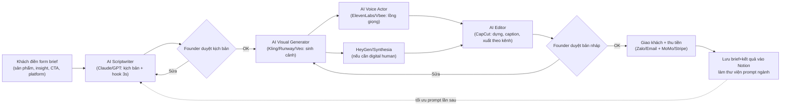

# Kế hoạch 08: "AI Director" sản xuất video quảng cáo cho SME (OPC)

> Model phụ trách: Claude · Ngày: 2026-09-10 · Trạng thái: draft
> ⚠️ **Ghi chú phiên nghiên cứu:** WebSearch/WebFetch và các MCP tool tra cứu (openseo) đều bị hệ thống từ chối quyền ("don't ask mode") trong phiên viết kế hoạch này — đã thử 3 lần (WebSearch trực tiếp, WebFetch tới trang giá Runway/Google + DuckDuckGo HTML, subagent độc lập) đều bị chặn như nhau. Vì vậy kế hoạch này dùng: (a) kiến thức đã thẩm định ở brief mục B/master playbook (có link, dùng thoải mái), (b) tên công cụ AI có thật, phổ biến, không bịa (Runway, Veo, HeyGen, ElevenLabs, CapCut, Kling...), nhưng **mọi con số giá/thị trường không có trong brief đều gắn ⚠️ + "chưa xác minh qua web phiên này"** thay vì bịa link. Orchestrator nên giao lại việc xác minh giá cụ thể (mục 11) trước khi dùng số liệu này để chào giá thật cho khách.

## 1. Mô hình công ty (1 slide)

OPC đóng vai "đạo diễn AI" (AI Creative Director), bán **gói sản xuất video quảng cáo trọn gói** cho SME: từ brief ý tưởng → kịch bản → sinh hình ảnh/video bằng AI → lồng giọng AI → dựng/hoàn thiện, giao file sẵn sàng chạy quảng cáo — **không cần đoàn quay, ánh sáng, diễn viên, phòng dựng**. Khách hàng: SME VN (quán ăn, mỹ phẩm, shop TikTok/Shopee, khoá học, dịch vụ địa phương) cần video quảng cáo rẻ + nhanh; và SME/solo-founder US (Shopify/Amazon seller, local service, coach) cần nhiều biến thể creative để test ads liên tục. Khác biệt so với quay truyền thống: giao trong 48–72 giờ thay vì 1–3 tuần; giá bằng 1/5–1/10 TVC truyền thống vì không tốn nhân sự/thiết bị hiện trường; sinh được 5–10 biến thể/đơn để A/B test (điều bất khả thi với quay thật). Vì sao 1 người làm được: toàn chuỗi (ý tưởng → hình ảnh → giọng nói → dựng) đã được các model AI sinh video/giọng đảm nhiệm; người chỉ giữ 3 việc không AI hoá được — hiểu insight khách hàng, chọn concept đúng gu thương hiệu, duyệt chất lượng trước khi giao.

## 2. Vì sao nó thắng ở Trung Quốc

- **彭青云 (AI短剧 xuất khẩu) ✅** — bị sa thải 2023, cùng 1 người bạn dựng phim ngắn AI 《众神之战》đạt ~20 triệu độ nóng, bán sang Singapore/Pháp, doanh thu vài vạn NDT/tháng; học qua cộng đồng mở WaytoAGI, không có nền tảng sản xuất phim ([天下网商/界面](https://m.jiemian.com/article/14193991.html)). Bài học: AI có thể thay thế **toàn bộ đoàn phim** cho nội dung hình ảnh chuyển động — nguyên lý giống hệt "AI Director" chỉ khác đầu ra là quảng cáo thay vì phim giải trí.
- **"一人一剧组" (1 người = 1 đoàn phim) ✅** — mô hình AI短剧 được báo chí gọi thẳng là ngành "1 người thay cả đoàn làm phim" ([重庆日报](https://cqrb.cn/shishi/2026-03-29/2618574_pc.html)). Copy trực tiếp: brief → AI sinh cảnh → AI lồng giọng → dựng tự động, không có bước nào bắt buộc con người ngoài duyệt.
- **数字人 (digital human) livestream ✅** — chi phí dựng chỉ vài nghìn NDT nhưng sức bán từng vượt cả người nổi tiếng livestream thật ([一财](https://finance.sina.com.cn/roll/2026-01-12/doc-inhfzukt9994973.shtml)); cho thấy khách hàng TQ đã chấp nhận nội dung thương mại 100% AI-generated nếu chất lượng đủ tốt — tín hiệu tốt cho việc bán video quảng cáo AI cho SME.
- **Nguyên tắc vàng áp dụng:** "AI hoá triệt để → chuẩn hoá cục bộ → người giỏi nhất giữ lõi" (光年易达, xem master playbook mục 9) — áp cho AI Director: AI hoá 100% khâu sản xuất, chuẩn hoá SOP brief theo từng ngành (F&B/mỹ phẩm/dịch vụ), người giữ phần duyệt sáng tạo + quan hệ khách hàng.

## 3. Thị trường VN & US

**VN:** Hàng triệu hộ kinh doanh cá thể + SME chạy TikTok Shop/Shopee/Facebook Ads đều cần creative liên tục nhưng ngân sách nhỏ; TVC truyền thống giá cao và chậm khiến nhiều SME chỉ tự quay điện thoại chất lượng thấp. Cửa vào dễ: gói giá thấp, giao nhanh, không cam kết hợp đồng dài; bán qua chính kênh SME đang hoạt động (nhóm Zalo/Facebook ngành, cộng đồng TikTok Shop seller). Cạnh tranh trực tiếp: agency quay dựng truyền thống (chậm hơn, đắt hơn), freelancer dựng CapCut thủ công (rẻ nhưng không có AI-generated visual mới lạ), và chính công cụ AI tự phục vụ (CapCut AI, Canva) mà SME có thể tự dùng miễn phí — nên OPC phải bán **kèm chiến lược + đa biến thể + tốc độ**, không chỉ bán "bấm nút AI hộ". Pháp lý: hộ kinh doanh/TNHH MTV, hoá đơn điện tử (Thông tư 78); nếu dùng digital human/avatar AI đại diện thương hiệu phải công bố nội dung AI theo Nghị định 147/2024/NĐ-CP.

**US:** thị trường "AI video ads" đã có nhiều công cụ tự phục vụ nổi tiếng (Arcads, Creatify, Icon, Captions, Pippit — theo hiểu biết chung, ⚠️ chưa xác minh giá/thị phần qua web phiên này) khiến rào cản tự làm rất thấp; OPC phải định vị là dịch vụ "làm hộ trọn gói + chiến lược" cho SME không có thời gian tự vọc công cụ, không cạnh tranh trực tiếp với chính các platform đó. Giá tính bằng USD cao hơn VN nhiều lần nên biên lợi nhuận tốt hơn nhưng cạnh tranh cũng khốc liệt hơn (agency Upwork/Fiverr đã đông). Pháp lý: LLC 1 thành viên, CCPA nếu thu dữ liệu khách California, cần điều khoản rõ về bản quyền output AI-generated (một số bang Mỹ đang siết luật công bố nội dung AI trong quảng cáo — ⚠️ cần kiểm tra quy định mới nhất trước khi ký hợp đồng). **Đánh giá cửa vào:** bắt đầu ở VN trước (chi phí thấp, ít rào cản pháp lý, dễ lấy case study thật) rồi dùng case đó làm bằng chứng bán sang US qua Fiverr/Upwork hoặc outreach trực tiếp.

## 4. Tech stack & kiến trúc tự động hoá

| Công cụ | Vai trò | Chi phí/tháng (ước tính) |
|---|---|---|
| Claude/ChatGPT/DeepSeek | Brief hoá yêu cầu khách → kịch bản 3 hồi + hook 3 giây đầu | ~$20 (1 sub Claude/ChatGPT Pro) |
| Kling (可灵/即梦 bản quốc tế), Runway Gen-4, Google Veo (qua Gemini/Flow), Luma Dream Machine | Sinh cảnh/video theo storyboard | ⚠️ $12–100+/tháng tuỳ gói — **chưa xác minh giá hiện tại qua web phiên này**, cần kiểm tra lại trước khi chốt stack |
| ElevenLabs | Lồng giọng AI đa ngôn ngữ (tiếng Anh, có hỗ trợ tiếng Việt) | ⚠️ chưa xác minh giá phiên này |
| Vbee | Giọng đọc AI tiếng Việt bản địa (giọng vùng miền) | theo brief B3, chi tiết giá chưa có |
| HeyGen / Synthesia | Digital human/avatar nói chuyện cho ads dạng testimonial | ⚠️ chưa xác minh giá phiên này (đã ✅ trong brief về hiệu quả bán hàng, chưa ✅ về giá) |
| CapCut (bản quốc tế của 剪映) | Dựng, cắt theo nhịp, caption tự động, xuất theo tỉ lệ nền tảng | Miễn phí bản cơ bản |
| Notion/Airtable | Quản lý brief, trạng thái đơn, thư viện prompt theo ngành | Miễn phí–$10 |
| Zalo OA (VN) / email+Slack (US) | Giao tiếp, nhận brief, gửi bản nháp duyệt | Miễn phí–thấp |
| n8n (self-host) | Nối form nhận brief → tạo task → nhắc AI sinh script → thông báo khi xong | Miễn phí (self-host) |
| MoMo/VietQR (VN), Stripe/Wise (US) | Thu tiền | Phí giao dịch theo cổng |

Người làm: brief hoá insight khách, chọn concept, duyệt 2 lần (kịch bản + bản nháp), giao tiếp khách hàng. AI làm: viết script chi tiết, sinh toàn bộ hình ảnh/video, lồng giọng, dựng, xuất file theo tỉ lệ từng nền tảng (9:16 TikTok, 1:1 Feed, 16:9 YouTube).

## 5. Vận hành ngày/tuần của founder

**Lịch tuần mẫu:**
- **Thứ 2:** nhận brief mới từ form/Zalo, phân loại theo ngành, AI sinh kịch bản nháp cho toàn bộ đơn trong tuần.
- **Thứ 2–3:** duyệt kịch bản, gửi khách xác nhận hướng trước khi sinh hình ảnh (tránh làm lại tốn credit AI).
- **Thứ 3–4:** chạy AI sinh visual + giọng cho các đơn đã xác nhận, theo dõi batch generate.
- **Thứ 4–5:** dựng bằng CapCut, duyệt chất lượng, sửa lỗi AI (tay lạ, chuyển động bất thường).
- **Thứ 6:** giao khách, thu tiền, xin feedback/case study, cập nhật thư viện prompt.
- **Cuối tuần:** dự trữ — làm content bán hàng cho chính OPC (showcase video mẫu trên TikTok/Facebook cá nhân).

**"Vị trí công việc AI" (mẫu 张顺 5 nhân viên AI):**
| Chức danh | Prompt chính | Công cụ |
|---|---|---|
| AI Scriptwriter | "Viết kịch bản quảng cáo 15-30s cho [ngành], hook 3 giây đầu theo insight [pain point], CTA [hành động]" | Claude/GPT |
| AI Visual Generator | "Sinh cảnh [mô tả] phong cách [thương hiệu], tỉ lệ [nền tảng], độ dài [X]s" | Kling/Runway/Veo |
| AI Voice Actor | "Đọc kịch bản giọng [vùng miền/tone], tốc độ [X], cảm xúc [X]" | ElevenLabs/Vbee |
| AI Editor | "Cắt theo nhịp beat nhạc [X], caption auto, xuất 9:16 + 1:1 + 16:9" | CapCut |
| AI QA/Compliance | "Kiểm tra bản quyền nhạc/hình, gắn nhãn AI-generated nếu cần" | checklist thủ công + AI hỗ trợ rà |

**Vòng lặp dữ liệu:** mỗi brief + kịch bản + kết quả + phản hồi khách lưu vào Notion → sau 10–15 đơn cùng ngành, đúc thành template prompt riêng cho ngành đó (F&B, mỹ phẩm, dịch vụ) → giảm thời gian brief hoá lần sau, tăng tốc độ giao hàng.

## 6. Mô hình doanh thu & chi phí

⚠️ **Toàn bộ mức giá gói dưới đây là ước lượng dựa trên định vị thị trường mô tả ở mục 3, KHÔNG có link xác minh giá thị trường thực tế trong phiên này — founder phải khảo sát giá đối thủ VN/US thật trước khi chào giá chính thức.**

| Gói | VN (VND) | US (USD) | Nội dung |
|---|---|---|---|
| Cơ bản (1 video 15–30s) | 1.500.000–3.000.000 | 150–300 | 1 kịch bản, 1 bản dựng, 1 vòng sửa |
| Combo 5 biến thể (A/B test) | 6.000.000–10.000.000 | 600–1.000 | 1 kịch bản gốc, 5 biến thể hình/hook khác nhau |
| Gói tháng (4 video/tháng) | 8.000.000–15.000.000/tháng | 800–1.500/tháng | Subscription, ưu tiên xử lý, thư viện prompt riêng thương hiệu |

**Chi phí vận hành/tháng (vốn khởi điểm):** AI tool subscriptions (script + visual + voice) ước ~$100–300/tháng tuỳ scale; Notion/n8n gần như miễn phí; marketing bản thân (chạy ads nhỏ giới thiệu dịch vụ) ~$50–100/tháng. Tổng vốn khởi điểm 3 tháng đầu (mua sub AI tools + dự phòng) **dưới 1.000 USD**, còn dư nhiều trong hạn mức 3.000 USD của nhiệm vụ này để dự phòng nâng cấp gói AI cao hơn khi có đơn ổn định.

**Kịch bản 12 tháng (VN, đơn vị triệu VND, ước lượng):**
| Kịch bản | Tháng 1–3 | Tháng 4–6 | Tháng 7–12 |
|---|---|---|---|
| Tệ | 3–5 đơn/tháng, DT 10–15tr, lỗ nhẹ (chi phí AI+ads cá nhân > DT) | 5–8 đơn, DT 20–30tr, hoà vốn | 8–10 đơn, DT 30–40tr |
| Cơ bản | 5–8 đơn, DT 20–25tr | 10–15 đơn, DT 40–60tr | 15–20 đơn, DT 70–100tr |
| Tốt | 10–15 đơn, DT 40–60tr | 20–25 đơn, DT 100–150tr | 25+ đơn hoặc chuyển gói tháng, DT 150tr+ |

Điểm hoà vốn ước tính: ~4–6 đơn cơ bản/tháng (đủ bù chi phí AI tool + marketing cá nhân, chưa tính công founder).

## 7. Lộ trình start-from-scratch

**Ngày 0–30 — Dựng pipeline & lấy khách đầu tiên:**
1. Đăng ký hộ kinh doanh cá thể/TNHH MTV VN (nộp online qua Cổng dịch vụ công, 1–3 ngày, phí ~0–100.000đ) hoặc LLC US nếu nhắm khách US ngay từ đầu.
2. Đăng ký sub Claude/ChatGPT + 1 tool sinh video AI (Kling hoặc Runway, chọn gói thấp nhất) + ElevenLabs gói free/thấp nhất — tổng ~$50–100.
3. Dựng 3 template kịch bản mẫu cho 3 ngành phổ biến (F&B, mỹ phẩm, dịch vụ địa phương) để demo.
4. Tự sản xuất 3–5 video mẫu (portfolio) cho sản phẩm/dịch vụ giả định hoặc xin làm free cho 1–2 SME quen biết đổi lấy feedback + case study.
5. Lập Notion quản lý brief + trang landing đơn giản (Notion site hoặc 1 trang Linktree) giới thiệu gói giá.
6. Đăng bài giới thiệu dịch vụ trong 5–10 nhóm Facebook/Zalo SME, TikTok Shop seller.
7. Chốt đơn trả phí đầu tiên (mục tiêu: ≥1 khách trả tiền trong 30 ngày, theo tiêu chí Ninh Ba ở master playbook).
8. Mở tài khoản nhận tiền: MoMo/VietQR (VN); nếu có khách US: đăng ký Wise/Stripe.

**Ngày 30–60 — Chuẩn hoá & mở rộng kênh:**
1. Đúc 3 template thành SOP prompt chuẩn (lưu trong Notion, tái dùng).
2. Thêm HeyGen/Synthesia cho gói digital-human testimonial.
3. Dựng n8n workflow: form brief → task Notion → nhắc AI sinh script tự động.
4. Test gói combo 5 biến thể A/B với 2–3 khách để chứng minh giá trị "nhiều biến thể".
5. Thu thập 3–5 case study có số liệu thật (CTR/engagement nếu khách chia sẻ).
6. Bắt đầu outreach sang US qua Fiverr/Upwork với case study VN làm bằng chứng.
7. Đánh giá lại giá gói dựa trên thời gian thực tế bỏ ra/đơn.

**Ngày 60–90 — Ổn định vận hành & phòng thủ:**
1. Chuẩn hoá checklist compliance: gắn nhãn AI-generated khi cần (Nghị định 147/2024 VN), kiểm tra bản quyền nhạc/font trước khi giao.
2. Thiết lập gói subscription tháng cho khách quay lại (dòng tiền ổn định hơn đơn lẻ).
3. Tối ưu thời gian/đơn bằng thư viện prompt đã tích luỹ (mục tiêu giảm 30–50% thời gian brief hoá).
4. Đánh giá công cụ AI đang dùng — nâng gói nếu chất lượng chưa đạt, đổi tool nếu có option rẻ/tốt hơn.
5. Xác định ngách con cụ thể nhất (VD: chỉ chuyên video mỹ phẩm, hoặc chỉ chuyên testimonial digital-human) nếu thấy 1 ngành phản hồi tốt hơn hẳn.

**Ngày 90–180 — Scale hoặc điều chỉnh:**
1. Nếu đạt ngưỡng SCALE (mục 9): tuyển cộng tác viên bán thời gian phụ trách QA/duyệt bản nháp, founder tập trung sales + concept.
2. Xây quy trình nhận đơn hàng loạt (batch) cho khách agency trung gian (bán buôn creative cho agency nhỏ khác).
3. Đánh giá mở gói cao cấp hơn (video dài hơn, tích hợp chạy ads luôn — xem câu hỏi mở #5).
4. Nếu không đạt ngưỡng: xem lại mục 9 (tiêu chí KILL), cân nhắc pivot ngách hoặc đổi mô hình giá.

## 8. Rủi ro & phòng thủ

1. **Thị trường:** SME tự làm được bằng công cụ AI miễn phí (CapCut AI, Canva) → mất khách phân khúc thấp. *Phòng thủ:* định vị bán chiến lược + đa biến thể + tốc độ giao, không chỉ bán "bấm nút AI hộ".
2. **Nền tảng:** chính sách TikTok/Meta Ads về nội dung AI-generated (gắn nhãn, hạn chế ngành nhạy cảm) thay đổi nhanh, có thể khiến video bị gắn cờ/giảm phân phối. *Phòng thủ:* theo dõi policy 2 nền tảng hàng tháng, luôn gắn nhãn đúng quy định, có phương án chỉnh sang footage thật khi cần.
3. **Pháp lý bản quyền:** tính pháp lý của nội dung do AI train từ dữ liệu bên thứ ba vẫn chưa rõ ràng ở nhiều nước; nhạc nền/font trong video AI có thể dính bản quyền. *Phòng thủ:* chỉ dùng nhạc/font có license thương mại rõ trong tool, đọc kỹ TOS thương mại của từng AI tool trước khi bán output.
4. **Công nghệ:** chất lượng video AI còn lỗi (tay, chuyển động lạ, "uncanny valley") gây mất uy tín nếu giao thẳng cho khách khó tính. *Phòng thủ:* luôn có ≥1 vòng duyệt nội bộ trước khi gửi khách; với sản phẩm cần độ chính xác cao, kết hợp ảnh/clip thật khách gửi + AI chỉ hỗ trợ enhance/dựng thay vì sinh 100% từ đầu.
5. **Cá nhân/nghẽn cổ chai:** 1 người vẫn phải duyệt từng bước (kịch bản, bản nháp) nên số đơn xử lý song song có giới hạn thật; nhận quá nhiều đơn cùng lúc → trễ hẹn, mất uy tín. *Phòng thủ:* giới hạn cứng số đơn/tuần, chuẩn hoá SOP theo ngành để rút ngắn thời gian duyệt, có ngưỡng để thuê cộng tác viên (mục 9).
6. **Compliance VN:** dùng digital human/avatar đại diện thương hiệu mà không công bố AI có thể vi phạm Nghị định 147/2024/NĐ-CP. *Phòng thủ:* checklist gắn nhãn "nội dung có sử dụng AI" trước khi giao khách.
7. **Rủi ro tiền tệ/thanh toán quốc tế:** nhận USD từ khách Mỹ khi vận hành ở VN có thể vướng phí chuyển đổi/khai báo thuế thu nhập nước ngoài. *Phòng thủ:* dùng Wise/Stripe, tham vấn kế toán về nghĩa vụ thuế thu nhập từ nước ngoài trước khi nhận đơn US đầu tiên.

## 9. KPI & tiêu chí kill/scale

**KPI chính:**
- Số đơn trả tiền/tháng.
- Doanh thu/tháng (VND & USD riêng).
- Thời gian trung bình/đơn (giờ, từ nhận brief → giao hàng) — mục tiêu giảm dần nhờ thư viện prompt.
- Tỷ lệ khách quay lại/giới thiệu (repeat + referral rate).
- Tỷ lệ đơn cần sửa >1 lần (đo chất lượng output AI đầu ra).

**Ngưỡng KILL (dừng/đổi hướng):** sau 90 ngày có <3 đơn trả tiền HOẶC doanh thu tháng liên tục thấp hơn chi phí vận hành (AI tool + marketing) trong 3 tháng liền → xem lại ngách/giá, cân nhắc pivot sang mô hình khác trong brief (VD: chuyển hẳn sang chuyên digital-human livestream, kế hoạch 03).

**Ngưỡng SCALE (tuyển người → STC):** ổn định ≥15 đơn/tháng hoặc doanh thu ≥150 triệu VND/tháng (~6.000 USD) trong 2 tháng liên tiếp, VÀ thời gian founder duyệt/đơn đã là điểm nghẽn rõ ràng → tuyển cộng tác viên bán thời gian phụ trách QA/dựng, founder chuyển sang vai trò sales + creative director thuần.

## 10. Nguồn tham khảo

- [天下网商/界面 — 团队仅1人，目标年收入百万，一人AI公司爆火 (04/2026)](https://m.jiemian.com/article/14193991.html) — case 彭青云 AI短剧, truy cập qua brief 2026-09-10.
- [重庆日报 — 一人一剧组：AI短剧新生态 (03/2026)](https://cqrb.cn/shishi/2026-03-29/2618574_pc.html) — mô hình "1 người = 1 đoàn phim", truy cập qua brief 2026-09-10.
- [一财 — 成本几千元的数字人卖爆 (01/2026)](https://finance.sina.com.cn/roll/2026-01-12/doc-inhfzukt9994973.shtml) — digital human bán hàng, truy cập qua brief 2026-09-10.
- Brief chung `00-brief-va-template.md` mục B (kiến thức đã thẩm định, dùng trực tiếp không cần re-verify) và master playbook `plans/reports/260910-1118-opc-china-master-playbook.md` mục 9 (10 nguyên tắc vàng).
- ⚠️ **Không có nguồn:** giá cụ thể Runway/Veo/HeyGen/ElevenLabs 2026, mức giá thị trường TVC VN, và case study "AI video ads agency" cụ thể — 4 hướng deep-research được giao trong nhiệm vụ **không thực hiện được** vì WebSearch/WebFetch/openseo đều bị từ chối quyền truy cập trong toàn bộ phiên làm việc này (đã thử qua 3 con đường khác nhau, xem đầu file).

## 11. Câu hỏi mở

1. WebSearch/WebFetch bị chặn hoàn toàn trong phiên này — cần orchestrator chạy lại nghiên cứu (hoặc cấp quyền) để xác minh giá Runway/Veo/HeyGen/ElevenLabs hiện tại trước khi dùng mục 4/6 để chào giá thật.
2. Mức giá TVC truyền thống VN hiện tại (để định vị mức giá AI thấp hơn bao nhiêu %) chưa có số liệu xác minh — cần khảo sát trực tiếp 3–5 agency/freelancer VN.
3. Case study "AI video ads agency" thành công cụ thể (TQ hoặc quốc tế) làm bằng chứng bán hàng — chưa tìm được trong phiên, cần bổ sung.
4. Quy định gắn nhãn nội dung AI trên TikTok Ads/Meta Ads (VN & US) mới nhất — thay đổi nhanh, cần kiểm tra ngay trước khi launch dịch vụ.
5. Có nên bundle bán kèm chạy quảng cáo (media buying) hay chỉ bán creative thuần — ảnh hưởng lớn tới mô hình doanh thu và rủi ro pháp lý (quảng cáo cần license riêng ở một số ngành).

## 12. Xác minh bổ sung (verify-pass, 10/09/2026)

- **Giá Veo (nguồn chính thức Google):** Veo 3 = $0,40/giây, Veo 3 Fast = $0,15/giây (đã giảm từ $0,75/$0,40 kể từ 08/09/2025); hỗ trợ 9:16 + 1080p → 1 video 30s ≈ $12 (Veo 3) hoặc ≈ $4,5 (Veo 3 Fast) ([Google Developers Blog](https://developers.googleblog.com/ja/veo-3-and-veo-3-fast-new-pricing-new-configurations-and-better-resolution/), truy cập 10/09/2026).
- **Giá Runway:** trang giá chính thức chuyển về runway.com/pricing, tiêu đề trang công bố "from $12/month" → gói thấp nhất ~$12/tháng ([runway.com/pricing](https://runway.com/pricing), truy cập 10/09/2026). ⚠️ Chi tiết từng tier (Standard/Pro/Unlimited + credit) không fetch được vì trang render bằng JS; nguồn bên thứ ba (Siteefy, dữ liệu 12/2025) ghi "From $20/mo" — cần đối chiếu trực tiếp trước khi chốt stack.
- **Giá HeyGen (trang chính thức):** Free $0 (3 video/tháng); Creator $29/tháng (600 credits, 1080p); Pro $49/tháng (1.000 credits, 4K); Business $149/tháng + $20/chỗ ([heygen.com/pricing](https://www.heygen.com/pricing), truy cập 10/09/2026).
- **Giá ElevenLabs:** Free $0 (10k credits, KHÔNG license thương mại); Starter $6/tháng (đã có license thương mại); Creator $22 (tháng đầu $11); Pro $99; Scale $299; Business $990; API pay-as-you-go TTS $0,10/1.000 ký tự ([Cekura breakdown, cập nhật 08/09/2026](https://www.cekura.ai/blogs/elevenlabs-pricing), truy cập 10/09/2026). Gói Starter $6 đã đủ dùng thương mại cho giai đoạn đầu — thấp hơn ước lượng của plan.
- **Gắn nhãn AI — TikTok Ads:** theo Advertising Policies cập nhật 01/2026, quảng cáo chứa nội dung AI (mặt người tổng hợp, giọng clone, nền AI, ảnh sản phẩm photorealistic) phải bật tag "AI Disclosure" ở Ads Manager → hiện nhãn "Contains AI-generated content" trên quảng cáo; TikTok tự quét C2PA metadata + phát hiện mặt tổng hợp; hình phạt 4 bậc (cảnh cáo → hạn chế đăng 7 ngày → khoá 30 ngày → khoá vĩnh viễn); AI avatar bắt buộc ghi rõ trong bio + gắn nhãn từng bài và bị cấm claim "trải nghiệm cá nhân" ([AuditSocials — TikTok AI Content Disclosure Rules 2026, cập nhật 09/05/2026](https://www.auditsocials.com/blog/tiktok-ai-content-disclosure-rules-2026), truy cập 10/09/2026).
- **Gắn nhãn AI — Meta Ads:** Meta công bố 02/2025 và cập nhật 01/06/2026: quảng cáo tạo/sửa đổi đáng kể bằng AI hiện nhãn "AI info" trong mục "About this ad" (menu 3 chấm); Meta dùng tín hiệu chuẩn ngành để TỰ phát hiện cả quảng cáo dùng AI của bên thứ ba; người photorealistic do AI có thể bị gắn nhãn ngay cạnh "Sponsored" ([Meta announcement 02/2025](https://about.fb.com/news/2025/02/gen-ai-transparency-metas-ads-products/) + [Affiverse tổng hợp cập nhật 01/06/2026](https://www.affiversemedia.com/meta-ai-labels-facebook-instagram-ads/), truy cập 10/09/2026). Meta không yêu cầu tự khai báo bắt buộc ở Ads Manager như TikTok, nhưng nội dung AI không gắn nhãn đúng có thể bị tự gắn cờ/giảm phân phối.
- **Case study AI video ads:** (1) Cosmorama — đại lý du lịch Hy Lạp dùng video AI (Google AI) tăng gấp đôi doanh thu online, case chính thức của Google Business AI Excellence ([business.google.com](https://business.google.com/en-all/think/ai-excellence/cosmorama-travel-ai-video/), truy cập 10/09/2026); (2) Adcore (agency) dùng AI video models cho khách hàng House (thời trang) để cắt chi phí + tăng user upper-funnel ([Adcore Blog](https://www.adcore.com/blog/building-upper-funnel-awareness-ahead-of-promotion-house-ai-video/), truy cập 10/09/2026) — ⚠️ trang bị cắt nội dung, chỉ xác minh được khung case, số liệu chi tiết cần mở lại trang gốc.
- ⚠️ **Vẫn chưa xác minh được:** chi tiết tier giá Runway hiện hành (mới xác nhận mức khởi điểm $12/tháng); mức giá TVC truyền thống VN (không có nguồn web đáng tin, phải khảo sát agency trực tiếp); chính sách nhãn AI 2 nền tảng có thể đổi tiếp trước ngày launch thật (cần re-check vào tháng khởi chạy dịch vụ).
- ❓ Câu hỏi chỉ con người/khảo sát trực tiếp giải được (giữ nguyên ở mục 11): khảo sát giá TVC/agency VN (câu 2); quyết định bundle media buying hay bán creative thuần (câu 5).
