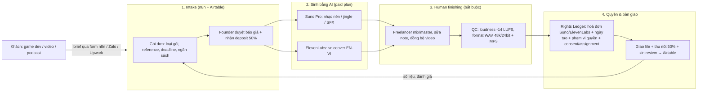

# Kế hoạch 09: Studio nhạc AI/âm thanh cho game-video-podcast (OPC)

> Model phụ trách: Codex (bản soạn: DeepSeek) · Ngày: 2026-09-10 · Trạng thái: draft

## 1. Mô hình công ty (1 slide)

- **Khách hàng:** nhà làm game indie, kênh video/YouTube, nhà sản xuất podcast (VN trước, US sau) cần nhạc nền, jingle, voiceover, SFX nhanh–rẻ–có giấy tờ quyền rõ ràng.
- **Bán gì:** 4 gói sản phẩm — (1) Nhạc nền game loop; (2) Jingle/intro-outro podcast; (3) Voiceover EN/VI (ElevenLabs + human finishing); (4) SFX pack. Mỗi đơn giao kèm **Rights Ledger** (hoá đơn công cụ + ngày tạo + phạm vi quyền giao cho khách + phần human finishing) — đây chính là thứ studio AI giá rẻ không làm.
- **Khác biệt:** KHÔNG hứa "bản quyền sạch 100%" cho output AI thuần; thay vào đó bán **sự minh bạch quyền** (provenance) + **human finishing** (mix/master/điều chỉnh) + tốc độ 48-72h. Với khách cần độc quyền thật sự → gói hybrid có nhạc sĩ/voice actor người thật (freelancer toàn cầu).
- **Vì sao 1 người làm được:** mẫu 任朵 ✅ — "global chain master", 0 nhân viên, điều phối chuỗi toàn cầu, đơn gấp vài ngày vẫn nhận ([上观新闻](https://www.shobserver.com/wx/detail.do?id=1036074)). Founder chỉ giữ 3 thứ theo nguyên tắc OPC: hướng đi, nhu cầu khách, niềm tin + rủi ro pháp lý; AI + freelancer làm phần còn lại.
- **Ngân sách:** ≤2.000 USD cho 6 tháng (tool ~400 USD + freelancer finishing ~1.000 USD + marketing/mẫu ~600 USD).

## 2. Vì sao nó thắng ở Trung Quốc

- ✅ **任朵 (Lâm Cảng, Thượng Hải):** AI music, định vị "global chain master", không nhân viên, nhận cả dự án gấp vài ngày; Lâm Cảng xếp "AI music/âm thanh" vào nhóm ngành OPC được ưu tiên ("288行动": văn phòng + ở 24h giá 0đ) ([上观新闻](https://www.shobserver.com/wx/detail.do?id=1036074)). Bài học copy: **OPC là nút điều phối trong mạng lưới, không làm hết mọi việc** — bán tốc độ + điều phối, không bán "tôi là nhạc sĩ".
- ✅ **Nguyên tắc 3 tầng đã thẩm định (光年易达):** "AI hoá triệt để → chuẩn hoá cục bộ → người giỏi nhất giữ phần lõi" ([中国经营报](https://news.qq.com/rain/a/20260326A04AP000)). Áp vào audio: sinh nhạc/voice = AI 100%; quy trình brief/QC/ledger = chuẩn hoá cục bộ; mix/master + quyết định quyền = freelancer giỏi/founder giữ lõi.
- ✅ **Hạ tầng rẻ:** công cụ AI audio toàn cầu giá chục USD/tháng (mục 4) — tương đương "bộ đồ nghề OPC" ¥158-362/năm của Alibaba ([阿里云](https://developer.aliyun.com/article/1753572)) về triết lý: chi phí công cụ không còn là rào cản.
- ⚠️ Chưa có số liệu độc lập về doanh thu của 任朵 (báo chí không nêu con số) — dùng làm bằng chứng mô hình, không lập kế hoạch tài chính theo.

## 3. Thị trường VN & US

### Việt Nam (vào trước)
- **Nhu cầu game/podcast/video:** cộng đồng game indie VN và podcast tiếng Việt đang phát triển ⚠️ (chưa có nguồn định lượng độc lập — đưa vào mục 11); có nhu cầu **thật** đã xác minh cho voiceover game: studio VNVO có hẳn dịch vụ "Video Games Voice Over in Vietnamese" ✅ ([vnvoice.net](https://vnvoice.net/en/dich-vu-long-tieng-game-chuyen-nghiep/)).
- **Giá voiceover VN rẻ & đơn giản:** ~90% dự án digital ở VN tính **giá trọn gói đã gồm quyền thương mại**, không tách "session fee + usage fee" như US/UK; quyền dùng riêng lẻ chỉ áp cho TVC thương hiệu lớn (mua 1-2 năm/perpetual) ✅ ([VNVO Studio 07/2026](https://vnvoice.net/en/english-demystifying-vietnamese-voiceover-rates-a-complete-guide-to-pricing-buyouts-and-usage-rights-in-2026/)). Lợi thế: COGS voice tiếng Việt rẻ, turnaround chuẩn 24-48h ✅ (cùng nguồn).
- **Kênh tiếp cận:** Zalo OA + nhóm Zalo/Facebook cộng đồng game dev, agency quảng cáo; thanh toán MoMo/VNPay + hoá đơn điện tử (Thông tư 78 — theo brief B5, đã thẩm định).
- **Lợi thế ngôn ngữ:** phát âm tiếng Việt chuẩn 3 miền + chỉnh phiên âm tên riêng EN cho ElevenLabs là kỹ năng freelancer nước ngoài hiếm có.
- **Đối thủ:** studio voiceover VN truyền thống (rẻ nhưng chậm với đơn nhỏ), freelancer Fiverr giá thấp (không có ledger).

### Mỹ (vào sau, ticket cao hơn)
- **Kênh & giá:** Upwork có danh mục riêng "Voice Actors US" và "Video Game Music Composers" — chứng tỏ cầu tập trung ✅ ([Upwork voice actors](https://www.upwork.com/hire/voice-actors/us/), [Upwork game music](https://www.upwork.com/hire/video-game-music-freelancers/california-us/)); mức giá giờ/track cụ thể chưa xác minh được nguồn độc lập ⚠️ (đưa vào mục 11).
- **Chuẩn đối thủ (music library):** Artlist ~$199/năm (Personal) / ~$299/năm (Commercial); Epidemic Sound ~$16/tháng (Personal) / ~$25/tháng (Commercial, ~$300/năm) ✅ — **giấy phép cho dự án MỚI hết hiệu lực khi huỷ subscription** ([Artyfile so sánh 05/2026](https://artyfile.com/blog/artlist-vs-epidemic-sound-vs-artyfile-comparison-2026)). Đây là "gót chân Achilles" để studio ta bán: khách mua nhạc custom + quyền rõ ràng, không phụ thuộc subscription.
- **Pháp lý:** khách US đòi **assignment + provenance + consent** nghiêm ngặt; CCPA nếu có user California (brief B5); thanh toán Stripe/Wise/PayPal.
- **Cửa vào trước: VN** (quan hệ Zalo, chi phí mẫu thấp, cạnh tranh giá nhẹ nhàng) → dùng portfolio VN để mở Upwork US từ tháng 4.

## 4. Tech stack & kiến trúc tự động hoá

### 4.1 Bảng công cụ

| Công cụ | Vai trò | Chi phí/tháng | Ghi chú |
|---|---|---|---|
| Suno **Pro** | Sinh nhạc nền/jingle/SFX | $10 (hoặc $8/năm trả trước) | **Commercial rights chỉ cho bài tạo KHI đang subscribe**; credit không cộng dồn; Suno KHÔNG bảo đảm copyright sẽ được công nhận ✅ ([Suno pricing](https://suno.com/pricing), [SaaSZap 06/2026](https://saaszap.com/suno-ai-pricing/)) |
| ElevenLabs **Starter → Creator** | Voiceover EN/VI, cloning giọng | $5 → $22 | Free KHÔNG có quyền thương mại; Starter (30k credit ~30 phút TTS) là mức tối thiểu có commercial rights; Creator thêm Professional Voice Cloning ✅ ([BIGVU 03/2026](https://bigvu.tv/blog/elevenlabs-pricing-2026-plans-credits-commercial-rights-api-costs/)) |
| Audacity / BandLab | Edit, mix/master human finishing | $0 | Chuẩn hoá xuất WAV 48kHz/24bit + MP3 |
| Airtable / Notion | Database đơn hàng + **Rights Ledger** | $0 (free tier) | Hub trung tâm theo pattern Bitable |
| n8n (self-host) | Form intake → tạo đơn → nhắc việc → gửi email bàn giao | $0 (VPS ~$5) | "Nhân viên vô hình" |
| Carrd/Notion site | Portfolio + bảng giá | $0-3 | Demo reel 6-10 mẫu |
| Zalo OA / Upwork / Fiverr | Kênh khách + thanh toán | $0 + phí nền tảng 10-20% | Upwork/Fiverr tính phí trên doanh thu |
| Freelancer mix/master & voice actor (VN + global) | Human finishing bắt buộc | 15-30% giá trị đơn | Hợp đồng assignment + consent form |

Tổng tool cố định: **~$15-40/tháng** (không tính phí nền tảng bán hàng).

### 4.2 Workflow end-to-end

**Người làm:** duyệt báo giá, chốt phạm vi quyền, QC cuối, xử lý rủi ro pháp lý. **AI làm:** sinh nhạc/voice, nhắc deadline, tạo ledger nháp, email bàn giao. **Freelancer làm:** mix/master, voice thật khi khách cần độc quyền.

## 5. Vận hành ngày/tuần của founder

**Lịch tuần mẫu (20-25h):**

| Ngày | Việc |
|---|---|
| T2 | Duyệt đơn mới + báo giá; giao brief cho pipeline AI |
| T3 | Sinh hàng loạt (Suno/ElevenLabs), chọn 3-5 bản tốt nhất mỗi đơn |
| T4 | Điều phối freelancer finishing; QC + cập nhật Rights Ledger |
| T5 | Bàn giao + thu tiền; đăng 1 mẫu demo mới lên portfolio/Zalo |
| T6 | Outreach 20 khách (nhóm Zalo/Facebook game dev, agency, Upwork proposals) |
| CN | Báo cáo tuần (MRR, đơn, vòng sửa) từ Airtable tự động; học 1 skill mới (prompt nhạc/mix) |

**"Vị trí công việc AI" (chức danh theo mẫu 张顺 ✅):**

| Chức danh AI | Công cụ | Prompt/luật chính |
|---|---|---|
| AI Nhạc sĩ | Suno Pro + Claude | Prompt chuẩn theo thể loại: tempo, key, mood, loop 8-16 bar cho game; luôn ghi ngày tạo + plan |
| AI Diễn viên lồng tiếng | ElevenLabs | Thư viện giọng đã chọn + phiên âm tên riêng VI/EN; chỉ dùng giọng stock hoặc giọng có consent |
| AI Trợ lý đơn hàng | n8n + Airtable | Form → tạo đơn → nhắc deadline 24h → email bàn giao kèm ledger |
| AI Kế toán quyền | Airtable automation | Mỗi đơn bắt buộc đủ: invoice tool + ngày tạo + phần human finishing + quyền giao cho khách; thiếu 1 mục = chặn bàn giao |

**Vòng lặp dữ liệu:** mỗi đơn xong → lưu prompt đã dùng + bản được khách chọn + số vòng sửa → tháng sau prompt tốt hơn, vòng sửa giảm → margin tăng.

## 6. Mô hình doanh thu & chi phí

**Bảng giá đề xuất (tự đặt, ⚠️ chưa test thị trường):**

| Gói | Khách | Nội dung | Giá | COGS ước |
|---|---|---|---|---|
| Podcast VN | creator VN | intro+outro+jingle + voiceover 60-90s | 2,0-3,5 tr VND (~$80-140) | ~15-25% |
| Game indie VN | dev VN | 5 loop nhạc nền + 20 SFX + ledger | 3,0-6,0 tr VND (~$120-240) | ~15-25% |
| Video US | creator US | nhạc nền 2-3 phút + voiceover EN 300-500 từ | $120-250 | ~20-30% |
| Game US | dev US | 5 track nhạc nền + SFX pack + assignment | $300-800 | ~25-35% |

**Chi phí cố định/tháng:** Suno Pro $10 + ElevenLabs $5-22 + VPS $5 + marketing $50 = **~$70-90/tháng**. Chi phí biến đổi: freelancer finishing + phí Upwork/Fiverr + MoMo/VNPay.

**Ước lượng tháng 1→12 (USD doanh thu, 3 kịch bản — số tự đặt ⚠️):**

| Tháng | 1 | 2 | 3 | 4 | 5 | 6 | 7 | 8 | 9 | 10 | 11 | 12 | Tổng |
|---|---|---|---|---|---|---|---|---|---|---|---|---|---|
| Tệ | 0 | 0 | 0 | 80 | 80 | 100 | 100 | 150 | 150 | 150 | 200 | 200 | 1.210 |
| Cơ bản | 0 | 120 | 200 | 300 | 450 | 550 | 650 | 750 | 850 | 950 | 1.050 | 1.200 | 7.070 |
| Tốt | 0 | 200 | 400 | 800 | 1.200 | 1.600 | 2.000 | 2.400 | 2.600 | 2.800 | 3.000 | 3.200 | 20.200 |

- **Điểm hoà vốn:** ~$180/tháng (chi phí cố định + trung bình COGS của 2-3 đơn) → kịch bản cơ bản hoà vốn từ **tháng 4**; tổng chi 6 tháng mọi kịch bản vẫn ≤2.000 USD nếu freelancer chỉ dùng khi có đơn.
- **Quy tắc tiền:** deposit 50% trước khi sinh; gói ≤$100 thu 100% trước; không nhận đơn vượt khả năng song song 4 đơn.

## 7. Lộ trình start-from-scratch

### 0–30 ngày — Nền móng + mẫu thử (chi ~$150)
1. [ ] Đăng ký tài khoản Suno (free) + ElevenLabs (free) + Audacity; làm 10 bài nhạc + 3 voiceover mẫu để thuần prompt.
2. [ ] Đọc kỹ ToS Suno + ElevenLabs, ghi lại 3 câu "được/không được" vào ledger template ([Suno ToS](https://suno.com/legal/terms)).
3. [ ] Lập Airtable: bảng Đơn hàng + bảng Rights Ledger (cột: công cụ, plan, ngày tạo, invoice link, human finishing, quyền giao khách).
4. [ ] Soạn 3 mẫu hợp đồng ngắn: dịch vụ (scope + 2 vòng sửa), consent form voice, assignment freelancer (nhờ luật sư/Claude soạn thảo, 1-2 triệu VND nếu thuê luật sư).
5. [ ] Làm portfolio 6-10 mẫu trên Notion/Carrd + tài khoản Zalo OA (đăng ký 1-3 ngày, phí ~0-500k VND) + profile Upwork/Fiverr.
6. [ ] Lập danh sách 50 khách tiềm năng VN (nhóm Zalo/Facebook game dev, podcast, agency).
7. [ ] Giá mở bán beta: giảm 30% cho 5 khách đầu, đổi lấy review + case study.
8. [ ] ✅ Mốc: portfolio live + 3 khách beta có đơn (kể cả miễn phí 1 đơn đổi review).

### 30–60 ngày — Đơn đầu tiên trả tiền (chi ~$200)
1. [ ] Nâng cấp Suno Pro $10/tháng (bắt buộc trước khi làm đơn thương mại — bài tạo trên free KHÔNG được dùng bán).
2. [ ] Nâng cấp ElevenLabs Starter $5/tháng khi có đơn voiceover đầu tiên.
3. [ ] Chạy 3-5 đơn trả tiền qua Zalo/người quen/agency; mỗi đơn đi đúng pipeline mục 4.2 và ledger đủ 100%.
4. [ ] Tuyển 2-3 freelancer finishing (mix/master + 1 voice actor VN) qua nhóm Zalo/VNVO, ký assignment/consent.
5. [ ] Tự động hoá n8n: form intake → tạo đơn Airtable → nhắc deadline → email bàn giao.
6. [ ] Đăng 3 case study (trước/sau, thời gian giao, giá) lên Zalo + Facebook.
7. [ ] Outreach 20 khách/tuần; đo tỷ lệ phản hồi.
8. [ ] ✅ Mốc: 3-5 đơn trả tiền, doanh thu ≥$300, ledger đủ 100%.

### 60–90 ngày — Chuẩn hoá + mở US (chi ~$300)
1. [ ] Đóng gói "bộ giao hàng chuẩn": WAV 48kHz/24bit + MP3 + file license note + ledger (mẫu cố định).
2. [ ] Lên gói giá chính thức (bảng mục 6), bỏ giá beta; thêm gói hybrid "độc quyền có human composer".
3. [ ] Mở bán trên Fiverr (gói $50-150) để lấy volume + review quốc tế.
4. [ ] Upwork: gửi 10-15 proposal/tuần vào job voiceover + game music, dùng case study VN làm bằng chứng.
5. [ ] Thuê 1 voice actor EN (Upwork/Fiverr) cho gói hybrid; xây thư viện prompt giọng ElevenLabs có consent.
6. [ ] Đánh giá 90 ngày: MRR, tỷ lệ chốt, vòng sửa trung bình → quyết định kill/scale (mục 9).
7. [ ] ✅ Mốc: 6-10 đơn tích luỹ, MRR ≥$400, ít nhất 1 đơn từ kênh quốc tế.

### 90–180 ngày — Scale có chọn lọc (chi ~$700)
1. [ ] Nâng ElevenLabs lên Creator $22/tháng (PVC cho khách retainer) nếu MRR ≥$800.
2. [ ] Chốt 1-2 khách retainer (game studio nhỏ: nhạc + SFX hàng tháng).
3. [ ] Thuê part-time producer (người thật, 10-15h/tuần) xử lý intake + QC — bước OPC → STC.
4. [ ] Chuẩn hoá 3 "skill" riêng: prompt pack nhạc game, SOP voiceover EN, SOP ledger — tài sản tái dùng.
5. [ ] Test kênh mới: marketplace game (itch.io/Unity Asset Store cho SFX pack bán nhiều lần).
6. [ ] Đánh giá tháng 6: MRR, margin, thời gian founder/đơn → quyết định tuyển tiếp hay giữ 1 người.
7. [ ] ✅ Mốc: MRR ≥$1.000 bền 2 tháng, founder còn ≤15h/tuần vận hành.

## 8. Rủi ro & phòng thủ

| # | Rủi ro | Loại | Giảm thiểu |
|---|---|---|---|
| 1 | **Output AI thuần không đủ điều kiện copyright:** US Copyright Office chỉ nhận đăng ký khi có "meaningful human authorship"; Suno ToS không bảo đảm copyright vesting ✅ ([Rimon Law](https://www.rimonlaw.com/u-s-copyright-office-will-accept-ai-generated-work-for-registration-when-and-if-it-embodies-meaningful-human-authorship/), [SaaSZap](https://saaszap.com/suno-ai-pricing/)) | Pháp lý | Không bao giờ hứa copyright/exclusivity cho AI thuần; hợp đồng ghi rõ "giấy phép sử dụng thương mại theo ToS Suno/ElevenLabs, không bảo đảm đăng ký copyright"; gói hybrid có human composer cho ai cần độc quyền |
| 2 | **Thiếu consent/license chain-of-title:** giọng clone không có consent, nhạc tham chiếu vi phạm, freelancer không ký assignment | Pháp lý | Consent form bắt buộc cho mọi giọng clone; chỉ dùng giọng stock ElevenLabs hoặc giọng có văn bản; freelancer ký IP assignment; ledger lưu mọi hoá đơn + ngày tạo |
| 3 | **Scope creep + revision vô hạn làm chết biên** | Vận hành | Brief template chốt trước; giá gồm đúng 2 vòng sửa, vòng thêm tính phí; deposit 50%; giới hạn 4 đơn song song |
| 4 | **Nền tảng đổi ToS/giá:** Suno vừa ký thoả thuận Warner và "âm thầm sửa luật chơi" cuối 2025 ✅ ([Digital Music News](https://www.digitalmusicnews.com/2025/12/22/suno-warner-music-deal-changes/)) | Nền tảng | Kiểm tra ToS mỗi tháng; backup tool (Udio ~$10/tháng, giọng: MiniMax TTS); ledger ghi ngày tạo nên đơn cũ không bị ảnh hưởng hồi tố; không phụ thuộc 1 nền tảng |
| 5 | **Khách tự làm bằng tool rẻ (Suno $10/tháng)** | Thị trường | Bán thứ tool không tự làm được: human finishing, mix chuẩn -14 LUFS, đồng bộ video, ledger, tốc độ; giá trị = tiết kiệm thời gian + an toàn pháp lý |
| 6 | **Founder kiệt sức / thiếu kỹ năng mix** | Cá nhân | Cap 20-25h/tuần; thuê ngoài 100% phần mix từ ngày đầu; mỗi tuần học 1 kỹ năng nhỏ có lịch |
| 7 | **Thanh toán & tỷ giá VN↔US:** PayPal/Wise phí, thuế TNCN VN | Tài chính | Báo giá đã cộng phí; giữ hoá đơn đầy đủ; cân nhắc TNHH MTV khi doanh thu ổn định; tham vấn kế toán thuế từ tháng 3 |

## 9. KPI & tiêu chí kill/scale

**KPI chính (đo hàng tuần trong Airtable):**
1. MRR (doanh thu định kỳ tháng).
2. Số khách trả tiền mới/tháng.
3. Số vòng sửa trung bình/đơn (mục tiêu ≤2).
4. Tỷ lệ đơn có Rights Ledger đủ 100% (mục tiêu = 100%, cứng).
5. Thời gian từ brief → bàn giao (mục tiêu ≤72h).

**Ngưỡng KILL (đánh giá ngày 90):** MRR <$250 HOẶC <3 khách trả tiền tích luỹ HOẶC vòng sửa trung bình >3 → dừng mô hình dịch vụ, chuyển hướng: bán SFX pack/music pack một-lần trên itch.io/Unity Asset Store/Artlist-style (tài sản bán lặp, không tốn thời gian phục vụ).

**Ngưỡng SCALE (→ STC):** MRR ≥$2.000 bền 2 tháng liên tiếp → tuyển 1 producer part-time + mở rộng roster freelancer 5-7 người → mục tiêu 6 tháng sau: MRR $5.000, founder rút về vai định hướng + kiểm định nhu cầu + rủi ro pháp lý (đúng nguyên tắc OPC #4).

## 10. Nguồn tham khảo

*Truy cập 2026-09-10:*
- [Suno — Pricing (trang chính thức)](https://suno.com/pricing) · [Suno ToS](https://suno.com/legal/terms)
- [SaaSZap — Suno AI Pricing 2026: Plans, Credits, Commercial Rights (06/2026)](https://saaszap.com/suno-ai-pricing/)
- [BIGVU — ElevenLabs Pricing 2026: Plans, Credits, Commercial Rights, API (03/2026)](https://bigvu.tv/blog/elevenlabs-pricing-2026-plans-credits-commercial-rights-api-costs/)
- [Artyfile — Artlist vs Epidemic Sound vs Artyfile: 2026 Prices (05/2026)](https://artyfile.com/blog/artlist-vs-epidemic-sound-vs-artyfile-comparison-2026)
- [Rimon Law — How Copyright Office Guidance Applies to Music That Includes AI-generated Material](https://www.rimonlaw.com/how-copyright-office-guidance-applies-to-music-that-includes-ai-generated-material/)
- [Rimon Law — U.S. Copyright Office Will Accept AI-Generated Work When It Embodies Meaningful Human Authorship](https://www.rimonlaw.com/u-s-copyright-office-will-accept-ai-generated-work-for-registration-when-and-if-it-embodies-meaningful-human-authorship/)
- [Digital Music News — Suno Previews 2026 Changes Under Warner Music Deal (12/2025)](https://www.digitalmusicnews.com/2025/12/22/suno-warner-music-deal-changes/)
- [VNVO Studio — Vietnamese Voiceover Rates 2026: Pricing, Buyouts, Usage Rights (07/2026)](https://vnvoice.net/en/english-demystifying-vietnamese-voiceover-rates-a-complete-guide-to-pricing-buyouts-and-usage-rights-in-2026/) · [VNVO — Video Games Voice Over in Vietnamese](https://vnvoice.net/en/dich-vu-long-tieng-game-chuyen-nghiep/)
- [Upwork — Best Voice Actors US](https://www.upwork.com/hire/voice-actors/us/) · [Upwork — Video Game Music Composers](https://www.upwork.com/hire/video-game-music-freelancers/california-us/)
- [上观新闻 — 上海崛起超级个体经济 (case 任朵)](https://www.shobserver.com/wx/detail.do?id=1036074)
- [中国经营报 — OPC创业者如何玩转"AI+跨境电商" (nguyên tắc 3 tầng)](https://news.qq.com/rain/a/20260326A04AP000)
- [阿里云开发者社区 — OPC创业装备库 (08/2026)](https://developer.aliyun.com/article/1753572)

## 11. Câu hỏi mở

1. Giá Upwork/Fiverr thực tế cho game music + voiceover EN (theo giờ/theo track) — chưa có nguồn độc lập ⚠️; cần khảo sát 20-30 job đã đóng trước khi định giá US.
2. Quy mô thị trường game indie + podcast VN (số studio, ngân sách audio) ⚠️ chưa có nguồn định lượng — cần khảo sát sơ cấp trong 30 ngày đầu.
3. Mức độ human finishing nào đủ để US Copyright Office coi là "meaningful human authorship" cho nhạc AI (điều chỉnh nốt/hoà âm lại bao nhiêu %?) — cần luật sư IP tư vấn trước khi bán gói "độc quyền".
4. ElevenLabs PVC: điều kiện consent cụ thể khi clone giọng người thật cho dự án khách (giới hạn gì, ai chịu trách nhiệm nếu giọng giống người nổi tiếng).
5. Thuế & hoá đơn cho doanh thu từ Upwork/Fiverr về VN (cá nhân vs TNHH MTV) — chưa nghiên cứu, cần kế toán trước tháng 3.
