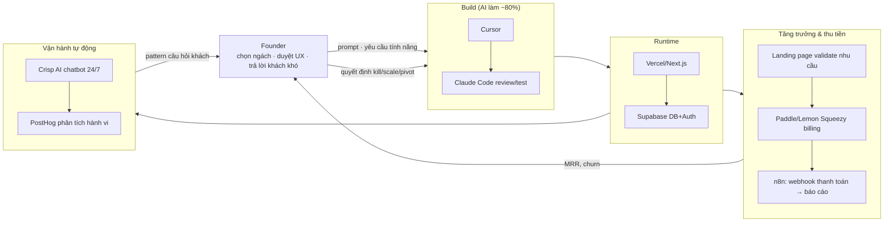

# Kế hoạch 10: Indie SaaS niche toàn cầu bằng vibe coding (OPC)

> Model phụ trách: Claude · Ngày: 2026-09-10 · Trạng thái: draft

## 1. Mô hình công ty (1 slide)

- **Founder:** 1 người, không nhất thiết biết code sâu — AI (Cursor + Claude Code) viết ~80% code, founder giữ vai trò "chọn hướng + định nghĩa nhu cầu + duyệt sản phẩm" (giống nguyên tắc 3 tầng ở mục B4 brief).
- **Sản phẩm:** không phải 1 SaaS lớn mà **2-3 SaaS ngách nhẹ chạy song song** (mẫu 景行): mỗi sản phẩm giải 1 vấn đề hẹp cho 1 nhóm khách cụ thể (VD: công cụ cho freelancer kế toán Mỹ, tool cho agency nhỏ quản lý báo giá, plugin niche cho Notion/Shopify).
- **Khách hàng:** SME/freelancer/solo-preneur toàn cầu (chủ yếu US/EU, thị trường sẵn sàng trả subscription thẻ tín dụng), trả **$9-49/tháng**.
- **Khác biệt:** không cạnh tranh tính năng với SaaS lớn — đánh vào ngách quá nhỏ để bigtech không thèm làm, nhưng đủ đau để khách trả tiền ngay tuần đầu.
- **Vì sao 1 người làm được:** chi phí biên gần 0 (code do AI viết, hạ tầng serverless trả theo dùng), không cần đội sales — kênh phân phối là content/SEO/cộng đồng, không cần văn phòng/nhân sự. Nếu sản phẩm sai nhu cầu, bỏ trong 2-4 tuần và chuyển hướng — không "chết chìm" với 1 ý tưởng.

## 2. Vì sao nó thắng ở Trung Quốc

**Case gốc: 景行 (泓链智能)** ✅ — 1 người chạy song song 3 sản phẩm nhẹ (báo cáo tư vấn lao động, app cảm xúc "愈见", app thành phố "MystiGo"); thu từ phí báo cáo + custom dev. Nguyên văn: *"AI là nhân viên 7×24; sai thì đổi sản phẩm trong vài tuần"*, nguyên tắc cốt lõi là **"tìm nhu cầu trước khi làm sản phẩm"** ([天下网商/界面 — 04/2026](https://m.jiemian.com/article/14193991.html)).

Bài học cụ thể để copy:
1. **Không code trước khi có tín hiệu nhu cầu** — 景行 xác nhận nhu cầu qua tư vấn/report trả phí trước, sau đó mới build sản phẩm hoá quy trình đó.
2. **Danh mục song song, không đặt cược 1 sản phẩm** — nếu 1 hướng không chạy, chi phí chuyển hướng gần 0 vì hạ tầng AI dùng chung (cùng 1 stack Cursor/Claude Code, cùng thói quen validate).
3. **AI xử lý phần lặp, người giữ phần phán đoán** — đúng nguyên tắc vàng #1 của brief (mục B4): "AI hoá triệt để → chuẩn hoá cục bộ → người giỏi nhất giữ phần lõi".
4. Bối cảnh rộng hơn ủng hộ mô hình này: **75% founder OPC Trung Quốc không có nền kỹ thuật** ✅ (báo cáo 鸿鹄汇, dẫn qua mục B1 brief) — vibe coding đã hạ rào cản kỹ thuật xuống gần 0, cho phép người không giỏi code vẫn ra sản phẩm thật.

## 3. Thị trường VN & US

### VN (founder ở đây, thị trường khách hàng KHÔNG nhất thiết ở VN)
- Founder Việt hiếm khi bán SaaS cho khách VN (thị trường SaaS B2C VN nhỏ, khách quen dùng miễn phí) — mô hình này **bán ra toàn cầu, thu USD**, VN chỉ là nơi founder sống và vận hành.
- Pháp lý: cách đơn giản nhất để bắt đầu là founder cá nhân + **hộ kinh doanh cá thể hoặc công ty TNHH một thành viên** (= OPC của VN theo Luật Doanh nghiệp, đã thẩm định ở mục B5 brief) để có tư cách xuất hoá đơn, kê khai thuế TNCN/TNDN khi có doanh thu ổn định. Chưa cần thành lập ngay tháng đầu — có thể vận hành cá nhân trong giai đoạn thử nghiệm (<3 tháng, doanh thu thấp), nhưng phải đăng ký khi có dòng tiền đều.
- Dữ liệu khách hàng (email, hành vi) thu thập từ user toàn cầu → vẫn áp Nghị định 13/2023/NĐ-CP (bảo vệ dữ liệu cá nhân) nếu công ty đặt tại VN xử lý dữ liệu người dùng VN; với khách EU cần tuân GDPR-style (privacy policy, DPA) dù không có pháp nhân EU.
- ⚠️ **Điểm khác biệt quan trọng VN vs US: Stripe KHÔNG hỗ trợ mở tài khoản merchant trực tiếp tại Việt Nam** (theo hiểu biết chung về danh sách quốc gia hỗ trợ của Stripe — cần founder tự xác nhận lại tại stripe.com/global trước khi triển khai, tôi không có link xác minh mới trong phiên này). Vì vậy founder VN có 2 đường: (a) **Merchant of Record (MoR)** như Paddle hoặc Lemon Squeezy — họ đứng tên bán hàng, tự lo thuế VAT/GST toàn cầu, founder chỉ nhận payout qua Wise/Payoneer, KHÔNG cần pháp nhân Mỹ; (b) **Stripe Atlas** — lập công ty Delaware (C-Corp/LLC) qua Stripe, có EIN, mở tài khoản Mercury, rồi dùng Stripe trực tiếp — kiểm soát phí thấp hơn nhưng phát sinh nghĩa vụ khai thuế Mỹ (franchise tax Delaware, có thể cần federal return) và overhead hành chính.
- **Khuyến nghị lộ trình:** Tháng 1-3 dùng Paddle/Lemon Squeezy (MoR) để validate nhanh, không tốn setup; khi có MRR ổn định (>$1.000-2.000/tháng) mới cân nhắc Stripe Atlas để giảm phí giao dịch dài hạn.

### US (thị trường khách hàng chính)
- Đây là thị trường SaaS trưởng thành nhất: khách quen trả thẻ tín dụng cho subscription, kỳ vọng self-serve (không cần sales gọi điện) — rất hợp với mô hình 1 người.
- Cạnh tranh: ngách càng hẹp càng ít đối thủ trực diện; rủi ro lớn nhất là big player (Notion, Shopify, Stripe...) tự làm tính năng tương tự — vì vậy chọn ngách mà nền tảng lớn không có động lực làm (quá nhỏ, quá đặc thù ngành).
- Tuân thủ: CCPA nếu có khách California + thu thập dữ liệu cá nhân ở quy mô đủ lớn (brief mục B5); sales tax US thường không áp cho SaaS B2B thuần túy ở nhiều bang nhưng cần kiểm tra theo bang khi doanh thu lớn (Stripe Tax/Paddle tự động xử lý nếu dùng MoR).
- **Cửa dễ vào trước:** ngách B2B nhỏ (freelancer, agency 1-5 người, chủ shop Shopify/Etsy nhỏ) — nhóm này đau vấn đề cụ thể, sẵn sàng trả $10-30/tháng để tiết kiệm vài giờ/tuần, và có thể tiếp cận qua Reddit/X/IndieHackers mà không cần ngân sách ads.

## 4. Tech stack & kiến trúc tự động hoá

| Công cụ | Vai trò | Chi phí/tháng (USD, ⚠️ tham khảo, kiểm tra lại giá hiện hành) |
|---|---|---|
| Cursor (AI IDE) | Viết ~80% code, autocomplete, refactor | ~$20/tháng (gói Pro) |
| Claude Code / Claude API | Code review, viết test, xử lý task phức tạp, debug | Trả theo token, ước ~$20-50/tháng giai đoạn đầu |
| Next.js + Vercel | Frontend + hosting, deploy tự động từ git | Free tier lúc validate → ~$20/tháng khi có traffic |
| Supabase | Postgres DB + Auth + storage, dùng chung boilerplate cho nhiều sản phẩm | Free tier lúc validate → ~$25/tháng/dự án khi scale |
| Paddle / Lemon Squeezy | Billing MoR (không cần pháp nhân Mỹ) | Không phí cố định, thu % trên mỗi giao dịch (họ tự lo thuế) |
| Resend / Postmark | Email transactional (welcome, invoice, dunning) | Free tier ~3.000 email/tháng → vài USD khi scale |
| PostHog (self-host free hoặc cloud free tier) | Analytics hành vi user, funnel | Free tier đủ cho SaaS nhỏ |
| Crisp / Intercom (AI chatbot) | "AI CSKH 24/7" trả lời support cơ bản, escalate khi khó | Free–$25/tháng |
| n8n (self-host) | Nối webhook Stripe/Paddle → Slack/email báo doanh thu, tự động onboarding | Free (self-host) hoặc ~$20/tháng cloud |
| Domain + DNS | Mỗi sản phẩm 1 domain riêng | ~$1-2/tháng/domain (tính theo năm) |

**Kiến trúc end-to-end:**

**Việc người làm:** đặt câu hỏi phỏng vấn khách hàng, viết prompt định nghĩa tính năng, duyệt UX/pricing, trả lời ticket support phức tạp, quyết định kill/scale.
**Việc AI làm:** viết code, viết test, viết landing page copy nháp, trả lời support cơ bản, tổng hợp báo cáo doanh thu/hành vi hằng tuần.

## 5. Vận hành ngày/tuần của founder

**Lịch tuần mẫu (founder chạy 2-3 sản phẩm song song):**
| Ngày | Việc chính |
|---|---|
| Thứ 2 | Đọc báo cáo AI tổng hợp cuối tuần (MRR, churn, ticket support tồn) cho từng sản phẩm; đặt 1-2 mục tiêu tuần/sản phẩm |
| Thứ 3-4 | Prompt Cursor/Claude Code build tính năng ưu tiên; review PR do AI tạo |
| Thứ 5 | Viết/duyệt content marketing (Reddit reply, X thread, blog SEO) — AI viết nháp, người chỉnh giọng văn thật |
| Thứ 6 | Trả lời ticket support khó (AI đã lọc ticket dễ); phỏng vấn nhanh 2-3 khách hàng qua email/Cal.com |
| Cuối tuần | Review chỉ số kill/scale (mục 9); nếu sản phẩm nào dưới ngưỡng 4 tuần liên tiếp → cân nhắc pivot |

**"Vị trí công việc AI" (chuẩn hoá theo mẫu 张顺 — 5 nhân viên AI có chức danh, mục B2 brief):**
1. **AI Builder** (Cursor + Claude Code): prompt "implement feature X theo spec Y, viết test, không phá schema hiện có".
2. **AI Support Agent** (Crisp AI + prompt FAQ sản phẩm): trả lời câu hỏi lặp lại, escalate câu lạ cho founder.
3. **AI Growth Writer**: viết bản nháp landing page, email onboarding, reply Reddit/X — founder luôn sửa lại giọng văn trước khi đăng.
4. **AI Analyst** (n8n + PostHog + prompt tổng hợp): mỗi thứ 2 gửi báo cáo MRR/churn/funnel dạng 5 dòng.

**Vòng lặp dữ liệu:** khách dùng sản phẩm → ticket support + hành vi (PostHog) → founder tổng hợp thành insight → prompt AI build tính năng mới → đo lại MRR/retention → lặp lại.

## 6. Mô hình doanh thu & chi phí

**Giả định (ước lượng, KHÔNG phải số đã kiểm chứng — dùng làm khung lập kế hoạch):** 1 sản phẩm niche, giá trung bình $20/tháng/khách, launch tháng 1, có content/SEO đều đặn.

| Tháng | Khách trả phí (kịch bản cơ bản) | MRR ước tính (USD) | Chi phí hạ tầng/tháng (USD) | Ghi chú |
|---|---|---|---|---|
| 1-2 | 0-5 | $0-100 | ~$50 (free tier phần lớn) | Giai đoạn validate, landing page + waitlist |
| 3-4 | 10-25 | $200-500 | ~$80 | Bắt đầu content/SEO, launch Product Hunt |
| 5-6 | 30-60 | $600-1.200 | ~$120 | Cân nhắc bật Stripe Atlas nếu ổn định |

**3 kịch bản tháng 6:**
- **Tệ:** <10 khách trả phí, MRR <$200 → tín hiệu kill (mục 9).
- **Cơ bản:** 30-60 khách, MRR $600-1.200 → đủ sống tối thiểu ở VN (chi phí sinh hoạt VN thấp hơn US nhiều), tiếp tục đầu tư.
- **Tốt:** >100 khách, MRR >$2.000 → cân nhắc scale (thêm sản phẩm thứ 2-3 song song, hoặc thuê VA/support part-time).

**Điểm hoà vốn:** với chi phí hạ tầng ~$100-150/tháng, cần ~6-8 khách trả $20/tháng là hoà vốn công cụ — ngưỡng rất thấp, đúng bản chất "chi phí biên gần 0" của mô hình.

**Ngân sách 6 tháng đầu (vốn khởi điểm, USD):**
| Hạng mục | Ước tính |
|---|---|
| Cursor + Claude Code (6 tháng) | ~$250-400 |
| Hosting/DB (Vercel+Supabase, tăng dần) | ~$300-500 |
| Domain (2-3 sản phẩm) | ~$50 |
| Công cụ support/analytics/email | ~$100-200 |
| Dự phòng Stripe Atlas (nếu kích hoạt tháng 5-6) | ~$500 một lần + ~$400-500/năm duy trì (⚠️ phí Delaware franchise tax + registered agent, cần xác minh lại số hiện hành) |
| Dự phòng/marketing nhỏ (Product Hunt, ads test) | ~$200-300 |
| **Tổng** | **~$1.400-2.450** — nằm trong ngưỡng ≤3.000 USD của brief |

## 7. Lộ trình start-from-scratch

**Giai đoạn 0-30 ngày — Validate, không code trước:**
1. Ngày 1: chọn 3-5 ngách ứng viên (ghi ra pain point cụ thể, không phải "ý tưởng hay").
2. Ngày 2-5: phỏng vấn 10-15 người trong ngách qua Reddit/X/LinkedIn (miễn phí, chỉ tốn thời gian).
3. Ngày 6-10: dựng landing page bằng AI (Cursor/Claude Code hoặc Framer) cho 1-2 ngách có tín hiệu mạnh nhất, gắn form waitlist.
4. Ngày 10-20: chạy landing page, đo tỷ lệ đăng ký waitlist/lượt xem; mục tiêu >15% là tín hiệu tốt.
5. Ngày 20-25: nếu có tín hiệu, mở tài khoản Lemon Squeezy/Paddle (miễn phí, không cần pháp nhân) để nhận thanh toán sớm — kể cả trước khi sản phẩm hoàn chỉnh (pre-sell).
6. Ngày 25-30: setup Supabase + Vercel project từ boilerplate dùng chung; prompt AI build MVP tối giản (1 tính năng lõi duy nhất).

**Giai đoạn 30-60 ngày — Build MVP & AI worker đầu tiên:**
1. Build tính năng lõi bằng Cursor/Claude Code, launch cho waitlist (không public rộng).
2. Setup AI Support Agent (Crisp + FAQ prompt) ngay từ ngày đầu có user thật.
3. Setup n8n nối Paddle webhook → báo cáo doanh thu tự động.
4. Thu feedback trực tiếp từ 10-20 người dùng đầu, ưu tiên sửa churn-driver trước feature mới.
5. Viết 2-3 bài content SEO/Reddit dựa trên câu hỏi thật của user.

**Giai đoạn 60-90 ngày — Mở kênh & chuẩn hoá:**
1. Launch Product Hunt / Hacker News "Show HN" nếu sản phẩm đã ổn định.
2. Thêm AI Growth Writer vào vòng lặp content hàng tuần.
3. Đánh giá theo KPI kill/scale (mục 9); nếu sản phẩm 1 yếu, bắt đầu song song sản phẩm 2 dùng chung boilerplate.
4. Nếu MRR vượt $500-1.000 ổn định 2 tháng, cân nhắc đăng ký hộ kinh doanh/TNHH MTV tại VN để hợp thức hoá thu nhập.

**Giai đoạn 90-180 ngày — Scale danh mục:**
1. Chạy song song 2-3 sản phẩm, mỗi sản phẩm 1 AI worker set riêng nhưng dùng chung hạ tầng lõi.
2. Nếu 1 sản phẩm MRR >$2.000, cân nhắc Stripe Atlas để giảm phí giao dịch dài hạn và mở đường nhận đầu tư nếu muốn.
3. Đánh giá thuê VA part-time (support/content) cho sản phẩm mạnh nhất — bước đầu OPC → STC (mục B4 nguyên tắc #10).
4. Kill các sản phẩm dưới ngưỡng, tái đầu tư thời gian/vốn vào sản phẩm thắng.

## 8. Rủi ro & phòng thủ

1. **Thị trường:** chọn sai ngách (quá nhỏ không đủ sống, hoặc quá lớn bị bigtech nhảy vào) → phòng thủ: validate bằng pre-sell thật (tiền vào ví) trước khi build sâu, không tin waitlist email suông.
2. **Nền tảng thanh toán:** Stripe không hỗ trợ VN trực tiếp, tài khoản MoR (Paddle/Lemon Squeezy) có thể khoá nếu nghi gian lận/chargeback cao → phòng thủ: giữ chargeback rate thấp, đọc kỹ ToS, có kênh dự phòng (2 MoR khác nhau cho 2 sản phẩm).
3. **Pháp lý:** thu nhập USD về VN không khai báo đúng → rủi ro thuế; dữ liệu khách EU/US vi phạm GDPR/CCPA nếu không có privacy policy → phòng thủ: đăng ký hộ kinh doanh/TNHH MTV khi có doanh thu đều, dùng template privacy policy chuẩn ngay từ đầu.
4. **Công nghệ:** phụ thuộc 1 AI coding tool (Cursor) hoặc 1 model — nếu tăng giá/ngừng dịch vụ → phòng thủ: giữ code sạch, dễ đọc để chuyển sang Claude Code/Windsurf/Copilot khác; không khoá cứng vào 1 vendor DB/hosting (Supabase/Vercel đều dùng chuẩn Postgres/Next.js, dễ migrate).
5. **Cá nhân:** làm 2-3 sản phẩm song song dễ phân tán, burnout, hoặc không sản phẩm nào đủ sâu để thắng → phòng thủ: giới hạn cứng tối đa 3 sản phẩm cùng lúc, áp dụng ngưỡng kill nghiêm túc (mục 9), không giữ sản phẩm "vì tiếc công".
6. **Cạnh tranh AI hoá đồng loạt:** vibe coding hạ rào cản cho tất cả mọi người, ngách dễ copy nhanh hơn trước → phòng thủ: giữ lợi thế ở hiểu khách hàng sâu + tốc độ phản hồi, không phải ở code (dễ bị sao chép).

## 9. KPI & tiêu chí kill/scale

**KPI chính (theo dõi hàng tuần/tháng):**
1. MRR (Monthly Recurring Revenue) theo từng sản phẩm.
2. Tỷ lệ chuyển đổi landing page → trial/khách trả phí.
3. Churn rate tháng (mục tiêu <5-7%/tháng cho SaaS niche B2B nhỏ).
4. Thời gian founder dành cho support thủ công (mục tiêu giảm dần nhờ AI Support Agent).
5. Số câu hỏi khách lặp lại AI chưa trả lời được (đo độ trưởng thành AI worker).

**Ngưỡng KILL (dừng/đổi hướng):**
- Sau 4 tuần chạy landing page mà tỷ lệ waitlist <5% VÀ không ai đồng ý pre-pay → dừng, không build MVP.
- Sau 8 tuần có MVP mà MRR = $0 hoặc <5 khách dùng thử tích cực → pivot ngách hoặc dừng hẳn.
- Churn >15%/tháng liên tục 2 tháng không cải thiện được sau khi đã sửa → xem lại product-market fit, có thể kill.

**Ngưỡng SCALE (tuyển người, tiến tới STC):**
- MRR >$2.000-3.000 ổn định 2 tháng liên tiếp cho 1 sản phẩm → tuyển VA/support part-time.
- Founder dành >50% thời gian cho 1 sản phẩm thắng → cân nhắc dừng sản phẩm khác để dồn lực, đúng tinh thần "OPC là khởi điểm, STC là đích" (mục B4 nguyên tắc #10).

## 10. Nguồn tham khảo

- Case 景行 (泓链智能) — [天下网商/界面, 04/2026](https://m.jiemian.com/article/14193991.html) — dẫn qua master playbook mục 3.1, đã ✅ thẩm định độc lập.
- Case 张顺, 5 nhân viên AI — [南国都市报, 07/2026](http://szb.ngdsb.cn/h5/html5/2026-07/23/content_58867_19728456.htm) — dẫn qua master playbook, mẫu "vị trí công việc AI".
- Bối cảnh "75% founder OPC không có nền kỹ thuật" — báo cáo 鸿鹄汇 2026, dẫn qua brief mục B1 (chưa có link gốc trong tài liệu gốc).
- Stack OPC developer (Cursor/Claude Code/FastAPI/Postgres) — [CSDN OPC社区, 02/2026](https://opc.csdn.net/69845eefa16c6648a9877cea.html) — dẫn qua master playbook mục 7.1.
- Bản đồ công cụ VN/US (TikTok Shop, Stripe/Wise, LLC, Nghị định 13/2023, CCPA) — brief mục B5, đã thẩm định.

**⚠️ Hạn chế của báo cáo này:** trong phiên làm việc này, công cụ `WebSearch`/`WebFetch` bị chặn ở tầng môi trường ("don't ask mode"), nên KHÔNG thể xác minh trực tuyến các claim sau (đã dùng kiến thức nền, không có link mới): giá gói hiện hành của Cursor/Vercel/Supabase/Paddle/Lemon Squeezy, danh sách quốc gia Stripe hỗ trợ, phí Stripe Atlas + Delaware franchise tax hiện hành, case study MRR indie hacker 2025-2026 cụ thể. **Cần xác minh lại các mục có ⚠️ trước khi dùng để ra quyết định tài chính.**

## 11. Câu hỏi mở

1. Danh sách quốc gia Stripe hỗ trợ merchant trực tiếp có còn loại trừ Việt Nam không (2026) — cần kiểm tra tại nguồn chính thức khi có quyền truy cập web.
2. Phí Stripe Atlas + duy trì công ty Delaware (franchise tax, registered agent) hiện hành bao nhiêu USD/năm.
3. Ngưỡng doanh thu cụ thể để bắt buộc phải đăng ký hộ kinh doanh/TNHH MTV tại VN (theo luật thuế TNCN hiện hành) là bao nhiêu.
4. Có case study indie hacker Việt Nam cụ thể nào đã chạy mô hình này thành công để tham chiếu thực tế hơn không (ngoài case Trung Quốc 景行)?
5. Founder nên ưu tiên ngách nào trước (dev tools, agency tools, hay content tools) nếu chưa có kinh nghiệm ngành cụ thể?

## 12. Xác minh bổ sung (verify-pass, 10/09/2026)

- **Stripe KHÔNG hỗ trợ merchant đăng ký tại Việt Nam (2026):** Stripe chỉ hỗ trợ trực tiếp ~46 quốc gia; Việt Nam nằm trong danh sách "unsupported" — doanh nghiệp đăng ký tại VN không mở được tài khoản Stripe bản địa ([USLLCGlobal — Countries Where Stripe Isn't Available, cập nhật 06/2026](https://usllcglobal.com/guides/countries-where-stripe-not-available), truy cập 10/09/2026). ⚠️ Đây là nguồn bên thứ ba; trang stripe.com/global không fetch được nội dung (JS) — nên xác nhận lại trực tiếp trên trang Stripe trước khi triển khai. Hai đường trong plan (MoR Paddle/Lemon Squeezy, hoặc Stripe Atlas + pháp nhân Mỹ) là đúng hướng.
- **Stripe Atlas (giá xác minh 08/2026 trên trang chính thức):** phí một lần $500 (đã gồm phí nộp hồ sơ bang Delaware); năm đầu đã gồm registered agent, từ năm 2 trả $100/năm; thành lập được cả Delaware C-Corp lẫn LLC; kèm EIN, giấy tờ phát hành cổ phần founder, nộp 83(b), $2.500 Stripe credits + $50.000+ partner discounts ([Rho — Doola vs Stripe Atlas 2026](https://www.rho.co/blog/doola-vs-stripe-atlas), truy cập 10/09/2026).
- **Duy trì công ty Delaware/năm:** LLC: franchise tax $300/năm (flat, hạn 01/06) + registered agent $50–150/năm (qua Atlas $100/năm) → tổng ≈ $350–400/năm; LLC không cần nộp annual report. C-Corp tối thiểu: annual report $50 + franchise tax tối thiểu $175 = $225/năm (với <5.000 cổ phiếu authorised; cao hơn nhiều nếu tính theo Assumed Par Value) ([UpCounsel — Delaware LLC Annual Fees, cập nhật 05/2025](https://www.upcounsel.com/delaware-annual-franchise-tax), truy cập 10/09/2026). ⚠️ Delaware đã sửa biểu phí ngày 01/08/2026 (ghi chú của Rho) — cần kiểm tra lại số hiện hành trước khi dùng; ước lượng "~$400–500/năm duy trì" ở mục 6 của plan là hợp lý với LLC.
- **Case indie hacker VN bán SaaS quốc tế — Tony Dinh (xác minh):** Tony Dinh (@tdinh_me), solo developer người Việt (TP.HCM), 0 nhân viên, chạy song song 3 sản phẩm: TypingMind ~$33K/tháng + Xnapper ~$6K + DevUtils ~$5,5K ≈ **$45K MRR/tháng**; vượt $1M doanh thu trọn đời tháng 11/2024; trước đó bán Black Magic $128K (05/2023) sau khi Twitter API thay đổi giá; thanh toán qua Stripe/Gumroad/Lemon Squeezy ([Tycoon profile, cập nhật 17/04/2026](https://tycoon.us/one-person-company/tony-dinh), truy cập 10/09/2026). ⚠️ Nguồn bên thứ ba tổng hợp — đối chiếu thêm newsletter công khai news.tonydinh.com nếu cần số chính thức.
- ⚠️ **Vẫn chưa xác minh được:** ngưỡng doanh thu bắt buộc đăng ký hộ kinh doanh/TNHH MTV tại VN theo luật thuế TNCN hiện hành (không tìm được văn bản quy định ngưỡng cụ thể — tham vấn kế toán); danh sách 46 nước của Stripe từ chính stripe.com/global (trang JS không fetch được).
- ❓ Câu hỏi chỉ con người/khảo sát trực tiếp giải được (giữ nguyên ở mục 11): chọn ngách ưu tiên trước (câu 5); xác nhận nghĩa vụ thuế thu nhập từ nước ngoài với kế toán VN (liên quan câu 3).
