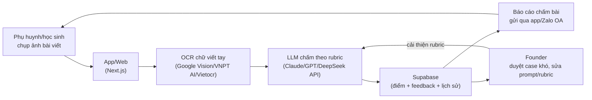

# Kế hoạch 11: Công cụ AI chấm bài văn/essay (OPC)

> Model phụ trách: Claude · Ngày: 2026-09-10 · Trạng thái: draft

> ⚠️ **Ghi chú giới hạn nghiên cứu (đọc trước khi dùng file này):** Trong phiên viết kế hoạch này, công cụ `WebSearch`, `WebFetch` và các MCP tra cứu (kể cả `openseo`) bị hệ thống từ chối quyền truy cập ("don't ask mode" tự động deny, không có người để xin phê duyệt). Do đó **4 lượt web-search theo brief KHÔNG thực hiện được**. Toàn bộ nội dung dưới đây dùng: (a) kiến thức đã thẩm định trong brief/master playbook (đánh dấu ✅ theo nguồn gốc của brief), (b) kiến thức nền về các sản phẩm/công nghệ có thật nhưng **chưa xác minh lại số liệu/giá/tính năng trong phiên này** (đánh dấu ⚠️ + ghi rõ "cần verify"). Không có số liệu thị trường định lượng nào được bịa ra — những chỗ cần số liệu định lượng mà không xác minh được, file này để trống và liệt kê thành câu hỏi mở (mục 11). **Trước khi dùng file này để ra quyết định tài chính, cần chạy lại bước deep-research với quyền web-search đầy đủ.**

## 1. Mô hình công ty (1 slide)

- **Khách hàng:** (a) phụ huynh có con cấp 2–3 tại VN cần chấm/sửa bài văn (Ngữ văn thi vào 10, thi THPTQG) và bài luận tiếng Anh; (b) học viên luyện thi IELTS/TOEFL Writing tại VN và thị trường US/quốc tế (non-native speakers) cần feedback nhanh, rẻ hơn gia sư người.
- **Bán gì:** app/web — chụp ảnh bài viết tay hoặc paste text → AI chấm điểm theo rubric (thang điểm 10 Bộ GD VN hoặc band descriptor IELTS 0–9) → chỉ lỗi cụ thể (chính tả, ngữ pháp, bố cục, luận điểm) → gợi ý sửa → lưu tiến độ theo thời gian cho từng học sinh.
- **Khác biệt:** chấm theo **rubric nội địa hoá** (bám khung điểm chính thức VN hoặc band descriptor IELTS thật) thay vì chỉ sửa ngữ pháp chung chung kiểu Grammarly; có OCR chữ viết tay — khâu mà công cụ quốc tế phổ biến thường không tối ưu cho học sinh VN viết tay.
- **Vì sao 1 người làm được:** lõi sản phẩm là prompt/rubric engineering + pipeline OCR→LLM, không cần đội ngũ giáo viên chấm thủ công; theo case gốc, AI viết ~80% code, founder giữ vai trò chiến lược gia + PM + người kiểm định chất lượng chấm.

## 2. Vì sao nó thắng ở Trung Quốc

- ✅ Case **李云帆 / "作文说"** (brief mục B2, nguồn gốc 光明网/人民日报海外版, 08/2026): chụp ảnh bài văn tay → AI sinh báo cáo chấm điểm, **15.000 người dùng**; AI làm ~80% việc code; founder đang mở rộng sang "枢机AI督学" (giám sát học tập AI).
- **Bài học cụ thể để copy:**
  1. **OCR chữ viết tay là rào cản kỹ thuật chính, giải quyết 1 lần → tái dùng vô hạn lần** — đây là lợi thế công nghệ thực sự (không phải chỉ là wrapper LLM mỏng).
  2. **Sản phẩm 1 tính năng cốt lõi** (chụp → chấm → báo cáo) dễ hiểu, dễ demo, dễ viral truyền miệng trong nhóm phụ huynh — đúng nguyên tắc "ngách dọc, trải nghiệm cực đoan trong 1 workflow hẹp" (brief mục B4 #3).
  3. Thị trường phụ huynh TQ vốn chi rất mạnh cho luyện thi dù có chính sách "giảm tải" (双减) — hàm ý: nhu cầu chấm bài/luyện thi là nhu cầu bền, không phụ thuộc chu kỳ kinh tế ngắn hạn (⚠️ suy luận từ brief, chưa có số liệu chi tiêu định lượng verify trong phiên này).

## 3. Thị trường VN & US

### VN
- **Nhu cầu:** kỳ thi vào 10 (môn Ngữ văn), thi THPTQG, viết luận tiếng Anh xin học bổng/du học — đều có khâu chấm bài luận cần feedback lặp lại nhiều lần, gia sư người tốn kém và không sẵn 24/7.
- **Đối thủ:** trung tâm luyện thi truyền thống, gia sư online, các app học tiếng Anh tổng quát (Elsa, Prep — brief mục B5 nhắc tới Elsa). ⚠️ Chưa xác định được đối thủ AI-native chuyên chấm văn/luận tiếng Việt cụ thể trong phiên này — cần search riêng trước khi launch để tránh đụng sản phẩm đã có.
- **Quy định:** người dùng là **trẻ vị thành niên** → áp dụng Nghị định 13/2023/NĐ-CP (bảo vệ dữ liệu cá nhân) ở mức nghiêm ngặt hơn bình thường vì liên quan dữ liệu trẻ em; cần có cơ chế phụ huynh đồng ý (consent) khi thu thập ảnh bài viết/thông tin học sinh.
- **Kênh vào:** Zalo OA (phụ huynh VN dùng Zalo nhiều hơn các app chat khác), nhóm Facebook phụ huynh theo trường/khu vực, TikTok content "mẹo viết văn điểm cao".

### US
- **Nhu cầu:** IELTS/TOEFL Writing prep cho non-native, và chấm essay cho học sinh bản ngữ (school essay feedback).
- **Đối thủ:** thị trường AI-writing-feedback ở US đã có nhiều tên tuổi lớn hơn nhiều so với ngách tiếng Việt — ví dụ Grammarly, Turnitin, các công cụ luyện IELTS AI (Writing9, IELTS Podium là các tên tôi biết từ kiến thức nền, ⚠️ **chưa xác minh giá/tính năng/quy mô hiện tại trong phiên này**, cần verify lại trước khi định vị cạnh tranh).
- **Quy định:** COPPA (nếu có người dùng <13 tuổi, nghiêm ngặt hơn CCPA nhiều — cấm thu thập dữ liệu trẻ em nếu không có consent phụ huynh xác thực); FERPA nếu bán trực tiếp cho trường học/giáo viên (hồ sơ học sinh là dữ liệu được bảo vệ liên bang); CCPA nếu có user California trưởng thành.
- **Đánh giá cửa vào:** **VN dễ vào trước** — ít đối thủ AI-native tiếng Việt, chi phí thu hút khách qua Zalo/Facebook group thấp, founder hiểu rubric giáo dục VN. US là **giai đoạn mở rộng 2** (tháng 4-6 trở đi), tập trung ngách hẹp hơn (IELTS Writing cho người Việt luyện thi ra nước ngoài, không đối đầu trực diện Grammarly/Turnitin toàn thị trường).

## 4. Tech stack & kiến trúc tự động hoá

| Công cụ | Vai trò | Chi phí/tháng (ước tính ⚠️) |
|---|---|---|
| OCR chữ viết tay: Google Cloud Vision API (handwriting) hoặc VNPT AI OCR / FPT.AI OCR / Vietocr (open-source, GitHub `pbcquoc/vietocr`) | Nhận diện chữ viết tay tiếng Việt từ ảnh chụp | Pay-per-call, ước ~0,001–0,01 USD/ảnh tuỳ API ⚠️ cần verify giá thật |
| LLM chấm bài: Claude API / GPT API / DeepSeek API | Chấm theo rubric + sinh feedback | Theo token, ước vài trăm nghìn VND/tháng ở quy mô vài trăm bài/ngày ⚠️ |
| Web/app: Next.js (web) hoặc Flutter (mobile), build bằng Cursor/Claude Code | Giao diện chụp ảnh, xem báo cáo, lịch sử tiến bộ | Công cụ code $20–30/tháng (Cursor Pro/Claude Code) |
| Database: Supabase (Postgres + Auth + Storage) | Lưu bài viết, điểm, tiến độ học sinh | Free tier → $25/tháng khi scale |
| Zalo OA (VN) / Email (US) | Giao diện chăm sóc khách hàng, gửi báo cáo | Zalo OA có gói miễn phí cơ bản |
| Thanh toán: MoMo/VNPay (VN), Stripe (US) | Thu phí subscription | Phí giao dịch % theo giao dịch |
| n8n (self-host) | Nối OCR → LLM → lưu DB → gửi báo cáo tự động | Free (self-host) hoặc VPS ~$5–10/tháng |

- **Người làm:** thiết kế rubric ban đầu (cần cố vấn giáo viên thật để rubric đúng chuẩn), duyệt case AI chấm sai/gây tranh cãi, quyết định giá, chăm sóc phụ huynh khó tính.
- **AI làm:** OCR, chấm điểm hàng loạt, sinh feedback, trả lời câu hỏi thường gặp, viết content marketing.

## 5. Vận hành ngày/tuần của founder

**Lịch tuần mẫu:**
- Thứ 2–4: duyệt 10–20 bài AI chấm có điểm tin cậy thấp (model tự đánh dấu "cần người xem lại"), tinh chỉnh prompt/rubric.
- Thứ 5: trả lời phụ huynh qua Zalo OA, xử lý khiếu nại điểm.
- Thứ 6: viết/duyệt content marketing (blog SEO "cách chấm điểm văn thi vào 10", TikTok mẹo viết).
- Cuối tuần: xem báo cáo KPI tự động (số bài chấm, % hài lòng, MRR), lên kế hoạch tuần sau.

**"Vị trí công việc AI":**
| Chức danh | Prompt chính | Công cụ |
|---|---|---|
| AI OCR Operator | "Trích xuất chính xác văn bản tiếng Việt viết tay từ ảnh, giữ nguyên lỗi chính tả gốc" | Google Vision/Vietocr |
| AI Grader | "Chấm bài theo rubric [X], chỉ ra lỗi cụ thể kèm vị trí, cho điểm + giải thích" | Claude/GPT API |
| AI CSKH | "Trả lời câu hỏi phụ huynh về cách dùng app, cách đọc báo cáo" | Zalo OA bot |
| AI Content | "Viết bài blog/TikTok script về mẹo viết văn theo chủ đề tuần" | Claude/GPT API |

**Vòng lặp dữ liệu:** bài chấm → phụ huynh phản hồi đúng/sai → founder gắn nhãn case sai → dùng làm ví dụ few-shot cải thiện prompt → độ chính xác tăng dần (đúng nguyên tắc "sản phẩm → dữ liệu → AI → sản phẩm", brief mục B4 #7).

## 6. Mô hình doanh thu & chi phí

> ⚠️ Toàn bộ số trong bảng là **giả định lập kế hoạch**, chưa verify bằng nghiên cứu giá thị trường thực tế (do bị chặn web-search phiên này). Phải test giá thật với 20–30 khách hàng đầu trước khi tin số này.

| Tháng | Doanh thu (VND, giả định) | Chi phí (VND, giả định) | Ghi chú |
|---|---|---|---|
| 1–2 | 0 | ~15.000.000 (đăng ký KD + API test + ads thử nghiệm) | MVP, chấm miễn phí cho 20–30 gia đình lấy feedback |
| 3–4 | 3.000.000–8.000.000 (giả sử 30–80 học sinh × 99.000 VND/tháng) | 5.000.000 | Bắt đầu thu phí, vẫn nhỏ |
| 5–6 | 10.000.000–25.000.000 (100–250 học sinh) | 6.000.000–8.000.000 | Nếu retention tốt, mở rộng qua nhóm Facebook |

**3 kịch bản tháng 6:**
- **Tệ:** <50 học sinh trả phí, doanh thu <5.000.000 VND/tháng → chưa đủ sống, cần đánh giá lại rubric/giá/kênh.
- **Cơ bản:** 100–150 học sinh × 79.000–99.000 VND/tháng ≈ 8–15 triệu VND/tháng.
- **Tốt:** 300+ học sinh, mở thêm gói IELTS (giả định 200.000–300.000 VND/tháng/học viên IELTS do giá trị cao hơn) → 30–50 triệu VND/tháng, đủ điều kiện tính chuyện thuê giáo viên review bán thời gian.

**Vốn khởi điểm (≤3.000 USD theo yêu cầu):** ~2.000–2.500 USD cho 6 tháng đầu — gồm công cụ code/API (~600 USD), đăng ký hộ kinh doanh/công ty + phí kế toán tối thiểu (~200 USD), ads test (~500–800 USD), buffer OCR/LLM API scale (~500 USD), cố vấn giáo viên (thù lao nhỏ theo giờ, ~300 USD). Không cần thuê văn phòng/nhân sự cố định.

## 7. Lộ trình start-from-scratch

**Ngày 0–30 — MVP + rubric:**
1. Ngày 1: đăng ký hộ kinh doanh cá thể hoặc công ty TNHH MTV (nếu định thu qua công ty để xuất hoá đơn điện tử cho phụ huynh/trường), qua Sở KH&ĐT/cổng dịch vụ công, mất 1–3 ngày làm việc.
2. Ngày 2–5: liên hệ 1–2 giáo viên Ngữ văn/tiếng Anh làm cố vấn thiết kế rubric ban đầu (thù lao nhỏ hoặc đổi bằng cổ phần cố vấn).
3. Ngày 5–15: build MVP (app chụp ảnh → OCR → LLM chấm → hiển thị điểm) bằng Cursor/Claude Code; test OCR với 20–30 mẫu chữ viết tay học sinh thật.
4. Ngày 15–25: mời 20–30 gia đình dùng thử miễn phí, thu feedback độ chính xác chấm.
5. Ngày 25–30: mở Zalo OA, chuẩn bị nội dung marketing đầu tiên.
6. Mốc hoàn thành: MVP chạy ổn định, có ≥20 bài chấm test, tỷ lệ phụ huynh đồng ý "điểm AI gần đúng với giáo viên" >70% (tự đo, benchmark thô).

**Ngày 30–60 — Thu phí thật đầu tiên:**
1. Set giá thử nghiệm (2–3 mức), mở bán cho nhóm test đã dùng miễn phí.
2. Nối thanh toán MoMo/VNPay.
3. Tự động hoá báo cáo (n8n: OCR→LLM→lưu→gửi).
4. Content marketing tuần 2 bài (blog SEO + TikTok).
5. Thu thập case AI chấm sai → sửa prompt.
6. Mốc hoàn thành: ≥30 học sinh trả phí, retention tháng 2 >50%.

**Ngày 60–90 — Tối ưu & mở ngách IELTS:**
1. Thêm rubric IELTS Writing task 1/2 (band descriptor chính thức).
2. Test giá riêng cho gói IELTS.
3. Đánh giá lại chi phí OCR/LLM theo quy mô thật, tối ưu batch để giảm giá.
4. Xây trang landing riêng cho IELTS (khác trang phụ huynh cấp 2–3).
5. Mốc hoàn thành: có ≥10 khách IELTS trả phí, chi phí API/khách <30% doanh thu/khách.

**Ngày 90–180 — Scale kênh & cân nhắc US:**
1. Mở rộng kênh (Facebook Ads nhắm phụ huynh theo khu vực/trường).
2. Đánh giá case study thật (trước/sau điểm số) làm bằng chứng marketing.
3. Tính chuyện thuê CTV giáo viên bán thời gian review case khó.
4. Nếu MRR ổn định >30 triệu VND/tháng, khảo sát thị trường US thật (chạy lại deep-research có web-search) trước khi launch bản US.
5. Mốc hoàn thành: MRR ổn định 3 tháng liên tiếp không giảm, có ≥1 báo cáo case study công khai được.

## 8. Rủi ro & phòng thủ

1. **OCR chữ viết tay sai nhiều** (học sinh viết xấu, chữ Việt có dấu phức tạp) → luôn có nút "sửa tay văn bản OCR trước khi chấm"; không tự động 100%.
2. **AI chấm sai/lệch chuẩn giáo viên thật** → mất uy tín, phụ huynh khiếu nại → luôn ghi rõ disclaimer "điểm AI mang tính tham khảo, không thay thế giáo viên/giám khảo chính thức"; có cố vấn giáo viên review định kỳ.
3. **Pháp lý dữ liệu trẻ em** (VN: Nghị định 13/2023; US: COPPA) → thu thập tối thiểu dữ liệu, xin consent phụ huynh rõ ràng, không lưu ảnh gốc lâu hơn cần thiết.
4. **Phụ thuộc 1 nhà cung cấp LLM/OCR** → giá tăng đột ngột hoặc đổi chính sách → dùng gateway đa model (OpenRouter kiểu brief mục B3) để dễ chuyển đổi.
5. **Cạnh tranh từ bigtech** (Google/OpenAI có thể tích hợp chấm bài miễn phí vào sản phẩm chính, ví dụ Google Classroom) → giữ lợi thế ngách hẹp (rubric VN nội địa hoá + OCR chữ viết tay tối ưu tiếng Việt) thay vì cạnh tranh tính năng chung chung.
6. **Founder không phải giáo viên chuyên môn** → rubric sai chuẩn → bắt buộc có cố vấn giáo viên thật trước khi launch, không tự chế rubric một mình.

## 9. KPI & tiêu chí kill/scale

- **KPI chính:** số học sinh trả phí; retention tháng 2 (%); NPS/độ hài lòng phụ huynh; % bài "AI tự tin thấp cần người xem lại"; MRR.
- **Ngưỡng KILL:** sau 90 ngày có <30 học sinh trả phí HOẶC retention tháng 2 <30% HOẶC phụ huynh phản hồi "điểm AI sai nhiều" >30% case → dừng, xem lại rubric/OCR hoặc đổi hướng ngách khác.
- **Ngưỡng SCALE:** MRR ổn định >30 triệu VND/tháng trong 3 tháng liên tiếp → thuê CTV giáo viên review bán thời gian, cân nhắc mở gói IELTS/US chính thức (OPC → STC theo brief mục B4 #10).

## 10. Nguồn tham khảo

- Brief chung: `plans/260910-opc-20-models/00-brief-va-template.md` (mục B2 — case 李云帆/作文说, mục B5 — bản đồ công cụ VN/US, mục B6 — cảnh báo pháp lý).
- Master playbook: `plans/reports/260910-1118-opc-china-master-playbook.md` (mục 3.1, 9, 10).
- ⚠️ Các tên sản phẩm nhắc tới ngoài brief (Google Cloud Vision, VNPT AI, FPT.AI, Vietocr, Grammarly, Turnitin, Writing9, IELTS Podium) là sản phẩm có thật theo kiến thức nền của model, **chưa có link/số liệu xác minh trong phiên này** do WebSearch/WebFetch/MCP bị chặn quyền. Cần chạy lại nghiên cứu có web-search trước khi dùng các tên này trong tài liệu bán hàng/so sánh cạnh tranh chính thức.

## 11. Câu hỏi mở

1. Quy mô thị trường AI essay/writing grading toàn cầu và mức giá phổ biến (Turnitin/Grammarly/CoGrader...) — cần web-search xác minh.
2. Mức chi tiêu thực tế của phụ huynh VN cho app/dịch vụ luyện thi Văn/tiếng Anh (VND/tháng) — chưa có số liệu verify.
3. Giá và độ chính xác thực tế của các công cụ AI chấm IELTS Writing hiện có (Writing9, IELTS Podium, hoặc tên khác) — chưa verify.
4. Độ chính xác thực tế của OCR chữ viết tay tiếng Việt (Google Vision/VNPT AI/FPT.AI/Vietocr) trên chữ viết học sinh thật — cần test thực nghiệm, không chỉ tra cứu.
5. Rủi ro pháp lý cụ thể khi AI "chấm điểm" ảnh hưởng quyết định học tập trẻ em — có cần giấy phép/đăng ký gì đặc biệt ở VN không (ngoài Nghị định 13/2023)?

## 12. Xác minh bổ sung (verify-pass, 10/09/2026)

- **Quy mô thị trường automated essay scoring:** ~$1,3 tỷ USD (2025) → dự báo ~$3,4 tỷ USD (2033), CAGR 15,2%; khu vực tăng trưởng cao nhất là Asia-Pacific; North America giữ thị phần lớn nhất; các tên lớn: Pearson, ETS, Turnitin, Cognii, Vantage Learning, Grammarly ([HTF Market Intelligence, cập nhật 04/05/2026](https://www.htfmarketintelligence.com/report/global-automated-essay-scoring-software-market), truy cập 10/09/2026). Ước lượng khác: phân khúc AI assessment & grading ~$2,4 tỷ USD, CAGR 28,5%, tiềm năng MRR $12–50K cho sản phẩm ngách ([PlanMySaaS — AI Essay Grading Assistant](https://www.planmysaas.com/ideas/edtech-saas-ideas/ai-essay-grading-assistant), truy cập 10/09/2026).
- **Giá benchmark chấm essay cho giáo viên — CoGrader:** Free 100 bài nộp/tháng; Standard $15/tháng (thanh toán năm, $19 theo tháng); gói Schools & Districts theo báo giá; 100.000+ giáo viên tại 16.000+ trường; tích hợp Google Classroom/Canvas/Schoology; tuân thủ FERPA/COPPA/SOPIPA ([RightAIChoice — CoGrader, verify 31/08/2026](https://rightaichoice.com/tools/cograder) + [cograder.com/pricing](https://cograder.com/pricing/), truy cập 10/09/2026). Lưu ý cạnh tranh: CoGrader cũng chấm bài VIẾT TAY qua ảnh (photo upload) — giả định "OCR chữ viết tay là rào cản ít ai làm" của plan cần xem lại.
- **Giá công cụ AI chấm IELTS Writing:** Grammarly Premium từ $12/tháng (không chuyên IELTS); LanguageTool Premium từ $4,99/tháng; Writing9: free + gói trả phí (một số gói có hoàn tiền); LexiBot: free + gói trả phí (độ lệch ±0,5–1,0 band); UpScore.ai: theo bài/gói, 60% điểm trong ±0,5 band so với IELTS thật; IELTS Writing Pro: $5,99 (3 ngày) → $59,99 (3 tháng); Engnovate: free + Premium ([BandWriteCoach — IELTS Writing Tools Comparison, 18/09/2025](https://bandwritecoach.com/blog/ielts-writing-tools-comparison-which-one-actually-helps-you-), truy cập 10/09/2026). ⚠️ IELTS Podium không xuất hiện trong so sánh 2025/2026 — khả năng đã ngừng hoạt động hoặc quá ngách, không nên dùng làm benchmark.
- ⚠️ **Vẫn chưa xác minh được:** giá chi tiết gói trả phí Writing9/LexiBot (trang chính thức không fetch được số); mức chi tiêu thực tế của phụ huynh VN cho app luyện thi (chưa có khảo sát công khai); độ chính xác OCR chữ viết tay tiếng Việt (bản chất phải test thực nghiệm — câu 4 mục 11).
- ❓ Câu hỏi chỉ con người/khảo sát trực tiếp giải được (giữ nguyên ở mục 11): rủi ro pháp lý khi AI "chấm điểm" ảnh hưởng trẻ em tại VN — cần luật sư/cơ quan chuyên môn xác nhận (câu 5); mốc "điểm AI gần đúng giáo viên >70%" cần giáo viên thật chấm đối chiếu.
