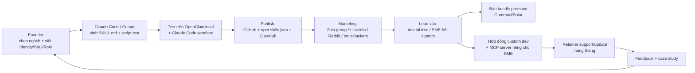

# Kế hoạch 12: Xưởng skill/plugin/MCP cho AI agent (OPC)

> Model phụ trách: Claude · Ngày: 2026-09-10 · Trạng thái: draft
> ⚠️ Lưu ý phương pháp: phiên làm việc này bị chặn `WebSearch`/`WebFetch` (môi trường "don't ask mode", đã thử cả gọi trực tiếp lẫn qua subagent — đều bị từ chối). Toàn bộ claim dưới đây lấy từ **mục B của brief** + 2 báo cáo đã thẩm định (`260910-1118-opc-china-master-playbook.md`, `260910-1119-openclaw-opc-agentos-deep-dive.md`), không có vòng deep-research bổ sung nào được thực hiện. Chỗ nào cần số liệu mới (giá MCP marketplace ngoài hệ OpenClaw, mức giá skill pack thị trường) đã đánh dấu ⚠️ và đưa vào mục 11.

## 1. Mô hình công ty (1 slide)

- **Khách hàng:** (a) dev/agent-builder cá nhân dùng Claude Code/Cursor/OpenClaw/n8n — mua skill pack lẻ giá rẻ; (b) SME (kế toán dịch vụ, agency TMĐT, agency marketing AI) — thuê đóng skill/MCP server riêng theo nghiệp vụ VN.
- **Bán gì:** gói **skill pack** chuẩn `SKILL.md` (Markdown + YAML frontmatter, tương thích Claude Code/Cursor/OpenClaw) và **MCP server** nhỏ (API kế toán, hoá đơn điện tử, Zalo OA, TikTok Shop VN…) — đóng gói theo ngành dọc, không làm "mọi thứ cho mọi agent".
- **Khác biệt:** copy mô hình `opc-skills-cn` (25 skills cho nghiệp vụ TQ: WeChat/Xiaohongshu/thuế/ICP…) nhưng làm **bản Việt hoá** (`opc-skills-vn`: Zalo OA, TikTok Shop VN, hoá đơn điện tử, Nghị định 13/2023) — thị trường ngách này hiện chưa ai làm bằng tiếng Việt.
- **Vì sao 1 người làm được:** mỗi skill = 1 file Markdown + script nhỏ, không cần hạ tầng; dùng chính AI (Claude Code/Cursor) để sinh code/test hàng loạt skill; kênh phân phối có sẵn miễn phí (GitHub, npm, ClawHub) — không cần tự xây marketplace.

## 2. Vì sao nó thắng ở Trung Quốc

- **✅ Luận điểm nền tảng — 周鸿祎 (360):** *"mọi phần mềm sẽ được xây lại theo tư duy agent"* → làm API/MCP/skill phục vụ agent là điểm khởi nghiệp tốt nhất hiện tại ([环球时报/新浪财经](https://finance.sina.cn/2026-03-31/detail-inhsvmyh9204120.d.html)). Đây là luận cứ trực tiếp cho mô hình này.
- **✅ Case đã tồn tại thật:** [`himeai/opc-skills-cn`](https://github.com/himeai/opc-skills-cn) — 25 skills vận hành OPC TQ (traffic WeChat公众号/Xiaohongshu/Douyin/Bilibili/Zhihu, thanh toán WeChat Pay V3/Alipay OpenAPI, e-invoice, thuế, ICP备案, tuyển dụng, gọi vốn…), Apache-2.0, tuân chuẩn `SKILL.md` + YAML frontmatter + `skills.json` registry, phân phối qua `npx skills add` cho 16+ AI tool (claude/cursor/codex/opencode). Là bản "China edition" của [`ReScienceLab/opc-skills`](https://github.com/ReScienceLab/opc-skills) — tức đã có **template gốc quốc tế để copy sang bản Việt**. Quy mô nhỏ (10 sao, 2 fork) — chứng tỏ đây vẫn là sân chơi sớm, chưa bão hoà.
- **✅ Hạ tầng phân phối có sẵn, miễn phí:** OpenClaw (389.324 sao GitHub, 81.817 fork — số thật kiểm bằng GitHub API) có hệ **Skills** chính thức: mỗi skill = thư mục chứa `SKILL.md` (frontmatter field `name` quyết định tên/slash command) + body; thứ tự nạp ưu tiên workspace → `.agents/skills/` → `~/.agents/skills/` → managed dir → workshop → bundled → plugin ([docs.openclaw.ai/tools/skills](https://docs.openclaw.ai/tools/skills)). Phân phối qua **ClawHub** ([clawhub.ai](https://clawhub.ai)) và **Skill Workshop** (agent tự soạn, người duyệt) — tức có sẵn 389k-sao cộng đồng làm "cầu" mà không cần tự tạo audience.
- **✅ Bigtech đang đóng gói sẵn hạ tầng để OPC cắm skill vào:** Alibaba OPC 创业装备库 (ra mắt 20/05/2026) bán gói Starter ¥158–362/năm gồm server + Token Plan Qwen + **image OpenClaw cài sẵn** ([阿里云开发者社区](https://developer.aliyun.com/article/1753572)) — nghĩa là hàng nghìn OPC TQ sẽ cần skill "cắm là chạy" ngay khi mở gói này.
- **Bài học cụ thể để copy:** (1) đóng skill theo **định dạng chuẩn** (`SKILL.md` + YAML) để tương thích nhiều agent runtime cùng lúc, không tự chế định dạng riêng; (2) publish **miễn phí trên GitHub/ClawHub trước** để lấy uy tín + feedback, tiền thật đến từ **hợp đồng custom** cho SME chứ không phải bán từng file (opc-skills-cn free, chỉ 10 sao — chứng minh bán file lẻ không phải mô hình thu tiền chính); (3) chọn ngách nghiệp vụ địa phương mà bigtech quốc tế không làm (thuế/hoá đơn VN, giống opc-skills-cn làm ICP备案/WeChat Pay mà Anthropic/OpenAI không làm).

## 3. Thị trường VN & US

**VN:**
- Chưa có skill pack tiếng Việt cho nghiệp vụ VN nào được xác minh trong 2 báo cáo (⚠️ chưa search để loại trừ hoàn toàn — xem mục 11). Ngách rõ: Zalo OA ops, TikTok Shop VN ops, Shopee ops, hoá đơn điện tử (Thông tư 78), thuế TNCN/TNDN, tuân thủ Nghị định 13/2023/NĐ-CP (bảo vệ dữ liệu cá nhân) — đều là bản đồ đã thẩm định ở brief B5.
- Khách hàng: agency AI/automation VN đang dùng n8n/Dify/Coze quốc tế cho khách SME; dev cá nhân xây bot Zalo/CSKH; kế toán dịch vụ muốn agent hoá.
- Cửa dễ vào: **bán MCP server nhỏ tích hợp hoá đơn điện tử/Zalo OA cho agency AI VN** — họ cần nhưng không muốn tự viết, và đây là kiến thức nghiệp vụ (không phải công nghệ khó).

**US:**
- Cạnh tranh cao hơn: ClawHub + kho skill GitHub tiếng Anh đã đông; MCP là chuẩn mở của Anthropic nên ai cũng viết được server MCP miễn phí → khó bán "generic skill" cho dev Mỹ.
- Cửa dễ hơn: bán **dịch vụ custom skill/MCP development** cho SME Mỹ nhỏ (không phải bán sản phẩm đóng gói) — ví dụ tích hợp QuickBooks/Shopify/HubSpot vào agent nội bộ của họ, tính phí dự án qua Stripe/Upwork.
- **Đánh giá:** VN nên là thị trường khởi động (ít đối thủ, founder hiểu luật/ngôn ngữ) — US là mở rộng giai đoạn sau khi đã có case study VN để chứng minh năng lực.

## 4. Tech stack & kiến trúc tự động hoá

| Công cụ | Vai trò | Chi phí/tháng |
|---|---|---|
| GitHub | Lưu trữ + phân phối skill pack (public repo) | $0 |
| npm registry | Đóng gói `skills.json`, phân phối qua `npx skills add` (chuẩn opc-skills-cn/ReScienceLab) | $0 |
| ClawHub ([clawhub.ai](https://clawhub.ai)) | Marketplace skill cộng đồng OpenClaw — kênh phát hiện chính | $0 publish (mô hình thu phí cho creator ⚠️ chưa xác minh — xem mục 11) |
| OpenClaw (local, BYOK) | Cài để tự test/demo skill trước khi bán; cài chính thức `curl -fsSL https://openclaw.ai/install.sh \| bash` | $0 phần mềm + API model |
| Claude Code / Cursor | Công cụ chính sinh `SKILL.md` + script test hàng loạt | ~$20/tháng (Cursor Pro) hoặc theo gói Claude Code |
| DeepSeek / Claude API | Chạy & test agent khi làm demo cho khách | ~10–50 USD/tháng tuỳ usage |
| n8n (self-host VPS nhỏ) | Dựng demo MCP server/automation cho khách xem trước khi ký hợp đồng | ~5–10 USD/tháng VPS |
| Gumroad / Polar.sh | Bán bundle premium (nhiều skill đóng gói theo ngành) | $0 list, % phí giao dịch (kiểm tra chính sách hiện tại trước khi dùng — chưa xác minh phiên này) |
| Stripe / VNPay / MoMo | Thu tiền khách US / VN | % giao dịch chuẩn thị trường |
| Notion/Airtable | Catalog skill + CRM khách hàng | $0 (free tier) |
| Zalo OA + nhóm Facebook/LinkedIn dev | Marketing + support | $0 |

**Người làm / AI làm:** người chọn ngách, viết đặc tả nghiệp vụ (Identity/Soul/Role của skill), duyệt output cuối, đàm phán hợp đồng custom. AI (Claude Code/Cursor) sinh code + test hàng loạt, viết docs, viết post marketing nháp, trả lời FAQ khách qua bot.

## 5. Vận hành ngày/tuần của founder

**Lịch tuần mẫu:**
- T2: đọc feedback/issues GitHub, nghiên cứu nhu cầu ngách mới (nhóm dev, agency AI).
- T3–T4: dùng AI code 1–2 skill mới hoặc mở rộng MCP server.
- T5: test trên OpenClaw/Claude Code, publish (GitHub + npm + ClawHub).
- T6: marketing (đăng nhóm Zalo/LinkedIn/Reddit) + outreach khách custom.
- T7: support khách hiện tại, fix bug, viết case study/demo video ngắn.
- CN: học chuẩn mới (SKILL.md/MCP cập nhật — OpenClaw ra bản mới ~hàng tuần).

**"Vị trí công việc AI":**

| Chức danh | Prompt chính | Công cụ |
|---|---|---|
| AI Skill Coder | "Viết SKILL.md chuẩn YAML frontmatter (name/description) cho tác vụ X + script test kèm theo" | Claude Code/Cursor |
| AI QA Tester | "Chạy skill này trên OpenClaw sandbox, liệt kê edge case lỗi" | OpenClaw local |
| AI Content/Marketing | "Viết post giới thiệu skill Y cho nhóm dev VN, giọng thẳng, có demo" | Claude/ChatGPT |
| AI Support Bot | "Trả lời câu hỏi khách dùng skill qua Zalo OA/Discord theo FAQ đã học" | Zalo OA bot + Coze/Dify |

**Vòng lặp dữ liệu:** skill free → tải nhiều trên GitHub/ClawHub → issues/feedback → cải tiến → uy tín tăng → SME liên hệ hỏi custom → doanh thu hợp đồng → tái đầu tư thời gian vào ngách đang có traction nhất.

## 6. Mô hình doanh thu & chi phí

**Nguồn thu:** (1) bundle premium (5–10 skill/ngành) bán qua Gumroad/Polar; (2) hợp đồng custom skill/MCP server cho SME; (3) retainer support/update hàng tháng. Free skill trên GitHub/ClawHub là kênh lấy lead, không phải nguồn thu.

| Tháng | Doanh thu (kịch bản cơ bản, USD) | Chi phí phần mềm (USD) | Ghi chú |
|---|---|---|---|
| 1–2 | 0 | ~30–60 | Viết + publish free skill, chưa có khách |
| 3–4 | 100–300 | ~40–70 | Bundle đầu tiên bán được vài đơn (~20 USD/đơn) |
| 5–6 | 300–800 | ~50–80 | 1–2 hợp đồng custom SME (300–500 USD/hợp đồng) |
| 7–9 | 800–2.000 | ~60–100 | 2–3 khách custom + 2–3 retainer (50–100 USD/tháng/khách) |
| 10–12 | 1.500–4.000 | ~80–150 | Retainer ổn định + custom lớn hơn (500–1.500 USD/hợp đồng) |

**3 kịch bản (tháng 12, MRR):**
- Tệ: <300 USD/tháng — chỉ vài lead free, không chốt được hợp đồng custom → cần đổi ngách.
- Cơ bản: 800–1.500 USD/tháng — 3–5 retainer + custom rải rác.
- Tốt: >3.000 USD/tháng — trở thành nhà cung cấp skill/MCP quen của 1–2 agency AI VN, có case study lặp lại.

**Điểm hoà vốn:** chi phí vận hành thấp (~50–150 USD/tháng phần mềm), hoà vốn ngay khi có 1–2 hợp đồng custom nhỏ hoặc 3 retainer 50 USD/tháng — không cần vốn lớn ban đầu.

## 7. Lộ trình start-from-scratch

**Ngày 0–30 — Chọn ngách & ra skill đầu tiên:**
1. Ngày 1: cài OpenClaw chính thức (`curl -fsSL https://openclaw.ai/install.sh | bash` macOS/Linux, hoặc `iwr -useb https://openclaw.ai/install.ps1 | iex` Windows) — chỉ cài từ `openclaw.ai`/GitHub Releases chính thức, **không** làm theo tutorial yêu cầu tắt antivirus. Chi phí: $0.
2. Ngày 1–2: đăng ký GitHub (free), đăng ký API DeepSeek hoặc Claude (vài USD nạp trước) để có model chạy thử.
3. Ngày 2–3: chọn 1 ngách dọc duy nhất (đề xuất: hoá đơn điện tử + thuế hộ kinh doanh VN, vì nhu cầu thật + chưa ai làm bằng tiếng Việt).
4. Ngày 3–10: đọc chuẩn `SKILL.md` ([docs.openclaw.ai/tools/skills](https://docs.openclaw.ai/tools/skills)) + tham khảo cấu trúc `opc-skills-cn` để nắm khung 25-skill mẫu; dùng Claude Code/Cursor viết 3–5 skill đầu (ví dụ: `vn-invoice-lookup`, `vn-tax-calendar`, `zalo-oa-ops`).
5. Ngày 10–20: test từng skill trên OpenClaw local; sửa lỗi.
6. Ngày 20–25: publish free lên GitHub (repo `opc-skills-vn`) + đăng ký package npm dạng `skills.json` (theo mẫu opc-skills-cn) + đăng lên ClawHub.
7. Ngày 25–30: đăng giới thiệu trong 2–3 nhóm Facebook/Zalo dev VN + LinkedIn cá nhân; chưa cần đăng ký công ty — bán dưới tên cá nhân/Gumroad.

**Ngày 30–60 — Bundle & khách custom đầu tiên:**
1. Đóng gói bundle 5–10 skill thành 1 gói premium, đăng Gumroad/Polar (~15–30 USD/gói).
2. Viết 1 case study demo (video ngắn: skill chạy thật trên OpenClaw).
3. Outreach trực tiếp 10–15 agency AI/automation VN qua LinkedIn/Zalo — chào custom MCP server.
4. Chốt 1–2 hợp đồng custom nhỏ (300–500 USD) hoặc retainer đầu tiên.
5. Nếu có ≥1 khách trả tiền (tiêu chí như Ninh Ba ✅) → tiếp tục; nếu không → xem lại ngách.

**Ngày 60–90 — Mở rộng bộ skill & pháp lý:**
1. Hoàn thiện `opc-skills-vn` lên 10+ skill (thêm TikTok Shop VN ops, Shopee ops).
2. Đăng ký hộ kinh doanh cá thể hoặc TNHH MTV (khi cần xuất hoá đơn cho khách B2B VN) — TNHH MTV là dạng OPC hợp pháp tại VN theo Luật Doanh nghiệp (brief B5).
3. Rà soát skill nào xử lý dữ liệu cá nhân → bổ sung điều khoản tuân thủ Nghị định 13/2023/NĐ-CP.
4. Tìm 1 đối tác agency để white-label bán lại skill pack.

**Ngày 90–180 — Scale & tính đường US:**
1. Xây 1 MCP server thật (không chỉ Markdown skill) cho 1 khách lớn — nâng giá trị hợp đồng.
2. Nếu MRR ổn định >1.500 USD/tháng 2 tháng liên tiếp: cân nhắc dịch bộ skill sang tiếng Anh, thử đăng Gumroad/IndieHackers cho thị trường US.
3. Đánh giá tuyển 1 dev phụ part-time nếu backlog custom vượt khả năng 1 người (OPC → STC theo mẫu 张小博 ✅).

## 8. Rủi ro & phòng thủ

1. **Thị trường:** skill/plugin thường bị coi là hàng miễn phí (opc-skills-cn free, chỉ 10 sao) → khó bán file lẻ. *Phòng thủ:* thu tiền qua hợp đồng custom + retainer, không phụ thuộc bán bundle.
2. **Nền tảng:** phụ thuộc ClawHub/npm/GitHub để phân phối — chính sách/khả năng gỡ nằm ngoài tầm kiểm soát. *Phòng thủ:* đa kênh (GitHub + npm + Gumroad + website riêng), giữ danh sách khách trực tiếp (không chỉ qua marketplace).
3. **Pháp lý:** skill xử lý dữ liệu thuế/hoá đơn/cá nhân phải tuân Nghị định 13/2023/NĐ-CP; bán cho US cần cẩn trọng không tự nhận là "tư vấn pháp lý/thuế chính thức". *Phòng thủ:* ghi rõ disclaimer, khuyến nghị khách xác minh với kế toán/luật sư.
4. **Công nghệ:** chuẩn `SKILL.md`/MCP còn thay đổi nhanh (OpenClaw ra bản mới ~hàng tuần) — skill viết hôm nay có thể lỗi thời. *Phòng thủ:* theo dõi `docs.openclaw.ai` + changelog MCP, đặt lịch rà soát skill mỗi quý.
5. **Bảo mật/uy tín:** case `opc-agentos` (⚠️ repo không khai báo, 1 sao, license thiếu) cho thấy rủi ro supply-chain khi khách cài code không rõ nguồn — nếu skill của mình có bug bảo mật, mất uy tín nhanh. *Phòng thủ:* mọi skill public đều có license rõ ràng (MIT/Apache-2.0), CI test tối thiểu, không nhúng bí mật/API key mẫu.
6. **Cá nhân:** founder một mình vừa code vừa bán hàng dễ quá tải khi có nhiều hợp đồng custom song song. *Phòng thủ:* giới hạn số hợp đồng custom đồng thời (≤2), ưu tiên retainer lặp lại hơn dự án một lần.

## 9. KPI & tiêu chí kill/scale

- **KPI chính:** số skill đã publish; số lượt tải/install (GitHub+npm+ClawHub); số khách custom đã ký; MRR từ retainer; thời gian trung bình hoàn thành 1 skill mới.
- **Ngưỡng KILL:** sau 90 ngày không có **bất kỳ khách trả tiền nào** (dù custom hay bundle) dù đã publish ≥5 skill free và outreach ≥15 lead → đổi ngách hoặc chuyển sang mô hình khác (VD: agency automation thuần — kế hoạch 14).
- **Ngưỡng SCALE:** MRR (retainer + custom đều đặn) ổn định >1.500–2.000 USD/tháng trong 3 tháng liên tiếp → tuyển 1 dev phụ part-time, bắt đầu chuyển từ OPC sang STC nhỏ (mẫu 张小博: OPC → 60 người, quy mô nhỏ hơn nhiều nhưng cùng logic ✅).

## 10. Nguồn tham khảo

- 周鸿祎 — "mọi phần mềm xây lại theo agent, làm API/MCP/skill là điểm khởi nghiệp tốt nhất" — [环球时报/新浪财经, 2026-03-31](https://finance.sina.cn/2026-03-31/detail-inhsvmyh9204120.d.html) (đọc qua master playbook, 2026-09-10).
- `himeai/opc-skills-cn` — [GitHub repo](https://github.com/himeai/opc-skills-cn) (25 skills, Apache-2.0) — dữ liệu từ deep-dive report 2026-09-10; gốc quốc tế: [`ReScienceLab/opc-skills`](https://github.com/ReScienceLab/opc-skills).
- OpenClaw Skills — [docs.openclaw.ai/tools/skills](https://docs.openclaw.ai/tools/skills); ClawHub — [clawhub.ai](https://clawhub.ai); repo chính — [github.com/openclaw/openclaw](https://github.com/openclaw/openclaw) (389.324 sao, kiểm bằng GitHub API 2026-09-10).
- Alibaba Cloud OPC 创业装备库 — [阿里云开发者社区, 2026-08](https://developer.aliyun.com/article/1753572).
- opc-agentos (case rủi ro supply-chain, tham khảo) — [npm registry](https://registry.npmjs.org/opc-agentos), repo suy luận [Zhimacoder/OPC_AgentOS](https://github.com/Zhimacoder/OPC_AgentOS).
- 张小博/仓颉智能 (OPC → 60 người) — dẫn qua master playbook từ [光明网/人民日报海外版, 2026-08](https://m.gmw.cn/2026-08/10/content_1304545694.htm).
- Ninh Ba tiêu chí "≥1 khách trả tiền" — master playbook mục 2.
- Nghị định 13/2023/NĐ-CP, TNHH MTV = OPC VN — brief mục B5 (đã thẩm định, dùng trực tiếp).
- Ngày truy cập tất cả nguồn trên: 2026-09-10 (qua 2 báo cáo nội bộ, không có fetch trực tiếp mới trong phiên này).

## 11. Câu hỏi mở

1. ClawHub có cơ chế trả phí cho người tạo skill (revenue share) hay chỉ là kho miễn phí thuần cộng đồng? Chưa xác minh — cần đọc trực tiếp `clawhub.ai` khi có quyền web.
2. Ngoài hệ OpenClaw/Claude, các "MCP server marketplace" độc lập nào đang hoạt động ở quy mô lớn 2026 (Anthropic MCP registry chính thức, Smithery, mcp.so...) và mô hình thu phí của họ ra sao? Chưa search được trong phiên này.
3. Mức giá thị trường thực tế cho 1 skill pack/MCP server custom (US và VN) — số trong mục 6 là ước lượng suy luận từ bối cảnh chung, chưa có benchmark thật.
4. Có agency/freelancer VN nào đã bán skill/MCP server chưa (để tránh trùng lặp hoàn toàn)? Chưa kiểm tra được.
5. Gumroad/Polar.sh có còn là kênh tối ưu 2026 cho micro-digital-product, và mức phí giao dịch hiện tại là bao nhiêu? Cần xác minh trước khi chọn.

## 12. Xác minh bổ sung (verify-pass, 10/09/2026)

- **ClawHub — cơ chế trả phí cho creator:** hiện KHÔNG có hệ thống thanh toán/payout chính thức tích hợp. Dữ liệu 04/2026: 700+ skills, 52,7k tools, 180k user, 12M lượt tải; GitHub issue #1752 (01/2026) hỏi về bán skill trả phí — chưa có phản hồi chính thức; tỷ lệ chiết khấu marketplace (nếu có) chưa công bố. Skill trả phí tồn tại KHÔNG chính thức ở mức $10–200/skill; doanh thu tham chiếu của skill dọc chất lượng $100–1.000/tháng (nguồn blog bên thứ ba, độ tin cậy trung bình); các đường thu tiền thực tế: GitHub Sponsors/Gumroad/Patreon, custom dev $500–2.000/dự án, setup $200–500, retainer $50–200/tháng ([ClawHub Monetization Report, one2agi/openclaw-moling](https://github.com/one2agi/openclaw-moling/blob/main/clawhub-monetization-report.md) + [clawhub.ai](https://clawhub.ai), truy cập 10/09/2026). → Kết luận cho plan: ClawHub là kênh discovery, thu tiền qua kênh ngoài — đúng giả định mục 2/6 của plan.
- **MCP marketplace 2026 & mô hình thu phí:** rất ít nền tảng cho phép bán: **MCP Marketplace** chia 85/15 (creator/nền tảng) qua Stripe Connect + license keys (SDK Python/TS); **Apify MCP** 80/20; còn lại là thư mục miễn phí, KHÔNG có monetization: mcp.so, Smithery, PulseMCP, Glama và Anthropic Connectors (registry chính thức) ([MCP Marketplace — State of MCP Monetization 2026, 03/03/2026](https://mcp-marketplace.io/blog/state-of-mcp-monetization-2026), truy cập 10/09/2026). Biến động 2026: Smithery đã được Arcade.dev mua lại ([smithery.ai/pricing](https://smithery.ai/pricing), truy cập 10/09/2026). Mô hình giá phổ biến: one-time $5–25; subscription $5–50/tháng; freemium.
- **Phí Gumroad (2026):** 10% + $0,50/giao dịch (đã gồm xử lý thanh toán; MoR từ 01/2025 nên lo luôn thuế VAT/GST); bán qua chợ Discover: 30% cho khách mới tìm thấy qua Discover; không hoàn phí khi refund; payout quốc tế qua PayPal thêm ~2–3% + spread FX 1–2% ([Dodo Payments — Gumroad Fees 2026, 12/03/2026](https://dodopayments.com/blogs/gumroad-fees-explained), truy cập 10/09/2026).
- **Phí Polar.sh (2026):** từ 20/05/2026 có 3 gói trả phí: Starter $0 — 5% + $0,50; Pro $20/tháng — 3,8% + $0,40; Growth $100/tháng — 3,6% + $0,35; Scale $400/tháng — 3,4% + $0,30 (cộng phí thẻ quốc tế/payout/dispute); tổ chức tạo trước 27/05/2026 giữ giá cũ 4% + $0,40 + 0,5% subscription ([Polar — Introducing Polar Plans, 20/05/2026](https://polar.sh/blog/introducing-polar-plans), truy cập 10/09/2026). → Ở doanh thu nhỏ (dưới ~$1.379/tháng), Polar Starter (5% + $0,50) rẻ hơn Gumroad (10% + $0,50).
- ⚠️ **Vẫn chưa xác minh được:** tỷ lệ chiết khấu chính thức của ClawHub khi (nếu) ra mắt paid feature; có agency/freelancer VN nào đã bán skill/MCP chưa (không tìm thấy listing công khai — cần hỏi trực tiếp cộng đồng dev VN); chính sách mới của Smithery sau khi về Arcade.dev (trang pricing không hiển thị nội dung chi tiết).
- ❓ Câu hỏi chỉ con người/khảo sát trực tiếp giải được (giữ nguyên ở mục 11): mức giá thực tế MCP server custom tại VN — cần chào thử giá với agency (câu 3); xác nhận đối thủ VN (câu 4).
