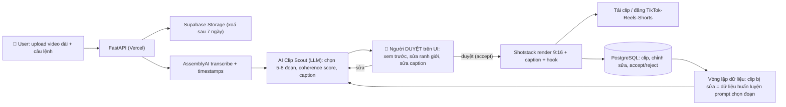

# Kế hoạch 13: Phần mềm dựng video AI niche — "Cắt bằng một câu nói" (OPC)

> Model phụ trách: Codex · Ngày: 2026-09-10 · Trạng thái: draft

## 1. Mô hình công ty (1 slide)

- **Khách hàng:** podcaster, coach, creator khóa học, chủ kênh YouTube tiếng Anh (US/English là thị trường đầu tiên) — người có video dài 30–120 phút mỗi tuần và cần 3–10 clip dọc 9:16 mỗi tuần cho TikTok/Reels/Shorts.
- **Bán gì:** SaaS thuê bao $19/$49/$99/tháng. Người dùng upload video dài, gõ câu lệnh bằng ngôn ngữ tự nhiên ("cắt đoạn nói về pricing từ phút 12, 40 giây, giọng mạnh"), AI transcribe → chọn đoạn → người duyệt 30 giây trên UI → render clip dọc có caption theo brand kênh.
- **Khác biệt:** (1) command-first — cắt bằng câu nói, không kéo timeline; (2) human-in-the-loop — AI đề xuất + coherence score, người duyệt trước khi render (sửa thẳng lỗi "AI cắt sai ngữ cảnh" của Munch/Opus Clip); (3) render ra clip "đăng được ngay" (9:16 + caption cháy chữ + hook) — không phải raw cut.
- **Vì sao 1 người làm được:** toàn bộ pipeline là API bên ngoài (transcription → LLM chọn đoạn → Shotstack render), founder chỉ viết lớp web mỏng + prompt hệ thống. Không cần GPU, không cần nhân viên, không cần văn phòng. Founder kỹ thuật (mẫu 构序科技) là moat của riêng mô hình này.

## 2. Vì sao nó thắng ở Trung Quốc

- **✅ Case gốc — 构序科技 "AiXcut"** ([新民晚报/上观新闻, 27/04/2026](https://www.shobserver.cn/journal/getMobileArticle.htm?id=506601)): 29 tuổi (ĐH Khoa Kỹ Trung Quốc, cựu Intel) lập đội 7 người tại 张江科学之门 (Thượng Hải), làm đúng sản phẩm **"dùng một câu lệnh cắt một bộ phim"**. Khách đầu: cơ quan cắt clip livestream (直播切片) cho Douyin/Xiaohongshu. Kết quả xác minh: editor thủ công làm 7–8 clip/ngày → dùng AiXcut **15 phút/clip** (vài lần tinh chỉnh prompt + hậu kỳ nhẹ). Thắng cuộc thi "创在上海", gọi được vòng đầu vài triệu NDT, đang gọi vòng 2; đội mở rộng lên 9 người.
- **Bài học copy cụ thể:** (a) **không đối đầu 剪映/CapCut** ở "dựng video tổng quát", chỉ làm sâu 1 workflow "video dài → clip ngắn"; (b) **con người giữ prompt, logic, thẩm mỹ** — "AI không thay người, chỉ gánh việc bẩn"; (c) **tìm nhu cầu trước**: họ bán cho机构 đang thuê editor cắt clip hằng ngày — nhu cầu đã tồn tại và trả tiền sẵn; (d) **quality-first, từ chối batch-clip** khi chất lượng từng clip chưa ổn — đúng nguyên tắc "đi chưa vững thì đừng chạy".
- Nhu cầu tương đương ở US: "podcast/coach → clip ngắn" — thị trường đã được xác nhận bởi Munch, Opus Clip, Descript nhưng các tool này auto-publish mà thiếu bước người duyệt (Munch tự nhận ~25–30% clip cần sửa lại, xem mục 3). Khe hở chính là "AI đề xuất + người duyệt + câu lệnh".

## 3. Thị trường VN & US

**US (cửa vào trước — thị trường doanh thu):**
- Đối thủ trực tiếp (giá 2026, đã xác minh): **Munch** Pro $49/tháng/200 phút upload, Elite $116/500 phút ([review 2026](https://www.nemovideo.com/blog/what-is-munch-ai-review-2026)); **Descript** Creator $24–35/user/tháng, Business $50–65 ([phân tích giá 2026](https://sonix.ai/resources/descript-pricing/)); Opus Clip (credit-based) ⚠️ chưa xác minh trang giá chính thức; **CapCut Pro** ~$10/tháng ⚠️ (chưa xác minh). Khe hở: Munch/Descript đắt cho solo podcaster và **cắt sai ngữ cảnh 25–30%** vì không có bước duyệt — đây là chỗ chúng ta chèn $19 + "duyệt trước khi render".
- Quy định US: DMCA (clip từ chính video của người dùng nên rủi ro bản quyền thấp; vẫn cần ToS + DMCA policy); CCPA khi có user California; sales tax toàn cầu — **Paddle (MoR) lo hết** nếu bán từ VN; Stripe thuận tiện khi đã có LLC US.
- Quy mô tham chiếu: thị trường Mỹ 85,8% doanh nghiệp nhỏ là one-person ✅ (master playbook mục 1) — khách tiềm năng chính là các coach/creator một người này.

**VN (design partner + QA, không phải thị trường doanh thu giai đoạn đầu):**
- Podcast/coach VN trả phí thấp và thị trường nhỏ → chỉ dùng 5–10 khách beta miễn phí người Việt để **QA tiếng Việt** (transcription tiếng Việt, caption có dấu) và phản biện UX. VN cũng là nguồn nhân sự rẻ khi scale (editor/QA part-time).
- Pháp lý VN khi bán qua Paddle: cần công ty TNHH MTV (tức OPC kiểu VN) để ký hợp đồng MoR; Nghị định 13/2023/NĐ-CP nếu xử lý dữ liệu cá nhân khách VN; hoá đơn điện tử (TT 78).
- **Đánh giá:** vào US trước bằng Paddle từ VN (không cần LLC, không cần bay sang Mỹ); mở LLC + Stripe khi MRR > $1.000 (xem mục 7).

## 4. Tech stack & kiến trúc tự động hoá

| Công cụ | Vai trò | Chi phí/tháng |
|---|---|---|
| AssemblyAI (Universal-3.5 Pro) | Transcription + word-level timestamps | $0,21/giờ audio, pay-as-you-go ✅ ([pricing](https://www.assemblyai.com/pricing)) |
| Whisper local (fallback) | Transcription dự phòng khi API lỗi | $0 (máy founder chạy đêm) |
| Claude / GPT-4o-mini / DeepSeek qua OpenRouter | "Clip Scout": chọn đoạn, coherence score, viết caption/hook | ~$5–15 (MVP) |
| Shotstack (subscription) | Render 9:16 + caption, 1080p | $39/tháng = 200 phút ($0,20/phút) ✅ ([pricing](https://shotstack.io/pricing/)) |
| FFmpeg trên VPS (fallback) | Render thủ công khi cần rẻ hơn/khi Shotstack lỗi | $0 phần mềm; VPS $5–10 nếu dùng |
| Next.js + Tailwind (Vercel) | Web app upload/duyệt/tải | $0–20 (free tier → Pro) |
| Supabase (PostgreSQL + Auth + Storage) | DB, đăng nhập, lưu video tạm | $0–25 |
| Paddle Billing (MoR) | Thanh toán $19/$49/$99, thuế toàn cầu | 5% + $0,50/giao dịch, thực tế ~6,9% kể cả FX ✅ ([phân tích 2026](https://dodopayments.com/blogs/paddle-fees-explained)) |
| n8n (free self-host) + Telegram/Slack | "QA Reporter": tối thứ 6 tổng KPI gửi founder | $0 |
| Sentry + Vercel Analytics | Giám sát lỗi render | $0 |

- **AI làm:** transcribe, chọn đoạn, viết caption/hook, render, email onboarding 5 bước, tổng hợp KPI cuối tuần, trả lời FAQ (bot dùng chính tài liệu hỗ trợ).
- **Người làm:** viết/tinh chỉnh prompt "Clip Scout", duyệt 5 clip mẫu mỗi ngày để chấm chất lượng, trả lời khách beta 10 người đầu, chọn tính năng kế tiếp. Nguyên tắc master playbook: "người giữ định hướng + nhu cầu + niềm tin; AI giữ phần còn lại".

## 5. Vận hành ngày/tuần của founder

**Lịch tuần mẫu (40 giờ, múi giờ VN làm việc theo giờ US buổi tối):**
- 08:00–09:00: duyệt clip khách render đêm qua (QA thủ công 5 clip — "human-in-the-loop của chính sản phẩm mình"), trả lời support.
- 09:00–12:00: code với Cursor/Claude Code (1 tính năng hoặc 1 bug/tuần).
- 14:00–15:00: 1 giờ marketing content — cắt clip demo từ podcast lớn bằng chính sản phẩm (dogfooding), đăng X/TikTok/LinkedIn kèm link.
- 15:00–16:00: phỏng vấn 1 khách/tuần (bản ghi → file insight).
- 20:00–22:00 (giờ US): support live, trả lời cộng đồng r/podcasting, Indie Hackers.
- Thứ 6: n8n gửi báo cáo KPI → founder duyệt backlog tuần sau.

**"Vị trí công việc AI" (chức danh + prompt chính):**
| Chức danh AI | Prompt chính | Công cụ |
|---|---|---|
| Clip Scout | "Chọn đoạn 30–60s: có hook trong 3 giây đầu, trọn 1 ý, hiểu được khi đứng một mình, không cắt giữa câu; ghi coherence score 0–100" | LLM qua OpenRouter |
| Caption Writer | "Viết caption 5 dòng theo phong cách kênh + hook chữ to; chính tả 100%" | LLM |
| Support Triage | "Phân loại ticket: lỗi render / câu hỏi giá / đề xuất tính năng; soạn nháp trả lời theo FAQ" | Coze/OpenClaw |
| QA Reporter | "Tối thứ 6: gom acceptance, retention, chi phí render → 10 dòng báo cáo gửi Telegram" | n8n |

**Vòng lặp dữ liệu (lõi moat):** mọi chỉnh sửa ranh giới/caption của người dùng được lưu vào DB → cuối tuần đưa 20 mẫu "AI chọn sai vs người sửa" vào prompt Clip Scout → acceptance tăng dần theo tuần. Đây là thứ CapCut/Descript không làm riêng cho từng niche.

## 6. Mô hình doanh thu & chi phí

**Giá (USD/tháng):** $19 Starter (200 phút upload, 20 clip, brand mặc định) · $49 Creator (600 phút, 60 clip, brand kit riêng) · $99 Pro (unlimited hợp lý + API/Zapier + render ưu tiên). Retry render: 2 lần miễn phí/clip, lần 3+ tính credit — chặn rủi ro chi phí render.

**Chi phí biến đổi/khách (ước lượng):** 4 giờ upload/tháng × $0,21 = $0,84 transcribe + LLM ~$0,10 + 15 clip × 0,5 phút × $0,20 = $1,50 render → COGS ~$2,5/khách + Paddle ~6,9% doanh thu. ARPU ước ~$21 → **gross margin ~82%** (trước chi phí cố định) ⚠️ số tự tính.

**Ngân sách 6 tháng $4.650 (⚠️ phân bổ tự thiết kế):**
- Hạ tầng 6 tháng (Vercel/Supabase/Shotstack/LLM/domain): ~$100/tháng × 6 = $600.
- Một lần: domain $15, logo/landing $150, đăng ký công ty TNHH MTV VN ~$120 (2–3 triệu VND), Paddle setup $0 = ~$285.
- Marketing thử nghiệm (ad + Product Hunt launch + tool): $700.
- Chi phí sống founder 6 tháng: ~$3.065 (~$510/tháng ở VN). Nếu có lương dự phòng → dồn phần này vào ads.

**Bảng ước lượng tháng 1→12 (MRR, USD):**

| Kịch bản | M1 | M3 (ngày 90) | M6 | M9 | M12 |
|---|---|---|---|---|---|
| A – Tệ | 1 khách ($19) | 5 khách ($95) → **KILL, pivot** | — | — | — |
| B – Cơ bản | 2 ($38) | 15 ($285) ✅ pass kill | 35 ($665) | 70 ($1.330) | 120 ($2.280) |
| C – Tốt | 4 ($76) | 25 ($475) | 80 ($1.520) | 180 ($3.420) | 300 ($5.700) |

- **Điểm hoà vốn:** chi phí cố định ~$100/tháng + COGS ~18% → hoà vốn dòng tiền tháng ở ~7 khách (~$130 MRR) — kịch bản B đạt từ M2–M3; **hoàn vốn tích luỹ 6 tháng** (~$4.650) ở ~M8 (B) / ~M5–6 (C).
- Kịch bản A chi tổng ~$1.900 rồi kill → vẫn còn >$2.700 ngân sách cho pivot "agency cắt clip thuê" (xem mục 9).

## 7. Lộ trình start-from-scratch

**Ngày 0–30 — Chứng minh lõi + design partner (chi ~$350):**
1. Ngày 1: mở tài khoản Paddle (paddle.com → "Get started" → khai sản phẩm SaaS + website; phê duyệt 2–5 ngày, phí $0) — việc đầu tiên vì đây là nút thắt thanh toán của cả dự án.
2. Ngày 2: mua domain (~$15, Namecheap) + email (Zoho $1/người/tháng).
3. Ngày 3–5: landing page + waitlist (Next.js + v0/Cursor, deploy Vercel free).
4. Ngày 6–14: pipeline offline bằng script Python: AssemblyAI transcribe 1 podcast thật → LLM chọn 5 đoạn → FFmpeg cắt 9:16 có caption; chạy với 3 podcast lớn tiếng Anh.
5. Ngày 8–20: tuyển 10 design partner (5 VN — QA tiếng Việt; 5 US — qua r/podcasting, X DM, Indie Hackers): dùng miễn phí, trả feedback 30 phút/tuần.
6. Ngày 15–25: viết prompt "Clip Scout" v1 + bộ tiêu chí chấm acceptance (hook 3 giây, trọn ý, độc lập ngữ cảnh, 30–60s).
7. Ngày 25–30: đo thủ công acceptance trên 50 clip (mục tiêu ≥40%).
8. Mốc ✅: 50 clip render, 10 partner active, Paddle approved.

**Ngày 30–60 — MVP + beta trả phí (chi ~$250):**
1. Build web MVP: upload (≤4GB), xem transcript + đoạn đề xuất, sửa ranh giới/caption inline, duyệt, render Shotstack, tải về.
2. Nối Paddle Billing: 3 gói, webhook cấp phút upload; giới hạn retry 2 lần/clip; tự xoá file sau 7 ngày.
3. Mở beta 20 chỗ giá $9 (early-bird 50%) từ waitlist + partner; onboarding email "first clip trong 10 phút".
4. Dựng bảng theo dõi: acceptance, W2 retention, NPS, time-to-first-clip.
5. n8n "QA Reporter" báo cáo KPI tối thứ 6.
6. Mốc ✅: 20 beta users, 10 trả phí, ≥3 khách dùng ≥3 lần/tuần.

**Ngày 60–90 — Launch công khai + cổng kill (chi ~$700):**
1. Launch Product Hunt (1 ngày, tự chuẩn bị asset) + AMA r/podcasting + 3 thread X demo "1 giờ podcast → 5 clip trong 12 phút".
2. Content-led: mỗi tuần 3 clip demo dogfooding lên TikTok/Reels/Shorts kèm link waitlist.
3. Fix top 10 phàn nàn beta; thêm "style theo brand kênh" (font/màu).
4. Ad thử nghiệm $500: TikTok/Meta nhắm "podcast clip" (CAC mục tiêu <$40).
5. **Ngày 90: bàn kill** — đối chiếu 3 ngưỡng (<12 khách / acceptance <40% / W2 retention <50%).
6. Mốc ✅: 12–20 khách trả phí, acceptance >50%, W2 retention >60% (kịch bản B).

**Ngày 90–180 — Scale (nếu pass kill):**
1. Chỉ khi acceptance 1 clip >60% mới làm batch "1 lệnh → 10 clip" (bài học 构序科技: đừng chạy trước khi đi vững).
2. API + Zapier cho agency (khách $99).
3. Thuê 1 editor part-time VN ($150–250/tháng) làm QA đầu ra — bước đầu OPC → STC.
4. Khi MRR >$1.000: mở LLC US (~$500 qua Stripe Atlas/Firstbase) + Stripe 2,9%+30¢, tiết kiệm ~3% so với Paddle, đủ bù phí LLC + sales tax filing.
5. Affiliate 30% cho podcaster giới thiệu; cân nhắc tăng gói theo usage.
6. Mốc ✅: 35–80 khách, gross margin >70%, 1 nhân sự part-time.

## 8. Rủi ro & phòng thủ

1. **CapCut/Descript/Opus sao chép tính năng (thị trường, cao):** bigtech có "AI cắt clip" nhưng làm tổng quát, không có bước duyệt + vòng lặp dữ liệu riêng niche. Phòng thủ: chạy nhanh 90 ngày, mở sâu "style theo brand + câu lệnh nghiệp vụ của podcaster", giữ quan hệ 1-1 với 100 khách đầu (bigtech không ngồi phỏng vấn từng khách).
2. **AI cắt sai ngữ cảnh → khách bỏ (công nghệ, cao):** Munch tự nhận 25–30% clip hỏng. Phòng thủ: human-approval là tính năng lõi (không phải phụ); coherence score công khai; sửa inline không mất credit; vòng lặp học từ chỉnh sửa hằng tuần; kill nếu acceptance <40%.
3. **Chi phí render/retry/storage phá gross margin (tài chính, trung bình):** Shotstack $0,20/phút + khách render lại nhiều. Phòng thủ: cap retry 2 lần/clip, xoá file 7 ngày, mặc định 1080p (không 4K ở gói thấp), chuyển render hàng loạt sang FFmpeg trên VPS $10 khi >200 phút/tháng, giám sát cost/khách trong báo cáo thứ 6.
4. **Paddle từ chối merchant VN hoặc chậm payout (nền tảng, trung bình):** nộp hồ sơ ngày 1 để sớm biết; phương án B: Lemon Squeezy/Creem; phương án C: bán qua Gumroad cho giai đoạn beta rồi migrate.
5. **Churn cao sau tháng 1 vì "không đỡ hơn tự cắt bằng CapCut" (thị trường, trung bình):** onboarding đưa khách tới "first clip trong 10 phút" bằng 1 video mẫu của chính họ; email sequence 4 tuần gợi ý góc cắt theo mùa/trend; đo W2 retention, kill nếu <50%.
6. **Pháp lý (trung bình-thấp):** DMCA — chỉ xử lý video của chính người dùng, thêm ToS + DMCA policy + liên hệ gỡ; CCPA (US) và Nghị định 13/2023 (VN) — khai báo privacy policy ngay từ landing page; nội dung khách VN không lưu quá 7 ngày là một lớp tuân thủ tự nhiên.
7. **Cá nhân (burn-out, trung bình):** 1 người chạy support + code + marketing. Phòng thủ: phạm vi tính năng đóng băng hằng tuần; thuê freelancer VN $5–10/giờ cho việc lặp (QA clip, test); giữ 1 ngày nghỉ/tuần; ngân sách đã dự phòng chi phí sống để không hoảng về tiền.

## 9. KPI & tiêu chí kill/scale

**KPI chính (theo dõi hằng tuần, n8n tự tổng hợp):**
1. Khách trả phí (MRR).
2. **Acceptance rate** — % clip render xong được đăng/giữ không cần sửa lại: mục tiêu >50%, đáy 40%.
3. **Retention tháng 2 (W2)** — % khách tháng 1 còn trả tiền tháng 2: mục tiêu ≥60%.
4. Time-to-first-clip <15 phút kể từ khi đăng ký (activation).
5. Gross margin ≥70% (chi phí render/transcribe ≤30% doanh thu).

**KILL (ngày 90, đánh đồng thời 3 ngưỡng):** <12 khách trả phí HOẶC acceptance <40% HOẶC W2 retention <50% → **pivot trong 2 tuần**: đóng gói pipeline thành dịch vụ "clip agency thuê" (cắt clip hằng tháng cho 10 podcaster/coach, giá $200–500/tháng/khách, founder + AI làm) — tái dùng 100% công nghệ đã build, chi phí pivot gần $0, đúng tinh thần "bán xẻng không được thì tự dùng xẻng đào".

**SCALE (→ STC):** ≥50 khách trả phí + W2 retention >75% + acceptance >60% → thuê 1 editor part-time VN + 1 VA support, mở API/agency plan, nhân bản sang thị trường ngôn ngữ thứ 2 (Tây Ban Nha/Đức) bằng chính pipeline AI localisation.

## 10. Nguồn tham khảo

- [新民晚报/上观新闻 — 一年磨一剑 深耕AI剪辑: 29岁创业者丁军滔 (构序科技/AiXcut), 27/04/2026](https://www.shobserver.cn/journal/getMobileArticle.htm?id=506601) — truy cập 2026-09-10.
- [AssemblyAI — Pricing (Universal-3.5 Pro $0,21/giờ)](https://www.assemblyai.com/pricing) — truy cập 2026-09-10.
- [Shotstack — Pricing ($0,20/phút subscription, $0,30/phút PAYG, 1 credit = 1 phút)](https://shotstack.io/pricing/) — truy cập 2026-09-10.
- [Sonix Blog — Descript Pricing 2026 (Creator $24–35, Business $50–65)](https://sonix.ai/resources/descript-pricing/) — truy cập 2026-09-10.
- [Nemo Video Blog — Munch AI review 2026 (Pro $49/200 phút; 25–30% clip cần sửa)](https://www.nemovideo.com/blog/what-is-munch-ai-review-2026) — truy cập 2026-09-10.
- [Dodo Payments Blog — Paddle Fees 2026 (5% + $0,50, FX 2–3%, hiệu quả ~6,9%)](https://dodopayments.com/blogs/paddle-fees-explained) — truy cập 2026-09-10.
- [HuggingFace tensorfeed/ai-ecosystem-daily — snapshot giá gpt-4o-transcribe ($0,006/phút)](https://huggingface.co/datasets/tensorfeed/ai-ecosystem-daily/commit/c033c63e0fe040e5061f5c7620a24b18b73a69f7) ⚠️ dữ liệu snapshot, dùng tham khảo — truy cập 2026-09-10.
- Nội bộ: `00-brief-va-template.md` (mục B, E) · `plans/reports/260910-1118-opc-china-master-playbook.md` (mục 1–12).

## 11. Câu hỏi mở

1. Paddle có thực sự duyệt merchant mới từ VN (KYC) trong 2–5 ngày không — cần xác minh thực tế ngay ngày 1 vì nó chặn toàn bộ lộ trình?
2. Acceptance 40–60% của AI chọn đoạn có đủ để người dùng trả $19/tháng, hay họ vẫn muốn thuê editor — cần trả lời bằng 50 clip test tuần 4?
3. Shotstack có render ổn định caption "cháy chữ" kiểu TikTok không, hay phải tự dựng template FFmpeg từ đầu (ảnh hưởng lộ trình 30–60)?
4. "Câu lệnh cắt clip" có phải là nhu cầu thật của podcaster US, hay họ chỉ cần nút "auto-clip" như Opus Clip — câu hỏi định vị, kiểm chứng bằng 10 phỏng vấn design partner?
5. Chi phí transcribe video 2 giờ (~$0,42) là nhỏ, nhưng nếu khách upload podcast video 4K thì storage 7 ngày có đủ — hay cần chuyển về audio-only cho pipeline chọn đoạn?
