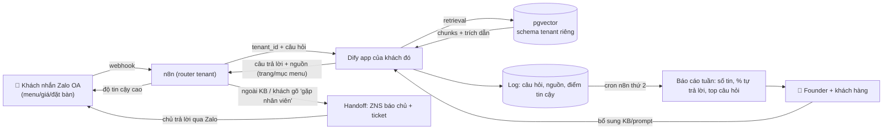

# Kế hoạch 14: Agency AI chatbot/RAG cho SME địa phương (OPC)

> Model phụ trách: Codex · Ngày: 2026-09-10 · Trạng thái: draft
> Kế thừa thiết kế đã chốt: chatbot RAG dẫn nguồn trên Zalo OA + web, handoff người thật + dashboard; vertical nhà hàng trước; setup 8–30 triệu VND, subscription 1,5–7 triệu/tháng; Dify self-host + n8n + PostgreSQL/pgvector; vốn 1.700 USD.

## 1. Mô hình công ty (1 slide)

- **Khách hàng:** nhà hàng/quán ăn/quán cà phê tại 1 thành phố lớn VN (bắt đầu HN/HCM), 1–3 chi nhánh, chủ không có IT, đang trả lời tin nhắn Zalo bằng tay.
- **Bán gì:** "Nhân viên trả lời khách 24/7" — chatbot RAG trả lời menu, giá, giờ mở cửa, đặt bàn, dị ứng, chỗ đậu xe **kèm trích dẫn nguồn trong KB**, tự handoff người thật khi ngoài phạm vi, kèm dashboard câu hỏi hằng tuần cho chủ.
- **Khác biệt:** grounded-only (bot chỉ nói điều có trong KB, không bịa), dẫn nguồn từng câu, mỗi khách 1 tenant/knowledge base riêng, blueprint ngành → triển khai 7–14 ngày, không phải dự án "hàng trăm triệu".
- **Vì sao 1 người làm được:** toàn bộ stack mã nguồn mở (Dify/n8n/pgvector) chạy trên 1 VPS phục vụ nhiều khách; AI làm onboarding KB + QA regression + báo cáo; founder chỉ giữ bán hàng, duyệt chất lượng và rủi ro.

## 2. Vì sao nó thắng ở Trung Quốc

- **光年易达 ✅** — AI CSKH ban đêm "1 AI = 10+ nhân viên" trong 14 shop TikTok: SME trả tiền cho bot CSKH khi hiệu quả đo được bằng tiền ([中国经营报](https://news.qq.com/rain/a/20260326A04AP000)). Bài học: bán bằng KPI cứng (câu hỏi được giải quyết, đơn đặt bàn), không bán "AI".
- **冉伟 ✅** — 48 giờ dựng nền tảng "同路人" phục vụ chính OPC: "bán xẻng cho thợ đào vàng" — agency bán công cụ/dịch vụ AI cho doanh nghiệp nhỏ khác là ngành OPC hợp lệ, ra sản phẩm nhanh bằng AI ([天下网商/界面](https://m.jiemian.com/article/14193991.html)).
- **Coze ✅** — publish bot thẳng vào WeChat/Douyin/飞书多维表格 ([docs.coze.cn](https://docs.coze.cn/guides_shortcut)): kênh chat nội địa là giao diện chuẩn của bot CSKH; VN copy bằng Zalo OA (nơi khách F&B thực sự nhắn tin).
- **Feishu aily ✅** — "dạy agent như dạy nhân viên, 沉淀 thành skill" ([环球时报](https://finance.sina.cn/2026-03-31/detail-inhsvmyh9204120.d.html)): quy trình triển khai phải đóng gói thành blueprint/skill tái dùng, không làm lại từ đầu mỗi khách.
- **华聚·经营罗盘 ⚠️ / 米线AI ⚠️** (10k users, 75% trả phí): SaaS AI cho SME có nhu cầu thật — chỉ dùng làm chỉ dẫn hướng, không lập kế hoạch tài chính theo.
- **Nguyên tắc từ cộng đồng:** Ninh Ba yêu cầu OPC "phải có ≥1 khách trả tiền" mới được vào ✅ — áp dụng: bán trước khi dựng thêm tính năng; tìm nhu cầu trước, code sau (景行 ✅).

## 3. Thị trường VN & US

**VN (cửa vào trước):**
- Zalo là kênh CSKH trung tâm của SME F&B (Zalo ~75 triệu người dùng ⚠️ tự ước từ công bố Zalo); nhà hàng nhận hàng chục tin hỏi menu/đặt bàn mỗi ngày nhưng trả lời chậm ngoài giờ.
- Giá thị trường 2026: chatbot AI SaaS cho SME có "điểm ngọt" **1–3 triệu VND/tháng**, phân khúc rẻ <500k là rule-based (không phải AI), enterprise ≥10 triệu; tự build RAG in-house "lên tới hàng trăm triệu" ([Mimo Group, 05/2026](https://mimo.com.vn/chi-phi-trien-khai-chatbot-ai-doanh-nghiep-nho-2026/)). → Giá của ta (setup 8–30 triệu, sub 1,5–7 triệu) cạnh tranh được nhờ khác biệt dẫn nguồn + ngành dọc + handoff + tenant riêng.
- Đối thủ: Mimo Group, BBotech/Tre Viet, freelancer Dify/n8n giá rẻ. Điểm yếu chung của họ: bot chung chung, không trích nguồn, không chuyên ngành F&B — ta đánh đúng chỗ này.
- Quy định: Nghị định 13/2023/NĐ-CP (bảo vệ dữ liệu cá nhân); hộ kinh doanh hoặc TNHH MTV; chính sách/phí Zalo OA thay đổi nhanh (kiểm tra trước mỗi quý).

**US (cửa sau, ngày 90–180):**
- SME US dùng website chat widget + WhatsApp + CRM (HubSpot/Zendesk); đối thủ SaaS trưởng thành (Intercom Fin, Chatbase, Tidio) — phải thắng bằng ngách dọc (nhà hàng) + giá agency.
- Benchmark giá agency 2026: AI chatbot development **$498–1.598**, workflow automation $498–1.798, custom AI agent $798–2.998 ([Ai Adoption Agency](https://aiadoptionagency.com/ai-automation-services-pricing/)) → định giá US cao gấp 3–5× VN nhưng đòi hỏi SLA/độ tin cậy cao hơn.

## 4. Tech stack & kiến trúc tự động hoá

| Công cụ | Vai trò | Chi phí/tháng |
|---|---|---|
| Dify self-host (Community) | App RAG, mỗi khách 1 app + 1 knowledge base + 1 API key | 0đ (trên VPS) |
| n8n self-host | Webhook Zalo↔Dify, handoff, báo cáo, cron QA | 0đ |
| PostgreSQL 15 + pgvector | Vector store, mỗi tenant 1 schema riêng (chống lộ dữ liệu) | 0đ (trong VPS) |
| Zalo OA + OpenAPI | Kênh chat, webhook nhận tin, ZNS báo chủ | Tạo miễn phí; gói nâng cao ~1,2 triệu/năm ⚠️; ZNS theo gói/tin ⚠️ |
| DeepSeek API (chat) + embedding | Sinh câu trả lời grounded; embedding bge-m3 chạy local hoặc API | 50–150k/khách/tháng ⚠️ |
| VPS VN 4GB/2vCPU (Viettel IDC/VNG/Contabo) | Chạy toàn stack cho ~10 tenant | 500–800k ⚠️ |
| Cloudflare + domain .vn | HTTPS, che IP gốc, rate-limit | ~30k (≈350k/năm ⚠️) |
| Google Sheets/Airtable | Dashboard KPI gửi khách hằng tuần | 0đ |
| Email doanh nghiệp | Zoho free hoặc Google Workspace Starter | 0–180k ⚠️ |

- **AI làm:** nhận tin → truy vấn → trả lời dẫn nguồn → handoff → báo cáo; onboarding KB từ menu/PDF/website; chạy regression test.
- **Người làm:** bán hàng chốt hợp đồng, duyệt KB trước khi bật bot, duyệt các câu trả lời "rủi ro cao" (giá, dị ứng, cam kết), giữ quan hệ khách.

## 5. Vận hành ngày/tuần của founder

- **Thứ 2:** Ops Analyst AI gửi báo cáo tuần cho 3–5 khách; QA Tester AI chạy regression 50 câu/khách; duyệt top 10 câu hỏi mới → bổ sung KB.
- **Thứ 3–4:** bán hàng — Sales SDR AI đưa 10 lead nhà hàng (fanpage chậm phản hồi), founder gọi/chốt 3–5; onboarding khách mới trong 48h (AI sinh KB, founder duyệt).
- **Thứ 5:** audit bảo mật tenant (truy vấn chéo giữa 2 khách phải trả 0 kết quả), backup, kiểm tra policy/phí Zalo.
- **Thứ 6:** viết 1 case study khách; đóng gói cải tiến vào blueprint.
- **Cuối tuần:** trực handoff (tin khách ngoài giờ → ZNS), đối soát tài chính.

| "Vị trí công việc AI" | Chức danh | Prompt chính / công cụ |
|---|---|---|
| Bot CSKH 24/7 | Nhân viên chăm sóc khách | "Chỉ trả lời từ KB, kèm nguồn; không biết thì từ chối + mời gặp nhân viên" (Dify) |
| QA Tester | Nhân viên kiểm thử | 50 câu hỏi chuẩn + đáp án vàng → chấm điểm, báo câu sai (n8n cron) |
| Onboarding Engineer | Nhân viên triển khai | menu/PDF/web → chunks KB + prompt hệ thống theo template (Claude/Cursor) |
| Ops Analyst | Nhân viên báo cáo | logs → bảng KPI tuần cho khách (n8n + Sheets) |
| Sales SDR | Nhân viên tìm khách | quét fanpage F&B ít phản hồi → soạn tin giới thiệu cá nhân hoá (founder duyệt) |

**Vòng lặp dữ liệu:** logs câu hỏi → top câu chưa trả lời được → bổ sung KB → đo lại % tự trả lời → blueprint tốt hơn cho khách sau.

## 6. Mô hình doanh thu & chi phí

**Bảng giá (⚠️ tự đặt trong khung thiết kế đã chốt):**

| Gói | Setup (1 lần) | Subscription/tháng | Gồm |
|---|---|---|---|
| Start | 8–12 triệu | 1,5–2,5 triệu | 1 kênh (Zalo OA hoặc web), ≤100 trang KB, ≤500 tin/tháng |
| Growth | 15–20 triệu | 3–4,5 triệu | 2 kênh, ZNS, form đặt bàn, báo cáo tuần |
| Pro | 25–30 triệu | 5–7 triệu | đa chi nhánh, dashboard riêng, SLA phản hồi 24h |
| Change request | 500k–2 triệu/hạng mục | — | ngoài scope hợp đồng (chống founder ngập support) |

**Tỷ giá giả định 1 USD ≈ 26.000 VND ⚠️ → vốn 1.700 USD ≈ 44 triệu VND.** Ngân sách: VPS 6 tháng ~4,8M; Zalo OA+ZNS dự phòng ~6M; LLM API 6 tháng ~4M; marketing/ăn trưa khách ~15M; dự phòng ~14M.

**Kịch bản cơ bản (tháng 1→12, đơn vị triệu VND):**

| Tháng | 1 | 2 | 3 | 4 | 5 | 6 | 7 | 8 | 9 | 10 | 11 | 12 |
|---|---|---|---|---|---|---|---|---|---|---|---|---|
| Khách mới | 1 | 1 | 1 | 1 | 1 | 1 | 1 | 1 | 1 | 1 | 1 | 1 |
| Tổng khách | 1 | 2 | 3 | 4 | 5 | 6 | 7 | 8 | 9 | 10 | 11 | 12 |
| Setup thu | 8 | 10 | 12 | 12 | 12 | 12 | 15 | 15 | 15 | 15 | 15 | 15 |
| MRR | 1,5 | 3,5 | 6 | 9 | 12 | 15 | 19 | 23 | 27 | 31 | 35 | 40 |
| Chi phí tháng | 4 | 4,5 | 5 | 5,5 | 6 | 6,5 | 7,5 | 8,5 | 9,5 | 10,5 | 11,5 | 12,5 |
| Tích luỹ | ~5 | ~13 | ~25 | ~41 | ~58 | ~77 | ~103 | ~132 | ~164 | ~199 | ~237 | ~278 |

- **Hoà vốn dòng tiền:** ~tháng 3 (setup + MRR vượt chi phí); **thu hồi 44 triệu vốn:** ~tháng 4 ⚠️ (số tự ước từ bảng trên).
- **Kịch bản tệ:** chỉ 3 khách, 1 khách rời tháng 5 → MRR cuối năm ~6 triệu → KILL theo tiêu chí mục 9.
- **Kịch bản tốt:** 15 khách + 2 gói Growth (MRR ~55–60 triệu) + nhánh US 1 khách → thuê QA part-time từ tháng 7.
- **Gross margin:** chi phí biến đổi/khách chỉ ~150–300k (API + ZNS + VPS chia đều) → margin ≥65% đạt từ 5 khách; doanh thu bảng trên ⚠️ là mục tiêu tự đặt, chưa có nguồn thị trường xác nhận.

## 7. Lộ trình start-from-scratch

**Giai đoạn 0–30 ngày — nền tảng + khách beta (chi ~10 triệu):**
1. Ngày 1: đăng ký **hộ kinh doanh cá thể** tại UBND quận (phí ~100k ⚠️, 1–3 ngày) — cần cho hợp đồng + Zalo OA doanh nghiệp.
2. Ngày 1: tạo **Zalo OA "Doanh nghiệp"** tại oa.zalo.me (số ĐT + GPKD; xác minh để mở OpenAPI/webhook — điều kiện đổi theo policy ⚠️, kiểm tra trang developers.zalo.me).
3. Ngày 1–5: thuê **VPS VN 4GB** (~800k/tháng ⚠️), cài Docker: Dify + n8n + PostgreSQL/pgvector (theo docs chính thức, 1 ngày).
4. Ngày 5–10: nối Zalo OA webhook → n8n → Dify; tạo tenant #1, schema + API key riêng.
5. Ngày 10–20: xây **blueprint nhà hàng**: 50 câu hỏi chuẩn + đáp án vàng (menu, giá, giờ, đặt bàn, dị ứng, chỗ đậu xe), prompt grounded-only + citation, KB mẫu từ 1 menu thật.
6. Ngày 20–25: demo **beta miễn phí 2 tuần** cho 2–3 nhà hàng quen; đo % tự trả lời đúng, số tin/ngày.
7. Ngày 25–30: landing page 1 trang + bảng giá + hợp đồng mẫu (scope cap, Nghị định 13/2023).
8. Mốc: **1 khách trả phí đầu tiên (setup ≥8 triệu).**

**30–60 ngày — 3 khách trả tiền + vận hành chuẩn:**
1. Chốt 2–3 khách gói Start (8–12 triệu setup, 1,5–2,5 triệu/tháng).
2. Chuẩn hoá onboarding: menu/PDF/Facebook → KB trong 48h (AI sinh, founder duyệt).
3. Regression 50 câu/khách/tuần bằng n8n; ngưỡng ≥95% đúng trước khi bật bot.
4. Bật handoff: ngoài KB hoặc khách gõ "gặp nhân viên" → ZNS báo chủ + lưu ticket.
5. Dashboard khách hằng tuần (Google Sheets tự cập nhật).
6. Bắt đầu tính phí change request ngoài scope (500k–2M/hạng mục ⚠️).
7. Mốc: MRR ≥4,5 triệu, churn = 0, thời gian triển khai ≤14 ngày.

**60–90 ngày — tăng tốc + phòng thủ:**
1. Rút thời gian triển khai còn **7 ngày** (blueprint v2: template KB + prompt + checklist).
2. Thử vertical thứ 2 (phòng khám/spa) — **chỉ làm khi có 1 khách trả tiền trước** (nguyên tắc Ninh Ba).
3. Audit bảo mật: truy vấn chéo giữa 2 tenant phải trả rỗng; backup hằng ngày; giới hạn API key từng tenant.
4. Đặt quota Zalo/ZNS theo gói khách + cảnh báo vượt ngân sách trước khi hết.
5. Gửi báo cáo ROI: chi phí CSKH thủ công 15–25 triệu/tháng so với 1,5–3 triệu bot ([Mimo](https://mimo.com.vn/chi-phi-trien-khai-chatbot-ai-doanh-nghiep-nho-2026/)).
6. Mốc: 5–6 khách, MRR ≥12 triệu, thu hồi đủ vốn 44 triệu ⚠️.

**90–180 ngày — scale theo ngưỡng:**
1. Khi đạt **~8 khách + MRR ≥35 triệu + gross margin ≥65%**: thuê QA/ops part-time 2–4h/ngày (OPC → STC).
2. Dựng portal tự onboarding (khách tự nạp KB, bot kiểm tra trước khi duyệt).
3. Nâng 30% khách hiện có lên Growth/Pro.
4. Mở nhánh US: chatbot web + WhatsApp, giá theo benchmark $498–1.598 setup ⚠️ ([Ai Adoption Agency](https://aiadoptionagency.com/ai-automation-services-pricing/)), dùng chung stack + thêm CRM.
5. Đóng gói quy trình thành skill pack nội bộ (`zalo-oa-ops`, `restaurant-blueprint`) — tài sản tái dùng/bán.
6. Mốc: 10–12 khách, MRR ≥35 triệu, đội 2 người.

## 8. Rủi ro & phòng thủ

| # | Rủi ro | Giảm thiểu |
|---|---|---|
| 1 | **Bot trả lời sai** (giá, dị ứng, cam kết) → mất khách + trách nhiệm | Grounded-only + citation; ngưỡng tin cậy thấp → từ chối + handoff; regression 50 câu/tuần; duyệt trước khi bật; log đầy đủ |
| 2 | **Lộ dữ liệu giữa khách** (tenant A đọc KB tenant B) | Schema pgvector riêng + API key riêng từng tenant; test truy vấn chéo hằng tuần; hợp đồng Nghị định 13/2023, xoá dữ liệu khi chấm dứt |
| 3 | **Zalo đổi API/chính sách/phí** (đã từng thay đổi điều kiện OA) | Lớp adapter n8n tách biệt; quota + budget cảnh báo; fallback widget web (Cloudflare) khi Zalo sập/đổi phí |
| 4 | **Founder ngập support** (khách gọi suốt ngày) | Blueprint + portal tự onboarding; scope cap trong hợp đồng; phí change request; SLA theo gói |
| 5 | **Churn cao / khách không thấy giá trị** | Báo cáo ROI hằng tuần (số tin, % tự trả lời, đơn đặt bàn); hợp đồng tối thiểu 6 tháng; KPI gắn đơn hàng |
| 6 | **Cạnh tranh giá SaaS 1–3 triệu/tháng** | Khác biệt: dẫn nguồn, ngành dọc F&B, handoff, tenant riêng — SaaS chung không làm được ngách |
| 7 | **Pháp lý dữ liệu cá nhân** (Nghị định 13/2023) | Chỉ thu thập tối thiểu (số ĐT đặt bàn); lưu tại VPS VN; thoả thuận xử lý dữ liệu trong hợp đồng; tư vấn luật 1 buổi ⚠️ |
| 8 | **Cá nhân: burnout, SPOF** | Giới hạn 10–12 khách nếu chưa có người phụ; SOP toàn bộ bằng văn bản + skill; ngưỡng scale tự động ở mục 9 |

## 9. KPI & tiêu chí kill/scale

- **KPI:** (1) MRR + số khách trả tiền; (2) % câu hỏi bot tự trả lời đúng (regression ≥95%); (3) churn/tháng ≤10%; (4) gross margin ≥65%; (5) thời gian triển khai/khách ≤7 ngày.
- **KILL (tháng 6):** <2 khách trả tiền HOẶC MRR <6 triệu HOẶC churn >20%/tháng 2 tháng liên tiếp → dừng dịch vụ agency, giữ stack chuyển hướng (bán blueprint/skill, tư vấn, hoặc dùng bot cho việc riêng).
- **SCALE:** ~8 khách + MRR ≥35 triệu + gross margin ≥65% → thuê QA/ops part-time → nhân bản vertical (spa, phòng khám) → mở US → STC.

## 10. Nguồn tham khảo

- [中国经营报/腾讯 — OPC "AI+跨境电商", 光年易达 AI CSKH đêm (03/2026)](https://news.qq.com/rain/a/20260326A04AP000) — truy cập 2026-09-10
- [天下网商/界面 — 一人AI公司爆火: 冉伟 48h dựng nền tảng, 景行, 华聚·经营罗盘 ⚠️ (04/2026)](https://m.jiemian.com/article/14193991.html) — truy cập 2026-09-10
- [环球时报/新浪财经 — "百虾竞渡", Feishu aily dạy agent như nhân viên (03/2026)](https://finance.sina.cn/2026-03-31/detail-inhsvmyh9204120.d.html) — truy cập 2026-09-10
- [Coze docs — publish bot ra WeChat/飞书](https://docs.coze.cn/guides_shortcut) — truy cập 2026-09-10
- [Mimo Group — Chi phí chatbot AI cho doanh nghiệp nhỏ 2026: sweet spot 1–3 triệu/tháng, CSKH thủ công 15–25 triệu/tháng (05/2026)](https://mimo.com.vn/chi-phi-trien-khai-chatbot-ai-doanh-nghiep-nho-2026/) — truy cập 2026-09-10
- [Ai Adoption Agency — AI Automation Pricing 2026: chatbot $498–1.598, workflow $498–1.798](https://aiadoptionagency.com/ai-automation-services-pricing/) — truy cập 2026-09-10
- [Zalo OA — Tính năng mở rộng/nâng cấp OA](https://oa.zalo.me/home/resources/library/tinh-nang-mo-rong-nang-cap-zalo-oa_2410156908111809541) — truy cập 2026-09-10
- [Haravan Academy — Gói trả phí Zalo OA Doanh nghiệp](https://hocvien.haravan.com/blogs/zalo/goi-tra-phi-danh-cho-zalo-oa-doanh-nghiep) — truy cập 2026-09-10
- [aiho.net — Dify self-host 1 tháng thực tế: RAG tuning & chi phí](https://aiho.net/review/dify-self-host-1-month.html) — truy cập 2026-09-10
- [Master playbook OPC (mục 2–12, đã thẩm định)](../reports/260910-1118-opc-china-master-playbook.md) — truy cập 2026-09-10

## 11. Câu hỏi mở

1. Zalo OA OpenAPI hiện giới hạn bao nhiêu tin nhắn chủ động (ZNS)/tháng với OA thường — có buộc mua gói cao cho handoff không?
2. Embedding tiếng Việt nào rẻ nhất mà giữ được độ chính xác retrieval cho menu/giá (bge-m3 local vs DeepSeek API)?
3. Giá setup thực tế cho chatbot nhà hàng tại HN/HCM đang là bao nhiêu (khảo sát 10 agency trước khi chốt bảng giá)?
4. Nghị định 13/2023 yêu cầu cụ thể gì với dữ liệu khách hàng do bot thu thập (cần 1 buổi tư vấn luật để soạn hợp đồng chuẩn)?
5. Revenue share theo đơn đặt bàn có thay thế được subscription cho nhà hàng nhỏ (rủi ro chủ "quên" xác nhận đơn)?
