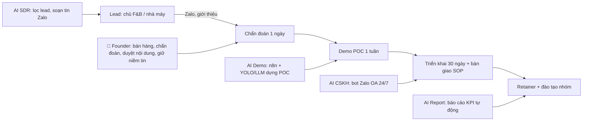

# Kế hoạch 15: Tư vấn AI chuyển đổi số ngành dọc (OPC)

> Model phụ trách: DeepSeek · Ngày: 2026-09-10 · Trạng thái: draft

## 1. Mô hình công ty (1 slide)

- **Khách hàng:** (a) chủ chuỗi F&B/retail 3–50 cửa hàng cần "AI私域" (chăm khách quay lại qua Zalo OA/CRM); (b) nhà máy SME (may mặc, bao bì, cơ khí, chế biến) cần "AI质检" (AI soi lỗi sản phẩm).
- **Bán gì:** 3 gói — chẩn đoán 1 ngày; gói "30 ngày cầm tay" (founder làm CÙNG nhân viên khách, để lại SOP + bot chạy thật); retainer + đào tạo nhóm theo tháng.
- **Khác biệt:** bán bằng kinh nghiệm ngành của founder (từng làm nhà máy/F&B → nói được "lỗi này tốn anh bao nhiêu % hàng hỏng") chứ không bán tool; đo kết quả bằng đồng tiền thật của khách.
- **Vì sao 1 người làm được:** chi phí chính là thời gian (brief); AI làm phần dựng demo/SOP/bot (mục 4); 2 gói sản phẩm chuẩn hoá là đủ chạy 8–10 dự án/năm song song.

## 2. Vì sao nó thắng ở Trung Quốc

- **Giá tư vấn xác nhận:** tư vấn số hoá cho SME ở TQ "cỡ vài chục vạn NDT" (khớp mức 20–50 vạn/đơn trong brief), dịch vụ nhẹ theo cảnh cũng có mức "vạn NDT" ✅ ([搜狐/汉数科技 05/2026](https://www.sohu.com/a/1029655649_122388181)).
- **Tư vấn gắn kết quả kinh doanh:** case tư vấn F&B của Acewill — 190 vạn hội viên, **4 tháng giá trị thẻ nạp ×3**, định vị "tư vấn chịu trách nhiệm kết quả" ✅ ([acewill.cn](https://www.acewill.cn/news-detail/346.html)).
- **AI质检 là ngách sôi động:** nhà máy vòng bi tỉnh Hà Bắc lắp "AI质检员" soi lỗi ✅ ([长城网 09/2025](https://economy.hebccw.cn/system/2025/09/19/102105786.shtml)); dệt may Đông Dương "AI织女" đoạt giải nhất toàn quốc về AI质检 ✅ ([东阳日报 12/2025](https://dyrb.dynews.zj.cn/h5/html5/2025-12/18/content_122726_2947229.htm)).
- **Nhà nước chính thức xếp AI质检 vào "cảnh điển hình cho SME":** Sơn Tây công bố danh mục ca điển hình của Bộ Công nghiệp "AI trao quyền cho doanh nghiệp vừa và nhỏ" ✅ ([山西工信厅 01/2026](http://gxt.shanxi.gov.cn/xwdt/gxdt/202601/t20260105_10032126.shtml)) → khách TQ coi đây là khoản chi hợp pháp, có thể xin trợ giá.
- **Bigtech làm phần trên, OPC ăn phần dưới:** Tencent bán giải pháp AI toàn chuỗi cho F&B lớn ([腾讯云](https://cloud.tencent.cn/developer/article/2648107)) — founder solo nhắm SME mà bigtech không thèm.
- **Bài học copy:** (1) bán "kết quả kinh doanh" chứ không bán giờ công; (2) tự chạy case thật làm demo (nguyên tắc vàng "tìm nhu cầu trước, code sau" — playbook mục 9); (3) sản phẩm hoá gói dịch vụ để 1 năm làm 20 đơn + đào tạo mà không phình nhân sự.

## 3. Thị trường VN & US

**VN — cửa vào trước:**
- Nhà máy VN đang "chạy đua chuyển đổi số" ✅ ([vietnam.vn](https://www.vietnam.vn/en/doanh-nghiep-san-xuat-chay-dua-chuyen-doi-so)); Foxconn Industrial Internet VN tăng 83% doanh thu nhờ tự động hoá/số hoá ✅ ([VCCI](https://en.vcci.com.vn/economic-news/foxconn-industrial-internets-vietnam-revenue-jumps-83-on-automation-digitalization-ceo-113851#1)).
- Chính quyền trợ vốn CĐS cho SME (Lâm Đồng ✅ [VOV](https://vov.gov.vn/lam-dong-ho-tro-doanh-nghiep-nho-va-vua-chuyen-doi-so-chuyen-giao-cong-nghe-dtnew-1145140); TP.HCM ✅ [SatiTech](https://satitech.gov.vn/bai-viet/tp-hcm-tang-manh-ho-tro-cho-startup-doanh-nghiep-cong-nghe)) → khách có ngân sách nhưng thiếu người cầm tay.
- Tool rẻ nên **không cạnh tranh bằng tool**: chatbot AI VN chỉ 199k–999k VND/tháng (Fchat), BizChatAI 1–9,6 triệu/tháng ✅ ([Bizfly](https://bizfly.vn/techblog/bang-gia-chatbot-gia-re-hop-ly-pho-bien-nhat-hien-nay.html)) — bán "tư vấn + triển khai + đào tạo" mới có biên.
- Bằng chứng 私域 F&B trên Zalo chạy được: Highlands Coffee tăng chuyển đổi nhờ voucher trên Zalo Mini App ✅ ([miniforbusiness.zalo.me](https://miniforbusiness.zalo.me/case-study/highlands-coffee-tang-ti-le-chuyen-doi-voi-chien-dich-phat-voucher-tren-zalo-mini-app)); kết nối kỹ thuật có sẵn qua node cộng đồng ✅ ([GitHub bautran1911/n8n-nodes-zalo-oa](https://github.com/bautran1911/n8n-nodes-zalo-oa)); Zalo OA có hướng dẫn chính thức tự động hoá CSKH bằng chatbot ✅ ([oa.zalo.me](https://oa.zalo.me/home/resources/library/tu-dong-hoa-cham-soc-khach-hang-voi-zalo-chatbot_6352033339970702125)).
- Quy mô: thị trường chi tiêu chuyển đổi số VN dự báo tăng 2025–2031 ✅ ([6Wresearch](https://www.6wresearch.com/industry-report/vietnam-digital-transformation-in-spending-market#1)) — nhu cầu có thật và đang tăng, ngân sách SME vẫn chủ yếu chi cho "dịch vụ triển khai" chứ không tự làm.
- Đối thủ: công ty tư vấn truyền thống (VD OCD bán cả gói AI agent cho SME VN ✅ [ocd.vn](https://ocd.vn/chi-phi-trien-khai-ai-agent-cho-doanh-nghiep-nho/)) — bạn thắng bằng tốc độ + giá + đứng trong ngành khách.

**US — thị trường đắt nhưng khó vào từ xa:**
- Giá chuẩn: $600–1.200/ngày; dự án chiến lược nhỏ $5.000–25.000; tích hợp chatbot $10.000–50.000 ✅ ([Holistic Consulting, Charlotte](https://www.holisticconsulting.tech/insights/ai-consulting-costs-charlotte-small-business-guide)).
- Nhưng 95% doanh nghiệp báo **zero ROI** từ sáng kiến AI (MIT 2025, trích trong nguồn trên) → khách US "chán AI", đòi bằng chứng ROI; 58% doanh nghiệp nhỏ đã dùng genAI (SBA 09/2025, cùng nguồn) → cạnh tranh agency dày đặc, founder VN không có network/trust → **không ưu tiên 6 tháng đầu**; chỉ dùng giá US làm benchmark định vị giá VN.

**Kết luận:** vào VN trước (F&B trước, 质检 sau), US để ngỏ qua network cá nhân sau khi có 3 case study.

## 4. Tech stack & kiến trúc tự động hoá

| Công cụ | Vai trò | Chi phí/tháng |
|---|---|---|
| VPS 4GB (Hetzner/Vultr) + n8n + Dify (Docker) | "Dây nối" Zalo OA ↔ CRM ↔ báo cáo; dựng bot RAG không code cho khách | $6–12 |
| Zalo OA + ZNS | Kênh 私域 của khách | OA: 0đ; ZNS ~300đ/tin |
| DeepSeek API / GPT-4o-mini | Não chatbot, sinh SOP, chấm dữ liệu khách | $5–20 |
| Google Colab + Ultralytics YOLO / Roboflow | Train mẫu AI质检 demo (nhận diện lỗi từ ảnh) | $0–10 |
| Điện thoại + đèn LED + tripod | Thu 200–500 ảnh lỗi thật tại nhà máy | 1 lần $100–150 |
| Google Sheets / Notion | Database trung tâm lead/dự án | $0 |
| CapCut (+ HeyGen tuỳ chọn) | Video marketing, demo 数字人 CSKH | $0–29 |
| Cursor / Claude Code | Code tuỳ chỉnh (web demo 质检, Zalo Mini App nhỏ) | $20 |

**Người làm:** bán/chốt giá, chẩn đoán tại chỗ, quản lý kỳ vọng, duyệt mọi nội dung AI trước khi gửi khách, giữ quan hệ.
**AI làm:** tìm lead, soạn tin nhắn đầu, dựng bot, train mẫu lỗi, sinh SOP/tài liệu, báo cáo tuần, trả lời CSKH đêm.

## 5. Vận hành ngày/tuần của founder

**Lịch tuần mẫu:** T2: chẩn đoán khách mới tại chỗ (2–3h) + dựng demo; T3–T4: onsite triển khai 2 dự án đang chạy; T5: nội dung marketing (1 case study + 1 clip demo lỗi AI bắt được); T6: báo cáo KPI tuần cho khách + học 1 công cụ mới; T7: nghỉ/nghe phản hồi cộng đồng.

**"Vị trí công việc AI" (chức danh + prompt chính + công cụ):**
1. **AI SDR** — "Lọc 20 chủ F&B khu X; soạn tin Zalo giới thiệu bằng ngôn ngữ chủ quán, kèm 1 số liệu case của tôi" — n8n + Sheets + DeepSeek.
2. **AI Demo Builder** — "Từ 300 ảnh lỗi này, train YOLO + viết web demo 1 trang + script thuyết trình 5 phút" — Colab + Cursor.
3. **AI CSKH Coach** — "Soạn kịch bản bot Zalo OA cho quán lẩu: menu, đặt bàn, nhắn lại khách sau 30/60 ngày" — Dify + DeepSeek.
4. **AI Report Writer** — "Gom data Zalo/đơn hàng tuần → báo cáo 1 trang: khách quay lại %, đơn từ Zalo, lỗi bot" — n8n + Sheets.
5. **AI SOP Keeper** — "Ghi lại từng bước tôi vừa làm → SOP chuẩn để VA làm thay" — Claude/Cursor.

**Vòng lặp dữ liệu:** mỗi dự án → template + dữ liệu mẫu mới → dự án sau rút ngắn 20% → case study mới → bán nhanh hơn (đúng nguyên tắc 7 của playbook).

## 6. Mô hình doanh thu & chi phí

**Bảng giá VN ⚠️ (tự đề xuất, căn theo giá TQ "mức vạn NDT" + mặt bằng chatbot VN):**

| Gói | Giá | Ghi chú |
|---|---|---|
| Chẩn đoán 1 ngày (audit + báo cáo + demo nhỏ) | 3–8 triệu VND | khấu trừ 100% nếu ký gói 30 ngày |
| Gói 30 ngày cầm tay — F&B 私域 | 40–70 triệu VND | bot Zalo OA + kịch bản quay lại + đào tạo 5 nhân viên |
| Gói AI质检 pilot (4–6 tuần) | 50–90 triệu VND | thu mẫu + train + web demo + SOP kiểm định |
| Retainer (vận hành + cải tiến bot) | 5–12 triệu VND/tháng | mục tiêu ≥40% khách gia hạn |
| Đào tạo nhóm 1 ngày | 800k–1,5 triệu VND/người | nhóm 5–15 người |

**Dòng tiền 12 tháng ⚠️ (kịch bản cơ bản, đơn vị triệu VND):**

| Tháng | 1 | 2 | 3 | 4 | 5 | 6 | 7 | 8 | 9 | 10 | 11 | 12 |
|---|---|---|---|---|---|---|---|---|---|---|---|---|
| Doanh thu | 0 | 0 | 8 | 40 | 5 | 45 | 12 | 50 | 60 | 15 | 70 | 20 |
| Chi phí (tool+marketing+đi lại+pháp lý) | 5 | 4 | 4 | 4 | 5 | 5 | 5 | 5 | 6 | 6 | 6 | 6 |
| Luỹ kế | −5 | −9 | −5 | +31 | +31 | +71 | +78 | +123 | +177 | +186 | +250 | +264 |

- Điểm hoà vốn: **đơn thứ 1–2** (tháng 3–4). Vốn khởi điểm: **≤2.000 USD** (~50 triệu VND) — 100% là tool + thiết bị demo + dự phòng 2 tháng sống, không cần văn phòng.
- Kịch bản tệ: 2 đơn/năm (~80 triệu, lỗ nhẹ) → kill. Tốt: 10 đơn + 4 retainer + 2 khoá đào tạo (~600–700 triệu/năm). Tham chiếu: mục tiêu TQ 20 đơn/năm là "sau khi có thương hiệu"; năm 1 VN thực tế 8–10 đơn.

## 7. Lộ trình start-from-scratch

**Giai đoạn 0–30 ngày (chi phí ~15–20 triệu VND):**
1. Ngày 1: đăng ký **hộ kinh doanh cá thể** qua Cổng DVCQG (dichvucong.gov.vn, lệ phí ~100k, 3–5 ngày); muốn xuất hoá đơn VAT đẹp thì TNHH MTV (~1–2 triệu, 3–7 ngày).
2. Ngày 2: đăng ký **Zalo OA doanh nghiệp** tại oa.zalo.me (cần giấy phép KD; OA 0đ, ZNS trả phí theo tin) — đây là "phòng lab" của bạn.
3. Ngày 3–5: thuê VPS ~$8/tháng, cài n8n + Dify bằng Docker (một lệnh); mua tài khoản DeepSeek API nạp 200k VND.
4. Ngày 6–7: nối Zalo OA ↔ n8n bằng node cộng đồng (GitHub bautran1911/n8n-nodes-zalo-oa); tự dựng bot cho CHÍNH MÌNH (bạn là case study số 0).
5. Tuần 2: chọn ngách — **F&B trước** (vốn thấp, chu kỳ bán ngắn, không đụng phần cứng); 质检 để tháng 2.
6. Tuần 2–3: gọi/nhắn 20 chủ quán quen → chốt 2 "case đổi case study" (miễn phí, họ cho số liệu để quảng cáo).
7. Tuần 3–4: triển khai case 1: bot menu + đặt bàn + nhắn lại khách sau 30 ngày; đo tỷ lệ khách quay lại.
8. **Mốc:** 1 case chạy thật + 1 case study có số liệu.

**30–60 ngày (~5 triệu VND):**
1. Đóng gói "Gói 30 ngày": checklist 30 bước, template hợp đồng (50% tạm ứng, 50% khi bàn giao), slide bán hàng.
2. Bán 2 đơn trả phí giá khởi động 30–40 triệu; hợp đồng ghi rõ KPI (tỷ lệ phản hồi ≤1 phút, % khách quay lại).
3. Song song dựng **demo AI质检**: xin 1 nhà máy bạn bè cho quay 200–500 ảnh lỗi thật (1 buổi, đèn + tripod ~$150); train YOLO trên Colab; web demo quét ảnh trả kết quả 0,3s.
4. Mở kênh content: 3 bài/tuần ("lỗi này AI bắt trong 0,3 giây") trên Facebook/Zalo/LinkedIn — mời khách dự chẩn đoán miễn phí.
5. Chuẩn hoá 5 vị trí AI (mục 5) vào file Markdown riêng, dùng cho mọi dự án.
6. **Mốc:** 2 hợp đồng ký + nhận 50% tạm ứng; demo 质检 chạy trên laptop.

**60–90 ngày (~5 triệu VND):**
1. Đạt 4–6 đơn luỹ kế; chương trình giới thiệu (khách cũ giới thiệu được giảm 10% tháng retainer).
2. Bán retainer đầu tiên (5–8 triệu/tháng).
3. Bán khoá đào tạo 1 ngày cho chuỗi F&B đầu tiên (5–10 học viên).
4. Tự động hoá 80% CSKH nội bộ bằng bot (bạn là case study số 2).
5. **Mốc:** doanh thu luỹ kế ≥150 triệu; 1 khách gia hạn.

**90–180 ngày (~10 triệu VND):**
1. 8–10 đơn/năm; tỷ lệ 80% F&B – 20% 质检.
2. Tuyển 1 VA part-time (3–5 triệu/tháng) làm các bước lặp (thu data, test bot, báo cáo) theo SOP của AI SOP Keeper.
3. Sản phẩm hoá: khoá online "AI私域 cho F&B" + cộng đồng Zalo trả phí 200k/tháng/thành viên.
4. Chuẩn bị STC: mọi quy trình ghi 100% vào SOP, thử 1 tuần VA chạy không cần bạn.
5. **Mốc:** doanh thu 12 tháng ≥400 triệu; đánh giá ngưỡng SCALE (mục 9).

## 8. Rủi ro & phòng thủ

1. **Khách trả chậm/quỵt (đặc thù tư vấn VN):** hợp đồng 50% trước + milestone 25% + 25% bàn giao; không bàn giao mã/SOP khi chưa đủ tiền.
2. **Kỳ vọng AI sai (95% doanh nghiệp zero ROI — MIT):** chỉ nhận KPI đo được; làm pilot 1 tuần trước gói lớn; ghi rõ "AI không thay người, AI nhân năng suất".
3. **Dự án ngốn thời gian, không scale:** từ chối custom vô tận; mọi yêu cầu mới → báo giá thêm; dùng AI Demo Builder để giữ tổng công ≤30 ngày/dự án.
4. **Pháp lý dữ liệu cá nhân (Nghị định 13/2023/NĐ-CP):** khách F&B thu thập SĐT khách hàng → hợp đồng DPA, chỉ self-host (n8n/Dify VPS VN), không gửi dữ liệu cá nhân ra model ngoài; bot hỏi consent khi thu data.
5. **Zalo thay đổi policy/ZNS tăng giá:** thiết kế bot đa kênh (Facebook, SMS, Zalo Mini App) ngay từ đầu; giữ bản quyền kịch bản/SOP về phía bạn.
6. **Phụ thuộc founder 100% (ốm đau, chán):** AI SOP Keeper ghi mọi quy trình; nhắm mục tiêu VA thay được 70% công việc ở tháng 6.
7. **AI质检 vượt vốn (camera công nghiệp, integration):** chỉ bán pilot ≤90 triệu dùng camera thường; phần cứng lớn giới thiệu đối tác hưởng hoa hồng, không tự ôm.
8. **Cạnh tranh agency giá rẻ:** không đấu giá; bán bằng case study ngành + bảo hành KPI 30 ngày sau bàn giao.

## 9. KPI & tiêu chí kill/scale

- **KPI:** (1) ≥8 cuộc chẩn đoán/tháng từ tháng 3; (2) tỷ lệ chốt từ chẩn đoán ≥25%; (3) doanh thu tháng 6 ≥50 triệu; (4) ≥40% khách gia hạn retainer; (5) thời gian triển khai trung bình ≤30 ngày.
- **KILL (90 ngày):** <2 đơn trả phí HOẶC <15 cuộc chẩn đoán tích luỹ → đổi ngách (sang bán thuần đào tạo hoặc chatbot agency mẫu kế hoạch 14). Dự án nào kéo >6 tuần 2 lần liên tiếp → bỏ phân khúc đó.
- **SCALE:** 10 đơn/năm + 4 retainer ổn định → tuyển 1 VA full-time + 1 sales part-time → STC 3 người; sản phẩm hoá khoá học/cộng đồng thành nguồn thu thứ 2 (doanh thu ổn định không phụ thuộc giờ công).

## 10. Nguồn tham khảo

- [搜狐/汉数科技 — 企业数智化转型咨询价格 (05/2026)](https://www.sohu.com/a/1029655649_122388181) — giá tư vấn TQ theo quy mô (truy cập 10/09/2026).
- [Acewill — 190万会员，4个月储值翻3倍：餐饮咨询案例](https://www.acewill.cn/news-detail/346.html) (truy cập 10/09/2026).
- [长城网 — 轴承有了AI质检员 (09/2025)](https://economy.hebccw.cn/system/2025/09/19/102105786.shtml) (truy cập 10/09/2026).
- [东阳日报 — 东阳"AI织女"拿下全国一等奖 (12/2025)](https://dyrb.dynews.zj.cn/h5/html5/2025-12/18/content_122726_2947229.htm) (truy cập 10/09/2026).
- [山西工信厅 — 工信部人工智能赋能中小企业典型应用场景 (01/2026)](http://gxt.shanxi.gov.cn/xwdt/gxdt/202601/t20260105_10032126.shtml) (truy cập 10/09/2026).
- [腾讯云开发者社区 — 饮食行业数字化解决方案](https://cloud.tencent.cn/developer/article/2648107) (truy cập 10/09/2026).
- [vietnam.vn — Doanh nghiệp sản xuất chạy đua chuyển đổi số](https://www.vietnam.vn/en/doanh-nghiep-san-xuat-chay-dua-chuyen-doi-so) (truy cập 10/09/2026).
- [VCCI — Foxconn FII Vietnam revenue +83% on automation](https://en.vcci.com.vn/economic-news/foxconn-industrial-internets-vietnam-revenue-jumps-83-on-automation-digitalization-ceo-113851#1) (truy cập 10/09/2026).
- [VOV — Lâm Đồng hỗ trợ SME chuyển đổi số](https://vov.gov.vn/lam-dong-ho-tro-doanh-nghiep-nho-va-vua-chuyen-doi-so-chuyen-giao-cong-nghe-dtnew-1145140) (truy cập 10/09/2026).
- [Bizfly — Bảng giá chatbot AI phổ biến tại VN (09/2025)](https://bizfly.vn/techblog/bang-gia-chatbot-gia-re-hop-ly-pho-bien-nhat-hien-nay.html) (truy cập 10/09/2026).
- [Zalo Mini App for Business — Case Highlands Coffee](https://miniforbusiness.zalo.me/case-study/highlands-coffee-tang-ti-le-chuyen-doi-voi-chien-dich-phat-voucher-tren-zalo-mini-app) (truy cập 10/09/2026).
- [Zalo OA — Tự động hoá CSKH với Zalo Chatbot](https://oa.zalo.me/home/resources/library/tu-dong-hoa-cham-soc-khach-hang-voi-zalo-chatbot_6352033339970702125) (truy cập 10/09/2026).
- [GitHub — bautran1911/n8n-nodes-zalo-oa](https://github.com/bautran1911/n8n-nodes-zalo-oa) (truy cập 10/09/2026).
- [Holistic Consulting — AI Consulting Costs, Charlotte SMB (03/2026)](https://www.holisticconsulting.tech/insights/ai-consulting-costs-charlotte-small-business-guide) — giá US + MIT 95% zero ROI + SBA 58% (truy cập 10/09/2026).
- [OCD — Chi phí triển khai AI Agent cho doanh nghiệp nhỏ VN](https://ocd.vn/chi-phi-trien-khai-ai-agent-cho-doanh-nghiep-nho/) (truy cập 10/09/2026).
- [6Wresearch — Vietnam Digital Transformation Spending Market (2025–2031)](https://www.6wresearch.com/industry-report/vietnam-digital-transformation-in-spending-market#1) (truy cập 10/09/2026).
- Master playbook: `plans/reports/260910-1118-opc-china-master-playbook.md` (mục 2–12).

## 11. Câu hỏi mở

1. Hộ kinh doanh cá thể xuất hoá đơn tư vấn cho khách doanh nghiệp có bị giới hạn doanh thu/năm không (ngưỡng 100 triệu chuyển sang kê khai)?
2. Zalo OA năm 2026 có giới hạn số tin quảng cáo (ZNS) miễn phí/tháng với tài khoản thường không — cần kiểm tra policy hiện tại trước khi bán gói.
3. Đào tạo "kèm cặp" theo tháng có cần chứng chỉ hành nghề tư vấn gì ở VN không (thường không, nhưng cần xác nhận với hợp đồng đào tạo)?
4. Nghị định 13/2023/NĐ-CP: bot thu SĐT khách F&B có bắt buộc đánh giá tác động bảo vệ dữ liệu (DPIA) với chuỗi nhỏ không?
5. Giá retainer F&B VN 5–12 triệu/tháng có đủ biên để trả VA và vẫn lời khi scale lên 10 khách không — cần kiểm chứng bằng 2 khách thật ở tháng 4.
