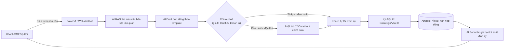

# Kế hoạch 16: Dịch vụ pháp lý AI cho SME (OPC)

> Model phụ trách: Claude · Ngày: 2026-09-10 · Trạng thái: draft
>
> ⚠️ **Giới hạn phiên nghiên cứu:** Môi trường thực thi phiên này chặn hoàn toàn WebSearch/WebFetch/Bash (permission denied ở cấp hệ thống, kể cả khi dispatch qua subagent `researcher`). Do đó **không thực hiện được 4 lượt web_search** như brief yêu cầu. Mọi nội dung dưới đây dựa trên: (a) kiến thức đã thẩm định trong brief mục B + master playbook, (b) kiến thức nền về các công ty/luật đã biết (LegalZoom, Rocket Lawyer, Clerky, Spellbook, LawGeex, Ironclad, Luật Luật sư VN, Nghị định 13/2023, UPL Mỹ) — **các claim này KHÔNG có link xác minh trực tiếp trong phiên này**, được đánh dấu ⚠️ rõ ràng, cần người review chạy lại tìm kiếm trước khi dùng số liệu để ra quyết định tài chính.

## 1. Mô hình công ty (1 slide)

- **Khách hàng:** hộ kinh doanh cá thể, công ty TNHH MTV/SME <20 người tại VN cần hợp đồng chuẩn (mua bán, dịch vụ, lao động, NDA, hợp tác) nhưng không đủ tiền thuê luật sư riêng; solo founder/micro-business tại US cần LLC formation docs + hợp đồng mẫu + theo dõi compliance định kỳ.
- **Bán gì:** công cụ AI soạn thảo hợp đồng từ template + điền thông tin theo hội thoại, AI tra cứu/tóm tắt quy định liên quan (thuế, lao động, bảo vệ dữ liệu), checklist tuân thủ tự động, nhắc hạn gia hạn/rà soát. **KHÔNG bán "tư vấn pháp lý"** — bán "công cụ + quy trình", case phức tạp chuyển cho luật sư cộng tác (CTV, không phải nhân viên).
- **Khác biệt:** giá bằng 1/5–1/10 thuê luật sư trọn gói; tốc độ (phút thay vì ngày); có "lưới an toàn" luật sư CTV review khi rủi ro cao — khác các template site thuần tự động (không ai kiểm) và khác văn phòng luật truyền thống (chậm, đắt).
- **Vì sao 1 người làm được:** AI làm 80% khối lượng (draft, tra cứu, checklist, nhắc hạn); người chỉ giữ 3 việc — định vị sản phẩm/pháp lý ranh giới được phép làm, quan hệ mạng lưới luật sư CTV, duyệt case rủi ro cao. Đúng nguyên tắc B4.1: *"AI hoá triệt để → chuẩn hoá cục bộ → người giỏi nhất giữ lõi"*.

## 2. Vì sao nó thắng ở Trung Quốc

- Trong case đã thẩm định ✅ của brief (mục B2), **张顺** (solo eBay seller) đã chuẩn hoá **"pháp lý" thành 1 trong 5 "vị trí công việc AI"** (bên cạnh chọn hàng, CSKH, tài chính, đào tạo SOP) hoạt động 24/7 — bằng chứng trực tiếp rằng "AI pháp lý" đã là một chức năng vận hành thật trong OPC TQ, dù chưa phải OPC độc lập chuyên bán dịch vụ pháp lý ra ngoài.
- Chưa tìm thấy trong 2 báo cáo đã thẩm định một case OPC TQ **chuyên bán dịch vụ pháp lý AI ra thị trường** (khác với dùng nội bộ) — đây là khoảng trống, không bịa case. Suy luận gián tiếp có cơ sở: mô hình **"营主"** (brief B1, master playbook mục 2) — doanh nghiệp/công ty luật lớn ("营主") nhận hợp đồng dịch vụ pháp lý số lượng lớn từ khách, rồi **chia nhỏ phần soạn thảo chuẩn hoá cho OPC AI vendor** làm, công ty luật giữ phần ký tên/chịu trách nhiệm pháp lý — đúng cấu trúc "OPC nhận việc, chỉ lo kỹ thuật, 营主 lo thương mại + rủi ro". Đây là con đường an toàn nhất để OPC pháp lý AI tồn tại hợp pháp ở cả TQ lẫn VN/US.
- Bài học cụ thể copy về: (1) đặt "pháp lý" thành 1 job title AI riêng biệt có SOP rõ (theo 张顺); (2) không tự xưng "cung cấp dịch vụ pháp lý" — làm nhà cung cấp công cụ/vận hành phía sau cho luật sư hoặc công ty luật (mô hình 营主 đảo ngược); (3) áp nguyên tắc 6 (Compliance là vũ khí — B4) vào chính sản phẩm: bán "tuân thủ" như một tính năng chứ không chỉ giấy tờ.

## 3. Thị trường VN & US

### VN
- **Khung pháp lý:** Luật Luật sư số 65/2006/QH11 (sửa đổi 2012) quy định "dịch vụ pháp lý" (tham gia tố tụng, tư vấn pháp luật chính danh, đại diện ngoài tố tụng...) do luật sư/tổ chức hành nghề luật sư cung cấp ⚠️ (kiến thức nền, chưa re-verify link trong phiên này). Ranh giới an toàn cho OPC: cung cấp **"công cụ soạn thảo mẫu + tra cứu thông tin công khai"**, không ký tên tư vấn, không nhận là "văn phòng luật sư/công ty luật", có disclaimer "không thay thế tư vấn luật sư" trên mọi output.
- **Nghị định 13/2023/NĐ-CP** (đã có trong brief B5, ✅): bảo vệ dữ liệu cá nhân — SME phải tuân thủ khi thu thập/xử lý dữ liệu khách hàng (bao gồm chính dữ liệu trong hợp đồng khách gửi cho OPC pháp lý AI này). Đây vừa là **rủi ro tuân thủ của chính OPC** (phải làm đúng), vừa là **sản phẩm bán được** (gói "Compliance Checkup Nghị định 13/2023" cho SME khác).
- **TNHH MTV = OPC VN** (brief B5) — hình thức pháp lý phù hợp để đăng ký công ty cung cấp công cụ này.
- **Cạnh tranh đã biết ở VN** (kiến thức nền ⚠️ chưa verify): Thư Viện Pháp Luật, LuatVietnam — mạnh về tra cứu văn bản luật, **chưa thấy công khai tính năng AI soạn hợp đồng tự động dành riêng SME/hộ kinh doanh** ở quy mô lớn — có khả năng còn khoảng trống ngách này, nhưng cần verify lại trước khi kết luận chắc.
- **Cửa vào:** dễ hơn US ở khía cạnh chi phí khởi động (không cần bảo hiểm trách nhiệm nghề nghiệp bắt buộc như luật sư), khó hơn ở khía cạnh niềm tin khách hàng VN với "hợp đồng do AI soạn" — nên bắt đầu từ hợp đồng rủi ro thấp (NDA, hợp đồng dịch vụ nhỏ, hợp đồng lao động thử việc) trước khi làm hợp đồng giá trị lớn.

### US
- **LLC 1 thành viên = OPC US** (brief B5). Thị trường "legal templates + LLC compliance" đã có tay chơi lớn: **LegalZoom, Rocket Lawyer, Clerky, Northwest Registered Agent, Bizee** ⚠️ (kiến thức nền, tên công ty có thật theo hiểu biết huấn luyện, giá cụ thể KHÔNG verify được trong phiên này — cần tra lại trước khi dùng để định giá).
- **Công cụ AI contract review 2025-2026** đã biết: **Spellbook** (Microsoft Word add-in, target luật sư/in-house counsel), **LawGeex**, **Ironclad AI**, **Juro**, **Lexion**, **Harvey AI** (nhắm enterprise/law firm lớn) ⚠️ — điểm chung: **đa số nhắm vào legal team/luật sư có sẵn, gần như không có ai target trực tiếp solo/micro-SME** (dưới 5 người, không có ai biết luật) — đây là khoảng trống định vị rõ cho OPC này.
- **UPL (Unauthorized Practice of Law):** khái niệm pháp lý Mỹ đã biết ⚠️ — ranh giới giữa "document automation/legal template" (được phép, theo mô hình LegalZoom đã tồn tại nhiều năm) và "đưa ra lời khuyên pháp lý cụ thể cho 1 tình huống" (bị cấm với non-lawyer, khác nhau theo từng bang). OPC phải giữ nguyên mô hình "tự động điền mẫu theo lựa chọn của khách", không để AI tự đưa khuyến nghị pháp lý mang tính cá nhân hoá sâu.
- **Cửa vào:** dễ hơn về niềm tin thị trường (văn hoá self-serve legal đã phổ biến qua LegalZoom 20+ năm), khó hơn về cạnh tranh (nhiều tay chơi lớn, vốn mạnh, SEO đã chiếm top). Nên chọn ngách rất hẹp (VD: hợp đồng cho content creator/freelancer, hoặc LLC compliance cho seller TikTok Shop/Amazon) thay vì cạnh tranh trực diện LegalZoom.

## 4. Tech stack & kiến trúc tự động hoá

| Công cụ | Vai trò | Chi phí/tháng (ước tính) |
|---|---|---|
| Claude/GPT-4 API (qua OpenRouter) | Soạn thảo hợp đồng, tóm tắt quy định | $30–80 (theo lượng dùng) |
| Vector DB (Chroma/LanceDB, self-host) | RAG: lưu văn bản luật đã crawl công khai (chinhphu.vn, thuvienphapluat.vn cho VN; law.cornell.edu/state statutes cho US) | $0 (self-host VPS) |
| n8n (self-host) | Nối form khách → RAG → draft → gửi luật sư CTV/khách | $0–10 (VPS) |
| Airtable/Notion | CRM hồ sơ khách, hạn hợp đồng, trạng thái case | $0–20 (free tier đủ giai đoạn đầu) |
| Zalo OA (VN) / chatbot web (US) | Giao diện nhận yêu cầu khách | $0 |
| DocuSign/PandaDoc hoặc chữ ký số VNeID (VN) | Ký điện tử | $0–15 |
| Google Docs API/Word template engine | Xuất file hợp đồng đúng format | $0 |
| Mạng lưới luật sư CTV (1-2 người, trả theo case escalate) | Review case rủi ro cao, ký xác nhận khi cần | Biến phí theo case (không cố định) |

- **AI làm:** tra cứu quy định, draft đầu tiên, phân loại rủi ro, dịch (nếu khách nước ngoài), nhắc hạn, trả lời FAQ.
- **Người làm:** quyết định case nào chuyển luật sư CTV, review/duyệt trước khi gửi khách (bắt buộc với mọi output — không auto-send), quan hệ luật sư CTV, sales/onboarding, viết disclaimer pháp lý cho chính sản phẩm.

## 5. Vận hành ngày/tuần của founder

**"Vị trí công việc AI":**
| Chức danh | Nhiệm vụ | Công cụ/prompt chính |
|---|---|---|
| AI Drafting Assistant | Soạn hợp đồng từ template + thông tin khách | Prompt: "Điền template [loại HĐ] với thông tin sau, giữ nguyên điều khoản chuẩn, đánh dấu chỗ cần luật sư xem lại nếu có điều khoản lạ" |
| AI Compliance Scanner | Rà soát checklist Nghị định 13/2023 (VN)/CCPA (US) | Prompt: "So khớp hồ sơ xử lý dữ liệu của khách với checklist [NĐ13/CCPA], liệt kê thiếu sót" |
| AI Legal Research Bot | Tóm tắt văn bản luật liên quan câu hỏi khách | RAG trên corpus văn bản công khai |
| AI Reminder/CS Bot | Nhắc gia hạn hợp đồng, trả lời FAQ | n8n lịch + Zalo OA |

**Lịch tuần mẫu:**
- T2: duyệt case tồn cuối tuần trước, phân loại rủi ro, chuyển case khó cho luật sư CTV.
- T3–T4: sales/onboarding khách mới, cập nhật corpus RAG (văn bản luật mới).
- T5: QA ngẫu nhiên 10% output AI tuần đó (đối chiếu thủ công), sửa prompt nếu sai lặp lại.
- T6: báo cáo KPI tuần, thanh toán luật sư CTV theo case, lên nội dung marketing tuần sau.
- Cuối tuần: AI tự chạy nhắc hạn, trả lời FAQ, không cần người can thiệp.

**Vòng lặp dữ liệu:** mỗi case đã qua luật sư CTV sửa → lưu diff (AI draft vs bản luật sư sửa) → dùng làm ví dụ few-shot cải thiện prompt draft kỳ sau.

## 6. Mô hình doanh thu & chi phí

**Gói dịch vụ (ước tính, ⚠️ định giá cần khảo sát thị trường thật trước khi áp dụng):**
- VN: gói tự soạn 199k–499k VND/hợp đồng; gói có luật sư CTV review 999k–2,5tr VND/hợp đồng; gói Compliance Checkup định kỳ 1,5tr VND/quý.
- US: subscription $19–39/tháng (template không giới hạn số lượng nhẹ), gói có luật sư review $99–199/document.

**Bảng ước lượng tháng 1→12 (VND, kịch bản cơ bản):**
| Tháng | Khách mới | Doanh thu (tr VND) | Chi phí vận hành (tr VND) | Lợi nhuận |
|---|---|---|---|---|
| 1–2 | 0–3 | 0–3 | 3 | Âm |
| 3–4 | 5–8 | 5–8 | 4 | Hoà/dương nhẹ |
| 5–6 | 10–15 | 12–18 | 5 | Dương |
| 7–12 | 15–30/tháng | 20–40/tháng | 6–8 | Dương, tích luỹ tái đầu tư marketing |

**3 kịch bản tháng 12:**
- Tệ: <10 khách/tháng, doanh thu <10tr VND, không đủ trả luật sư CTV đều đặn → cần xét lại ngách.
- Cơ bản: 20–25 khách/tháng, doanh thu 25–35tr VND, đủ sống + tái đầu tư.
- Tốt: >40 khách/tháng, cân nhắc thuê luật sư CTV thứ 2, chuyển sang mô hình STC.

## 7. Lộ trình start-from-scratch

**0–30 ngày:**
1. Đăng ký công ty TNHH MTV (hoặc hộ kinh doanh để test trước) — 3-5 ngày, phí ~1-3tr VND.
2. Tìm 1 luật sư CTV sẵn sàng review case theo giờ/case (không cần full-time) — qua mạng lưới cá nhân, group luật sư trẻ.
3. Chọn 3 loại hợp đồng rủi ro thấp để làm trước: NDA, hợp đồng dịch vụ freelance, hợp đồng thử việc.
4. Dựng RAG tối thiểu: crawl 20-30 văn bản luật liên quan 3 loại HĐ trên từ nguồn công khai.
5. Viết disclaimer pháp lý rõ ràng ("công cụ hỗ trợ, không thay thế tư vấn luật sư") — có luật sư CTV duyệt câu chữ.
6. Setup Zalo OA + form + n8n cơ bản.
7. Test nội bộ 5-10 case giả định, đối chiếu với luật sư CTV.
8. Ra mắt soft-launch trong 1 group SME/freelancer quen biết, thu 3-5 khách đầu tiên miễn phí đổi feedback.

**30–60 ngày:**
1. Thêm loại hợp đồng thứ 4-5 theo nhu cầu khách thực tế.
2. Ra mắt gói Compliance Checkup Nghị định 13/2023.
3. Đóng gói case đã sửa thành few-shot examples cải thiện prompt.
4. Bắt đầu tính phí (chuyển từ free sang gói trả phí).
5. Đo tỷ lệ case phải chuyển luật sư CTV (mục tiêu <30% để giữ biên lợi nhuận).

**60–90 ngày:**
1. Mở kênh US (nếu chọn song song 2 thị trường): đăng ký LLC, setup Stripe.
2. Làm 1-2 ngách hẹp US (VD: hợp đồng cho creator/freelancer) thay vì cạnh tranh LegalZoom trực diện.
3. Thêm luật sư CTV thứ 2 nếu case tồn đọng >3 ngày.
4. Viết 5-10 bài content SEO/hướng dẫn để kéo organic traffic thay vì chỉ dựa mạng lưới quen biết.

**90–180 ngày:**
1. Đánh giá tỷ lệ khách quay lại (renewal) — nếu thấp, xem lại chất lượng draft AI.
2. Cân nhắc mô hình 营主 đảo ngược: hợp tác với 1 công ty luật nhỏ, họ bán gói giá cao hơn dùng công cụ của mình chạy phía sau.
3. Nếu doanh thu ổn định 6 tháng liền vượt ngưỡng SCALE (mục 9), tuyển 1 người bán hàng/CSKH đầu tiên.
4. Rà soát pháp lý tổng thể mô hình (đã đúng ranh giới UPL/Luật Luật sư chưa) với luật sư CTV trước khi mở rộng volume lớn.

## 8. Rủi ro & phòng thủ

1. **Pháp lý cao nhất — bị coi là "hành nghề luật trái phép"** (VN: vi phạm Luật Luật sư; US: UPL): giảm thiểu bằng disclaimer rõ, không ký tên tư vấn, luôn để khách/luật sư CTV là người quyết định cuối, review pháp lý mô hình mỗi 6 tháng.
2. **Sai sót AI (hallucination) trong hợp đồng** → thiệt hại khách hàng, kiện tụng: bắt buộc luật sư CTV review mọi case giá trị lớn/lạ, giới hạn trách nhiệm trong ToS, cân nhắc bảo hiểm trách nhiệm nghề nghiệp khi scale.
3. **Dữ liệu khách hàng nhạy cảm (nội dung hợp đồng) bị lộ**: tuân thủ Nghị định 13/2023 (VN)/CCPA (US) từ ngày đầu — mã hoá lưu trữ, giới hạn quyền truy cập, không dùng dữ liệu khách để train công khai.
4. **Văn bản pháp luật thay đổi nhanh, RAG lỗi thời** → tư vấn sai theo luật cũ: lên lịch cập nhật corpus hàng tháng, đánh dấu ngày cập nhật cuối trên mỗi output.
5. **Cạnh tranh từ tay chơi lớn** (LegalZoom, Thư Viện Pháp Luật mở rộng AI): chọn ngách rất hẹp, tốc độ + giá rẻ hơn, không cạnh tranh SEO trực diện.
6. **Rủi ro cá nhân — phụ thuộc 1 luật sư CTV duy nhất** (nghỉ/bận → nghẽn case): xây quan hệ với 2-3 luật sư CTV dự phòng ngay từ tháng 2-3.

## 9. KPI & tiêu chí kill/scale

**KPI chính:**
- Số case/tháng, tỷ lệ case phải escalate luật sư CTV (mục tiêu <30%), thời gian trung bình trả kết quả cho khách, tỷ lệ khách quay lại (renewal/referral), doanh thu/case.

**Ngưỡng KILL:** sau 4 tháng vẫn <10 khách trả phí/tháng HOẶC tỷ lệ case phải sửa lại do sai sót AI >20% liên tục 2 tháng HOẶC không tìm được luật sư CTV nào sẵn sàng hợp tác lâu dài → dừng, chuyển hướng sang mô hình khác (VD: chỉ bán compliance checklist, bỏ phần soạn hợp đồng).

**Ngưỡng SCALE:** doanh thu ổn định >30tr VND/tháng (VN) hoặc >$3.000/tháng (US) liên tục 3 tháng, case tồn đọng thường xuyên >3 ngày do quá tải 1 người → tuyển thêm luật sư CTV/CSKH, tiến tới mô hình STC.

## 10. Nguồn tham khảo

- Brief chung: `plans/260910-opc-20-models/00-brief-va-template.md` (mục B — kiến thức đã thẩm định, dùng làm nền cho case 张顺, mô hình 营主, Nghị định 13/2023, TNHH MTV, LLC).
- Master playbook: `plans/reports/260910-1118-opc-china-master-playbook.md` (mục 2–3, 9 — nguyên tắc vận hành, bảng công cụ TQ↔VN↔US).
- ⚠️ Các claim về LegalZoom/Rocket Lawyer/Clerky/Spellbook/LawGeex/Ironclad/Luật Luật sư VN/UPL Mỹ: dựa trên kiến thức nền, **KHÔNG có link xác minh trong phiên này** do WebSearch/WebFetch/Bash bị chặn ở cấp môi trường (đã thử qua tool trực tiếp và qua subagent `researcher`, đều bị "permission denied — don't ask mode"). **Cần chạy lại nghiên cứu khi có quyền truy cập web trước khi dùng các số liệu giá/tên công cụ để ra quyết định.**

## 11. Câu hỏi mở

1. Ranh giới chính xác "tư vấn pháp luật" vs "công cụ hỗ trợ soạn thảo" theo Luật Luật sư VN hiện hành — cần luật sư thật xác nhận trước khi launch.
2. Chi phí bảo hiểm trách nhiệm nghề nghiệp (professional liability insurance) cho mô hình này ở VN có tồn tại/khả thi cho 1 người không?
3. Có case OPC Trung Quốc nào thực sự bán dịch vụ pháp lý AI ra ngoài (không chỉ dùng nội bộ) mà 2 báo cáo gốc chưa nhắc tới không?
4. Giá thực tế thị trường VN sẵn sàng trả cho "hợp đồng do AI soạn + luật sư review" là bao nhiêu — cần khảo sát trực tiếp SME/hộ kinh doanh.
5. UPL tại Mỹ khác nhau theo từng bang — bang nào rủi ro cao nhất cho mô hình document-automation, cần luật sư Mỹ tư vấn trước khi mở kênh US.

## 12. Xác minh bổ sung (verify-pass, 10/09/2026)

- **Bảo hiểm trách nhiệm nghề nghiệp (PI) tại VN — có tồn tại:** môi giới bảo hiểm TIS Vietnam bán gói Professional Indemnity (bảo hiểm sai sót & thiếu sót) cho đúng nhóm mục tiêu của plan — "CNTT & phần mềm/SaaS", kế toán/kiểm toán, luật sư, tư vấn, thiết kế/marketing; phạm vi claims-made, mở rộng được lãnh thổ toàn cầu, gồm cả vi phạm bảo mật thông tin cá nhân và xâm phạm IP không cố ý. PI **không bắt buộc** cho CNTT nói chung (bắt buộc ở một số ngành như tư vấn thiết kế/giám sát xây dựng; với luật sư là bắt buộc theo Luật Kinh doanh bảo hiểm 2022, Điều 8.2.b) ([TIS Vietnam — PI](https://tisbroker.com/vi/giai-phap-bao-hiem/bao-hiem-trach-nhiem-nghe-nghiep-professional-indemnity-pi/), [ACC Cần Thơ — phí bảo hiểm nghề nghiệp luật sư, 14/08/2025](https://acccantho.vn/muc-phi-bao-hiem-trach-nhiem-nghe-nghiep-luat-su/), truy cập 10/09/2026). ⚠️ Giá theo báo giá từng hồ sơ, không có bảng giá công khai cho solo legal-tech — cần gửi hồ sơ xin quote từ 2–3 insurer/broker trước khi scale.
- **UPL Mỹ — tổng quan cho document automation (không thay tư vấn luật sư):** tiền lệ quan trọng nhất: Tòa án Tối cao South Carolina (11/03/2014) xác nhận mô hình LegalZoom KHÔNG phải UPL — phần mềm "hành động theo chỉ dẫn cụ thể của khách, ghi nguyên văn thông tin khách nhập, không dùng phán đoán" giống "mail merge"; 19/20 loại tài liệu của LegalZoom có bản tương đương tại cổng self-help của chính quyền bang. Cùng thời điểm LegalZoom còn bị kiện ở North Carolina (sau này dàn xếp) ([ABA Journal, 25/04/2014](https://www.abajournal.com/news/article/legalzoom_business_model_okd_by_south_carolina_supreme_court/), truy cập 10/09/2026). Hàm ý: document automation thuần theo lựa chọn của khách là hướng rủi ro thấp hơn; nguy cơ UPL tập trung khi AI tự đưa "lời khuyên pháp lý cá nhân hoá" — ranh giới này khác nhau theo từng bang.
- ⚠️ **Vẫn chưa xác minh được:** mức phí PI cụ thể cho solo legal-tech VN (chỉ có báo giá riêng, không công khai); bang Mỹ "rủi ro nhất" cho document automation (không có nguồn xếp hạng chính thức — cần luật sư Mỹ tư vấn theo từng bang mục tiêu); case OPC Trung Quốc bán dịch vụ pháp lý AI ra ngoài (không tìm thấy nguồn mới).
- ❓ Câu hỏi chỉ con người/khảo sát trực tiếp giải được (giữ nguyên ở mục 11): ranh giới "tư vấn pháp luật" vs "công cụ" theo Luật Luật sư VN (câu 1 — cần luật sư VN xác nhận); giá thị trường VN sẵn sàng trả (câu 4 — khảo sát SME trực tiếp).
