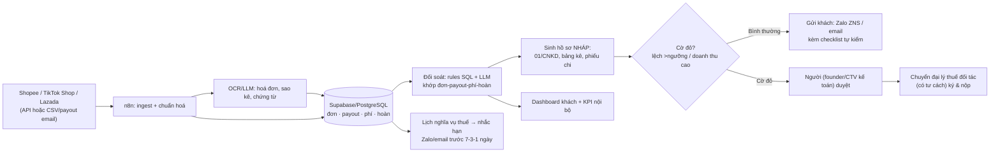

# Kế hoạch 17: AI kế toán–thuế cho hộ kinh doanh/seller VN (OPC)

> Model phụ trách: Codex · Ngày: 2026-09-10 · Trạng thái: draft

## 1. Mô hình công ty (1 slide)

- **Khách hàng:** hộ kinh doanh cá thể và seller online VN (TikTok Shop, Shopee, Lazada, Facebook) có doanh thu 50 triệu – 3 tỷ VND/năm — nhóm đang bị "bỏ rơi" giữa hai bờ: không đủ tiền thuê kế toán trọn gói (1,5–3tr/tháng ⚠️ ước theo giá thị trường, chưa verify), nhưng từ 01/01/2026 không còn được khoán thuế mà phải tự kê khai theo doanh thu thực tế.
- **Bán gì:** "Finance AI" — bộ công cụ tự động: (1) **đối soát** đơn–payout–phí–hoàn từ nhiều sàn về 1 bảng; (2) **chuẩn bị hồ sơ nháp** (tờ khai 01/CNKD, bảng kê doanh thu, phiếu chi phí — đóng dấu "BẢN NHÁP"); (3) **nhắc hạn nghĩa vụ thuế** qua Zalo/email; (4) báo cáo doanh thu–lãi tháng + cảnh báo ngưỡng (doanh thu chạm 100tr/năm → phải kê khai; chạm 1 tỷ → bắt buộc hoá đơn điện tử).
- **Khác biệt:** giá 149–499k/tháng (bằng 1/5–1/10 kế toán thuê ngoài); dữ liệu tự chảy từ sàn về, khách không phải gõ; **KHÔNG tự nhận là dịch vụ kế toán/đại lý thuế** — định vị "phần mềm hỗ trợ + cầu nối tới đơn vị có tư cách" (đại lý thuế/kế toán dịch vụ được cấp phép).
- **Vì sao 1 người làm được:** AI làm 90% khối lượng (ingest, OCR, phân loại, soạn nháp, nhắc hạn); founder chỉ giữ 3 việc theo nguyên tắc B4.4 — định vị pháp lý ranh giới, kiểm định nhu cầu 10 khách đầu, quan hệ đối tác đại lý thuế. Mẫu trực tiếp: **张顺** đã chuẩn hoá "tài chính" thành 1 trong 5 AI employees ✅.

## 2. Vì sao nó thắng ở Trung Quốc

- **张顺 (Trương Thuận)** ✅ — solo seller eBay, 5 "nhân viên AI" 24/7 trong đó có **vị trí "tài chính" riêng biệt** ([南国都市报/中新网海南](http://szb.ngdsb.cn/h5/html5/2026-07/23/content_58867_19728456.htm)): bằng chứng "Finance AI" là chức năng vận hành thật trong OPC TQ. Bài học copy: tài chính là **1 chức danh AI có SOP + KPI riêng**, không phải tính năng phụ.
- **Mô hình "营主"** ✅ (playbook mục 2, [光明网](https://m.gmw.cn/2026-08/10/content_1304545694.htm)): bên có tư cách đấu thầu/chịu trách nhiệm nhận khối lượng, chia nhỏ việc kỹ thuật cho OPC. **Đảo ngược cho ngành này:** OPC này làm công nghệ + vận hành dữ liệu, còn việc ký/nộp tờ khai giao đại lý thuế đối tác — đúng cấu trúc "营主 lo rủi ro pháp lý, OPC lo kỹ thuật".
- Nguyên tắc B4.6 "**Compliance là vũ khí**" (case 光年易达 ✅): bán đúng thứ đang làm khách sợ nhất — sợ bị truy thu, sợ sai tờ khai — thành gói sản phẩm.
- Lưu ý trung thực: chưa tìm thấy case OPC TQ **bán dịch vụ tài chính cho hộ kinh doanh bên ngoài** trong 2 báo cáo đã thẩm định — khoảng trống, không bịa case.

## 3. Thị trường VN & US

### VN (cửa vào chính — cú hích chính sách 2026)
- **Nghị quyết 198/2025/QH15** ✅ (17/5/2025, đã đọc trích dẫn tại [Sở Tư pháp Phú Thọ](https://htpldn.phutho.gov.vn/chi-dao-dieu-hanh/bai-viet/cat/nghiep-vu-pho-bien-giao-duc-phap-luat-6456/id/mot-so-quy-dinh-uu-dai-voi-ho-kinh-doanh-ca-nhan-kinh-doanh-theo-nghi-quyet-so-198-2025-qh15-89658)): **bỏ thuế khoán từ 01/01/2026**, hộ KD/cá nhân KD chuyển sang **phương pháp kê khai** hoặc **khai theo từng lần phát sinh** (khoản 6 Điều 10). Hàng triệu hộ đang khoán sẽ phải kê khai lần đầu → nhu cầu công cụ/hỗ trợ tăng đột biến đúng lúc sản phẩm ra mắt ([CAND](https://cand.vn/quan-ly-thue-doi-voi-ho-kinh-doanh-khi-xoa-bo-thue-khoan-post786509.html), [Quốc hội](https://quochoi.vn/pages/tim-kiem.aspx?ItemID=94663)).
- **Nghị định 70/2025/NĐ-CP** ✅ (hoá đơn, chứng từ; [Báo Chính phủ](https://baochinhphu.vn/print/nhung-noi-dung-moi-cua-nghi-dinh-so-70-2025-nd-cp-ve-hoa-don-chung-tu-102250903091616929.htm)) + quy định hộ KD doanh thu ≥1 tỷ/năm bắt buộc hoá đơn điện tử ([LuatVietnam](https://luatvietnam.vn/tin-van-ban-moi/ho-kinh-doanh-co-doanh-thu-1-ty-dong-tro-len-phai-su-dung-hoa-don-dien-tu-186-101679-article.html)) → mở rộng tự nhiên sản phẩm (phát hành hoá đơn qua API MISA meInvoice đã có [MCP sẵn](https://lobehub.com/mcp/junter1989k-ai-vietnam-invoice-mcp#1) ✅).
- **Thông tư 10/2021/TT-BTC** ✅ (quản lý hành nghề dịch vụ làm thủ tục về thuế; [VCCI](https://vanban.vcci.com.vn/thong-tu-102021tt-btc-huong-dan-quan-ly-hanh-nghe-dich-vu-lam-thu-tuc-ve-thue)) + **Luật Kế toán** ⚠️ (kiến thức nền, chưa verify link trong phiên: kinh doanh dịch vụ kế toán cần Giấy chứng nhận đủ điều kiện; cá nhân không được tự nhận làm kế toán dịch vụ) — **ranh giới pháp lý cứng cho sản phẩm** (mục 8).
- Quy mô: ≈5,2 triệu hộ kinh doanh cá thể VN ⚠️ (kiến thức nền GSO, chưa verify số chính xác trong phiên — cần kiểm trước khi dùng làm slide gọi vốn). TMĐT VN 2025: TikTok Shop tăng mạnh, lần đầu vượt Shopee ở một chỉ số quan trọng ✅ ([CafeBiz](https://m.cafebiz.vn/tiktok-shop-but-pha-ngoan-muc-shopee-lan-dau-mat-ngoi-o-mot-chi-so-quan-trong-176250729085631368.chn)).
- Đối thủ: MISA (meInvoice, SME.net — nhắm doanh nghiệp, không rẻ cho hộ KD), phần mềm kê khai của các nhà cung cấp HĐĐT (Viettel, VNPT), kế toán thuê ngoài truyền thống, nhóm Zalo "kế toán hộ" ⚠️ — khoảng trống: **tự động hoá đối soát đa sàn + nhắc hạn cho đúng phân khúc hộ KD/seller nhỏ, giá dưới 500k**.

### US (để sau — thị trường trưởng thành, không đánh trực diện)
- Sales tax phân mảnh: 45 bang + DC áp **economic nexus** sau Wayfair; mỗi bang ngưỡng/thuế suất khác nhau ✅ ([Avalara 2025](https://www.avalara.com/blog/en/north-america/2025/01/sales-tax-law-changes.html), [Avalara nexus guide](https://www.avalara.com/blog/en/north-america/2023/01/nexus-what-to-know-small-business.html)) — cơ hội là ngách "seller VN bán sang US cần nộp sales tax" qua đối tác US, không phải cạnh tranh Avalara/TaxJar.
- Phần mềm trưởng thành: QuickBooks Self-Employed ~$15–35/tháng ⚠️ ([freelancepick](https://www.freelancepick.com/blog/quickbooks-self-employed-pricing-2026) — nguồn yếu, chỉ dùng tham khảo khung giá), TurboTax Live, Bench — người dùng US đã quen trả $30–300/tháng, nhưng rào cản vào: tiếng Anh, hỗ trợ thuế 50 bang, cạnh tranh vốn lớn.
- **Kết luận cửa vào:** VN trước (cú hích chính sách 01/01/2026 + không đối thủ giá rẻ đúng ngách + founder là người Việt hiểu Zalo/CCT địa phương). US chỉ làm gói phụ "seller VN bán US" sau ngày 180.

## 4. Tech stack & kiến trúc tự động hoá

| Công cụ | Vai trò | Chi phí/tháng |
|---|---|---|
| VPS VN 4GB (Vietnix/AZdigi) | Chạy n8n self-host + worker | ~250.000đ |
| n8n (self-host) | "Nhân viên vô hình": ingest → parse → đối soát → nhắc | 0đ |
| Supabase (PostgreSQL + Auth + Storage) | Database trung tâm: khách, shop, đơn, payout, phí, hoàn, nghĩa vụ thuế | 0đ (free) → $25/tháng từ tháng 4 |
| Google Workspace + Drive | Lưu chứng từ khách, email gửi báo cáo | ~150.000đ |
| OCR/LLM: DeepSeek API + Gemini Flash (vision) | Đọc hoá đơn/sao kê payout, phân loại giao dịch, sinh bản nháp | 500.000–900.000đ (theo lượng) |
| Dashboard: Metabase (VPS) / Next.js + Vercel | Dashboard khách: doanh thu, đối soát, hạn nộp | 0đ |
| Zalo OA + ZNS | Kênh chính: nhắc hạn, báo cáo, CSKH | 0đ + phí template ~1tr/năm |
| MoMo/VNPay QR | Thu phí định kỳ | ~1,1% giao dịch ⚠️ |
| MISA meInvoice API/MCP (tháng 5+) | Xuất hoá đơn điện tử cho khách | theo gói partner ⚠️ |
| Playwright/OpenClaw (repo chính thức) | "Tay chân" cho portal thuế/sàn không có API | 0đ (BYOK) |

- **AI làm:** ingest, OCR, phân loại, đối soát, soạn nháp, nhắc hạn, trả lời FAQ thuế (RAG). **Người làm:** chốt ranh giới pháp lý, duyệt cờ đỏ (~10% hồ sơ), quan hệ đối tác, đọc luật mới mỗi tuần.

## 5. Vận hành ngày/tuần của founder

- **Thứ 2:** duyệt báo cáo "cờ đỏ" tuần trước (mục tiêu <30 phút); đọc 1 văn bản thuế mới → cập nhật RAG.
- **Thứ 3–5:** kiểm định nhu cầu — chat 3–5 khách tiềm năng/ngày trong nhóm Zalo seller; ghi nhận 1 tính năng "đau" nhất.
- **Thứ 6:** rà độ chính xác đối soát (mẫu ngẫu nhiên 10%), xem log lỗi phân loại → sửa prompt/rules; đăng 1 bài content "kiến thức thuế hộ KD" lên nhóm (mồi khách).
- **Thứ 7:** đóng gói quy trình thành SOP/skill (nguyên tắc B4.9); backup + kiểm tra bảo mật.
- **5 "vị trí công việc AI" (theo mẫu 张顺):** (1) *Nhân viên đối soát* — prompt: "khớp mọi payout với đơn, báo lệch >5.000đ hoặc >0,5%"; (2) *Trợ lý thuế* — sinh nháp tờ khai theo mẫu hiện hành + gắn trích dẫn văn bản; (3) *Nhân viên nhắc hạn* — lịch từ DB nghĩa vụ; (4) *CSKH tài chính* — FAQ thuế qua RAG, không tư vấn cá nhân hoá; (5) *Nhân viên chứng từ* — OCR hoá đơn → đặt tên chuẩn → lưu Drive.
- **Vòng lặp dữ liệu:** mỗi lỗi phân loại/đối soát → 1 dòng log → sửa prompt → đo lại độ chính xác tuần sau (nguyên tắc B4.7).

## 6. Mô hình doanh thu & chi phí

- **Giá:** Cơ bản 149k/tháng (đối soát + nhắc hạn 1 shop); Pro 299k/tháng (đa sàn + hồ sơ nháp hàng tháng); Studio 499k/tháng (doanh nghiệp nhỏ/TNHH MTV, hoá đơn, quyết toán nháp). ARPU kỳ vọng ~250k ⚠️ (tự đặt, sẽ kiểm định bằng 10 pilot).
- **Doanh thu khác:** hoa hồng giới thiệu đại lý thuế đối tác (10–20% phí dịch vụ ⚠️); phí "gói chuyển đổi khoán → kê khai" một lần 299–499k.
- **Ngân sách 6 tháng (~49 triệu VND ≈ 2.000 USD):** hạ tầng ~10,6tr (VPS 1,5tr + Supabase Pro 1,9tr + Workspace 0,9tr + LLM/OCR 4,8tr + Zalo template 1tr + domain 0,5tr); dịch vụ ~15tr (luật sư tư vấn ranh giới 1 lần 3tr + kế toán CTV 3tr×4 tháng); marketing 12tr (2tr/tháng); dự phòng 11,4tr.
- **Kịch bản (doanh thu luỹ kế 6 tháng / MRR cuối tháng 6):**
  - Tệ: 30 khách — MRR ~7,5tr, doanh thu ~20tr → lỗ ~29tr → chạy tiếp 3 tháng với pivot nhắm "solo seller TikTok".
  - Cơ bản: 120 khách — MRR ~30tr, doanh thu ~90tr → **hoà vốn ~tháng 5**, lãi tháng 6 ~13tr.
  - Tốt: 300 khách — MRR ~75tr, doanh thu ~180tr → tuyển người từ tháng 5 (→ STC).
- Điểm hoà vốn: ~45–50 khách trả phí (MRR ~11–12tr, biến phí ~30%, phí cố định ~8tr/tháng).

## 7. Lộ trình start-from-scratch (0–180 ngày)

**Giai đoạn 0–30 ngày — Pháp lý + pilot 10 khách (chi ~8tr):**
1. **Ngày 1:** đăng ký hộ kinh doanh online tại dangkykinhdoanh.gov.vn — ngành nghề ghi "lập trình phần mềm/tư vấn công nghệ", **KHÔNG ghi "dịch vụ kế toán/đại lý thuế"**; lệ phí ~100k, nhận giấy 3–5 ngày.
2. **Ngày 2–7:** tư vấn luật sư 1 buổi (2–3tr) chốt ranh giới: không ký/nộp tờ khai, mọi output đóng dấu "BẢN NHÁP — khách tự kiểm và nộp", hợp đồng dịch vụ + disclaimer + phụ lục bảo vệ dữ liệu (Nghị định 13/2023/NĐ-CP).
3. **Ngày 3–10:** dựng Supabase schema 8 bảng (khách, shop, đơn, payout, phí, hoàn, chứng từ, nghĩa_vụ_thuế) + mã hoá cột CCCD/MST.
4. **Ngày 5–14:** n8n workflow #1 — ingest CSV/Excel payout Shopee+TikTok Shop → chuẩn hoá → đối soát v1 (rules SQL + LLM khớp).
5. **Ngày 8–18:** workflow #2 — OCR hoá đơn/sao kê (Gemini Flash) → lưu Drive + DB; workflow #3 — nhắc hạn Zalo ZNS (đăng ký template mất 2–5 ngày).
6. **Ngày 15–25:** tuyển 10 seller pilot từ nhóm Zalo/Facebook bán hàng online (tặng 2 tháng, đổi lấy phản hồi hằng tuần); dashboard Metabase/Next.js.
7. **Ngày 20–30:** vòng lặp sửa lỗi; bảng giá chính thức; thanh toán MoMo QR.
8. **Mốc:** 10 pilot dùng thật, **≥1 khách trả phí** (tiêu chí Ninh Ba "≥1 khách trả tiền" ✅), độ chính xác đối soát ≥99%.

**Giai đoạn 30–60 ngày — Ký đối tác + hồ sơ nháp (chi ~9tr):**
1. Ký 1 đại lý thuế/kế toán dịch vụ có chứng chỉ hành nghề (TT 10/2021/TT-BTC) làm đối tác "营主 đảo": nhận hồ sơ nháp do AI soạn, review, ký/nộp cho khách có nhu cầu; chia hoa hồng.
2. Workflow #4 — sinh **hồ sơ nháp v1**: tờ khai 01/CNKD theo doanh thu DB + bảng kê + phiếu chi, đóng watermark BẢN NHÁP + trích dẫn văn bản.
3. Chuẩn hoá 5 "vị trí AI" thành SOP + prompt riêng + KPI riêng (mẫu 张顺).
4. Nối TikTok Shop Seller Center (API hoặc parsing email payout); Shopee Open Platform ⚠️ (kiểm tra hạn mức API cho seller thường).
5. Đóng gói "Gói chuyển đổi khoán → kê khai" (tận dụng NQ 198/2025, hiệu lực 01/01/2026) — đây là sản phẩm content + onboarding.
6. Bảo mật: RBAC, mã hoá cột nhạy cảm, backup mã hoá, quy trình xoá dữ liệu theo yêu cầu (NĐ 13/2023).
7. **Mốc:** 20 khách trả phí, MRR ~5–6tr, churn <20%, ≤5 phút hỗ trợ/khách/tuần.

**Giai đoạn 60–90 ngày — Vòng lặp + RAG thuế (chi ~9tr):**
1. Dựng RAG kho văn bản thuế hộ KD (TT 40/2021/TT-BTC, NĐ 70/2025/NĐ-CP, hướng dẫn CCT địa phương) cho chatbot FAQ — mọi câu trả lời kèm trích dẫn, từ chối "tư vấn cá nhân hoá".
2. Dashboard khách: đối soát trực quan + đếm ngược hạn nộp + cảnh báo ngưỡng 100tr/1 tỷ.
3. Kế toán CTV bán thời gian (chứng chỉ hành nghề) duyệt 10% hồ sơ ngẫu nhiên/tháng — đo tỷ lệ lỗi.
4. Tự động kê khai "từng lần phát sinh" cho cá nhân KD không thường xuyên (nhánh của NQ 198).
5. **Mốc:** 50–60 khách, MRR ≥9tr, độ chính xác ≥99,5%, 0 lỗi pháp lý nghiêm trọng.

**Giai đoạn 90–180 ngày — Scale + hoá đơn (chi ~23tr):**
1. Tích hợp MISA meInvoice (API/MCP) — phát hành hoá đơn cho khách doanh thu ≥1 tỷ (NĐ 70/2025).
2. Nhân bản thị trường: gói riêng cho (a) seller xuyên biên giới VN→US (sales tax qua đối tác US), (b) chủ shop nhỏ theo tỉnh (CCT địa phương).
3. Tuyển nhân viên #1 (CSKH) khi MRR ≥30tr (nguyên tắc B4.10: OPC → STC).
4. SEO/content: chuỗi bài "kê khai lần đầu cho hộ kinh doanh" — mồi khách miễn phí dài hạn.
5. **Mốc:** 120–300 khách, MRR 30–75tr, đánh giá KILL/SCALE (mục 9).

## 8. Rủi ro & phòng thủ

1. **PHÁP LÝ (cao nhất):** vô tình cung cấp dịch vụ kế toán/đại lý thuế khi chưa đủ điều kiện (Luật Kế toán ⚠️ + TT 10/2021/TT-BTC) → bị xử phạt, mất niềm tin. *Phòng thủ:* chỉ bán "phần mềm hỗ trợ"; mọi output đóng dấu BẢN NHÁP; khách tự ký/nộp; đối tác có tư cách thực hiện phần hành nghề; luật sư rà soát định kỳ 6 tháng; không dùng từ "kế toán cho bạn" trong marketing.
2. **AI/OCR phân loại sai** → sai hồ sơ/nghĩa vụ → khách bị truy thu, quy trách nhiệm sản phẩm. *Phòng thủ:* đối chiếu kép (rules + LLM), ngưỡng tin cậy → cờ đỏ chuyển người; khách xác nhận "đã đối chiếu" trước khi dùng nháp; mẫu kiểm 10%/tháng; bảo hiểm/hợp đồng giới hạn trách nhiệm.
3. **Rò rỉ CCCD/MST/doanh thu** (vi phạm Nghị định 13/2023/NĐ-CP). *Phòng thủ:* mã hoá cột nhạy cảm, least-privilege, VPS trong nước, backup mã hoá, chính sách xoá dữ liệu, không gửi dữ liệu thô cho LLM ngoài khi chưa ẩn danh.
4. **Nền tảng đổi định dạng/chặn:** Shopee/TikTok thay đổi payout/API. *Phòng thủ:* 3 đường ingest song song (API, CSV, email/ảnh chụp), giám sát hằng tuần, đa kênh để không phụ thuộc 1 sàn.
5. **Churn cao vì khách nhỏ nhạy giá.** *Phòng thủ:* nhắm khách doanh thu 50tr–3 tỷ (đau thật), tự phục vụ + FAQ bot để chi phí hỗ trợ <15% giá gói, khoá giá 12 tháng.
6. **LLM hallucinate văn bản thuế / API tăng giá.** *Phòng thủ:* RAG + bắt buộc trích dẫn + ngày hiệu lực văn bản; gateway đa model (DeepSeek/Gemini/GPT-4o-mini).
7. **Cá nhân:** founder không có chứng chỉ kế toán, sức khoẻ/kiệt sức. *Phòng thủ:* không làm phần hành nghề; kế toán CTV + đại lý thuế đỡ chuyên môn; lịch tuần cố định, nghỉ 1 ngày.

## 9. KPI & tiêu chí kill/scale

- **KPI:** (1) khách trả phí & MRR (mục tiêu 20→50→120 theo mốc); (2) độ chính xác đối soát ≥99,5% giá trị giao dịch; (3) churn <5%/tháng; (4) thời gian hỗ trợ/khách ≤5 phút/tuần; (5) 0 sự cố rò rỉ dữ liệu, 0 vi phạm ranh giới pháp lý.
- **KILL (đổi hướng) tại ngày 90:** <10 khách trả phí **hoặc** độ chính xác <98% sau 2 chu kỳ sửa **hoặc** chi phí hỗ trợ >30% doanh thu **hoặc** 1 sự cố pháp lý/dữ liệu nghiêm trọng. Hướng pivot: thu hẹp chỉ làm "đối soát + nhắc hạn" bán cho 1 ngách (solo seller TikTok), hoặc bán white-label cho đại lý thuế.
- **SCALE tại ngày 180:** MRR ≥30tr + churn <5% → tuyển CSKH #1 + kế toán viên có chứng chỉ full-time → mở rộng 2 tỉnh → chuyển TNHH MTV → đích STC (theo 张小博).

## 10. Nguồn tham khảo (truy cập 2026-09-10)

- [Nghị quyết 198/2025/QH15 — trích dẫn ưu đãi hộ kinh doanh, bỏ thuế khoán 01/01/2026 (Sở Tư pháp Phú Thọ)](https://htpldn.phutho.gov.vn/chi-dao-dieu-hanh/bai-viet/cat/nghiep-vu-pho-bien-giao-duc-phap-luat-6456/id/mot-so-quy-dinh-uu-dai-voi-ho-kinh-doanh-ca-nhan-kinh-doanh-theo-nghi-quyet-so-198-2025-qh15-89658) ✅
- [Nghị định 70/2025/NĐ-CP về hoá đơn, chứng từ (Báo Chính phủ)](https://baochinhphu.vn/print/nhung-noi-dung-moi-cua-nghi-dinh-so-70-2025-nd-cp-ve-hoa-don-chung-tu-102250903091616929.htm) ✅
- [Thông tư 10/2021/TT-BTC — quản lý hành nghề dịch vụ làm thủ tục về thuế (VCCI)](https://vanban.vcci.com.vn/thong-tu-102021tt-btc-huong-dan-quan-ly-hanh-nghe-dich-vu-lam-thu-tuc-ve-thue) ✅
- [Hộ kinh doanh doanh thu ≥1 tỷ phải dùng HĐĐT (LuatVietnam)](https://luatvietnam.vn/tin-van-ban-moi/ho-kinh-doanh-co-doanh-thu-1-ty-dong-tro-len-phai-su-dung-hoa-don-dien-tu-186-101679-article.html) ✅
- [Quản lý thuế hộ kinh doanh khi xoá bỏ thuế khoán (CAND)](https://cand.vn/quan-ly-thue-doi-voi-ho-kinh-doanh-khi-xoa-bo-thue-khoan-post786509.html) · [Chất vấn về bỏ thuế khoán (Quốc hội)](https://quochoi.vn/pages/tim-kiem.aspx?ItemID=94663) ✅
- [TikTok Shop bứt phá, Shopee mất ngôi chỉ số (CafeBiz 07/2025)](https://m.cafebiz.vn/tiktok-shop-but-pha-ngoan-muc-shopee-lan-dau-mat-ngoi-o-mot-chi-so-quan-trong-176250729085631368.chn) ✅
- [Avalara — 2025 sales tax changes](https://www.avalara.com/blog/en/north-america/2025/01/sales-tax-law-changes.html) · [nexus guide](https://www.avalara.com/blog/en/north-america/2023/01/nexus-what-to-know-small-business.html) ✅
- [MISA meInvoice MCP cho AI agent (LobeHub)](https://lobehub.com/mcp/junter1989k-ai-vietnam-invoice-mcp#1) ✅
- [QuickBooks Self-Employed pricing (freelancepick — nguồn yếu)](https://www.freelancepick.com/blog/quickbooks-self-employed-pricing-2026) ⚠️
- Master playbook: [张顺 5 AI employees](http://szb.ngdsb.cn/h5/html5/2026-07/23/content_58867_19728456.htm) · [营主 (光明网)](https://m.gmw.cn/2026-08/10/content_1304545694.htm) ✅

## 11. Câu hỏi mở

1. ⚠️ **Luật Kế toán 88/2015/QH13 + NĐ 174/2016/NĐ-CP** (điều kiện kinh doanh dịch vụ kế toán): chưa verify link toàn văn trong phiên — cần đọc kỹ để chốt chính xác ranh giới "phần mềm hỗ trợ" vs "dịch vụ kế toán" và đưa vào hợp đồng.
2. ⚠️ Chi tiết toàn văn Nghị định 70/2025/NĐ-CP (mức doanh thu bắt buộc HĐĐT, lộ trình áp dụng) chưa đọc hết — cần verify trước khi đóng gói "gói hoá đơn".
3. Shopee Open Platform / TikTok Shop Seller Center VN có API chính thức cho seller lấy payout & phí không? (ảnh hưởng trực tiếp kiến trúc ingest).
4. Zalo ZNS có phê duyệt template nội dung nhắc thuế/hạn nộp không (chính sách nội dung Zalo)?
5. Mức hoa hồng bền vững với đại lý thuế đối tác (10–20%?) và cơ chế trách nhiệm khi hồ sơ nháp có lỗi — cần làm việc thực tế với 1–2 đơn vị.
