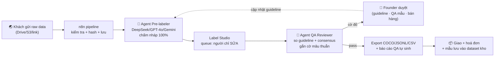

# Kế hoạch 18: OPC cung cấp dữ liệu AI (annotation/curation) — mẫu 张小博

> Model phụ trách: Codex · Ngày: 2026-09-10 · Trạng thái: draft
> Vốn tối đa: 3.000 USD · Người thực thi: 1 founder · Khung thời gian đánh giá: 6 tháng

## 1. Mô hình công ty (1 slide)

- **Khách hàng:** (a) phòng lab AI / startup trong & ngoài nước cần dữ liệu **tiếng Việt** (SFT/RLHF/eval/red-team cho LLM); (b) công ty AI y tế & bệnh viện cần nhãn ảnh X-quang/CT và chú thích bệnh án; (c) AgriTech cần ảnh cây trồng–sâu bệnh; (d) đích xa: hãng xe / ADAS cần dữ liệu làn đường (đúng đường đi của 张小博).
- **Bán gì (3 tầng giá trị):** ① dịch vụ annotation theo giờ/theo item (khởi động, có tiền ngay); ② **AI-assisted labeling** — dựng model pre-label cho từng loại dữ liệu, người chỉ sửa sai (lợi nhuận cao hơn, khó copy hơn); ③ **dữ liệu đóng gói** — bán dataset đã curated kèm license định kỳ.
- **Khác biệt:** ngách Việt/ĐNÁ mà đối thủ toàn cầu bỏ trống (tiếng Việt, ảnh y khoa bệnh viện VN, nông nghiệp nhiệt đới) + AI-first từ ngày 1 (pre-label bằng LLM/VLM, con người chỉ kiểm định).
- **Vì sao 1 người làm được:** tool annotation open-source miễn phí (Label Studio/CVAT), API model rẻ (vài chục USD/tháng), khách tìm từ xa qua sàn freelance, không cần văn phòng, không cần tồn kho — vốn 3.000 USD đủ cho 6 tháng.

## 2. Vì sao nó thắng ở Trung Quốc

- **Case 张小博 (仓颉智能) ✅** — từ OPC dán nhãn dữ liệu, dựng "智驾数据标注增效模型" tự đánh nhãn làn đường cho xe tự lái rồi **bán token cho hãng xe**; hiện 60 người, tự gọi là "STC" (Super Team Company) ✅ ([光明网/人民日报海外版](https://m.gmw.cn/2026-08/10/content_1304545694.htm), đã thẩm định trong master playbook mục 3.1).
- **Bài học copy trực tiếp:** (1) đừng bán giờ công — bán "mô hình tăng hiệu suất đánh nhãn", tức bán năng suất thay vì bán sức lao động; (2) đứng ở tầng nền móng của kỷ nguyên agent ("bán xẻng", ngành #6 bảng top ngành playbook); (3) OPC là khởi điểm, STC là đích — kế hoạch này phải có lối lên 60 người (nguyên tắc vàng #10).
- Ngữ cảnh: 75% founder OPC không có nền kỹ thuật ✅ (brief B1) — nhưng annotation KHÔNG phải nghề "không kỹ thuật"; founder giữ lõi là *kiểm định chất lượng + guideline*, việc lặp giao hết cho AI.

## 3. Thị trường VN & US

### 3.1 Quy mô & giá nhân công toàn cầu
- Thị trường annotation toàn cầu: **2,32 tỷ USD (2025) → 9,78 tỷ USD (2030), CAGR 33,27%** ([Second Talent](https://www.secondtalent.com/resources/data-annotation-costs-by-country-comparing-global-rates/)).
- Giá nhân công theo giờ: **châu Phi ~2 USD/h → Mỹ 60+ USD/h; Đông Nam Á 5–12 USD/h** — khúc giá tốt nhất thế giới về giá/chất lượng ([Second Talent](https://www.secondtalent.com/resources/data-annotation-costs-by-country-comparing-global-rates/)).
- Giá dịch vụ quản lý (managed): Scale AI 0,25–5 USD/ảnh, video 1–30 USD, đơn tối thiểu 500–2.000 USD; Labelbox 2–5 USD/item; crowdsourcing 0,10–0,50 USD/item nhưng chất lượng tự chịu ([Deploybase 03/2026](https://deploybase.ai/articles/best-data-labeling-tools)).
- Năng suất chuẩn: phân loại 10–20 item/h; bounding box 5–10/h; segmentation 2–5/h; model-assisted cắt giảm 50–70% thời gian; active learning giảm 30–50% khối lượng nhãn ([Deploybase FAQ](https://deploybase.ai/articles/best-data-labeling-tools)).

### 3.2 Việt Nam
- VN đang được định vị là hub annotation mới nổi: nguồn 650.000+ kỹ sư IT và chi phí "thấp hơn 56 lần so với Mỹ/TQ" ⚠️ (số liệu tự quảng cáo của vendor Second Talent, dùng làm tham chiếu hướng) ([Second Talent](https://www.secondtalent.com/resources/data-annotation-market-in-vietnam/)); có báo cáo thị trường riêng cho VN giai đoạn 2026–2032 ([6Wresearch](https://www.6wresearch.com/industry-report/vietnam-data-annotation-and-labeling-market)).
- Nhu cầu nội địa: làn sóng AI "made in Vietnam" được truyền thông quốc tế chú ý ([VietnamPlus](https://en.vietnamplus.vn/sputnik-praises-vietnams-home-grown-ai-apps-post275609.vnp)); hệ sinh thái dataset tiếng Việt trên Hugging Face còn mỏng — nhiều benchmark/bộ dữ liệu là nỗ lực cá nhân (vd [ViLegalBERT](https://huggingface.co/ntphuc149/ViLegalBERT)) → khoảng trống thật cho curated Vi datasets.
- Đối thủ tại VN: nhóm BPO annotation nội địa ⚠️ (chưa verify được tên cụ thể trong phiên này) và freelancer cá nhân — điểm yếu chung của họ là làm tay, không có tầng pre-label AI; đây chính là khe hở.

### 3.3 US
- US là **thị trường khách trả tiền cao** (60+ USD/h cho chuyên gia; nhu cầu RLHF/eval lớn), nhưng cạnh tranh lao động toàn cầu; cửa vào thực tế: bán từ xa qua sàn freelance + dataset đặc thù (tiếng Việt/y tế ĐNÁ là lợi thế hiếm, không ai ở US làm rẻ hơn).
- **Kết luận cửa nào trước:** bán cho khách quốc tế từ VN (thu ngoại tệ, không cần mở LLC ngay — nhận tiền qua Wise/PayPal). Mở LLC US chỉ khi đã có 2–3 khách doanh nghiệp US trả theo hợp đồng dài hạn.

## 4. Tech stack & kiến trúc tự động hoá

| Công cụ | Vai trò | Chi phí/tháng |
|---|---|---|
| Label Studio (self-host) | Nền tảng annotation chính (text/ảnh/audio/video) | 0 USD (cloud 25 USD nếu lười host) |
| CVAT (self-host) | Ảnh/video heavy (y tế, nông nghiệp) | 0 USD |
| Prodigy | NLP active learning (NER/quan hệ, tiếng Việt) | 60 USD/tháng commercial (hoặc 1.200 USD mua đứt) |
| DeepSeek / GPT-4o / Gemini API | Pre-label agent (VLM chấm ảnh, LLM sinh SFT/RLHF) | 20–50 USD |
| n8n (self-host) hoặc Make | Pipeline: nhận file → gọi API → đẩy vào Label Studio → xuất kết quả | 0–10 USD |
| Google Sheets/Notion | Quản lý đơn, guideline, QA log | 0 USD |
| Cursor + Claude Code | Script chuyển format (COCO/YOLO/JSONL), tool nhỏ | ~20 USD |
| Google Colab/Kaggle | Train/fine-tune model pre-label (GPU free) | 0 USD |
| Hugging Face | Host + quảng bá dataset, nhận issue | 0 USD |
| GitHub | Mã nguồn pipeline, portfolio | 0 USD |
| Wise/PayPal | Nhận tiền khách quốc tế | ~1% phí |

**Người làm:** viết guideline, kiểm định QA mẫu (10–20%), chốt giá, tìm khách, duyệt cờ đỏ. **AI làm:** pre-label, chuyển format, sinh báo cáo QA, nháp email/invoice, cập nhật bảng KPI.

## 5. Vận hành ngày/tuần của founder

**Lịch tuần mẫu (40–50h):**
- T2: 2h tổng kết tuần + cập nhật KPI; 3h bán hàng (gửi proposal, follow-up); 3h sửa nhãn.
- T3–T5: 4–5h/ngày sửa nhãn + duyệt QA; 2h/ngày cải thiện model pre-label (vòng lặp dữ liệu); 1h content (đăng dataset mẫu lên HF, viết case study).
- T6: 2h học guideline ngành mới; 2h test tool mới; còn lại buffer cho deadline.
- T7: nghỉ hoặc 2h QA nếu sát deadline.

**"Vị trí công việc AI" (mẫu 张顺 — chuẩn hoá có chức danh):**
1. **Pre-labeler** — prompt chính: *"Bạn là chuyên gia gán nhãn [loại dữ liệu]. Theo guideline đính kèm, đưa nhãn + confidence. Mục nào dưới 80% confidence → gắn cờ REVIEW, không đoán."* Công cụ: API GPT-4o/DeepSeek + script Python.
2. **QA Reviewer** — prompt: *"So 2 bản nhãn (người vs AI). Liệt kê mâu thuẫn, phân loại lỗi theo guideline, gợi ý sửa guideline nếu 1 lỗi lặp >3 lần."*
3. **Pipeline Engineer** — n8n + script: nhận file, pre-label, đẩy queue, export đúng format khách yêu cầu, log lỗi.
4. **SDR Bán hàng** — prompt: *"Từ danh sách lab AI/startup [nguồn], soạn email ≤100 từ: nhận diện nhu cầu dữ liệu [ngách], đính dataset mẫu, đề xuất pilot 1 tuần trả phí."*

**Vòng lặp dữ liệu (nguyên tắc vàng #7):** mỗi dự án → lưu guideline + prompt + model checkpoint vào kho riêng → dự án sau cùng loại bắt đầu từ mức 80% sẵn → giá thành giảm dần, đây là tài sản bán được ("AI-assisted labeling" như 张小博).

## 6. Mô hình doanh thu & chi phí

**Giá bán (định vị VN-hub, có nguồn):** annotation cơ bản 6–8 USD/h; y tế/chuyên sâu 15–25 USD/h; đóng gói theo item: 0,20–0,50 USD/item đơn giản, 1–3 USD/item segmentation (neo theo giá managed service [Deploybase](https://deploybase.ai/articles/best-data-labeling-tools) và khung SEA 5–12 USD/h [Second Talent](https://www.secondtalent.com/resources/data-annotation-costs-by-country-comparing-global-rates/)).
**Chi phí cố định/tháng:** API + tool ~100–150 USD; đăng ký kinh doanh 1 lần; không văn phòng.

| Tháng | Kịch bản TỆ (USD) | CƠ BẢN (USD) | TỐT (USD) |
|---|---|---|---|
| 1 | DT 200 · CP 250 · lỗ −50 | DT 400 · CP 250 | DT 800 · CP 300 |
| 2 | DT 300 · CP 250 · lỗ −50 | DT 800 · CP 300 | DT 1.500 · CP 350 |
| 3 | DT 400 · CP 250 (gần hoà vốn) | DT 1.200 · CP 350 (**hoà vốn ~800**) | DT 2.500 · CP 500 |
| 4–6 | 500–600/th, dần hoà vốn | 1.500–2.000/th | 3.000–4.000/th |
| 7–12 | 800/th (sống lay lắt → xem KILL) | 2.000–2.500/th | 5.000+/th → tuyển QA đầu tiên |

- Công thức hoà vốn: (CP cố định 300 USD) ÷ (giá 8 USD/h × ~60% giờ tính được tiền) ≈ **~60–70 giờ bán/tháng** — đạt được từ tháng 2–3 ở kịch bản cơ bản.
- Tổng vốn cần thiết 6 tháng: ~2.500–3.000 USD (gồm Prodigy nếu mua đứt 1.200 USD). Không cần GPU riêng nhờ Colab/Kaggle.

## 7. Lộ trình start-from-scratch

### Giai đoạn 0–30 ngày — dựng nền + đơn đầu tiên (CP ~500 USD)
1. Cài Label Studio + CVAT trên máy cá nhân (Docker, 0đ — theo [docs chính thức](https://labelstud.io/)); đăng ký tài khoản Hugging Face, GitHub, Wise, PayPal (ngày 1).
2. Chọn **1 ngách duy nhất** (đề xuất: dữ liệu tiếng Việt cho LLM — rào cản ngành thấp nhất, khách toàn cầu sẵn có; y tế cần bác sĩ cộng tác, làm ở tháng 3+).
3. Đăng ký pháp lý: TNHH một thành viên (OPC kiểu VN, theo brief B5) hoặc hộ kinh doanh ⚠️ (so sánh thuế tại chi cục thuế địa phương — mất 3–7 ngày, phí ~50–100 USD).
4. Viết 1 guideline mẫu (30 trang nháp bằng Claude/ChatGPT) + đóng 1 dataset demo 2.000 mẫu tiếng Việt (SFT pairs) bằng pre-label AI + tự sửa; đăng công khai lên HF (portfolio sống).
5. Lập 3 gói giá trên 1 trang landing đơn giản (Notion/Carrd): pilot 1 tuần, theo giờ, theo item.
6. Nối pipeline n8n: nhận Drive link → pre-label → Label Studio → export JSONL (2–3 ngày).
7. Gửi 20 email giới thiệu/tuần tới lab AI VN (VinAI, Zalo AI, FPT ⚠️ kiểm chứng danh sách) + 10 job post trên sàn quốc tế (Upwork ⚠️ lưu ý siết tài khoản VN mới, chuẩn bị hồ sơ kỹ).
8. **Mốc:** có 1 khách pilot trả tiền (dù 100 USD) trước ngày 30.

### Giai đoạn 30–60 ngày — đóng vòng lặp dữ liệu (CP ~300 USD/th)
1. Chạy 2–3 pilot song song; đo accuracy (consensus + spot-check) từng dự án.
2. Fine-tune/điều chỉnh prompt pre-label theo dữ liệu thật (Colab free); mục tiêu pre-label đúng ≥80% để người chỉ sửa.
3. Đóng gói quy trình thành SOP + "skill" tái dùng (mẫu 沉淀 skill của Feishu aily — brief B3).
4. Mua Prodigy nếu ngách NLP xác nhận có nhu cầu (60 USD/th hoặc 1.200 USD mua đứt).
5. Đăng dataset #2 (đã xin phép khách hoặc tự thu thập) lên HF; bắt đầu nhận tin nhắn inbound.
6. Tự động hoá invoice + báo cáo QA bằng n8n.
7. **Mốc:** doanh thu ≥600 USD/tháng lũy kế; 1 khách ký theo tháng.

### Giai đoạn 60–90 ngày — tầng "AI-assisted labeling" (CP ~350 USD/th)
1. Chuyển 1 khách từ "thuê người" sang "thuê quy trình": bán giá theo item với model pre-label riêng cho họ (biên lợi nhuận +30–50%).
2. Mở ngách thứ 2: y tế (tìm 1 bác sĩ cộng tác theo giờ 20–30 USD/h làm reviewer ⚠️ giá thỏa thuận; ký cam kết bảo mật dữ liệu bệnh nhân theo Nghị định 13/2023/NĐ-CP — brief B5).
3. Làm dataset nông nghiệp demo (ảnh sâu bệnh lúa/cà phê, nguồn mở) để đón làn sóng AgriTech.
4. **Mốc:** doanh thu ≥1.200 USD/th; ít nhất 1 hợp đồng theo item.

### Giai đoạn 90–180 ngày — sản phẩm dữ liệu & quyết định scale
1. Đóng gói 1 bộ dataset độc quyền bán license (1 lần + cập nhật định kỳ 6 tháng).
2. Nhận dự án video/ADAS nhỏ (đúng đường 张小博) nếu có khách; nếu không, giữ y tế + tiếng Việt.
3. Đánh giá KPI tháng 6 → KILL / giữ solo / SCALE (tuyển QA đầu tiên → STC).
4. Nếu SCALE: tuyển 1 QA part-time (từ chính freelancer giỏi đã cộng tác), chuyển mình sang bán hàng + guideline.
5. **Mốc:** doanh thu ≥2.000 USD/th bền 2 tháng liên tiếp = đạt ngưỡng scale.

## 8. Rủi ro & phòng thủ

| # | Rủi ro | Phòng thủ |
|---|---|---|
| 1 | **Đua giá xuống đáy** với Philippines/Ấn Độ (SEA 5–12 USD/h là vùng cạnh tranh khốc liệt — [Second Talent](https://www.secondtalent.com/resources/data-annotation-costs-by-country-comparing-global-rates/)) | Không bán giờ công thô: bán ngách hiếm (tiếng Việt/y tế VN) + tầng pre-label để rẻ hơn mà vẫn lời; tránh dự án "phân loại ảnh đơn giản" |
| 2 | **AI tự động hoá nuốt nghề tay** (model-assisted đã cắt 50–70% thời gian — [Deploybase](https://deploybase.ai/articles/best-data-labeling-tools)) | Đứng trước làn sóng: bán chính cái "AI-assisted labeling"; dịch chuyển lên curation/eval/RLHF mà AI chưa tự làm được |
| 3 | **Pháp lý dữ liệu cá nhân** — ảnh y khoa/bệnh án là dữ liệu cá nhân nhạy cảm theo Nghị định 13/2023/NĐ-CP (brief B5); khách quốc tế có GDPR/HIPAA | Hợp đồng xử lý dữ liệu (DPA) từng dự án; ẩn danh hoá trước khi nhãn; không lưu dữ liệu thô sau bàn giao; tách biệt thư mục từng khách |
| 4 | **Không kiếm được khách quốc tế** — sàn freelance siết tài khoản VN mới ⚠️ (tin đồn chưa verify; cần test sớm) | Đa kênh ngay từ đầu: HF (portfolio), LinkedIn outreach, mạng lưới lab AI VN, Zalo; khách VN cũng là khách |
| 5 | **Chất lượng/consensus kém → mất hợp đồng** | QA 2 lớp (AI + người), honeypot test, giao 110% mẫu QA; SLA ghi rõ accuracy cam kết (vd ≥95%) và quy trình sửa |
| 6 | **Cá nhân: burnout, cô độc, deadline dồn** | Không nhận quá 2 dự án song song; buffer 20% thời gian; tham gia cộng đồng (nhóm Zalo/đọc HF) để giữ nghề |
| 7 | **Phụ thuộc 1 nền tảng/tool** (Label Studio đổi license, HF đổi policy) | Export luôn ở format chuẩn (COCO/JSONL) — dữ liệu không khoá vào tool; có CVAT dự phòng |

## 9. KPI & tiêu chí kill/scale

**KPI chính (theo tuần/tháng):**
1. Doanh thu định kỳ tháng (MRR) — mục tiêu 800 USD (T3), 2.000 USD (T6).
2. Số khách trả tiền + tỷ lệ khách gia hạn (mục tiêu ≥50%).
3. Độ chính xác nhãn (consensus/spot-check) ≥95%; tỷ lệ rework <5%.
4. Tỷ lệ pre-label đúng ≥80% (tự động hoá biên lợi nhuận).
5. Giờ bán được/tuần (≥15h bán hàng + 25h sản xuất).

**Ngưỡng KILL (tháng 6):** MRR < 500 USD HOẶC mất >5 giờ/tuần bán hàng mà 2 tháng liền không có 1 hợp đồng mới → dừng, chuyển mô hình (giữ kho dataset làm tài sản phụ).
**Ngưỡng SCALE:** MRR ≥ 2.000 USD bền 2 tháng + có ≥2 khách theo item → tuyển QA đầu tiên (part-time) → mình chuyển sang bán hàng + guideline → lộ trình STC 60 người như 张小博.
**Quy tắc:** không scale bằng nhân công tay trước khi tầng pre-label chạy ≥80% — nếu không sẽ thành BPO lao động thường, mất hết lợi thế AI.

## 10. Nguồn tham khảo

- 张小博/仓颉智能 + chính sách OPC Hàng Châu: [光明网 2026-08-10](https://m.gmw.cn/2026-08/10/content_1304545694.htm) (truy cập 2026-09-10).
- Giá annotation theo quốc gia 2026 + quy mô thị trường: [Second Talent](https://www.secondtalent.com/resources/data-annotation-costs-by-country-comparing-global-rates/) (truy cập 2026-09-10).
- Thị trường annotation VN: [Second Talent](https://www.secondtalent.com/resources/data-annotation-market-in-vietnam/) và [6Wresearch](https://www.6wresearch.com/industry-report/vietnam-data-annotation-and-labeling-market) (truy cập 2026-09-10).
- So sánh công cụ & giá 03/2026: [Deploybase](https://deploybase.ai/articles/best-data-labeling-tools) (truy cập 2026-09-10).
- Hệ sinh thái dữ liệu tiếng Việt trên HF (ví dụ nỗ lực cá nhân): [ViLegalBERT](https://huggingface.co/ntphuc149/ViLegalBERT) (truy cập 2026-09-10).
- AI Việt Nam được quốc tế ghi nhận: [VietnamPlus](https://en.vietnamplus.vn/sputnik-praises-vietnams-home-grown-ai-apps-post275609.vnp) (truy cập 2026-09-10).
- Master playbook (case, nguyên tắc, bản đồ công cụ): `plans/reports/260910-1118-opc-china-master-playbook.md`.

## 11. Câu hỏi mở

1. Khách quốc tế có chấp nhận vendor cá nhân VN không có chứng nhận (ISO 27001/27701) không — hay phải khoác áo công ty TNHH ngay từ đầu?
2. Nghị định 13/2023/NĐ-CP áp dụng ra sao khi dữ liệu là của khách nước ngoài, xử lý tại VN (cross-border)? Cần tư vấn luật 1 buổi.
3. Liệu bán dataset tiếng Việt độc quyền có đủ volume khách mua (labs VN + diaspora + AI global localisation) để thành sản phẩm riêng?
4. Có chương trình hỗ trợ/token nào của chính phủ VN hoặc accelerator cho data/AI startup nhỏ để bù chi phí GPU khi scale không?
5. Giá sàn Upwork/Fiverr cho mảng annotation với tài khoản VN mới hiện tại (2026) là bao nhiêu và policy có hạn chế gì — cần test thực tế ngay tuần 1.
