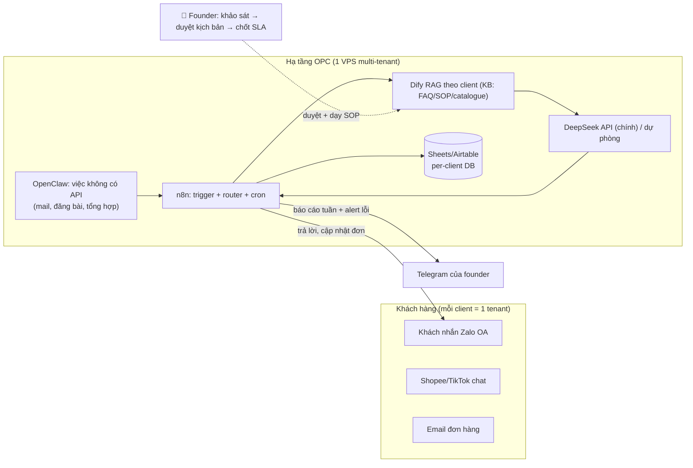

# Kế hoạch 19: Agent Manager — dựng & vận hành "đội ngũ AI" thuê cho doanh nghiệp (OPC)

> Model phụ trách: Codex · Ngày: 2026-09-10 · Trạng thái: draft

## 1. Mô hình công ty (1 slide)

- **Khách hàng:** SME Việt Nam 3–30 nhân viên bị ngộp việc lặp — seller TikTok Shop/Shopee (hỏi giá, khiếu nại, đăng listing), shop bán lẻ, phòng khám, trung tâm dạy học, đại lý B2B — có quy trình rõ nhưng không có người "rảnh tay" và không thuê nổi CTO.
- **Bán gì:** "AI employee cho thuê theo tháng" — OPC nhận khoán vận hành: khảo sát quy trình khách → dựng agent team (CSKH, content/listing, báo cáo…) bằng n8n/Dify/OpenClaw → chạy 24/7 + bảo trì theo SLA (thời gian phản hồi, uptime, báo cáo tuần). Mẫu sản phẩm = **5 AI employees của 张顺** đóng gói thành gói dịch vụ.
- **Khác biệt:** (1) bản địa — tiếng Việt chuẩn, tích hợp Zalo OA (kênh chăm sóc chính của SME VN), hiểu hoá đơn điện tử/thuế VN; (2) mỗi agent có **chức danh + SOP + KPI** như nhân viên thật (dễ trình bày, dễ đo, dễ gia hạn); (3) rẻ hơn 10–20× một nhân viên thật; (4) đối thủ ngoại (agency US) chỉ bán dự án $8.000+ và không nói tiếng Việt; đối thủ commodity (Hostinger Agents $7/tháng) bán "đồ chay" không gắn vào quy trình khách.
- **Vì sao 1 người làm được:** n8n + Dify + OpenClaw tự làm ~90% khối lượng; founder chỉ giữ 3 thứ — khảo sát nhu cầu, duyệt kịch bản, quan hệ khách (đúng nguyên tắc: người giữ định hướng + niềm tin + rủi ro).

## 2. Vì sao nó thắng ở Trung Quốc

- **张顺 ✅** — 1 người, 2 shop eBay, **5 nhân viên AI 24/7** (chọn hàng, CSKH, pháp lý, tài chính, đào tạo SOP), chuẩn hoá thành "vị trí công việc AI" có chức danh ([南国都市报](http://szb.ngdsb.cn/h5/html5/2026-07/23/content_58867_19728456.htm)). → Đây chính là **catalogue sản phẩm** của kế hoạch này: đóng gói từng "vị trí" thành gói thuê.
- **光年易达 ✅** — AI CSKH đêm 1 agent = 10+ người trực; nguyên tắc "AI hoá triệt để → chuẩn hoá cục bộ → người giỏi nhất giữ lõi" ([中国经营报](https://news.qq.com/rain/a/20260326A04AP000)). → Agent Manager bán đúng thứ họ dùng: "AI hoá" phần lặp của doanh nghiệp khách.
- **冉伟 ✅** — 48 giờ dựng nền tảng phục vụ chính OPC; "bán xẻng cho thợ đào vàng" là một ngành ([天下网商/界面](https://m.jiemian.com/article/14193991.html)). → Dịch vụ cho SME dùng AI là phiên bản "bán xẻng" ở VN.
- **Hạ tầng đã chín ✅:** Alibaba đóng gói sẵn OpenClaw vào bộ OPC Starter ¥158–362/năm cho doanh nghiệp nhỏ ([阿里云开发者社区](https://developer.aliyun.com/article/1753572)) — bằng chứng bigtech đang "đóng gói agent thành dịch vụ", ta làm tầng cuối: **gắn agent vào quy trình + trông nom nó hộ khách**.
- **Template kiến trúc miễn phí ✅:** `wenbuer/opc-web-dsh` mô hình "đội AI" R0 (duyệt) → R1 (phân rã task) → RX (thực thi theo vai) ([GitHub](https://github.com/wenbuer/opc-web-dsh)); opc-agentos cấu hình agent bằng Markdown Identity/Soul/Role/Tools ([npm registry](https://registry.npmjs.org/opc-agentos)) ⚠️ chỉ 31 tải/tháng, repo không khai báo, **chỉ dùng trong sandbox để học mẫu thiết kế** — không đưa vào production.
- **Bài học copy:** (1) chuẩn hoá vị trí công việc AI có chức danh; (2) "dạy agent như dạy nhân viên, 沉淀 thành skill" (Feishu aily pattern ✅) → mỗi khách để lại 1 SOP, SOP là tài sản tích luỹ của OPC.

## 3. Thị trường VN & US

- **VN (vào trước):** chưa có số liệu chính thức quy mô thị trường agency AI VN ⚠️ (không verify được trong hạn mức search). Tín hiệu thuận: Chính phủ đang triển khai chương trình hỗ trợ kỹ năng AI cho doanh nghiệp nhỏ và vừa ([vietnam.vn](https://www.vietnam.vn/en/doanh-nghiep-nho-va-vua-duoc-ho-tro-ky-nang-ai)); SME VN giao dịch và chăm sóc khách chủ yếu qua Zalo — đúng kênh mà agent làm chủ tốt nhất (Zalo OA có API chính thức). Đối thủ: agency chatbot nội địa nhỏ lẻ (bán dự án 1 lần, ít SLA) ⚠️ ước lượng; nguy cơ commoditisation: Hostinger ra mắt 04/2026 gói "7 AI agents = 7-person team" giá **$7/tháng** ([Hostinger blog](https://www.hostinger.com/blog/hostinger-agents-launch)) — nhưng đây là agent "chung chung" không gắn vào quy trình, không hỗ trợ tiếng Việt sâu, không có người đứng ra chịu trách nhiệm → ta bán **kết quả + trách nhiệm**, không bán công cụ.
- **US (sau, qua partner):** mặt bằng giá đã đo được — build agent SMB: $3.000–7.000, retainer bảo trì solo/boutique $500–1.500/tháng, retainer agency $2.500–8.000/tháng; chi phí vận hành agent: model $50–500/tháng + hạ tầng $20–200/tháng ([Cognio](https://cognio.so/resources/guides/ai-agent-cost)). Rào cản: bán niềm tin từ xa khó; cạnh tranh per-resolution (Intercom Fin $0,99/resolution — cùng nguồn Cognio). Cửa vào hợp lý: **làm trắng nhãn (white-label) cho agency US** hoặc phục vụ seller TikTok Shop US gốc Việt.
- **Kết luận:** VN trước vì bán được qua quan hệ trực tiếp + Zalo; dùng mặt bằng giá US làm trần để định giá VN.

## 4. Tech stack & kiến trúc tự động hoá

| Công cụ | Vai trò | Chi phí/tháng |
|---|---|---|
| **n8n self-host** (Docker, VPS 4GB) | Xương sống workflow: trigger Zalo/mail → LLM → ghi DB → báo cáo | $0 phần mềm (Community, unlimited executions ✅ [cloudzero](https://www.cloudzero.com/blog/n8n-pricing/)); VPS ~$12 |
| **Dify self-host** | Chatbot RAG cho từng khách: KB riêng (FAQ, SOP, catalogue), kiểm soát dữ liệu | $0 phần mềm; chung VPS |
| **OpenClaw** (cài từ `openclaw.ai` chính thức, BYOK) | "Tay chân" cho việc không có API: đọc mail, đăng bài, tổng hợp; gặp founder qua Telegram | $0 phần mềm ([openclaw.ai](https://openclaw.ai/)); API model tự trả |
| **DeepSeek API** (model chính) + dự phòng GPT/Gemini qua gateway | Não: trả lời CSKH, viết listing, phân loại đơn | ~$30–60 cho 3–5 khách ⚠️ ước lượng theo khối lượng |
| **Google Sheets/Airtable** | Database trung tâm per-client (đơn, hội thoại, KPI) — pattern "1 bảng + 1 chat + bot" | $0–12 |
| **Zalo OA** (mỗi khách 1 OA hoặc OA của khách + cấp quyền) | Giao diện khách hàng cuối | $0 (OA thường); template phí ~0–3 triệu VND/năm tuỳ loại ⚠️ |
| **Telegram** | Bảng điều khiển founder: alert lỗi, báo cáo ngày | $0 |
| **opc-agentos** | ⚠️ CHỈ trong máy ảo/sandbox: học mẫu "team agent" Markdown | $0 |
| GitHub private repo | Lưu workflow + SOP + skill làm tài sản | $0 |

- **Người làm:** khảo sát quy trình, duyệt kịch bản trả lời, chốt hợp đồng/SLA, gặp khách định kỳ.
- **AI làm:** trả lời tin, phân loại đơn, đăng listing/content, đối soát, báo cáo KPI, cảnh báo bất thường.

## 5. Vận hành ngày/tuần của founder

**Lịch tuần mẫu:** Thứ 2: xem báo cáo tự động 5 khách (30') + họp Zalo 15' với 1–2 khách; Thứ 3: dạy/tinh chỉnh 1 SOP từ log hội thoại; Thứ 4: prospecting 10 SME mới (Zalo/Facebook group seller); Thứ 5: build/điều chỉnh workflow; Thứ 6: kiểm tra lỗi, cập nhật KB; cuối tuần: chốt số, nạp API nếu cần. Tổng ~4–6h/ngày, còn lại OpenClaw + cron chạy 24/7.

**5 "vị trí công việc AI" (đóng gói từ mẫu 张顺):**

| Chức danh | Prompt chính | Công cụ |
|---|---|---|
| 1. Nhân viên CSKH | "Trả lời theo SOP [tên khách]; không biết thì xin thông tin rồi chuyển người duyệt" | Dify + n8n + Zalo OA |
| 2. Nhân viên Content/Listing | "Từ ảnh + thông số sản phẩm → listing chuẩn SEO Shopee/TikTok + bài đăng 7 ngày" | DeepSeek + n8n + OpenClaw đăng bài |
| 3. Nhân viên Báo cáo–Kế toán | "Mỗi sáng: tổng hợp đơn, tồn kho, tiền thu; cảnh báo chênh lệch" | n8n cron + Sheets |
| 4. Nhân viên Nghiên cứu | "Quét trend/keyword/giá đối thủ → gợi ý 5 hành động/tuần" | OpenClaw + DeepSeek |
| 5. Nhân viên Đào tạo SOP | "Đọc log hội thoại + bản ghi họp → viết SOP/SKILL.md cho agent khác" | DeepSeek + git repo skill |

**Vòng lặp dữ liệu:** hội thoại → log → founder duyệt mẫu trả lời tốt/xấu → cập nhật KB/skill → agent tốt hơn → khách giữ lâu hơn → SOP tích luỹ thành thư viện bán cho khách mới nhanh hơn.

## 6. Mô hình doanh thu & chi phí

**Định giá ⚠️ (tự đặt, neo theo thị trường US đã verify):** khách VN trả — setup 2–5 triệu VND/agent (khảo sát + build + test); retainer 1,5–3 triệu VND/agent/tháng theo khối lượng tin; khách US (sau này) $500–1.500/agent/tháng ([Cognio](https://cognio.so/resources/guides/ai-agent-cost)).

**Bảng ước lượng 12 tháng (VND, 1 người, vốn ≤3.000 USD ≈ 75 triệu):**

| Tháng | 1 | 2 | 3 | 4 | 5 | 6 | 9 | 12 |
|---|---|---|---|---|---|---|---|---|
| Số khách (kịch bản cơ bản) | 1 | 2 | 3 | 4 | 5 | 6 | 8 | 10 |
| Doanh thu (triệu) | 5 | 10 | 16 | 21 | 27 | 33 | 44 | 55 |
| Chi phí (triệu) | 4 | 5 | 6 | 7 | 8 | 9 | 12 | 15 |
| Luỹ kế lãi/lỗ (triệu) | +1 | +6 | +16 | +30 | +49 | +73 | +130 | +210 |

- **Chi phí/tháng:** VPS $12 + DeepSeek API $30–60 + SaaS lặt vặt ~500k VND + marketing (chạy quảng cáo group seller) 1–2 triệu = **~2,5–3,5 triệu VND/tháng**.
- **Hoà vốn: ~2 khách retainer** (tháng 2–3 kịch bản cơ bản).
- **Kịch bản tệ:** 6 tháng chỉ giữ 2 khách → lỗ luỹ kế ~10 triệu, dừng theo ngưỡng KILL (mục 9). **Kịch bản tốt:** 1 khách anchor 5 agent + 2 khách US white-label từ tháng 7 → MRR ~100 triệu/tháng 12.

## 7. Lộ trình start-from-scratch

**Giai đoạn 0–30 ngày — "1 agent chạy thật cho 1 khách"** (chi phí ~5 triệu):
1. Đăng ký Zalo OA tài khoản doanh nghiệp (miễn phí, xác minh CCCD/giấy phép, 1–3 ngày) — dùng cho chính OPC trước.
2. Thuê VPS VN (VD: Vietnix/BKCloud 4GB, ~250k VND/tháng ⚠️ giá tham khảo), cài Docker + n8n + Dify theo docs chính thức.
3. Đăng ký DeepSeek API (platform.deepseek.com, nạp $10) + nối Telegram cho OpenClaw; cài OpenClaw **chỉ từ openclaw.ai**.
4. Chọn khách đầu tiên: ưu tiên 1 seller TikTok Shop/Shopee bạn quen — mời **miễn phí 1 tháng** đổi lấy SOP + lời chứng thực (mẫu "tiêu chí ≥1 khách trả tiền" của Ninh Ba: ở đây bắt đầu bằng khách dùng thật).
5. Khảo sát 2 buổi: vẽ quy trình CSKH + FAQ 20 câu + sản phẩm 50 SKU → viết SOP.
6. Build workflow CSKH: Zalo webhook → Dify RAG → trả lời + ghi log Sheets. Test 100 câu hỏi, founder duyệt 100% trước khi mở.
7. **Mốc:** khách dùng hết tháng 1, trả lời đúng ≥90% câu FAQ không cần người.

**Giai đoạn 30–60 ngày — "đóng gói 5 vị trí AI + 3 khách trả tiền"** (chi phí ~6 triệu):
1. Viết "bảng giá + 1-pager sản phẩm" mô tả 5 AI employees (mục 5) kèm demo 2 phút quay màn hình.
2. Prospecting 30 seller qua group Zalo/Facebook (TikTok Shop VN, Shopee seller) — gửi demo, không spam.
3. Chốt khách #2, #3 với giá setup 3 triệu + retainer 2 triệu/agent/tháng; ký hợp đồng khoán vận hành ghi rõ SLA (phản hồi ≤5 phút giờ hành chính, ≤30 phút đêm) + điều khoản bảo mật theo Nghị định 13/2023/NĐ-CP.
4. Mỗi khách mới: clone template workflow vào tenant riêng (folder n8n + KB Dify riêng), build ≤3 ngày.
5. Bật nhân viên Báo cáo + Nghiên cứu cho khách anchor.
6. **Mốc:** 3 khách trả tiền, MRR ≥6 triệu, uptime workflow 99%.

**Giai đoạn 60–90 ngày — "bán thêm agent, dựng skill library"**:
1. Bán thêm vị trí #2 (Content/Listing) cho khách hiện hữu — upsell tự nhiên nhất.
2. Tuyển cộng tác viên bán hàng (commission 20–30% tháng đầu) nếu cần volume.
3. Đóng gói SOP đã chạy thành thư viện `SKILL.md` trên GitHub private — khách mới build còn 1 ngày.
4. Đo chi phí token/khách thật → tinh chỉnh giá retainer.
5. **Mốc:** 5 khách, MRR ≥10 triệu, 1 khách dùng ≥3 agent.

**Giai đoạn 90–180 ngày — "scale + cửa US":**
1. Đàm phán white-label 1 agency US (giá bán buôn ~40% retail, [Cognio](https://cognio.so/resources/guides/ai-agent-cost) làm khung).
2. Chuẩn hoá onboarding: checklist khảo sát 1 trang + video training khách 10 phút.
3. Nâng VPS, thêm backup + monitoring (UptimeRobot/N8N HealthCheck), tách DB per-client.
4. Đánh giá KILL/SCALE theo mục 9; nếu SCALE: thuê 1 người vận hành (6–10 triệu/tháng) → OPC → STC.
5. **Mốc:** MRR ≥30 triệu hoặc 1 hợp đồng US; quy trình bàn giao vận hành cho người thuê đầu tiên.

## 8. Rủi ro & phòng thủ

1. **Churn & "agent chết lặng lẽ":** agent hỏng không kêu to; Gartner dự báo 40%+ dự án agentic AI bị huỷ trước 2027 ([Cognio](https://cognio.so/resources/guides/ai-agent-cost)). → Bán retainer bắt buộc kèm monitoring; alert lỗi về Telegram trong 15 phút; test KPI/SOP **trước** khi build (chỉ nhận khách có SOP hoặc chịu để ta viết SOP); báo cáo tuần bằng số.
2. **Nền tảng đổi chính sách (Zalo OA, Shopee/TikTok API):** hạn mức tin, phí OA, cấm tự động hoá thay đổi nhanh. → Giữ dữ liệu + logic ở hạ tầng của mình, chỉ dùng kênh làm "cổng"; có sẵn kịch bản chuyển kênh (Zalo ↔ Facebook Messenger ↔ web chat); đọc policy trước mỗi tích hợp mới.
3. **Pháp lý dữ liệu cá nhân:** xử lý dữ liệu khách hàng của khách → ràng buộc **Nghị định 13/2023/NĐ-CP** (VN). → Hợp đồng nêu vai trò "bên xử lý dữ liệu"; server đặt VN; chỉ lưu tối thiểu (số điện thoại/địa chỉ phục vụ đơn), mã hoá + phân quyền; không gửi dữ liệu cá nhân cho model nước ngoài khi không cần (che trước khi đưa vào prompt). Nếu có khách US → CCPA.
4. **Công nghệ:** biến động giá token/model; opc-agentos rủi ro supply-chain cao ⚠️; OpenClaw có bản giả mạo yêu cầu tắt antivirus. → Gateway đa model (chính DeepSeek, dự phòng GPT/Gemini); **opc-agentos chỉ sandbox**, production chỉ n8n/Dify/OpenClaw; chỉ cài OpenClaw từ repo chính thức/openclaw.ai; không nhập API key vào môi trường không cô lập.
5. **Cá nhân (burnout vì SLA 24/7):** → SLA phân tầng: giờ hành chính ≤5 phút, đêm ≤30 phút, cấp gói "hotline đêm" giá cao hơn; agent trực đêm tự lo 90% trường hợp; founder tắt thông báo 23h–7h.
6. **Commoditisation ($7 Hostinger):** → không bán công cụ, bán **kết quả + trách nhiệm + bản địa hoá**; đưa "điểm cắt" vào hợp đồng (KPI cụ thể, không đạt → giảm giá/thanh lý).

## 9. KPI & tiêu chí kill/scale

- **KPI:** (1) MRR; (2) số khách trả tiền & tỷ lệ gia hạn sau 3 tháng (mục tiêu ≥80%); (3) % tin trả lời đúng không cần người (mục tiêu ≥85% FAQ); (4) chi phí token/khách/tháng (mục tiêu ≤500k VND); (5) biên gộp ≥70%.
- **KILL (tháng 3):** <2 khách trả tiền HOẶC 2 khách đầu đều không gia hạn → dừng tuyển khách mới, xoay sang bán template/SOP cho agency khác hoặc quay lại mô hình 14 (chatbot/RAG agency) trong 2 tuần.
- **SCALE:** MRR ≥50 triệu ổn định 2 tháng → thuê người vận hành thứ 2 (→ STC kiểu 张小博); MRR ≥20 triệu + tỷ lệ gia hạn 90% → tăng giá gói mới, mở nhánh white-label US.

## 10. Nguồn tham khảo (truy cập 2026-09-10)

- [南国都市报 — 张顺 và 5 AI employees](http://szb.ngdsb.cn/h5/html5/2026-07/23/content_58867_19728456.htm)
- [中国经营报 — 光年易达 AI+跨境电商](https://news.qq.com/rain/a/20260326A04AP000)
- [天下网商/界面 — 一人AI公司 (冉伟, 景行)](https://m.jiemian.com/article/14193991.html)
- [Cognio — AI agent cost 2026 (build/run/retainer, Gartner 40%)](https://cognio.so/resources/guides/ai-agent-cost)
- [CloudZero — n8n pricing 2026](https://www.cloudzero.com/blog/n8n-pricing/)
- [Hostinger — Hostinger Agents $7/month](https://www.hostinger.com/blog/hostinger-agents-launch)
- [vietnam.vn — SME VN được hỗ trợ kỹ năng AI](https://www.vietnam.vn/en/doanh-nghiep-nho-va-vua-duoc-ho-tro-ky-nang-ai)
- [阿里云开发者社区 — OPC 装备库 + OpenClaw thực chiến](https://developer.aliyun.com/article/1753572)
- [GitHub wenbuer/opc-web-dsh — workbench đội AI R0/R1/RX](https://github.com/wenbuer/opc-web-dsh)
- [npm registry opc-agentos — ⚠️ chỉ sandbox](https://registry.npmjs.org/opc-agentos)

## 11. Câu hỏi mở

1. Zalo OA hiện (09/2026) có hạn chế gì với webhook/bot trả lời tự động cho OA doanh nghiệp, phí template là bao nhiêu? (chưa verify trong hạn mức search ⚠️)
2. Chính sách tự động hoá chat của Shopee/TikTok Shop VN có cấm bot trả lời không, hay chỉ cấm spam?
3. Giá retainer 1,5–3 triệu VND/agent/tháng có đúng mức sẵn sàng chi trả của seller VN không — cần test A/B giá với 10 khách thật trước khi khoá bảng giá.
4. Có chương trình hỗ trợ SME chuyển đổi số nào của VN (Sở KH&ĐT, Bộ TT&TT) tài trợ một phần chi phí AI mà OPC có thể đứng ra làm đơn vị cung cấp không?
5. Nghĩa vụ thuế của mô hình "khoán vận hành thuê tháng" — khai theo hợp đồng dịch vụ (TNCN 10% với hộ cá thể) hay cần thành lập công ty ngay từ tháng đầu?
