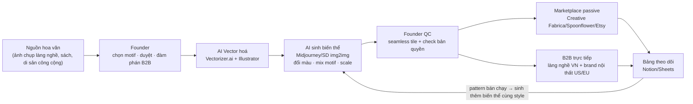

# Kế hoạch 20: Xưởng IP/thiết kế cấp phép bằng AI (OPC)

> Model phụ trách: Claude · Ngày: 2026-09-10 · Trạng thái: draft
> ⚠️ **Giới hạn phiên làm việc:** công cụ WebSearch/WebFetch bị từ chối quyền truy cập trong phiên này ("Claude Code is running in don't ask mode") — không thực hiện được 4 lượt deep-research như brief yêu cầu. Nội dung dưới đây dùng: (a) kiến thức đã thẩm định trong brief/master playbook (có nguồn), (b) kiến thức nền phổ biến về ngành licensing/pháp lý IP mà KHÔNG có link xác minh mới — mọi mục loại này được đánh dấu ⚠️ và ghi rõ "kiến thức nền, chưa re-verify qua web phiên này". Founder nên tự kiểm tra lại các mục ⚠️ trước khi ra quyết định tài chính/pháp lý. Xem mục 11.

## 1. Mô hình công ty

- **Khách hàng:** (a) marketplace thiết kế số toàn cầu (nhà thiết kế thời trang/nội thất/bao bì mua license pattern để dùng lại), (b) làng nghề/xưởng dệt-gốm-nội thất VN cần mẫu hoa văn mới mà không đủ tiền thuê designer riêng, (c) thương hiệu thời trang/nội thất vừa và nhỏ ở US/EU muốn họa tiết "heritage-inspired" độc quyền.
- **Bán gì:** thư viện họa tiết (pattern/motif) số hoá từ hoa văn truyền thống Việt Nam (thổ cẩm dân tộc thiểu số, hoa văn Đông Hồ, gốm Bát Tràng/Chu Đậu, chạm khắc gỗ, hoa văn Chăm...) được AI biến thể (recolor, remix, mở rộng seamless tile) thành **thiết kế phái sinh có thể cấp phép thương mại** — không bán "ảnh chụp di sản" mà bán "tác phẩm phái sinh do người + AI đồng sáng tạo".
- **Khác biệt:** nguồn nguyên liệu văn hoá VN (54 dân tộc, hàng trăm làng nghề) gần như chưa ai số hoá bằng AI để bán ra quốc tế; đối thủ marketplace quốc tế chủ yếu bán pattern hoa lá/hình học chung chung, ít chiều sâu văn hoá — đây là ngách khác biệt hoá thật.
- **Vì sao 1 người làm được:** pipeline AI làm hộ 80% việc kỹ thuật (vector hoá, sinh biến thể màu/bố cục, viết mô tả SEO); người chỉ giữ 3 việc — chọn motif nguồn đúng gu văn hoá, duyệt chất lượng/tránh trùng lặp bản quyền, đàm phán hợp đồng B2B. Không cần xưởng, không cần tồn kho vật lý (bán file số + license).

## 2. Vì sao nó thắng ở Trung Quốc

- **Case ✅ 智拙视觉** (2 cựu kỹ sư NVIDIA): trích xuất hoa văn di sản văn hoá phi vật thể Trung Quốc → AI sinh thiết kế phái sinh → cấp phép cho ngành dệt may, gốm sứ; "doanh thu ổn định" ([上观新闻/解放日报, 12/2025](https://www.shobserver.com/wx/detail.do?id=1036074), đọc 10/09/2026). Bài học: nền tảng kỹ thuật AI mạnh (2 cựu NVIDIA) không dùng để làm sản phẩm AI thuần tuý, mà dùng để **số hoá tài sản văn hoá thành hàng hoá cấp phép lặp lại được** — mỗi motif bán được nhiều lần cho nhiều khách (đặc tính kinh tế của IP: chi phí biên gần 0).
- Case liên quan cùng cụm hạ tầng Lâm Cảng — Thượng Hải ưu tiên 8 ngành OPC trong đó có "xử lý dữ liệu văn hoá" ✅ ([上观新闻](https://www.shobserver.com/wx/detail.do?id=1036074)).
- **Bài học cụ thể để copy:** (1) không cạnh tranh về *số lượng pattern generic* với các nhà thiết kế AI khác — cạnh tranh bằng *chiều sâu văn hoá bản địa* mà AI ngoại quốc không có dữ liệu train; (2) mô hình doanh thu là **cấp phép (license) lặp lại**, không phải bán đứt 1 lần — giống bán phần mềm hơn là bán tranh; (3) người sáng lập giữ vai trò "người hiểu văn hoá + gu thẩm mỹ", AI giữ vai trò "tay nghề kỹ thuật".

## 3. Thị trường VN & US

### VN — cửa vào trước (nhanh, ít vốn)
- Đối tượng: làng nghề dệt (Vạn Phúc, Nha Xá, thổ cẩm Mai Châu/Sa Pa), gốm (Bát Tràng, Chu Đậu, Phù Lãng), sơn mài (Hạ Thái), nội thất/decor nhỏ — nhóm này thường **có tay nghề sản xuất tốt nhưng thiếu năng lực thiết kế mẫu mới**, đang cần "làm mới" để bán được giá cao hơn/xuất khẩu.
- Cạnh tranh: hầu như chưa có ai chuyên bán "dịch vụ AI hoá hoa văn cấp phép" tại VN — ngách trống, nhưng cũng đồng nghĩa thị trường chưa được giáo dục, cần founder tự đi thuyết phục từng xưởng (bán hàng trực tiếp, không có sẵn nhu cầu rõ ràng như TikTok Shop).
- Pháp lý VN cần biết trước khi ký hợp đồng cấp phép:
  - Luật Sở hữu trí tuệ VN: tác phẩm mỹ thuật ứng dụng (trong đó có thiết kế hoa văn) được bảo hộ quyền tác giả tự động khi công bố; kiểu dáng công nghiệp muốn độc quyền mạnh hơn phải đăng ký tại Cục Sở hữu trí tuệ (⚠️ kiến thức nền về khung Luật SHTT VN, chưa re-verify thời hạn/thủ tục mới nhất qua web phiên này — cần hỏi lại 1 luật sư SHTT hoặc tra cứu ipvietnam.gov.vn trước khi soạn hợp đồng thật).
  - Hoa văn dân tộc thiểu số truyền thống (cổ, đã phổ biến) thường ở dạng "di sản văn hoá phi vật thể", không thuộc sở hữu cá nhân nào — an toàn để lấy cảm hứng, nhưng **tuyệt đối không chụp/scan lại nguyên trạng tác phẩm của nghệ nhân đương đại còn sống rồi bán như của mình** — đó là vi phạm quyền tác giả cá nhân, phải xin phép/trả tác quyền hoặc chỉ dùng làm "tham khảo phong cách" rồi AI tạo bố cục mới hoàn toàn.
  - Hộ kinh doanh cá thể (ngành nghề: thiết kế đồ hoạ/dịch vụ sáng tạo) đủ để bắt đầu — chi phí đăng ký thấp, thuế khoán đơn giản; nâng cấp lên TNHH MTV (= OPC pháp lý VN theo brief B5) khi có hợp đồng B2B lớn/quốc tế cần xuất hoá đơn VAT.

### US — cửa vào sau (thu nhập ngoại tệ, cạnh tranh cao hơn)
- Kênh: marketplace pattern-licensing quốc tế (Creative Fabrica, Spoonflower, Patternbank, Design Bundles, Etsy digital download) — đều nhận seller cá nhân ở VN, thanh toán qua PayPal/Payoneer/Wise (⚠️ danh sách nền tảng là kiến thức nền phổ biến trong ngành design licensing, chưa re-verify chính sách/hoa hồng hiện hành qua web phiên này — founder phải đọc lại Terms of Service + trang seller/artist trước khi đăng bán).
- Pháp lý US cần lưu ý:
  - **US Copyright Office** yêu cầu "human authorship" để đăng ký bản quyền — tác phẩm do AI tạo hoàn toàn tự động, không có sự can thiệp sáng tạo đủ mức của con người, có thể **không được cấp bản quyền** (⚠️ đây là chủ trương đã công bố rộng rãi từ 2023 — "Copyright Registration Guidance: Works Containing AI-Generated Material" — kiến thức nền, chưa re-fetch văn bản gốc trong phiên này do WebFetch bị chặn; founder nên tự đọc lại copyright.gov trước khi đăng ký bản quyền chính thức). **Ý nghĩa thực tế:** phải giữ lại bằng chứng công đoạn con người chỉnh sửa/bố cục lại (không chỉ export thẳng ảnh AI) để tăng khả năng được bảo hộ và tránh tranh chấp bản quyền với khách mua license.
  - **Indian Arts and Crafts Act (luật liên bang Mỹ)** cấm quảng cáo/gắn nhãn sản phẩm là "hàng thủ công bản địa Mỹ (Native American)" nếu không đúng — không liên quan trực tiếp tới hoa văn Việt Nam, nhưng là lời nhắc: nếu mở rộng sang bán "heritage pattern" ở thị trường US, phải ghi đúng nguồn gốc văn hoá (Việt Nam, dân tộc cụ thể), không gắn nhầm/gắn bừa nhãn văn hoá khác để tránh vi phạm luật ghi nhãn.
- **Cửa nào dễ vào trước:** VN B2B trực tiếp (tháng 1–3, thu nhập nhanh dù nhỏ, ít đối thủ) song song xây portfolio thụ động trên marketplace quốc tế (thu nhập chậm nhưng scale không giới hạn, không cần gặp khách).

## 4. Tech stack & kiến trúc tự động hoá

| Công cụ | Vai trò | Chi phí/tháng (⚠️ tham khảo, tự kiểm tra giá hiện hành) |
|---|---|---|
| Điện thoại + sách hoa văn/bảo tàng số | Nguồn dữ liệu motif gốc | 0đ |
| Midjourney hoặc Stable Diffusion (local/Leonardo.Ai) | AI sinh biến thể màu/bố cục từ motif gốc | ~10–30 USD |
| Vectorizer.ai + Adobe Illustrator (Image Trace) | Vector hoá motif → file production (SVG/EPS) | ~20–50 USD |
| Photoshop/Affinity Designer | Ghép seamless tile, chỉnh màu Pantone | ~20 USD hoặc mua đứt Affinity 1 lần |
| Claude/ChatGPT | Viết mô tả sản phẩm, SEO tag, email chào hàng B2B | dùng gói hiện có/free tier |
| Canva Pro | Mockup sản phẩm (vải, gối, gốm) demo cho khách B2B | ~13 USD |
| Creative Fabrica Seller Studio / Spoonflower / Etsy | Kênh bán license marketplace quốc tế (passive) | 0đ mở gian hàng, ăn hoa hồng theo đơn |
| Patternbank (application) | Kênh B2B license cho brand thời trang | 0đ nộp hồ sơ, chia doanh thu theo license |
| Notion/Google Sheets | Bảng theo dõi danh mục pattern, license đã bán, khách B2B | 0đ |
| TinEye/Google Lens | Kiểm tra trùng lặp/vi phạm bản quyền trước khi đăng | 0đ |
| Zalo OA/Gmail | Giao tiếp khách B2B trong nước | 0đ |

**Kiến trúc end-to-end:**

- **Người làm:** chọn nguồn motif đúng gu văn hoá, QC chất lượng/bản quyền, đàm phán & ký hợp đồng B2B, giữ quan hệ khách.
- **AI làm:** vector hoá, sinh hàng chục biến thể/giờ, viết mô tả SEO, gợi ý bảng màu theo xu hướng.

## 5. Vận hành ngày/tuần của founder

| Ngày | Việc chính |
|---|---|
| T2 | Research xu hướng màu/pattern (bestseller marketplace, mood board), chọn 1 chủ đề hoa văn cho tuần |
| T3 | Sưu tầm/chụp nguồn (gộp thực địa theo tháng), AI vector hoá 5–10 motif |
| T4 | AI sinh biến thể (đổi màu/scale/mix), founder QC + xuất file production |
| T5 | Đăng bán marketplace quốc tế + viết mô tả SEO bằng AI |
| T6 | Outreach B2B (email/Zalo cho xưởng dệt/gốm VN, brand nội thất) + follow-up hợp đồng |
| T7 | Xem báo cáo doanh thu, cập nhật bảng theo dõi, học 1 kỹ năng AI design mới |
| CN | Nghỉ / dự phòng |

**"Vị trí công việc AI" (chức danh — prompt chính — công cụ):**
1. **AI Pattern Extractor** — "trích xuất motif từ ảnh nguồn thành vector sạch, giữ đúng chi tiết gốc" — Vectorizer.ai + Illustrator.
2. **AI Derivative Designer** — "sinh 10 biến thể màu/bố cục từ motif gốc, giữ đúng phong cách văn hoá, không sao chép y nguyên" — Midjourney/SD img2img.
3. **AI Listing Copywriter** — "viết tiêu đề/mô tả/SEO tag cho pattern theo văn phong từng marketplace" — Claude/ChatGPT.
4. **AI B2B Outreach Assistant** — "soạn email/tin nhắn chào hàng cá nhân hoá theo từng xưởng/brand" — Claude + Gmail/Zalo.
5. **AI Compliance Checker** (bán tự động) — rà soát trùng lặp/vi phạm bản quyền bằng reverse image search — TinEye/Google Lens, người quyết định cuối.

**Vòng lặp dữ liệu:** pattern bán chạy nhất mỗi tháng (marketplace) → feed lại làm prompt gốc cho AI sinh thêm biến thể cùng tông màu/motif; pattern không có lượt mua sau 90 ngày → gỡ hoặc thử lại ở kênh/thị trường khác (không xoá dữ liệu gốc).

## 6. Mô hình doanh thu & chi phí

Quy đổi tham khảo 1 USD ≈ 25.000 VND (⚠️ tỷ giá tham khảo, biến động thực tế).

**Chi phí khởi động (1 lần, tháng 0):**
| Hạng mục | Chi phí |
|---|---|
| Đăng ký hộ kinh doanh cá thể | 0,5–1 triệu VND |
| Đi thực địa 2–3 làng nghề (xe, ăn ở) | 2–4 triệu VND |
| Domain + portfolio site (Framer/Carrd) | ~500.000 VND/năm |
| **Tổng khởi động** | **~3–5,5 triệu VND (~120–220 USD)** |

**Chi phí vận hành hàng tháng:** ~60–100 USD (~1,5–2,5 triệu VND) cho AI tools + subscription.

**Doanh thu ước lượng theo tháng (3 kịch bản, USD/tháng quy đổi cả marketplace lẫn B2B):**

| Mốc | Tệ | Cơ bản | Tốt |
|---|---|---|---|
| Tháng 1–3 | 0 (xây portfolio) | 0–50 | 50–150 (1 deal B2B nhỏ VN) |
| Tháng 6 | 30 | 150–300 | 500–900 (2–3 B2B + marketplace tăng) |
| Tháng 9 | 50 | 300–600 | 1.000–1.800 |
| Tháng 12 | 100 | 600–1.200 | 2.000–3.500 |

- **Điểm hoà vốn (chi phí ~80 USD/tháng):** kịch bản cơ bản đạt hoà vốn khoảng **tháng 4–5**; kịch bản tệ có thể chưa hoà vốn tới tháng 9–12 → cần đánh giá KILL (mục 9).
- Tất cả số trong bảng là **ước lượng định hướng dựa trên đặc tính kinh tế IP-license (chi phí biên ~0/lần bán lặp lại)**, không phải số đã kiểm chứng thị trường — không dùng để cam kết tài chính với đối tác/ngân hàng.

## 7. Lộ trình start-from-scratch

**Ngày 0–30 — Chọn di sản mục tiêu & dựng pipeline AI đầu tiên**
1. Chọn 1 vùng văn hoá/hoa văn mục tiêu đầu tiên (VD: thổ cẩm Tây Bắc) — không ôm hết 54 dân tộc cùng lúc.
2. Đăng ký hộ kinh doanh cá thể (ngành thiết kế đồ hoạ), CCCD + hồ sơ tại UBND phường/xã, phí <1 triệu VND, 3–5 ngày.
3. Mở tài khoản Midjourney/Stable Diffusion + Vectorizer.ai + Illustrator (dùng bản dùng thử trước khi trả phí).
4. Đi thực địa/sưu tầm ảnh nguồn hợp pháp (chụp trực tiếp, sách công cộng, bảo tàng cho phép chụp) — tối thiểu 20 motif gốc.
5. Chạy pipeline AI: vector hoá → sinh biến thể → xuất 20–30 pattern production-ready đầu tiên.
6. Mở gian hàng Creative Fabrica + Spoonflower + Etsy, đăng lô đầu tiên.
7. Lập danh sách 20 làng nghề/xưởng nội thất VN tiềm năng để outreach B2B.
8. Mở Payoneer/Wise để nhận thanh toán quốc tế.

**Ngày 30–60 — Mở rộng thư viện & B2B đầu tiên**
1. Tăng thư viện lên 100+ pattern (2–3 chủ đề văn hoá khác nhau).
2. Nộp hồ sơ Patternbank (nếu đủ điều kiện portfolio).
3. Outreach trực tiếp 20 xưởng/làng nghề đã lập danh sách — mục tiêu 1 hợp đồng thử nghiệm.
4. Dựng checklist compliance (TinEye check trước khi đăng mỗi pattern).
5. Xây website portfolio đơn giản để gửi khách B2B.
6. Theo dõi pattern nào bán/được xem nhiều trên marketplace → ghi vào bảng dữ liệu.

**Ngày 60–90 — Ký hợp đồng & chuẩn hoá quy trình**
1. Chốt hợp đồng B2B đầu tiên với 1 làng nghề/xưởng VN (license theo collection hoặc % doanh thu).
2. Chuẩn hoá mẫu hợp đồng cấp phép (phạm vi dùng, thời hạn, độc quyền/không độc quyền) — nên có luật sư SHTT rà 1 lần.
3. Tăng tần suất đăng pattern lên marketplace (mục tiêu 30–50 pattern/tháng nhờ AI).
4. Đánh giá kênh nào hiệu quả nhất (marketplace nào bán chạy, B2B nào phản hồi tốt) → tập trung nguồn lực.

**Ngày 90–180 — Scale danh mục & mở rộng thị trường**
1. Mở rộng sang 2–3 chủ đề văn hoá mới dựa trên phản hồi thị trường.
2. Chào hàng B2B ra thị trường US/EU (brand nội thất nhỏ, tìm qua Etsy Wholesale/LinkedIn).
3. Cân nhắc nộp đơn bảo hộ kiểu dáng công nghiệp cho 3–5 pattern độc quyền giá trị nhất (Cục SHTT VN).
4. Xem xét thuê cộng tác viên bán thời gian (VA outreach) nếu doanh thu vượt ngưỡng SCALE (mục 9).
5. Đánh giá lại toàn bộ mô hình theo KPI mục 9, quyết định tiếp tục/pivot.

## 8. Rủi ro & phòng thủ

1. **Thị trường:** marketplace pattern AI đang bão hoà, giá cạnh tranh xuống thấp (race-to-bottom) → phòng thủ: định vị bằng chiều sâu văn hoá cụ thể (kèm câu chuyện nguồn gốc từng pattern) thay vì cạnh tranh số lượng.
2. **Nền tảng:** Creative Fabrica/Spoonflower/Etsy có thể siết chính sách nội dung AI hoặc đổi tỷ lệ hoa hồng bất lợi (⚠️ chưa re-verify chính sách hiện hành) → phòng thủ: đa kênh (không phụ thuộc 1 marketplace), ưu tiên xây quan hệ B2B trực tiếp (ít phụ thuộc nền tảng nhất).
3. **Pháp lý:** vi phạm bản quyền ảnh nguồn/tác phẩm nghệ nhân đương đại, hoặc tranh chấp "chiếm dụng văn hoá" (cultural appropriation) khi bán hoa văn dân tộc thiểu số ra quốc tế → phòng thủ: chỉ dùng motif cổ/công cộng làm cảm hứng, AI tạo bố cục mới hoàn toàn, ghi rõ nguồn gốc văn hoá trong mô tả sản phẩm, cân nhắc chia sẻ lợi ích/tham vấn cộng đồng nguồn khi mở rộng quy mô.
4. **Công nghệ:** công cụ AI (Midjourney/Vectorizer.ai) tăng giá hoặc đổi điều khoản cấm dùng thương mại → phòng thủ: theo dõi ToS định kỳ, có phương án dự phòng (Stable Diffusion self-host miễn phí).
5. **Cá nhân:** founder không có nền tảng mỹ thuật/thiết kế → chất lượng pattern thấp, khó cạnh tranh; kiêm cả sáng tạo lẫn sales B2B dễ kiệt sức → phòng thủ: học nhanh nguyên lý màu sắc/bố cục cơ bản (khoá online ngắn), giới hạn KPI thời gian rõ ràng cho từng vai (sáng tạo vs sales) theo lịch tuần mục 5.
6. **Bản quyền đăng ký (US):** tác phẩm AI-sinh có thể không đủ điều kiện đăng ký bản quyền tại US Copyright Office nếu thiếu can thiệp sáng tạo của người → phòng thủ: lưu hồ sơ quy trình chỉnh sửa thủ công cho mỗi pattern, tư vấn luật sư IP trước khi ký hợp đồng độc quyền lớn.

## 9. KPI & tiêu chí kill/scale

- **KPI chính:** (1) số pattern mới đăng/tháng, (2) tỷ lệ pattern có ≥1 lượt bán trong 90 ngày, (3) doanh thu marketplace passive/tháng, (4) số hợp đồng B2B đang hiệu lực, (5) số lần bị khiếu nại bản quyền (mục tiêu = 0).
- **Ngưỡng KILL:** sau 6 tháng nếu tổng doanh thu <100 USD/tháng **và** chưa ký được hợp đồng B2B nào → xem xét đổi ngách (VD chuyển sang dịch vụ thiết kế theo yêu cầu thay vì bán license thụ động, hoặc đổi sang mảng digital paper/planner sticker ít cạnh tranh văn hoá hơn).
- **Ngưỡng SCALE:** doanh thu ổn định >1.200 USD/tháng trong 3 tháng liên tiếp **hoặc** ≥5 hợp đồng B2B dài hạn → tuyển 1 cộng tác viên thiết kế/QC + 1 sales B2B bán thời gian, chuyển hướng từ OPC sang STC theo nguyên tắc 10 (master playbook mục 9).

## 10. Nguồn tham khảo

- [上观新闻/解放日报 — 上海崛起超级个体经济 (case 智拙视觉, 12/2025)](https://www.shobserver.com/wx/detail.do?id=1036074) — đọc 10/09/2026.
- Brief chung: `plans/260910-opc-20-models/00-brief-va-template.md` (mục B, đã thẩm định).
- Master playbook: `plans/reports/260910-1118-opc-china-master-playbook.md` (mục 3, 5, 8).
- ⚠️ Các mục về Creative Fabrica/Spoonflower/Patternbank/Etsy, US Copyright Office AI guidance, Luật SHTT VN, Indian Arts and Crafts Act: kiến thức nền phổ biến trong ngành, **không có link xác minh mới trong phiên này** do WebSearch/WebFetch bị từ chối quyền truy cập (permission denied — "don't ask mode"). Founder cần tự tra cứu lại trước khi ký hợp đồng/đầu tư thật.

## 11. Câu hỏi mở

1. WebSearch/WebFetch bị chặn quyền trong phiên này — cần chạy lại 4 lượt deep-research đã brief khi công cụ khả dụng để xác minh: chính sách nội dung AI + tỷ lệ hoa hồng hiện hành của Creative Fabrica/Spoonflower/Patternbank; văn bản US Copyright Office guidance mới nhất.
2. Thời hạn/thủ tục đăng ký kiểu dáng công nghiệp cho hoa văn tại Cục SHTT VN hiện hành ra sao, chi phí bao nhiêu?
3. Nhu cầu thực tế của làng nghề VN với "mẫu hoa văn do AI thiết kế" — có e ngại/phản đối vì lo mất bản sắc không? Cần khảo sát trực tiếp trước khi outreach hàng loạt.
4. Có nên chia sẻ lợi ích tài chính với cộng đồng dân tộc thiểu số nguồn gốc hoa văn (dù luật không bắt buộc) để giảm rủi ro đạo đức/truyền thông không?
5. Ngưỡng doanh thu thực tế của 1 seller pattern cá nhân trên các marketplace này hiện nay là bao nhiêu — chưa có số liệu ngành đáng tin cậy để đối chiếu kịch bản tài chính mục 6.

## 12. Xác minh bổ sung (verify-pass, 10/09/2026)

- **Spoonflower (trang chính thức, cập nhật 21/08/2026):** hoa hồng cơ bản **10%** tính trên giá khách THỰC TRẢ (đã gồm discount, không tính trên giá niêm yết); bonus theo doanh số tháng: $3.000–9.999,99 → +1% (tổng 11%); $10.000–14.999,99 → +3% (13%); >$15.000 → +5% (15%); payout qua PayPal mỗi 14 ngày, ngưỡng tối thiểu $10 ([Spoonflower Help — How Royalties Work](https://support.spoonflower.com/hc/en-us/articles/204444580-How-Royalties-Work), truy cập 10/09/2026). ⚠️ Trang này KHÔNG nêu chính sách riêng cho nội dung AI — cần đọc thêm Terms of Service trước khi đăng bán pattern AI.
- **US Copyright Office — guidance mới nhất về AI (trang chính thức):** báo cáo 3 phần: Part 1 Digital Replicas (31/07/2024); **Part 2 Copyrightability (29/01/2025)** — chỉ bảo hộ phần sáng tạo do CON NGƯỜI đóng góp đủ mức, không bảo hộ output AI thuần; Part 3 Generative AI Training (bản pre-publication 09/05/2025); kèm Policy Statement đăng ký bản quyền (16/03/2023): bắt buộc "human authorship" + khai báo nội dung AI-generated khi đăng ký ([copyright.gov/ai](https://www.copyright.gov/ai/), truy cập 10/09/2026). → Khuyến nghị của plan (lưu hồ sơ bằng chứng chỉnh sửa thủ công của người trên mỗi pattern) là đúng hướng theo Part 2.
- ⚠️ **Vẫn chưa xác minh được:** chính sách nội dung AI + tỷ lệ hoa hồng hiện hành của Creative Fabrica và Patternbank — cả hai trang đều chặn fetch (HTTP 403/Cloudflare "Just a moment"); không có nguồn thay thế đáng tin trong lượt search; founder phải tự mở trang bằng trình duyệt thật trước khi đăng bán. Thời hạn/phí đăng ký kiểu dáng công nghiệp tại Cục SHTT VN (câu 2 mục 11) cũng chưa tra được văn bản hiện hành.
- ❓ Câu hỏi chỉ con người/khảo sát trực tiếp giải được (giữ nguyên ở mục 11): e ngại của làng nghề VN với hoa văn AI (câu 3 — khảo sát thực địa); chia sẻ lợi ích với cộng đồng dân tộc thiểu số (câu 4 — quyết định đạo đức của founder); thu nhập thực tế của seller pattern cá nhân (câu 5 — cần dữ liệu nội bộ/mạng lưới seller).
