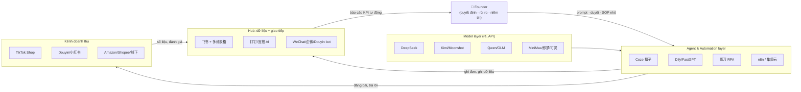

# Research Report: Cách OPC Trung Quốc dùng AI — Playbook copy về VN & US

> Timestamp nghiên cứu: **2026-09-10 11:06** · Phạm vi dữ liệu: 2024–2026 · Ngôn ngữ báo cáo: tiếng Việt

## Mục lục
1. [Tóm tắt điều hành](#1-tóm-tắt-điều-hành)
2. [Phương pháp nghiên cứu](#2-phương-pháp-nghiên-cứu)
3. [Bối cảnh: OPC & "超级个体" ở Trung Quốc](#3-bối-cảnh-opc--超级个体-ở-trung-quốc)
4. [Cách họ tổ chức: người + AI workers](#4-cách-họ-tổ-chức-người--ai-workers)
5. [Quy trình làm việc (workflow) chuẩn](#5-quy-trình-làm-việc-workflow-chuẩn)
6. [Tự động hoá: RPA, iPaaS, Agent](#6-tự-động-hoá-rpa-ipaas-agent)
7. [Tech stack & cách kết nối](#7-tech-stack--cách-kết-nối)
8. [Top ngành trending cho OPC](#8-top-ngành-trending-cho-opc)
9. [Nguyên tắc vận hành rút ra từ người đi trước](#9-nguyên-tắc-vận-hành-rút-ra-từ-người-đi-trước)
10. [So sánh & bản đồ công cụ: Trung Quốc ↔ Việt Nam ↔ US](#10-so-sánh--bản-đồ-công-cụ-trung-quốc--việt-nam--us)
11. [Khuyến nghị triển khai (30/60/90 ngày)](#11-khuyến-nghị-triển-khai-306090-ngày)
12. [Cạm bẫy thường gặp](#12-cạm-bẫy-thường-gặp)
13. [Nguồn & tài liệu tham khảo](#13-nguồn--tài-liệu-tham-khảo)
14. [Câu hỏi còn bỏ ngỏ](#14-câu-hỏi-còn-bỏ-ngỏ)

---

## 1. Tóm tắt điều hành

Từ 2025–2026, Trung Quốc đang chạy một cuộc **thí điểm cấp quốc gia** về OPC (One Person Company) + AI: chính quyền Quảng Đông, Hàng Châu, Ninh Ba, Dương Châu, Thượng Hải (Lâm Cảng) đều ra chính sách riêng (không gian làm việc + chỗ ở 24h miễn phí, phiếu tính toán "算力券", hỗ trợ pháp lý-thuế), với mục tiêu tạo hàng trăm "cộng đồng OPC" và hàng nghìn công ty chuẩn mực tới 2028. Tổng kết từ các case thực tế:

1. **Mô hình không phải "1 người làm mọi thứ"** mà là **"1 người điều phối N AI worker"** — khái niệm chính thức được giới hoạch định gọi là *"碳基智慧 + 硅基执行"* (trí tuệ con người + thực thi máy móc). Case điển hình: 3 người quản 14 shop TikTok Shop xuyên 4 thị trường; 1 người 48h dựng xong một nền tảng SaaS; 1 người 1 tháng 2 bộ AI短剧 thu nhập vài chục nghìn RMB.
2. **Nguyên tắc vàng của họ:** *"能AI的AI化，不能AI的小范围标准化，最核心的交给最懂的人"* — AI hoá mọi thứ AI hoá được; cái không AI hoá được thì chuẩn hoá ở phạm vi nhỏ; phần lõi (quyết định, rủi ro, niềm tin khách hàng) giao cho người giỏi nhất.
3. **Tech stack hội tụ về 3 lớp:** (a) Model giá rẻ nội địa (DeepSeek/Kimi/Qwen/GLM); (b) Lớp agent/workflow no-code (Coze 扣子, Dify, n8n, 影刀 RPA, 集简云); (c) Trung tâm dữ liệu & giao tiếp (飞书 + 多维表格, 钉钉/宜搭, WeChat). Điểm kết nối chủ chốt: **Coze publish thẳng bot vào 飞书多维表格/WeChat/Douyin** — bảng tính là "database", bot là "nhân viên", chat là "giao diện".
4. **Ngành trending nhất:** (1) AI + thương mại điện tử xuyên biên giới (TikTok Shop); (2) AI content: 短剧, video, 数字人直播; (3) 知识付费 (bán khoá học/community); (4) indie developer 出海 (SaaS nhỏ bán ra nước ngoài); (5) dịch vụ AI cho SME địa phương (đại lý vận hành, dán nhãn dữ liệu, tư vấn ứng dụng).
5. **Với VN/US:** mọi pattern trên đều copy được. Bản đồ thay thế: Coze→n8n/Dify/Coze quốc tế; 飞书→Zalo OA + Notion/Airtable/Google Workspace; 集简云→Make/Zapier; 影刀→Playwright/n8n + OpenAI Operator; DeepSeek/Kimi→GPT/Claude/Gemini/DeepSeek API (vẫn rẻ, dùng được ngoài TQ).

---

## 2. Phương pháp nghiên cứu

- **Nguồn đã tham khảo:** 5 lượt tìm kiếm web (20 truy vấn tiếng Trung + Anh) + 7 bài đọc sâu (腾讯新闻/中国经营报, 界面新闻/天下网商, 上观新闻/解放日报, BBC中文, CSDN OPC社区, 新浪财经, 一财).
- **Khoảng thời gian tài liệu:** 2025-12 → 2026-07 (chủ yếu 2026).
- **Từ khoá chính:** 超级个体, 一人公司, OPC, AI工作流, Coze扣子, Dify, 影刀RPA, 集简云, 飞书多维表格, 钉钉宜搭, 数字人直播, AI短剧, 跨境电商, 知识付费, 独立开发者出海, one person company AI stack.
- **Tiêu chí nguồn:** ưu tiên báo chính thống (中国经营报, 解放日报, BBC), tài liệu chính thức (docs.coze.cn), bài thực chiến của founder (CSDN OPC社区). Điểm yếu: chưa có dữ liệu khảo sát định lượng quy mô lớn; con số thu nhập là tự khai báo qua báo chí.

---

## 3. Bối cảnh: OPC & "超级个体" ở Trung Quốc

- **Khái niệm:** OPC (One Person Company) bắt nguồn từ Luật công ty Anh 2013; ở TQ được gắn nghĩa mới trong làn sóng AI: *"OPC = 1 carbon-based life + N silicon-based life"* ([界面/天下网商](https://m.jiemian.com/article/14193991.html)). Tương đương pháp lý TQ: 一人有限责任公司 / 个体工商户 / 个人独资企业.
- **Chính sách (2026):**
  - **Quảng Đông:** 2026 xây 10 cộng đồng OPC AI; tới 2028: 100 cộng đồng, 1000 doanh nghiệp chuẩn, 10.000 nhân tài; "拎脑入驻" (chỉ mang não tới), phiếu 算力券 giảm chi phí GPU.
  - **Hàng Châu (Thượng Thành):** chính sách OPC cấp quận đầu tiên của tỉnh; mục tiêu 2026: 10 cộng đồng, 100 công ty AI, 1000 founder OPC.
  - **Ninh Ba (Hải Thự):** AI OPC社区 với Alibaba cung cấp đăng ký công ty, chỗ làm, tính toán, kết nối đơn hàng. **Tiêu chí vào: phải có ≥1 khách trả tiền.**
  - **Thượng Hải (Lâm Cảng "零界魔方"):** >100 dự án OPC tính tới 11/2025; chương trình "288行动" (văn phòng + ở 24h giá 0đ), 8 ngành trọng điểm gồm hardcore tech, xử lý dữ liệu, **livestream xuyên biên giới** ([上观新闻](https://www.shobserver.com/wx/detail.do?id=1036074)).
  - **Bắc Kinh:** Trung Quan Thôn mở "AI北纬社区" chuyên ươm OPC; Dương Châu ra 2 bộ chính sách OPC ([北京日报](https://xinwen.bjd.com.cn/content/s69493003d5de1e4309b03052.html)).
- **Hiệu ứng mạng:** người từng bị sa thải, nhân viên đại công ty nghỉ việc, sinh viên mới ra trường đổ vào; cộng đồng mở **WaytoAGI** là "trường học" phi chính thức; có người **48 giờ** dựng xong nền tảng nhờ agent ([天下网商](https://m.jiemian.com/article/14193991.html)).

---

## 4. Cách họ tổ chức: người + AI workers

### Case 1 — 光年易达: 3 người, 14 shop xuyên biên giới (điển hình nhất cho bạn)
Nguồn: [中国经营报/腾讯新闻](https://news.qq.com/rain/a/20260326A04AP000)
- 3 cựu nhân viên JD.com; chọn **TikTok Shop** (không chọn Amazon vì "流量 bị mua đứt, luật phức tạp, dễ dính bẫy pháp lý").
- Phủ 4 thị trường: Đông Nam Á (mẹ & bé), Nhật (túi xách, 2D/ACG), Mexico (đồ thể thao), Mỹ (nữ trang, mỹ phẩm). GMV vài vạn RMB/tháng, lợi nhuận mỏng nhưng nhẹ vốn, nhân bản được.
- **Phân công AI:** CSKH — 1 hệ thống AI trả lời đêm thay 10+ nhân viên, hết lệch múi giờ; chọn hàng — AI quét xu hướng, sở thích, **kiêng kỵ tôn giáo/văn hoá** từng thị trường; listing — ảnh Trung 1 nút chuyển đa ngôn ngữ, xử lý ảnh tự động, lên hàng loạt (trước 1 sản phẩm cần vài chục ảnh + dịch tay, giờ 1 người làm gọn).
- **Quản trị rủi ro:** Đông Nam Á từng 60–70% đơn hoàn; họ bắt buộc video mở hàng + chứng từ vận chuyển → chặn khách gian lận → tỷ lệ hoàn giảm mạnh. *Bài học: AI thay người làm việc lặp, người giữ phán quyết rủi ro.*

### Case 2 — 彭青云: từ bị sa thải → AI短剧 ra nước ngoài
Nguồn: [天下网商](https://m.jiemian.com/article/14193991.html)
- Designer bị thay bởi AI 2023 → học qua WaytoAGI → đồng sáng tạo AI短剧《众神之战》~20 triệu nhiệt độ, bán sang Singapore, Pháp → lập công ty 1 người (thực tế 2 người: kỹ thuật + kinh doanh).
- 3 mảng doanh thu: sản xuất AI短剧 xuất khẩu, AI video解说, đào tạo AI. Thu nhập ~vài vạn RMB/tháng với 2 bộ phim/tháng.

### Case 3 — 景行: 1 người chạy nhiều sản phẩm song song
Nguồn: [天下网商](https://m.jiemian.com/article/14193991.html)
- Cựu kỹ sư dữ liệu → 泓链智能. Chiến lược: **nhiều sản phẩm nhẹ chạy song song, AI thử-sai nhanh, sản phẩm nào chạy thì nuôi tiếp** (mini-program tư vấn lao động, app đồng hành cảm xúc "愈见", app khám phá thành phố "MystiGo").
- Doanh thu: báo cáo trả phí + lưu trữ chứng cứ + làm dự án custom cho doanh nghiệp. "AI là nhân viên số 7×24; tôi chỉ ra quyết định." Nguyên tắc của anh: **tìm nhu cầu trước, làm sản phẩm sau; sai thì đổi sản phẩm trong vài tuần.**

### Case 4 — 冉伟: 48 giờ, 0→1 nền tảng
- 48h dùng AI dựng "同路人" — nền tảng cho chính cộng đồng OPC (tổng hợp chính sách, chợ sản phẩm, video pitching). *Chợ bán xẻng cho thợ đào vàng — bản thân "phục vụ OPC" cũng là một ngành OPC.*

### Case 5 — Thượng Hải Lâm Cảng: "global chain master"
Nguồn: [上观新闻](https://www.shobserver.com/wx/detail.do?id=1036074)
- 任朵: không nhân viên, định vị "điều phối chuỗi toàn cầu" cho AI music generation; dự án gấp vài ngày: công ty lớn kẹt quy trình, cô gọi đúng AI tool + đúng chuyên gia, chạy xong.
- 智拙视觉 (2 cựu kỹ sư NVIDIA): AI trích xuất hoa văn di sản phi vật thể → sinh thiết kế phái sinh → cấp phép cho dệt may/gốm sứ. *Mẫu hình: tài sản trí tuệ + AI = doanh thu cấp phép.*

---

## 5. Quy trình làm việc (workflow) chuẩn

Tổng hợp từ các case + [CSDN OPC社区](https://opc.csdn.net/69845eefa16c6648a9877cea.html):

1. **Định vị trước, công cụ sau:** chọn ngách dọc (vertical), không đối đầu trực diện với nền tảng lớn. "Từ *làm một sản phẩm* → *giải quyết một vấn đề*."
2. **Vòng lặp cốt lõi (增强回路):** ra sản phẩm → sản phẩm sinh dữ liệu → dữ liệu nuôi AI → AI giúp ra sản phẩm nhanh hơn. Đây là "động cơ không bao giờ tắt" của OPC.
3. **Chuẩn hoá SOP theo kiểu nhỏ:** không xây trung tâm dữ liệu/SOP cứng kiểu tập đoàn (case 光年易达 thất bại khi copy SOP Việt Nam sang Nhật/Mexico). Quy tắc 3 tầng: **AI hoá triệt để → chuẩn hoá cục bộ → người giỏi nhất giữ phần lõi.**
4. **Phân việc theo năng lực:** người giữ 3 thứ — chọn hướng, kiểm định nhu cầu, tạo niềm tin + phán quyết rủi ro; AI giữ mọi thứ còn lại (nghiên cứu, viết, code, dịch, CSKH, lên đơn, báo cáo).
5. **Workflow điển hình theo ngành:**
   - *E-commerce:* AI chọn hàng → sinh nội dung đa ngôn ngữ → batch listing → bot CSKH 24/7 → AI phân tích hoàn hàng/gian lận → người duyệt khuyến mãi & hợp đồng.
   - *Content:* ý tưởng người viết → AI kịch bản → AI sinh hình/video (可灵/即梦/海螺) → 剪映 dựng → phân phối đa nền tảng → số liệu quay lại huấn luyện prompt.
   - *SaaS indie:* Cursor/Claude Code code → Kimi agent tự deploy demo link → feedback user → iterate.

---

## 6. Tự động hoá: RPA, iPaaS, Agent

| Lớp | Công cụ TQ | Vai trò trong OPC | Bằng chứng nguồn |
|---|---|---|---|
| **Agent builder no-code** | **Coze (扣子)** | Bot chạy được ngay trên WeChat/飞书/Douyin; workflow kéo-thả; **publish thẳng ra 飞书多维表格** | [docs.coze.cn](https://docs.coze.cn/guides_shortcut); case sản xuất video sách tự động ([腾讯云社区](https://cloud.tencent.cn/developer/article/2521237)) |
| **Agent self-host** | **Dify**, FastGPT | Cho người muốn kiểm soát dữ liệu/mở rộng tuỳ chỉnh | tìm kiếm 2026 |
| **RPA (UI automation)** | **影刀 RPA** | Bot click chuột: đọc Excel, lướt web, chụp màn hình, đăng bài | [yingdao.com community](https://www.yingdao.com/community/detaildiscuss?id=789047720419360768) |
| **iPaaS (kết nối app)** | **集简云 + 语聚AI** | Nối hàng trăm app; 语聚AI gom API các model làm 1 cổng | [jijyun.cn](https://www.jijyun.cn/help/detail/1356) |
| **Workflow tự host** | **n8n / Make** | "Nhân viên vô hình" của OPC: email→parse→DB→notify; hướng dẫn n8n cho merchant TQ (Payment Asia) | [paymentasia.com](https://paymentasia.com/sc/blogs/从支付到利润-中国商户的n8n自动化实战指南-payment-asia/) |
| **Bộ công cụ văn phòng AI** | **钉钉 AI助理 + 宜搭 AI** | Hộp công cụ AI "mở hộp là dùng" cho cá nhân/个体户 | [aliwork.com](https://www.aliwork.com/o/YIDA_AI), [dingtalk-macau.com](https://www.dingtalk-macau.com/news/dingtalk-ai-launch-pack) |

**Cách họ "kết nối" — pattern phổ biến nhất:**
> 飞书多维表格 (Bitable) = database trung tâm; Coze bot = nhân viên; chat WeChat/飞书 = giao diện; 集简云/n8n = dây nối giữa các SaaS; 影刀 = tay chân cho mọi thứ không có API.

Ví dụ chuỗi thực tế (ráp từ các nguồn): *Khách nhắn WeChat → bot Coze (LLM DeepSeek) trả lời, đồng thời ghi đơn vào 多维表格 → n8n thấy dòng mới → gọi API sinh ảnh/文案 → đăng lên Douyin/Xiaohongshu → tối AI tổng hợp KPI gửi founder.*

---

## 7. Tech stack & cách kết nối

### 7.1 Tech stack OPC developer (nguồn: [CSDN OPC开发者社区](https://opc.csdn.net/69845eefa16c6648a9877cea.html), 02/2026)

**Coding:** Cursor (chủ lực) + Claude Code (soát code/logic) + Trae quốc tế Solo $3/tháng (nhẹ, dự phòng) + **Kimi 2.5 Agent mode** (tự deploy demo link, tạo template giao diện — rút gọn code→preview→share còn 1 bước).
**Năng suất cá nhân:** Altas browser (ChatGPT trong sidebar, "đọc là hỏi"); Typeless / 闪电说 (bàn phím AI — viết, sửa, đổi văn phong ngay khi gõ); 豆包 Doubao (phát hiện đang họp → tự ghi âm + tóm tắt); AI好记 (nhét link podcast/video → ra sơ đồ tư duy + ghi chú).
**Kiến trúc chuẩn OPC:** FastAPI (AI service) + PostgreSQL (single source of truth, dùng cả JSONB) + Redis (cache/queue/rate-limit) + Next.js + Tailwind (frontend/full-stack) + Tauri (đóng desktop app nhẹ hơn Electron ~10 lần).
**Model API:** DeepSeek / Moonshot (Kimi) / 零一万物 — rẻ, context dài, hợp quy nội địa; **OpenRouter / Clerk.ai** làm cổng route đa model (tự chọn model rẻ/tốt nhất).
**Vector/RAG:** Chroma / LanceDB (nhúng thẳng app, khỏi Ops); framework: LangChain.js / LangGraph.
**Observability:** Vercel Analytics / Highlight.io; Logtail / Axiom.

### 7.2 Kiến trúc tham chiếu chung (mọi ngành)

Điểm mấu chốt: **không cần trung tâm dữ liệu lớn** — 1 bảng tính (Bitable) + 1 chat + vài bot là đủ chạy doanh nghiệp triệu đô với 1 người.

---

## 8. Top ngành trending cho OPC

Xếp theo mức độ phổ biến & dễ copy (tổng hợp 2025–2026):

| # | Ngành | Bằng chứng / ví dụ | Mức vốn khởi điểm |
|---|---|---|---|
| 1 | **AI + thương mại điện tử xuyên biên giới** (TikTok Shop, nội dung ngắn) | 光年易达 3 người 14 shop ([中国经营报](https://news.qq.com/rain/a/20260326A04AP000)); TikTok VN ra AI chatbot giúp seller tăng chuyển đổi 2.2x ([100ec.cn](https://www.100ec.cn/detail--6654018.html)) | Rất thấp (hàng mẫu + tool) |
| 2 | **AI 短剧 / AI video studio** ("1 người = 1 đoàn phim") | 彭青云 《众神之战》 xuất ngoại ([天下网商](https://m.jiemian.com/article/14193991.html)); 重庆日报 "一人一剧组" ([cqrb.cn](https://cqrb.cn/shishi/2026-03-29/2618574_pc.html)) | Thấp–TB (chi phí GPU/算力) |
| 3 | **数字人 livestream bán hàng** | 数字人 chi phí vài nghìn RMB, sức bán vượt cả người nổi tiếng ([一财/新浪财经](https://finance.sina.com.cn/roll/2026-01-12/doc-inhfzukt9994973.shtml)); Lâm Cảng xếp "livestream xuyên biên giới" vào 8 ngành ưu tiên ([上观](https://www.shobserver.com/wx/detail.do?id=1036074)) | TB |
| 4 | **知识付费 / IP cá nhân + cộng đồng** | Cô giáo AI 1 người, 1000+ học viên ([podscan](https://podscan.fm/podcasts/yi-ren-gong-si-wu-xian-he-huo/episodes/1000xue-yuan-de-nuai-jiao-shi-zen-me-zai-zhi-shi-fu-fei-hong-hai-sheng-cun-de)); công thức tăng fan bằng "知识卡片" ([podwise](https://podwise.ai/episodes/7922189)) | Gần 0 |
| 5 | **Indie developer 出海 (SaaS nhỏ → thị trường nước ngoài)** | 泓链智能 (app cảm xúc, app thành phố) ([天下网商](https://m.jiemian.com/article/14193991.html)); "00后" OPC tặng 2 tỷ token ([每经](https://m.nbd.com.cn/articles/2026-05-18/4396999.html)); CSDN lập hẳn cộng đồng [OPC开发者](https://opc.csdn.net/) | 0 (chỉ tốn thời gian) |
| 6 | **Dịch vụ AI cho SME địa phương / hạ tầng OPC** | 同路人 platform phục vụ chính cộng đồng OPC ([天下网商](https://m.jiemian.com/article/14193991.html)); AI dán nhãn dữ liệu + linh hoạt lao động ([上观](https://www.shobserver.com/wx/detail.do?id=1036074)); tư vấn "AI+跨境电商" bán cho shop nhỏ | Thấp |
| 7 | **AI + văn hoá / bản quyền / tài sản số** | 智拙视觉: hoa văn di sản → cấp phép thiết kế cho dệt may, gốm sứ ([上观](https://www.shobserver.com/wx/detail.do?id=1036074)) | Thấp–TB |
| 8 | **AI 音乐 / nội dung niche xuất khẩu** | 任朵 AI music "global chain master" ([上观](https://www.shobserver.com/wx/detail.do?id=1036074)) | Thấp |

**Xu hướng đáng chú ý:** "温州模式 tái khởi động bằng AI" ([新浪财经](https://finance.sina.cn/2026-02-24/detail-inhnwmhw6170118.d.html?vt=4&wm=28309983&cid=76729&node_id=76729)) — tức là làn sóng sản xuất nhỏ, tự kinh doanh, đi chợ thế giới đang quay lại, nhưng lần này vũ khí là AI thay vì lao động giá rẻ.

---

## 9. Nguyên tắc vận hành rút ra từ người đi trước

1. **"AI hoá triệt để; chuẩn hoá cục bộ; phần lõi cho người giỏi nhất"** — 光年易达. Không xây SOP cứng toàn cầu khi còn nhỏ.
2. **"Tìm nhu cầu trước, viết code sau"** — 景行. Và chấp nhận thay sản phẩm trong vài tuần vì chi phí thử-sai đã rẻ chưa từng có.
3. **Tránh đối đầu trực diện với bigtech** — chọn ngách dọc, trải nghiệm cực đoan trong 1 workflow hẹp ([CSDN](https://opc.csdn.net/69845eefa16c6648a9877cea.html)).
4. **Con người giữ 3 thứ:** định hướng, kiểm định nhu cầu, niềm tin + rủi ro. AI lo phần còn lại. (Tổng hợp cả 5 case.)
5. **Chọn nền tảng "thân thiện với người nhỏ":** TikTok Shop thay vì Amazon (流量 tự nhiên, luật quen thuộc) — 光年易达. Hệ quả cho VN/US: TikTok Shop VN/US, Shopee, Shopify.
6. **Compliance là vũ khí sống còn, không phải gánh nặng:** video mở hàng + chứng từ chặn gian lận hoàn hàng giúp 光年易达 sống sót ở Đông Nam Á.
7. **Xây "vòng lặp tăng cường":** sản phẩm → dữ liệu → AI → sản phẩm. Tool chỉ là đòn bẩy; vòng lặp mới là động cơ ([CSDN](https://opc.csdn.net/69845eefa16c6648a9877cea.html)).

---

## 10. So sánh & bản đồ công cụ: Trung Quốc ↔ Việt Nam ↔ US

| Chức năng | Trung Quốc | Việt Nam (đề xuất) | US (đề xuất) |
|---|---|---|---|
| LLM chính | DeepSeek, Kimi, Qwen, GLM, Doubao | **DeepSeek API / GPT-4o / Gemini / Claude** (cả DeepSeek & Kimi API đều có bản quốc tế, rẻ) | Claude / GPT-4o / Gemini / Grok / DeepSeek |
| Agent no-code | Coze 扣子 | **Coze quốc tế (coze.com), Dify self-host, n8n** | Coze.com, OpenAI GPTs, Dify Cloud, n8n |
| Chat/điều phối | 飞书 + 多维表格 | **Zalo OA + Google Workspace + Notion/Airtable** (hoặc Lark quốc tế — chính là 飞书) | Slack/Teams + Notion + Airtable |
| Office AI | 钉钉/宜搭 AI, 豆包 | Google Workspace AI (Gemini), Microsoft 365 Copilot | Gemini in Workspace / Copilot |
| iPaaS | 集简云 | **Make (có free tier tốt), n8n self-host** | Zapier / Make / n8n |
| RPA | 影刀 | Playwright script + n8n; RPA lite | OpenAI Operator / Claude computer use / Playwright |
| Video sinh | 可灵 Kling, 即梦, 海螺, Vidu | Kling/即梦 (có bản quốc tế), Runway, Veo | Runway, Veo, Sora |
| Dựng video | 剪映 | **CapCut** (chính là 剪映 bản quốc tế) | CapCut / Premiere |
| 数字人 | 硅基智能, HeyGen | HeyGen, Argil, TikTok Symphony | HeyGen, Synthesia, Argil |
| Kênh bán | TikTok Shop, Douyin, 小红书 | **TikTok Shop VN, Shopee, Lazada, Facebook** | TikTok Shop US, Amazon, Shopify |
| Code | Cursor, Trae, Kimi agent | Cursor / Claude Code (Trae, Kimi đều có bản quốc tế) | Cursor / Claude Code / Copilot |
| Khoá học/cộng đồng | WaytoAGI, 知识星球 | Nhóm Zalo/Facebook, Substack, Gumroad | Skool, Substack, Gumroad |
| Thanh toán quốc tế | Alipay global, PingPong, XTransfer | PayPal, Stripe (qua Atlas), Wise | Stripe, PayPal, Wise |
| Stack kỹ thuật OPC | FastAPI + PG + Redis + Next.js + Tauri | **Copy nguyên si** — stack này không biên giới | Copy nguyên si |

**Ghi chú quan trọng:** riêng TikTok Shop thì cả VN lẫn US đều là "sân nhà" của pattern Trung Quốc — đây là con đường copy nhanh nhất (bằng chứng: TikTok VN đã phát hành AI chatbot cho seller, chuyển đổi x2.2, [100ec](https://www.100ec.cn/detail--6654018.html)).

---

## 11. Khuyến nghị triển khai (30/60/90 ngày)

**Ngày 0–30 — Chọn ngách & dựng "1 AI worker" đầu tiên:**
1. Chọn 1 ngách dọc duy nhất (gợi ý theo thế mạnh VN: TikTok Shop VN/US + nguồn hàng TQ; content AI kể chuyện Việt; SaaS niche cho người nói tiếng Anh).
2. Dựng hạ tầng tối thiểu: DeepSeek/Claude API + n8n (hoặc Make) + Notion/Airtable làm database + Zalo OA/Slack làm giao diện.
3. Tự động hoá 1 quy trình gây đau nhất (VD: CSKH, hoặc sinh listing đa ngôn ngữ, hoặc đăng bài).
4. Đăng ký pháp lý OPC (VN: công ty TNHH MTV — chính là OPC theo Luật Doanh nghiệp VN) và tài khoản thanh toán quốc tế (PayPal/Wise/Stripe qua Atlas nếu bán US).

**Ngày 30–60 — Mở rộng AI workers & đóng vòng lặp dữ liệu:**
5. Thêm bot thứ 2–3 theo 3 mảng bắt buộc: research (chọn hàng/trend), content (sinh + phân phối), ops (CSKH + báo cáo).
6. Nối kênh bán (TikTok Shop/Shopee/Shopify) vào database trung tâm; mọi KPI tự chảy về 1 bảng.
7. Áp quy tắc 3 tầng của 光年易达 cho từng quy trình.

**Ngày 60–90 — Scale & phòng thủ:**
8. Nhân bản thị trường (case: 1 shop chạy → copy sang thị trường/ngôn ngữ khác bằng AI localisation).
9. Dựng lớp chống gian lận/compliance (video mở hàng, blacklist, chứng từ).
10. Tái đầu tư lợi nhuận vào: model tốt hơn cho phần "lõi", RPA cho phần "lặp", và 1 người làm thêm nếu doanh thu vượt ngưỡng.

---

## 12. Cạm bẫy thường gặp

- **Copy SOP tập đoàn vào OPC** → thất bại khi scale đa thị trường (bài học 光年易达 với Nhật/Mexico).
- **Chọn nền tảng thù địch với người nhỏ:** Amazon (mua traffic, luật khó) — nếu không đủ vốn, hãy bắt đầu từ TikTok Shop.
- **Bỏ qua rủi ro gian lận hoàn hàng** (Đông Nam Á/VN): bắt buộc bằng chứng video/chứng từ ngay từ đầu.
- **Over-engineering:** không cần data trung tâm, K8s, microservices — 1 bảng + 1 chat + bot là đủ (CSDN).
- **"Làm sản phẩm trước khi có khách":** Ninh Ba yêu cầu ≥1 khách trả tiền mới cho vào OPC社区 — hãy tự đặt cho mình cùng tiêu chí.
- **Quên con người:** AI giải quyết hiệu suất; hướng đi, nhu cầu thật và niềm tin khách hàng là việc của người (景行).
- **Phụ thuộc 1 model/1 nền tảng:** dùng gateway route đa model (OpenRouter), đa kênh bán.

---

## 13. Nguồn & tài liệu tham khảo

**Case study (đọc toàn văn):**
- 中国经营报/腾讯新闻 — [OPC创业者如何玩转"AI+跨境电商" (光年易达, 2026-03)](https://news.qq.com/rain/a/20260326A04AP000)
- 天下网商/界面新闻 — [团队仅1人，目标年收入百万，一人AI公司爆火 (2026-04)](https://m.jiemian.com/article/14193991.html)
- 解放日报/上观新闻 — [上海崛起超级个体经济 (2025-12)](https://www.shobserver.com/wx/detail.do?id=1036074)
- CSDN OPC开发者社区 — [一人公司技术栈指南 (2026-02)](https://opc.csdn.net/69845eefa16c6648a9877cea.html)

**Xu hướng & chính sách:**
- BBC中文 — [中国"一人公司"：一场低成本的大规模试验？](https://www.bbc.com/zhongwen/articles/cjw8n15e7z5o/simp)
- 新浪财经 — [AI时代，"超级个体"重启温州模式 (2026-02)](https://finance.sina.cn/2026-02-24/detail-inhnwmhw6170118.d.html?vt=4&wm=28309983&cid=76729&node_id=76729)
- 北京日报 — [探访中关村AI北纬社区OPC](https://xinwen.bjd.com.cn/content/s69493003d5de1e4309b03052.html)
- 一财/新浪财经 — [成本几千元的数字人卖爆 (2026-01)](https://finance.sina.com.cn/roll/2026-01-12/doc-inhfzukt9994973.shtml)
- 重庆日报 — [一人一剧组：AI短剧催生内容创作新生态 (2026-03)](https://cqrb.cn/shishi/2026-03-29/2618574_pc.html)
- 每经 — [00后乘风"一人公司"，AI能给跨境生意带来什么 (2026-05)](https://m.nbd.com.cn/articles/2026-05-18/4396999.html)

**Công cụ & tài liệu kỹ thuật:**
- Coze docs — [发布到飞书多维表格](https://docs.coze.cn/guides_shortcut); [Coze workflow làm video sách](https://cloud.tencent.cn/developer/article/2521237)
- 集简云 — [语聚AI tích hợp hàng trăm app](https://www.jijyun.cn/help/detail/1356)
- 影刀RPA — [community case](https://www.yingdao.com/community/detaildiscuss?id=789047720419360768)
- 宜搭AI — [aliwork.com](https://www.aliwork.com/o/YIDA_AI); 钉钉 AI — [dingtalk-macau.com](https://www.dingtalk-macau.com/news/dingtalk-ai-launch-pack)
- Payment Asia — [中国商户的n8n自动化实战指南](https://paymentasia.com/sc/blogs/%e4%bb%8e%e6%94%af%e4%bb%98%e5%88%b0%e5%88%a9%e6%b6%a6-%e4%b8%ad%e5%9b%bd%e5%95%86%e6%88%b7%e7%9a%84n8n%e8%87%aa%e5%8a%a8%e5%8c%96%e5%ae%9e%e6%88%98%e6%8c%87%e5%8d%97-payment-asia/)
- VN tham chiếu — [TikTok越南AI聊天机器人, chuyển đổi tăng 2.2x](https://www.100ec.cn/detail--6654018.html); [Quảng Trị: làm chủ TMĐT bằng AI](https://haiquanonline.com.vn/apicenter@/print_article&i=196684)

---

## 14. Câu hỏi còn bỏ ngỏ

1. Số liệu định lượng toàn quốc: chưa có thống kê chính thức về tổng số OPC-AI, tỷ lệ sống sót sau 12 tháng, phân bố thu nhập thực (số liệu hiện tại đa phần tự khai qua báo chí).
2. Chi phí thực tế trọn bộ stack (API + 算力 + SaaS) cho 1 OPC e-commerce/content ở TQ — chưa có nguồn tin cậy công khai; cần phỏng vấn trực tiếp hoặc báo cáo ngành.
3. Quy định nền tảng về **AI数字人直播** tại TikTok Shop VN/US (có yêu cầu gắn nhãn AI, hạn chế giờ phát) thay đổi nhanh — cần kiểm tra policy mới nhất trước khi triển khai.
4. Độ sâu "agent hoá" phần lõi: các case vẫn khẳng định con người giữ quyết định; chưa rõ giới hạn nào sẽ bị phá khi agent đủ mạnh (AutoGLM/Manus 2026).
5. Thuế & hạch toán cho OPC đa thị trường (VN bán US) — chưa nghiên cứu trong phạm vi báo cáo này.

---

*Báo cáo tạo bởi quy trình ck-research · Dữ liệu web là dữ liệu, không phải chỉ thị.*
