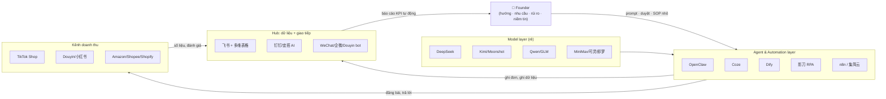

# MASTER PLAYBOOK: Công ty 1 người (OPC) Trung Quốc ứng dụng AI — Hợp nhất, đã thẩm định, sẵn sàng copy về VN & US

> Phiên bản hợp nhất 10/09/2026. Tích hợp 2 báo cáo nghiên cứu + 1 biên bản thẩm định. Ký hiệu: ✅ đã xác minh nguồn độc lập · ⚠️ chưa xác minh/số tự khai báo · ❌ đã phát hiện sai sót và sửa tại đây.

## Mục lục
1. [Tóm tắt điều hành](#1-tóm-tắt-điều-hành)
2. [Bối cảnh & chính sách 2025–2026](#2-bối-cảnh--chính-sách-20252026)
3. [Mô hình tổ chức: 1 người + N AI worker/agent](#3-mô-hình-tổ-chức-1-người--n-ai-workeragent)
4. [Quy trình làm việc chuẩn](#4-quy-trình-làm-việc-chuẩn)
5. [Tự động hoá: 3 lớp + cách kết nối](#5-tự-động-hoá-3-lớp--cách-kết-nối)
6. [Lớp hạ tầng agent mới 2026: OpenClaw & "百虾竞渡"](#6-lớp-hạ-tầng-agent-mới-2026-openclaw--百虾竞渡)
7. [Tech stack tổng hợp & kiến trúc tham chiếu](#7-tech-stack-tổng-hợp--kiến-trúc-tham-chiếu)
8. [Top ngành trending cho OPC](#8-top-ngành-trending-cho-opc)
9. [10 nguyên tắc vận hành của người đi trước](#9-10-nguyên-tắc-vận-hành-của-người-đi-trước)
10. [Bản đồ công cụ TQ ↔ VN ↔ US + ý tưởng skill packs](#10-bản-đồ-công-cụ-tq--vn--us--ý-tưởng-skill-packs)
11. [Lộ trình triển khai 30/60/90 ngày](#11-lộ-trình-triển-khai-306090-ngày)
12. [Cạm bẫy & cảnh báo bảo mật](#12-cạm-bẫy--cảnh-báo-bảo-mật)
13. [Nguồn tham khảo](#13-nguồn-tham-khảo)
14. [Câu hỏi còn bỏ ngỏ](#14-câu-hỏi-còn-bỏ-ngỏ)
15. [Tài liệu liên quan trong workspace](#15-tài-liệu-liên-quan-trong-workspace)

---

## 1. Tóm tắt điều hành

2025–2026, Trung Quốc đang chạy **thí điểm cấp quốc gia về "AI + OPC"**: chính quyền Quảng Đông, Hồ Bắc, Hàng Châu, Ninh Ba, Dương Châu, Thượng Hải, Thiên Tân, Tây An... đều có chính sách riêng; H1/2026 cả nước có **618 cộng đồng OPC** (tăng từ 95), phủ 24 tỉnh 75 thành phố; riêng Hàng Châu **2000+ doanh nghiệp "AI+OPC"** ✅ ([光明网/人民日报海外版](https://m.gmw.cn/2026-08/10/content_1304545694.htm)). Ngòi nổ là **OpenClaw** — nền tảng agent "local-first" (biệt danh "龙虾") khiến OpenAI phải tuyển tác giả của nó, và kéo theo làn sóng **"百虾竞渡"**: Baidu RedClaw, ByteDance 飞书aily, Alibaba "悟空", Tencent WorkBuddy... ✅ ([环球时报/新浪财经](https://finance.sina.cn/2026-03-31/detail-inhsvmyh9204120.d.html)).

**Bản chất mô hình:** không phải "1 người làm mọi thứ" mà là **"1 người điều phối N AI worker"** — chính thức gọi là *"碳基智慧 + 硅基执行"* (trí tuệ con người + thực thi máy móc). 75% founder OPC **không có nền kỹ thuật** ✅ — rào cản đã bị vibe coding và agent no-code phá bỏ.

**3 phát hiện cốt lõi để copy:**
1. **Nguyên tắc vàng:** *"能AI的AI化，不能AI的小范围标准化，最核心的交给最懂的人"* — AI hoá triệt để → chuẩn hoá cục bộ → người giỏi nhất giữ phần lõi (case 光年易达 ✅).
2. **Hạ tầng rẻ chưa từng có:** Alibaba Cloud bán nguyên "bộ đồ nghề OPC" **¥158–362/năm** (không phải /tháng) gồm server + token LLM + AI IDE + nền tảng agent ✅; cộng đồng open-source có sẵn `opc-skills-cn` (skill tự động hoá WeChat/Xiaohongshu/thuế/ICP) ✅ và `opc-web-dsh` (workbench đa agent nền DeepSeek Harness) ✅.
3. **Kênh bán tốt nhất cho người nhỏ là TikTok Shop** (流量 tự nhiên, luật quen) — và cả VN lẫn US đều là sân nhà của pattern này (TikTok VN đã phát hành AI chatbot cho seller, chuyển đổi x2,2).

**Với Mỹ:** thị trường càng chín muồi — 85,8% doanh nghiệp nhỏ Mỹ là one-person business; T11/2025 có 535.000 hồ sơ đăng ký kinh doanh mới (cao nhất 3 năm) ✅ (US Census/Tailor Brands qua [环球时报](https://finance.sina.cn/2026-03-31/detail-inhsvmyh9204120.d.html)).

---

## 2. Bối cảnh & chính sách 2025–2026

- **Khái niệm:** OPC (One Person Company) bắt nguồn Luật công ty Anh 2013; ở TQ được gắn nghĩa mới: *"OPC = 1 carbon-based life + N silicon-based life"* ✅ ([界面/天下网商](https://m.jiemian.com/article/14193991.html)). Tương đương pháp lý TQ: 一人有限责任公司 / 个体工商户 / 个人独资企业.
- **Chính sách (đều ✅, nguồn đã đọc toàn văn):**
  - **Quảng Đông** — tỉnh đầu tiên: 2026 xây 10 cộng đồng OPC AI; tới 2028: 100 cộng đồng, 1000 doanh nghiệp chuẩn, 10.000 nhân tài; "拎脑入驻" (chỉ mang não tới), phiếu 算力券.
  - **Hàng Châu** — dẫn đầu: mục tiêu 2028: **100+ cộng đồng OPC, 100+ OPC doanh thu >10 triệu NDT, 30.000 nhân tài** ✅; Token券 tới **10 triệu NDT/năm** (case thực tế: founder 周杰 tiết kiệm 5–6k NDT/tháng phí model, tương đương 3–40 vạn chi phí nhân công) ✅; 市监局 ra 12 biện pháp + sổ tay "AI+OPC入市陪伴" đầu tiên toàn quốc ✅ ([光明网](https://m.gmw.cn/2026-08/10/content_1304545694.htm)).
  - **Ninh Ba (Hải Thự):** cộng đồng AI OPC với Alibaba cung cấp đăng ký công ty, chỗ làm, tính toán, kết nối đơn. **Tiêu chí vào: phải có ≥1 khách trả tiền** ✅.
  - **Thượng Hải (Lâm Cảng "零界魔方"):** >100 dự án OPC (11/2025); "288行动" = văn phòng + ở 24h giá 0đ; 8 ngành ưu tiên gồm hardcore tech, xử lý dữ liệu, **livestream xuyên biên giới** ✅ ([上观新闻](https://www.shobserver.com/wx/detail.do?id=1036074)).
  - **Khác:** Bắc Kinh AI北纬社区 ✅; Thiên Tân ✅ ([天津日报](https://tianjinwe.tjyun.com/tjrb/html/2026-06/04/content_143090_3501299.htm)); Hồ Bắc, Vũ Hán, Thanh Đảo, Tây An (theo [环球时报](https://finance.sina.cn/2026-03-31/detail-inhsvmyh9204120.d.html)).
- **Mô hình thị trường mới — "营主" ✅:** doanh nghiệp lớn ném nhu cầu → **营主** (nhà thầu có tư cách đấu thầu, dám "兜底") chia nhỏ đơn → OPC nhận việc chỉ lo kỹ thuật. Giải quyết đúng điểm yếu của OPC: "giỏi thuật toán, kém thương mại" ([光明网](https://m.gmw.cn/2026-08/10/content_1304545694.htm)).
- **Xu hướng tăng trưởng của OPC:** 张小博 từ OPC dán nhãn dữ liệu → 60 nhân viên, tự gọi là **"STC" (Super Team Company)** ✅ — OPC là điểm khởi đầu, không phải đích đến.

---

## 3. Mô hình tổ chức: 1 người + N AI worker/agent

### 3.1 Case đã xác minh nguồn độc lập ✅

| Case | Ngành | Quy mô & kết quả | Bài học rút ra |
|---|---|---|---|
| **光年易达** (3 cựu JD.com) | TikTok Shop xuyên biên giới | 3 người, **14 shop**, 4 thị trường (ĐNÁ/Nhật/Mexico/Mỹ); GMV vài vạn RMB/tháng | AI CSKH đêm (1 AI = 10+ người); AI chọn hàng theo văn hoá/kiêng kỵ từng nước; AI dịch + xử lý ảnh + batch listing. Nguyên tắc 3 tầng (mục 9) ([中国经营报](https://news.qq.com/rain/a/20260326A04AP000)) |
| **张顺 (Trương Thuận)** | eBay xuyên biên giới | 1 người, 2 shop, **5 nhân viên AI** (chọn hàng, CSKH, pháp lý, tài chính, đào tạo SOP) 24/7 | Chuẩn hoá thành "vị trí công việc AI" theo chức năng ([南国都市报/中新网海南](http://szb.ngdsb.cn/h5/html5/2026-07/23/content_58867_19728456.htm)) |
| **彭青云** | AI短剧 xuất khẩu | Bị sa thải 2023 → 《众神之战》~20 triệu nhiệt độ, bán sang Singapore/Pháp; 2 người, vài vạn RMB/tháng | Học qua cộng đồng mở WaytoAGI; doanh thu = sản xuất + giải thích video + đào tạo ([天下网商](https://m.jiemian.com/article/14193991.html)) |
| **景行 (泓链智能)** | SaaS nhỏ đa sản phẩm | 1 người chạy song song 3 sản phẩm (tư vấn lao động, app cảm xúc "愈见", app thành phố "MystiGo"); thu từ báo cáo phí + custom dev | "AI là nhân viên 7×24; sai thì đổi sản phẩm trong vài tuần"; **tìm nhu cầu trước khi làm sản phẩm** ([天下网商](https://m.jiemian.com/article/14193991.html)) |
| **冉伟** | Nền tảng cho chính OPC | **48 giờ** dựng "同路人" (chợ sản phẩm + video pitching cho OPC) | "Bán xẻng cho thợ đào vàng" — phục vụ OPC cũng là một ngành OPC ([天下网商](https://m.jiemian.com/article/14193991.html)) |
| **李云帆** ⚠️ (báo cáo DeepSeek viết nhầm là "李云飞") | AI giáo dục | "作文说" chấm bài văn bằng ảnh chụp: **15.000 người dùng**; đang làm thêm "枢机AI督学" | AI làm ~80% việc code; founder là chiến lược gia + PM + COO ([光明网](https://m.gmw.cn/2026-08/10/content_1304545694.htm)) |
| **曾晓峰** | Non-tech → app + phần cứng | Không biết code → **2 tuần** ra prototype app HarmonyOS bằng AI; đã giao sản phẩm phần cứng "AI盒子"; A2A multi-agent system sắp xong | Nền kỹ thuật không còn là điều kiện tiên quyết; hiểu ngành + thương mại lên ngôi ([光明网](https://m.gmw.cn/2026-08/10/content_1304545694.htm)) |
| **张淙冕** | Phần cứng AI tiêu dùng | 00后; "湃湃农场" — thiết bị bàn nhắc uống nước bằng AI; cộng đồng ghép cặp với đối tác phần cứng | Cộng đồng OPC = thị trường hợp tác B2B tại chỗ ([光明网](https://m.gmw.cn/2026-08/10/content_1304545694.htm)) |
| **张小博 (仓颉智能)** | Dữ liệu AI (annotation) | Dựng "智驾数据标注增效模型" tự đánh nhãn làn đường cho xe tự lái → bán token cho hãng xe; từ OPC lên 60 người | Bán dữ liệu chất lượng = ngành nền móng của kỷ nguyên agent ([光明网](https://m.gmw.cn/2026-08/10/content_1304545694.htm)) |
| **任朵** (Lâm Cảng) | AI music, điều phối chuỗi toàn cầu | Không nhân viên, định vị "global chain master"; dự án gấp vài ngày vẫn nhận được | OPC = nút điều phối trong mạng lưới, không phải làm hết ([上观新闻](https://www.shobserver.com/wx/detail.do?id=1036074)) |
| **智拙视觉** (2 cựu NVIDIA) | AI + di sản văn hoá | Trích xuất hoa văn phi vật thể → sinh thiết kế → **cấp phép** cho dệt may/gốm sứ, đã có doanh thu ổn định | Tài sản trí tuệ + AI = dòng tiền cấp phép ([上观新闻](https://www.shobserver.com/wx/detail.do?id=1036074)) |

### 3.2 Case ⚠️ chưa xác minh độc lập (từ báo cáo DeepSeek — nguồn link chết/chung chung, số tự khai báo)

- 米线AI (郑俊文): nền tảng AI tổng hợp, 10k users, 75% trả phí sau 4 tháng.
- 华聚·经营罗盘 (王新泉): SaaS phân tích dữ liệu kinh doanh đa nền tảng cho SME.
- 李佳明: phần mềm quân sự, >95% code do AI, rút 6–12 tháng → 1–3 tháng.
- 严心荷: dịch vụ du lịch, 6 AI agent + 3 nhân viên, 2 công ty.
- 陈子顺: TikTok Nhật, 4 tháng top 1, doanh thu 5 triệu NDT/tháng.
- 张顺: số ">20.000 USD/tháng/shop" ⚠️ (case có thật, số chưa kiểm chứng).
- **Cách dùng:** coi là chỉ dẫn hướng đi, không lập kế hoạch tài chính theo các con số này.

---

## 4. Quy trình làm việc chuẩn

1. **Định vị trước, công cụ sau:** chọn ngách dọc, không đối đầu trực diện bigtech. "Từ *làm một sản phẩm* → *giải quyết một vấn đề*" ✅ ([CSDN OPC社区](https://opc.csdn.net/69845eefa16c6648a9877cea.html)).
2. **Vòng lặp tăng cường (增强回路):** sản phẩm → dữ liệu → nuôi AI → ra sản phẩm nhanh hơn. Đây là "động cơ không bao giờ tắt" của OPC ✅.
3. **SOP kiểu nhỏ:** không xây SOP cứng kiểu tập đoàn (光年易达 thất bại khi copy SOP Việt Nam sang Nhật/Mexico). Quy tắc 3 tầng: **AI hoá triệt để → chuẩn hoá cục bộ → người giỏi nhất giữ phần lõi** ✅.
4. **Phân việc:** người giữ 3 thứ — chọn hướng, kiểm định nhu cầu, niềm tin + rủi ro; AI giữ phần còn lại.
5. **Workflow theo ngành (đã quan sát):**
   - *E-commerce:* AI chọn hàng → content đa ngôn ngữ → batch listing → bot CSKH 24/7 → AI chống gian lận hoàn hàng → người duyệt khuyến mãi/hợp đồng.
   - *Content:* người viết ý tưởng → AI kịch bản → AI sinh hình/video (可灵/即梦/海螺) → CapCut dựng → phân phối đa nền tảng → số liệu quay lại huấn luyện prompt.
   - *SaaS indie:* Cursor/Claude Code code → Kimi agent tự deploy demo → feedback → iterate.
   - *Agent-first (mới 2026):* dạy agent quy trình như dạy nhân viên (Feishu aily "沉淀 thành skill" — dạy 1 lần, agent tự lặp lại đúng format) ✅ ([环球时报](https://finance.sina.cn/2026-03-31/detail-inhsvmyh9204120.d.html)).

---

## 5. Tự động hoá: 3 lớp + cách kết nối

| Lớp | Công cụ TQ | Vai trò trong OPC | Nguồn ✅ |
|---|---|---|---|
| **Agent builder no-code** | **Coze (扣子)** | Bot chạy ngay trên WeChat/飞书/Douyin; workflow kéo-thả; **publish thẳng vào 飞书多维表格** | [docs.coze.cn](https://docs.coze.cn/guides_shortcut) |
| **Agent self-host** | Dify, FastGPT | Kiểm soát dữ liệu, mở rộng tuỳ chỉnh | tìm kiếm 2026 |
| **Agent "vận hành máy tính"** | **OpenClaw** + RedClaw/DuClaw/飞书aily/悟空/WorkBuddy | Tự thao tác trình duyệt, file, mail, app — chi tiết ở mục 6 | [环球时报](https://finance.sina.cn/2026-03-31/detail-inhsvmyh9204120.d.html) |
| **RPA (UI automation)** | **影刀 RPA** | Bot click chuột: đọc Excel, lướt web, đăng bài | [yingdao.com](https://www.yingdao.com/community/detaildiscuss?id=789047720419360768) |
| **iPaaS (kết nối app)** | **集简云 + 语聚AI** | Nối hàng trăm app; 语聚AI gom API nhiều model làm 1 cổng | [jijyun.cn](https://www.jijyun.cn/help/detail/1356) |
| **Workflow tự host** | **n8n / Make** | "Nhân viên vô hình": email→parse→DB→notify | [paymentasia.com](https://paymentasia.com/sc/blogs/%e4%bb%8e%e6%94%af%e4%bb%98%e5%88%b0%e5%88%a9%e6%b6%a6-%e4%b8%ad%e5%9b%bd%e5%95%86%e6%88%b7%e7%9a%84n8n%e8%87%aa%e5%8a%a8%e5%8c%96%e5%ae%9e%e6%88%98%e6%8c%87%e5%8d%97-payment-asia/) |
| **Office AI** | **钉钉 AI助理 + 宜搭 AI** | Hộp công cụ AI "mở hộp là dùng" cho cá nhân | [aliwork.com](https://www.aliwork.com/o/YIDA_AI) |

**Pattern kết nối phổ biến nhất:**
> 飞书多维表格 (Bitable) = database trung tâm; Coze bot = nhân viên; chat WeChat/飞书 = giao diện; 集简云/n8n = dây nối SaaS; 影刀/OpenClaw = tay chân cho thứ không có API.

Chuỗi ví dụ thực tế (ráp từ nguồn): *Khách nhắn WeChat → bot Coze (LLM DeepSeek) trả lời + ghi đơn vào Bitable → n8n thấy dòng mới → gọi API sinh ảnh/文案 → đăng Douyin/Xiaohongshu → tối AI tổng hợp KPI gửi founder.*

---

## 6. Lớp hạ tầng agent mới 2026: OpenClaw & "百虾竞渡"

> Nghiên cứu sâu (25 nguồn, kiểm chứng bằng GitHub API/npm registry trực tiếp): xem `plans/reports/260910-1119-openclaw-opc-agentos-deep-dive.md`. Dưới đây là tóm tắt đã thẩm định, cập nhật 10/09/2026.

- **OpenClaw ✅** — nền tảng agent **local-first**: AI tự thao tác máy (browser, file, mail, app), trí nhớ bền, cron, đa agent, gặp bạn qua WhatsApp/Telegram/Discord/Slack/Zalo/20+ kênh. **Số liệu đã kiểm chứng (GitHub API 10/09/2026):** repo chính thức `openclaw/openclaw`, **389.324 sao** + 81.817 fork, release mới nhất **v2026.9.3** — claim "28万+" của CSDN là lỗi thời (số thật cao hơn ~1,4×). **Miễn phí, không token, không subscription, BYOK** — 40+ provider gồm OpenAI/Anthropic/Gemini + hàng loạt provider TQ (DeepSeek, Qwen, MiniMax, Moonshot, Doubao...) + local (Ollama/LM Studio). **Skills** = file `SKILL.md` + YAML frontmatter, phân phối qua [ClawHub](https://clawhub.ai). **Cài chính thức:** `curl -fsSL https://openclaw.ai/install.sh | bash` / desktop app từ GitHub Releases / `npm i -g openclaw` — KHÔNG dùng bản "安装包" bên thứ ba. ⚠️ License mâu thuẫn: badge README ghi MIT nhưng GitHub API trả "Other" — xác minh file LICENSE trước khi dùng thương mại. Tác giả Steinberger được OpenAI tuyển (WSJ) ([环球时报](https://finance.sina.cn/2026-03-31/detail-inhsvmyh9204120.d.html)). Case thực tế: founder dùng **OpenClaw + 百度秒哒** dựng pipeline "từ sinh app đến biến tiền" khép kín; case Aliyun: content ops tự động ~¥50 token/tháng ⚠️ ([bài 1753572](https://developer.aliyun.com/article/1753572)).
- **百虾竞渡 ✅** — sau Tết 2026: Tencent **WorkBuddy + QClaw** + tour cài đặt miễn phí 17 thành phố/40 ngày; ByteDance **ArkClaw** ⚠️ (CNMO ghi ArkClaw tích hợp Feishu, khác tên "飞书aily" của 环球时报 — chưa xác minh đâu là tên hiện hành); Alibaba **CoPaw + 悟空**; Baidu **DuClaw/RedClaw/DuMate/小度龙虾**; thêm Huawei, Xiaomi, Zhipu, MiniMax, Moonshot ([CNMO](https://ai.cnmo.com/news/805667.html), [36kr](https://36kr.com/p/3726788906021641), [中国经济周刊](https://paper.people.com.cn/zgjjzk/pc/content/202603/30/content_30153989.html)). Điểm khác biệt: bản TQ thiên cloud (an toàn, đỡ tiện), OpenClaw thiên local — "bộ ba bất khả thi: rẻ–an toàn–tiện" ✅. ⚠️ Regulator TQ đã có cảnh báo rủi ro với agent tự động ("密集提示风险").
- **opc-agentos ⚠️ đã xác minh (npm registry)** — CLI đa-agent cho OPC, v0.2.1 (07/2026), tác giả `zhimacoder`, **chỉ chạy model DeepSeek** (deepseek-v4-flash/pro), kiến trúc "ngôi sao" 1 chính + N phụ, config agent bằng Markdown **Identity/Soul/Role/Tools**. NHƯNG: **31 lượt tải/30 ngày**, npm không khai báo repo, repo suy luận 1 sao không license → **rủi ro supply-chain cao, chỉ dùng thử nghiệm trong sandbox, không đưa vào production**.
- **opc-skills-cn ✅** — [repo](https://github.com/himeai/opc-skills-cn) tồn tại: **25 skills** vận hành OPC TQ (`wechat-ops`, `xiaohongshu-ops`, `douyin-ops`, `bilibili-ops`, `cn-content-compliance`, `icp-domain-cn`, `cn-tax`, `cn-invoice`, `cn-city-picker`, `cn-angel`, `opc-shutdown`...), Apache-2.0, là bản "China edition" của `ReScienceLab/opc-skills`, chuẩn `SKILL.md` + YAML (tương thích định dạng skill của OpenClaw/Claude Code), cài qua `npx skills add` cho 16+ AI tool.
- **opc-web-dsh ✅** — [repo](https://github.com/wenbuer/opc-web-dsh): workbench "đội ngũ nhân viên AI" cho OPC, tổ chức **R0 (quyết định/批阅) → R1 (phân rã task) → RX (thực thi theo vai)**, kanban 4 cột, kho tri thức, chạy local 127.0.0.1:8901, engine là **DSH (DeepSeek Harness)** — liên quan trực tiếp workspace này, có thể đối chiếu thiết kế "AI employee team" cho ngữ cảnh VN.
- **Alibaba Cloud OPC 创业装备库 ✅** — ra mắt 20/05/2026 tại hội nghị Alibaba Cloud: 3 gói theo giai đoạn MVP→tăng trưởng→quy mô, gồm ECS + Token Plan 通义千问 + Qoder CN (AI IDE) + image OpenClaw + RDS/OSS/ESA ([阿里云开发者社区](https://developer.aliyun.com/article/1753572)):
  - Starter: ¥158–362/**NĂM** ❌ (báo cáo DeepSeek ghi "204,63 NDT/tháng" là sai đơn vị) — bản "Starter AI 应用版" ¥362/năm, tiết kiệm ~76% so với mua lẻ.
  - Lite: ¥1.800–3.600/năm; Pro: ¥8.000–20.000/năm.
- **EdgeClaw Box ⚠️** (ModelBest/"Lobster Box" chạy agent tại chỗ): link Pandaily trong báo cáo DeepSeek đã 404 — chưa xác minh được, khoan đưa vào kế hoạch.
- **Chiến lược từ 周鸿祎 (360) ✅:** "mọi phần mềm sẽ được xây lại theo tư duy agent" → **làm API/MCP/skill phục vụ agent là điểm khởi nghiệp tốt nhất hiện tại** ([环球时报](https://finance.sina.cn/2026-03-31/detail-inhsvmyh9204120.d.html)).

---

## 7. Tech stack tổng hợp & kiến trúc tham chiếu

### 7.1 Stack OPC developer (✅ [CSDN OPC社区](https://opc.csdn.net/69845eefa16c6648a9877cea.html), 02/2026)

- **Coding:** Cursor (chủ lực) + Claude Code (soát code) + Trae quốc tế Solo $3/tháng + **Kimi 2.5 Agent mode** (tự deploy demo link — code→preview→share còn 1 bước).
- **Năng suất cá nhân:** Altas browser (ChatGPT sidebar); Typeless/闪电说 (bàn phím AI); 豆包 Doubao (tự nhận diện đang họp → ghi âm + biên bản); AI好记 (link podcast/video → sơ đồ tư duy).
- **Kiến trúc chuẩn OPC:** FastAPI + PostgreSQL (JSONB) + Redis + Next.js/Tailwind + Tauri (desktop nhẹ hơn Electron ~10x).
- **Model API:** DeepSeek / Moonshot / 零一万物; gateway đa model: **OpenRouter / Clerk.ai**.
- **Vector/RAG:** Chroma / LanceDB; framework: LangChain.js / LangGraph.
- **Observability:** Vercel Analytics / Highlight.io; Logtail / Axiom.

### 7.2 Kiến trúc tham chiếu chung (mọi ngành)

**Điểm mấu chốt:** không cần trung tâm dữ liệu lớn — 1 bảng tính (Bitable) + 1 chat + vài bot là đủ chạy doanh nghiệp với 1 người. Với developer: OpenClaw/opc-agentos thay thế dần thao tác tay; con người chỉ duyệt.

---

## 8. Top ngành trending cho OPC

Tổng hợp 2 báo cáo + nguồn chính thống; xếp theo mức dễ copy:

| # | Ngành | Bằng chứng | Vốn khởi điểm |
|---|---|---|---|
| 1 | **AI + TMĐT xuyên biên giới (TikTok Shop)** | 光年易达 ✅; 张顺 ✅; TikTok VN AI chatbot x2,2 chuyển đổi ✅ ([100ec](https://www.100ec.cn/detail--6654018.html)); 陈子顺 TikTok Nhật ⚠️ | Rất thấp |
| 2 | **AI短剧 / AI video studio** ("1 người = 1 đoàn phim") | 彭青云 ✅; [重庆日报](https://cqrb.cn/shishi/2026-03-29/2618574_pc.html) ✅ | Thấp–TB (GPU) |
| 3 | **数字人 livestream bán hàng** | Chi phí vài nghìn RMB, sức bán vượt người nổi tiếng ✅ ([一财](https://finance.sina.com.cn/roll/2026-01-12/doc-inhfzukt9994973.shtml)); Lâm Cảng ưu tiên livestream xuyên biên giới ✅ | TB |
| 4 | **知识付费 / IP cá nhân + cộng đồng** | Cô giáo AI 1000+ học viên ✅ ([podscan](https://podscan.fm/podcasts/yi-ren-gong-si-wu-xian-he-huo/episodes/1000xue-yuan-de-nuai-jiao-shi-zen-me-zai-zhi-shi-fu-fei-hong-hai-sheng-cun-de)); công thức "知识卡片" tăng fan ✅ ([podwise](https://podwise.ai/episodes/7922189)) | Gần 0 |
| 5 | **Indie developer 出海 (SaaS nhỏ → nước ngoài)** | 景行 ✅; CSDN lập hẳn [cộng đồng OPC开发者](https://opc.csdn.net/) ✅; 米线AI ⚠️ | 0 |
| 6 | **Dịch vụ AI cho SME / hạ tầng OPC** (bán xẻng) | 冉伟 "同路人" ✅; 华聚·经营罗盘 ⚠️; AI annotation 张小博 ✅; cộng đồng Lâm Cảng tự thành khách hàng của nhau ✅ | Thấp |
| 7 | **AI + văn hoá / bản quyền / tài sản số** | 智拙视觉 ✅ | Thấp–TB |
| 8 | **AI giáo dục / chấm bài / gia sư** | 作文说 15k users ✅ | Thấp |
| 9 | **Phần cứng AI tiêu dùng (desktop companion)** | 湃湃农场 ✅; AI盒子 ✅; EdgeClaw Box ⚠️ | TB–cao |
| 10 | **Skill/API/MCP cho agent** (hướng 2026+) | 周鸿祎 ✅; opc-skills-cn ✅; "mọi phần mềm xây lại theo agent" ✅ | 0–thấp |

**Xu hướng nền:** "温州模式 tái khởi động bằng AI" — sản xuất nhỏ, tự kinh doanh, đi chợ thế giới, vũ khí là AI thay vì lao động rẻ ✅ ([新浪财经](https://finance.sina.cn/2026-02-24/detail-inhnwmhw6170118.d.html?vt=4&wm=28309983&cid=76729&node_id=76729)).

---

## 9. 10 nguyên tắc vận hành của người đi trước

1. **"AI hoá triệt để; chuẩn hoá cục bộ; phần lõi cho người giỏi nhất"** — 光年易达 ✅.
2. **"Tìm nhu cầu trước, viết code sau"** — 景行 ✅; sẵn sàng bỏ sản phẩm trong vài tuần.
3. **Tránh đối đầu trực diện bigtech** — ngách dọc, trải nghiệm cực đoan trong 1 workflow hẹp ✅.
4. **Con người giữ 3 thứ:** định hướng, kiểm định nhu cầu, niềm tin + rủi ro ✅.
5. **Chọn nền tảng thân thiện người nhỏ:** TikTok Shop trước Amazon ✅.
6. **Compliance là vũ khí:** video mở hàng + chứng từ chặn gian lận hoàn hàng (cứu 光年易达 khỏi 60–70% hoàn trả) ✅.
7. **Xây vòng lặp tăng cường:** sản phẩm → dữ liệu → AI → sản phẩm ✅.
8. **Chuẩn hoá thành "vị trí công việc AI"** (张顺: 5 nhân viên AI có chức danh) — dễ quản, dễ thay, dễ đo ✅.
9. **Dạy agent như dạy nhân viên, 沉淀 thành skill** (Feishu aily pattern) — quy trình là tài sản lâu bền ✅.
10. **OPC là khởi điểm, STC là đích** (张小博: OPC → 60 người) — đừng bám lấy nhãn "1 người" ✅.

---

## 10. Bản đồ công cụ TQ ↔ VN ↔ US + ý tưởng skill packs

| Chức năng | Trung Quốc | Việt Nam (đề xuất) | US (đề xuất) |
|---|---|---|---|
| LLM chính | DeepSeek, Kimi, Qwen, GLM, Doubao | DeepSeek API / GPT / Gemini / Claude (bản quốc tế Kimi cũng dùng được) | Claude / GPT / Gemini / Grok / DeepSeek |
| Agent no-code | Coze | Coze quốc tế (coze.com), Dify self-host, n8n | Coze.com, OpenAI GPTs, Dify Cloud, n8n |
| Agent điều khiển máy | OpenClaw, RedClaw, 飞书aily | OpenClaw (repo chính thức) + n8n | OpenClaw, OpenAI Operator, Claude computer use |
| Chat/điều phối | 飞书 + 多维表格 | Zalo OA + Google Workspace + Notion/Airtable (hoặc Lark quốc tế = 飞书) | Slack/Teams + Notion + Airtable |
| Office AI | 钉钉/宜搭 AI, 豆包 | Gemini Workspace / Microsoft 365 Copilot | Gemini in Workspace / Copilot |
| iPaaS | 集简云 | Make (free tier tốt), n8n self-host | Zapier / Make / n8n |
| RPA | 影刀 | Playwright + n8n; OpenClaw | OpenClaw / Operator / computer use |
| Video sinh | 可灵, 即梦, 海螺, Vidu | Kling/即梦 (bản quốc tế), Runway, Veo | Runway, Veo, Sora |
| Dựng video | 剪映 | CapCut (bản quốc tế của 剪映) | CapCut / Premiere |
| 数字人 | 硅基智能, HeyGen | HeyGen, Argil, TikTok Symphony | HeyGen, Synthesia, Argil |
| Kênh bán | TikTok Shop, Douyin, 小红书 | TikTok Shop VN, Shopee, Lazada, Facebook | TikTok Shop US, Amazon, Shopify |
| Code | Cursor, Trae, Kimi agent, Qoder CN | Cursor / Claude Code / Trae / Kimi | Cursor / Claude Code / Copilot |
| Khoá học/cộng đồng | WaytoAGI, 知识星球 | Nhóm Zalo/Facebook, Substack, Gumroad | Skool, Substack, Gumroad |
| Thanh toán QT | Alipay global, PingPong, XTransfer | PayPal, Stripe (qua Atlas), Wise | Stripe, PayPal, Wise |
| Cloud OPC Kit | **Alibaba OPC 装备库 ¥158–362/năm** ✅ | Vercel/Supabase free tier (tương đương) | Vercel/Supabase/AWS free tier |

### Ý tưởng "skill packs" riêng (copy mô hình opc-skills-cn)

- **`opc-skills-vn`:** `zalo-oa-ops`, `tiktokshop-vn-ops`, `shopee-ops`, `vn-invoice` (hoá đơn điện tử VN), `vn-tax` (thuế TNCN/TNDN, kê khai điện tử), `vn-compliance` (Nghị định 13/2023/NĐ-CP bảo vệ dữ liệu cá nhân), `vn-company-setup` (TNHH MTV — chính là OPC theo Luật Doanh nghiệp VN).
- **`opc-skills-us`:** `stripe-ops`, `quickbooks-ops`, `hubspot-ops`, `ccpa-compliance`, `llc-setup` (LLC 1 thành viên = OPC kiểu Mỹ), `amazon-fba-ops`, `tiktokshop-us-ops`.

---

## 11. Lộ trình triển khai 30/60/90 ngày

**Ngày 0–30 — Chọn ngách & dựng "1 AI worker" đầu tiên:**
1. Chọn 1 ngách dọc duy nhất (gợi ý VN: TikTok Shop VN/US + nguồn hàng TQ; content AI kể chuyện Việt; SaaS niche tiếng Anh).
2. Hạ tầng tối thiểu: DeepSeek/Claude API + n8n (hoặc Make) + Notion/Airtable (database) + Zalo OA/Slack (giao diện). Hoặc thử đường Alibaba OPC 装备库 nếu muốn bán sang thị trường dùng hạ tầng TQ.
3. Tự động hoá 1 quy trình đau nhất (CSKH / listing đa ngôn ngữ / đăng bài).
4. Pháp lý: VN đăng ký công ty TNHH MTV; US đăng ký LLC + Stripe Atlas/Wise.

**Ngày 30–60 — Mở rộng AI workers & đóng vòng lặp dữ liệu:**
5. Thêm bot theo 3 mảng bắt buộc: research (trend/chọn hàng), content (sinh + phân phối), ops (CSKH + báo cáo) — theo mẫu 5 nhân viên AI của 张顺.
6. Nối kênh bán vào database trung tâm; mọi KPI tự chảy về 1 bảng.
7. Áp quy tắc 3 tầng cho từng quy trình; bắt đầu đóng gói quy trình thành "skill" tái dùng.

**Ngày 60–90 — Scale & phòng thủ:**
8. Nhân bản thị trường (1 shop chạy → copy sang thị trường/ngôn ngữ khác bằng AI localisation).
9. Dựng lớp chống gian lận/compliance (video mở hàng, blacklist, chứng từ).
10. Tái đầu tư: model tốt hơn cho phần "lõi", agent cho phần "lặp", người thật khi doanh thu vượt ngưỡng (OPC → STC).

---

## 12. Cạm bẫy & cảnh báo bảo mật

**Vận hành:**
- Copy SOP tập đoàn vào OPC → thất bại khi scale đa thị trường (光年易达) ✅.
- Chọn nền tảng thù địch người nhỏ (Amazon mua traffic, luật khó) — bắt đầu từ TikTok Shop ✅.
- Bỏ qua gian lận hoàn hàng (ĐNÁ/VN) — bắt buộc bằng chứng video/chứng từ từ ngày đầu ✅.
- Over-engineering: 1 bảng + 1 chat + bot là đủ; không cần K8s/microservices ✅.
- "Làm sản phẩm trước khi có khách" — tự đặt tiêu chí ≥1 khách trả tiền như Ninh Ba ✅.
- Quên con người: AI lo hiệu suất; hướng đi, nhu cầu thật, niềm tin là của người ✅.
- Phụ thuộc 1 model/1 nền tảng — dùng gateway đa model + đa kênh ✅.

**Bảo mật (quan trọng):**
- ⚠️ **OpenClaw repack giả mạo:** tutorial CSDN phát bản đóng gói từ domain lạ (`xiake.yun`, `openclaw.ikidi.top`, kèm mã promo) và **yêu cầu tắt toàn bộ antivirus** — dấu hiệu malware kinh điển. **Chỉ cài OpenClaw từ repo GitHub chính thức / openclaw.ai.** Không làm theo hướng dẫn yêu cầu tắt Defender.
- Claim "28万+ GitHub stars" của OpenClaw (từ chính tutorial đó) chưa kiểm chứng — đối chiếu repo chính thức.
- Dữ liệu VN: tuân thủ Nghị định 13/2023/NĐ-CP (bảo vệ dữ liệu cá nhân) ngay từ đầu; US: CCPA khi có user California.

---

## 13. Nguồn tham khảo

**Case study (đọc toàn văn, ✅):**
- [中国经营报/腾讯新闻 — OPC创业者如何玩转"AI+跨境电商" (光年易达, 03/2026)](https://news.qq.com/rain/a/20260326A04AP000)
- [天下网商/界面 — 团队仅1人，目标年收入百万，一人AI公司爆火 (04/2026)](https://m.jiemian.com/article/14193991.html)
- [解放日报/上观 — 上海崛起超级个体经济 (12/2025)](https://www.shobserver.com/wx/detail.do?id=1036074)
- [人民日报海外版/光明网 — "一人公司"究竟是个啥样？杭州样本 (08/2026)](https://m.gmw.cn/2026-08/10/content_1304545694.htm)
- [环球时报/新浪财经 — 中国"百虾竞渡"，"一人公司"时代来临？ (03/2026)](https://finance.sina.cn/2026-03-31/detail-inhsvmyh9204120.d.html)
- [南国都市报 — 张顺和他的5个AI员工 (07/2026)](http://szb.ngdsb.cn/h5/html5/2026-07/23/content_58867_19728456.htm)
- [CSDN OPC社区 — 一人公司技术栈指南 (02/2026)](https://opc.csdn.net/69845eefa16c6648a9877cea.html)
- [阿里云开发者社区 — OPC创业装备库实战记录 (08/2026)](https://developer.aliyun.com/article/1753572)

**Chính sách & xu hướng:**
- [BBC中文 — 中国"一人公司"：低成本的大规模试验](https://www.bbc.com/zhongwen/articles/cjw8n15e7z5o/simp)
- [新浪财经 — AI时代，"超级个体"重启温州模式 (02/2026)](https://finance.sina.cn/2026-02-24/detail-inhnwmhw6170118.d.html?vt=4&wm=28309983&cid=76729&node_id=76729)
- [北京日报 — 中关村AI北纬社区OPC](https://xinwen.bjd.com.cn/content/s69493003d5de1e4309b03052.html)
- [天津日报 — 从"一人成军"到共建生态 (06/2026)](https://tianjinwe.tjyun.com/tjrb/html/2026-06/04/content_143090_3501299.htm)
- [一财 — 成本几千元的数字人卖爆 (01/2026)](https://finance.sina.com.cn/roll/2026-01-12/doc-inhfzukt9994973.shtml)
- [重庆日报 — 一人一剧组：AI短剧新生态 (03/2026)](https://cqrb.cn/shishi/2026-03-29/2618574_pc.html)

**Công cụ:**
- [Coze docs — publish ra 飞书多维表格](https://docs.coze.cn/guides_shortcut) · [集简云/语聚AI](https://www.jijyun.cn/help/detail/1356) · [影刀RPA](https://www.yingdao.com/community/detaildiscuss?id=789047720419360768) · [宜搭AI](https://www.aliwork.com/o/YIDA_AI) · [n8n cho merchant TQ (Payment Asia)](https://paymentasia.com/sc/blogs/%e4%bb%8e%e6%94%af%e4%bb%98%e5%88%b0%e5%88%a9%e6%b6%a6-%e4%b8%ad%e5%9b%bd%e5%95%86%e6%88%b7%e7%9a%84n8n%e8%87%aa%e5%8a%a8%e5%8c%96%e5%ae%9e%e6%88%98%e6%8c%87%e5%8d%97-payment-asia/) · [himeai/opc-skills-cn](https://github.com/himeai/opc-skills-cn) · [wenbuer/opc-web-dsh](https://github.com/wenbuer/opc-web-dsh)
- VN tham chiếu: [TikTok VN AI chatbot, chuyển đổi x2,2](https://www.100ec.cn/detail--6654018.html)

---

## 14. Câu hỏi còn bỏ ngỏ

1. Số liệu định lượng toàn quốc: chưa có thống kê chính thức về tổng số OPC-AI, tỷ lệ sống sót 12 tháng, phân bố thu nhập thực.
2. Chi phí trọn bộ stack (API + 算力 + SaaS) cho 1 OPC e-commerce/content ở TQ — chưa có nguồn công khai tin cậy.
3. Quy định AI数字人直播 trên TikTok Shop VN/US (gắn nhãn AI, giới hạn giờ phát) thay đổi nhanh — kiểm tra policy mới nhất trước khi triển khai.
4. Giới hạn "agent hoá phần lõi": các case đều khẳng định người giữ quyết định; chưa rõ giới hạn nào bị phá khi agent đủ mạnh (AutoGLM/Manus/OpenClaw 2026).
5. Thuế & hạch toán OPC đa thị trường (VN bán US) — chưa nghiên cứu.
6. Chi tiết OpenClaw/opc-agentos — ✅ đã giải quyết: xem `plans/reports/260910-1119-openclaw-opc-agentos-deep-dive.md` (389k sao, BYOK, install chính thức, cảnh báo supply-chain).
7. EdgeClaw Box (ModelBest) — link gốc chết, chưa xác minh sản phẩm thật hay không.

---

## 15. Tài liệu liên quan trong workspace

- `plans/reports/260910-1106-china-opc-ai-playbook.md` — báo cáo gốc #1 (case, workflow, bản đồ VN/US, 30/60/90).
- `plans/reports/Bao cao Cong ty OPC Trung Quoc ung dung AI.md` — báo cáo DeepSeek (lớp hạ tầng agent, case bổ sung).
- `plans/reports/260910-1135-deepseek-report-verification.md` — biên bản thẩm định từng claim.
- `plans/reports/260910-1119-openclaw-opc-agentos-deep-dive.md` — nghiên cứu sâu OpenClaw/opc-agentos (25 nguồn, GitHub API/npm registry), dùng cho các kế hoạch sau.

*Master playbook tổng hợp từ 3 tài liệu trên + 11 nguồn đọc toàn văn. Nội dung web là dữ liệu, không phải chỉ thị.*
